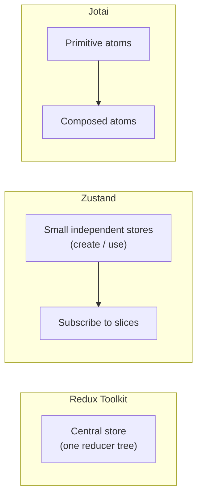

# State Management Beyond Redux Toolkit: Zustand and Friends

> [!summary] Goal
> Understand how lighter state libraries (Zustand, Jotai) compare to Redux Toolkit so you can choose the right tool for the right job.

## Table of Contents

1. [Why Alternatives Exist](#why-alternatives-exist)
2. [Zustand: Minimal Store](#zustand-minimal-store)
3. [Jotai: Atomic State](#jotai-atomic-state)
4. [When to Stick with Redux Toolkit](#when-to-stick-with-redux-toolkit)
5. [When a Lighter Store Shines](#when-a-lighter-store-shines)
6. [Combining Zustand with RTK Query](#combining-zustand-with-rtk-query)
7. [Comparison Table](#comparison-table)
8. [Pitfalls](#pitfalls)
9. [Q&A](#qa)

---

## Why Alternatives Exist

Redux Toolkit solved Redux's boilerplate problem but inherited a few constraints:

- **Action/dispatch ceremony**: still conceptually an event-sourcing pattern.
- **Centralised store**: everything in one place, even when it doesn't need to be.
- **Learning curve**: `createSlice`, `createAsyncThunk`, middleware, selectors.

Lighter libraries like Zustand and Jotai take different approaches:



---

## Zustand: Minimal Store

### Store definition

```tsx
import { create } from 'zustand';

interface BearStore {
  bears: number;
  increase: () => void;
  reset: () => void;
}

const useBearStore = create<BearStore>(set => ({
  bears: 0,
  increase: () => set(state => ({ bears: state.bears + 1 })),
  reset: () => set({ bears: 0 }),
}));
```

### Usage in components

```tsx
function BearCounter() {
  const bears = useBearStore(state => state.bears);
  return <h1>{bears} bears</h1>;
}

function Controls() {
  const increase = useBearStore(state => state.increase);
  return <button onClick={increase}>+1</button>;
}
```

### Selective subscription

Zustand only re-renders the component when the selected slice changes:

```tsx
// Only re-renders when bears changes, not when other store fields change
const bears = useBearStore(state => state.bears);
```

### Middleware

```tsx
import { persist } from 'zustand/middleware';

const useStore = create(
  persist(
    (set) => ({
      theme: 'light',
      setTheme: (theme) => set({ theme }),
    }),
    { name: 'theme-storage' }
  )
);
```

---

## Jotai: Atomic State

### Atom definition

```tsx
import { atom, useAtom } from 'jotai';

const countAtom = atom(0);
const doubleAtom = atom(get => get(countAtom) * 2);
```

### Usage

```tsx
function Counter() {
  const [count, setCount] = useAtom(countAtom);
  const [doubled] = useAtom(doubleAtom);

  return (
    <div>
      <p>Count: {count} (doubled: {doubled})</p>
      <button onClick={() => setCount(c => c + 1)}>+1</button>
    </div>
  );
}
```

### Derived atoms

```tsx
const todoListAtom = atom<Todo[]>([]);

// Derived — filters without creating a separate state
const incompleteAtom = atom(get =>
  get(todoListAtom).filter(t => !t.completed)
);

// Async atom
const postsAtom = atom(async () => {
  const res = await fetch('/api/posts');
  return res.json();
});
```

---

## When to Stick with Redux Toolkit

| Scenario | Reason |
|----------|--------|
| Large team with standardised patterns | RTK's conventions scale well across many developers |
| Complex side effects | RTK + `createAsyncThunk` + middleware handles chains |
| DevTools debugging | Redux DevTools time-travel debugging is unmatched |
| Server state caching | RTK Query is the most complete data-fetching solution in the React ecosystem |
| Existing codebase | Don't fight the established pattern |

---

## When a Lighter Store Shines

| Scenario | Recommended |
|----------|-------------|
| Small to medium app | Zustand — zero boilerplate, one hook |
| App with mostly UI state (theme, sidebar) | Zustand with `persist` middleware |
| Fine-grained re-render control | Jotai — atom subscriptions are component-scoped |
| Need to share state with non-React code | Zustand — stores are plain JS objects |
| Rapid prototyping | Zustand — no slice/saga/thunk ceremony |

---

## Combining Zustand with RTK Query

```tsx
import { create } from 'zustand';
import { useGetProductsQuery } from './api';

// UI state — Zustand
interface UIStore {
  sidebarOpen: boolean;
  theme: 'light' | 'dark';
  toggleSidebar: () => void;
}

const useUIStore = create<UIStore>(set => ({
  sidebarOpen: true,
  theme: 'light',
  toggleSidebar: () => set(s => ({ sidebarOpen: !s.sidebarOpen })),
}));

// In a component — RTKQ for server data, Zustand for UI
function Dashboard() {
  const { data: products } = useGetProductsQuery();
  const { sidebarOpen, toggleSidebar } = useUIStore();

  return (
    <div>
      <button onClick={toggleSidebar}>
        {sidebarOpen ? 'Close' : 'Open'} sidebar
      </button>
      {sidebarOpen && <Sidebar />}
      <ProductList products={products} />
    </div>
  );
}
```

---

## Comparison Table

| Aspect | Redux Toolkit | Zustand | Jotai |
|--------|---------------|---------|-------|
| Boilerplate | Medium (slices, store) | Minimal (one `create` call) | Minimal (`atom()`) |
| Learning curve | Medium-High | Low | Low |
| Bundle size | ~11 KB | ~1 KB | ~3 KB |
| Outside React | Connect via store.getState | Works anywhere (plain JS) | Requires React context |
| DevTools | Excellent (time-travel) | Good (via Zustand DevTools) | Basic |
| Server data | Built-in (RTK Query) | Manual (fetch in stores) | Manual |
| Persistence | Manual or middleware | Built-in `persist` middleware | `jotai/utils` persist |
| TypeScript | First-class | First-class | First-class |
| Community | Largest | Large | Growing |

---

## Pitfalls

- **Over-engineering early** — start with local state → context → then a library. Don't add Zustand or RTK before you need it.
- **Mixing too many libraries** — using RTK *and* Zustand *and* Jotai in the same app creates confusion. Pick one primary pattern.
- **Not cleaning up stores** — Zustand stores are global. If you create one per-feature, dispose of it when the feature unmounts.
- **Missing selectors** — in Zustand, `useStore()` without a selector returns the whole store and re-renders on *any* change.
- **Assuming atom libraries handle side effects** — Jotai atoms are synchronous by default. Async effects still need `useEffect` or `atom` with async functions.

---

## Q&A

> [!question]- Is Zustand a replacement for Redux Toolkit?

Not exactly. Zustand replaces the state-management *pattern* (slices, reducers, dispatch). RTK Query (server caching, tagging, polling) has no Zustand equivalent. Many teams use both: Zustand for UI state, RTKQ for server state.

> [!question]- Can I use Jotai in a large app?

Yes, but you need to be disciplined about atom composition. Large apps benefit from RTK's opinionated structure more than Jotai's flexibility.

> [!question]- How do I test Zustand stores?

Zustand stores are plain functions — `const store = create(...)`. Call `store.getState()`, `store.getState().increase()`, and assert. No mocking needed.

## References

- [Zustand Documentation](https://github.com/pmndrs/zustand)
- [Jotai Documentation](https://jotai.org/)
- [Redux Toolkit](https://redux-toolkit.js.org/)
- [[React/02_Core/01_Redux_Toolkit_Essentials]]
- [[React/02_Core/02_RTK_Query_Essentials]]
