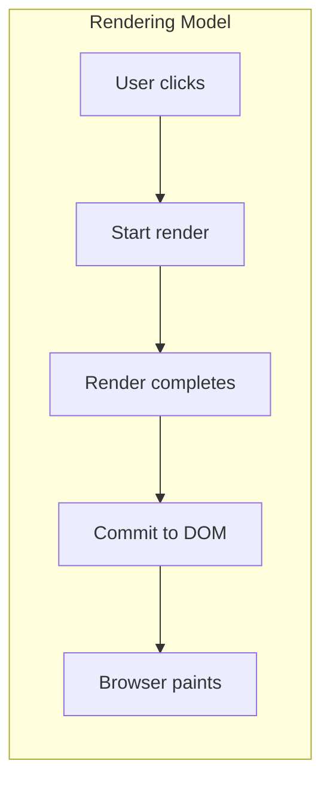
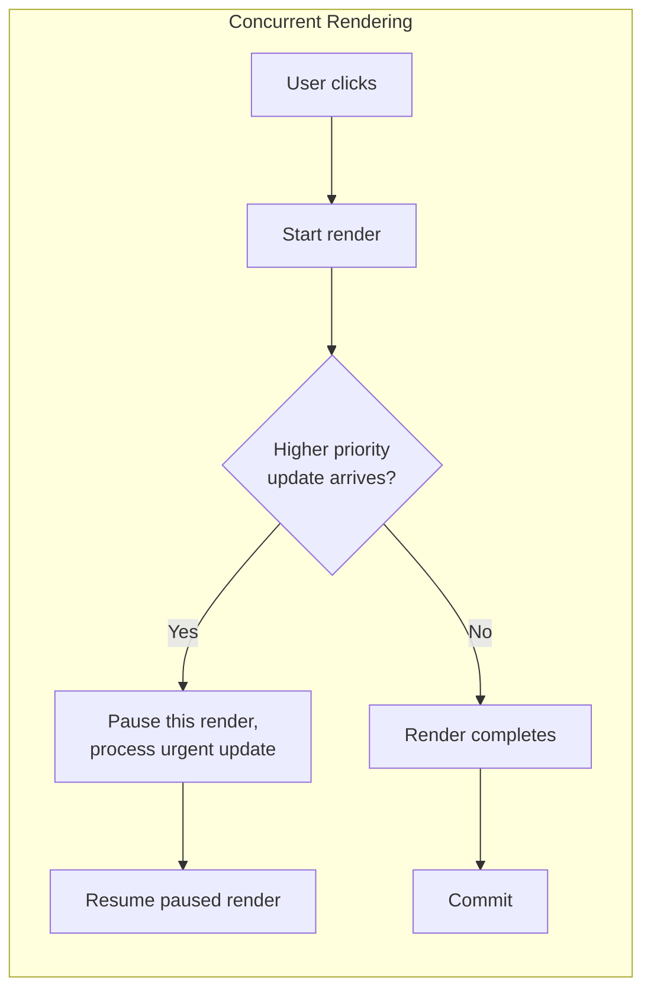
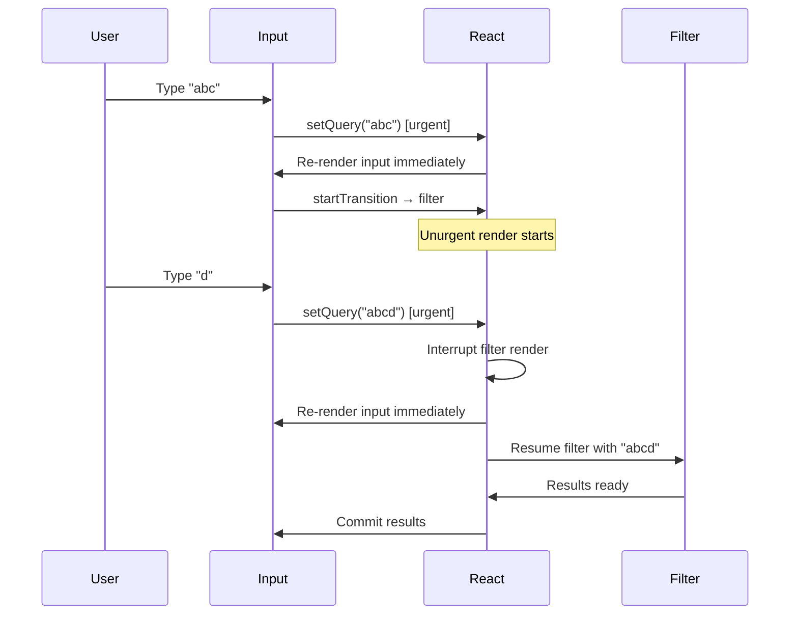
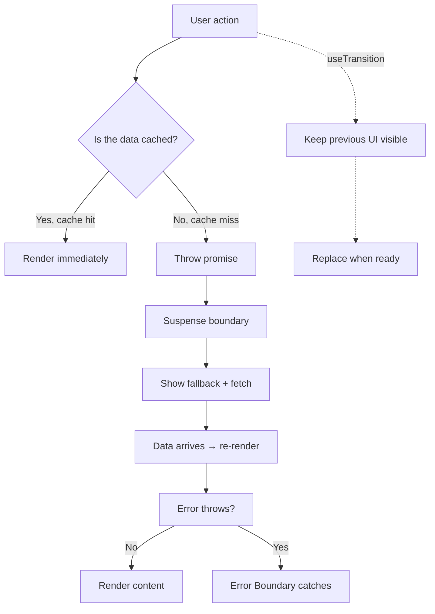

# Concurrent React, Suspense, and Transitions

> [!summary] Goal
> Understand how React 18+ concurrent features (`useTransition`, `useDeferredValue`, Suspense) let you keep your app responsive during expensive updates, and how they compose together.

## Table of Contents

1. [From Synchronous to Concurrent Rendering](#from-synchronous-to-concurrent-rendering)
2. [Suspense Fundamentals](#suspense-fundamentals)
3. [Transitions with useTransition](#transitions-with-usetransition)
4. [useDeferredValue for Deriving State](#usedeferredvalue-for-deriving-state)
5. [Combining Suspense, Transitions, and Error Boundaries](#combining-suspense-transitions-and-error-boundaries)
6. [Server Components and Suspense](#server-components-and-suspense)
7. [Pitfalls](#pitfalls)
8. [Q&A](#qa)

---

## From Synchronous to Concurrent Rendering

In synchronous rendering, once a render starts, it runs to completion — even if it takes 200ms. The browser is blocked, inputs lag, animations stutter.



Concurrent rendering allows React to:

- **Interrupt** a long render when a higher-priority update comes in.
- **Yield** back to the browser between units of work.
- **Keep the UI responsive** during large updates.



---

## Suspense Fundamentals

Suspense lets a component declare "I'm waiting for data" — React will show a fallback instead.

### Code-splitting with Suspense

```tsx
import { lazy, Suspense } from 'react';

const Dashboard = lazy(() => import('./Dashboard'));

function App() {
  return (
    <Suspense fallback={<div>Loading...</div>}>
      <Dashboard />
    </Suspense>
  );
}
```

### Data fetching with Suspense (conceptual)

When a data-fetching library (Relay, RTK Query experimental, Next.js) supports Suspense, the component can throw a promise during render:

```tsx
function UserProfile({ userId }: { userId: string }) {
  // With Suspense-enabled data fetching:
  // If data is cached, this returns immediately.
  // If not, it throws a promise → Suspense catches it.
  const user = useSuspenseQuery(userQuery, { id: userId });

  return <div>{user.name}</div>;
}

// Parent provides the boundary
<Suspense fallback={<Skeleton />}>
  <UserProfile userId="123" />
</Suspense>
```

### Error handling with Error Boundary

```tsx
<ErrorBoundary fallback={<ErrorPage />}>
  <Suspense fallback={<Spinner />}>
    <UserProfile userId="123" />
  </Suspense>
</ErrorBoundary>
```

---

## Transitions with useTransition

`useTransition` marks a state update as **non-urgent**. React can start it, pause it for urgent input, and resume it.

```tsx
import { useState, useTransition } from 'react';

function SearchPage() {
  const [query, setQuery] = useState('');
  const [results, setResults] = useState<string[]>([]);
  const [isPending, startTransition] = useTransition();

  function handleChange(e: React.ChangeEvent<HTMLInputElement>) {
    const value = e.target.value;
    // Urgent: update input immediately
    setQuery(value);

    // Non-urgent: filter results can be deferred
    startTransition(() => {
      const filtered = hugeList.filter(item =>
        item.toLowerCase().includes(value.toLowerCase())
      );
      setResults(filtered);
    });
  }

  return (
    <div>
      <input value={query} onChange={handleChange} />
      {isPending && <Spinner />}
      <ResultsList items={results} />
    </div>
  );
}
```



### When to use

- Filtering/searching large lists on every keystroke.
- Navigating between tabs with expensive content.
- Any update where the result can lag slightly behind user input.

---

## useDeferredValue for Deriving State

`useDeferredValue` is `useTransition` without the setter: it defers a *value* rather than a state update.

```tsx
import { useState, useDeferredValue } from 'react';

function SearchPage() {
  const [query, setQuery] = useState('');
  const deferredQuery = useDeferredValue(query);
  const isStale = query !== deferredQuery;

  // This is the expensive derivation
  const results = hugeList.filter(item =>
    item.toLowerCase().includes(deferredQuery.toLowerCase())
  );

  return (
    <div>
      <input value={query} onChange={e => setQuery(e.target.value)} />
      {isStale && <div>Updating...</div>}
      <ResultsList items={results} />
    </div>
  );
}
```

### useTransition vs useDeferredValue

| Aspect | useTransition | useDeferredValue |
|--------|---------------|------------------|
| What you control | A state setter | A value |
 | Typical use case | Wrapping imperative set calls | Deriving from existing state |
| Pending indicator | `isPending` | Compare `value !== deferredValue` |
| Granularity | Per-transition | Per-value |

---

## Combining Suspense, Transitions, and Error Boundaries



### Practical example: tab navigation

```tsx
function Tabs() {
  const [tab, setTab] = useState('profile');
  const [isPending, startTransition] = useTransition();

  function selectTab(nextTab: string) {
    startTransition(() => setTab(nextTab));
  }

  return (
    <>
      <TabButton isActive={tab === 'profile'} onClick={() => selectTab('profile')}>
        Profile
      </TabButton>
      <TabButton isActive={tab === 'dashboard'} onClick={() => selectTab('dashboard')}>
        Dashboard
      </TabButton>

      <ErrorBoundary fallback={<TabError />}>
        <Suspense fallback={<TabSkeleton />}>
          {tab === 'profile' ? <Profile /> : <Dashboard />}
        </Suspense>
      </ErrorBoundary>

      {isPending && <div className="tab-pending-indicator" />}
    </>
  );
}
```

---

## Server Components and Suspense

In Next.js App Router, Server Components work naturally with Suspense:

```tsx
// page.tsx — this is a Server Component
export default function Page() {
  return (
    <div>
      <h1>Dashboard</h1>
      {/* Suspense around async client components */}
      <Suspense fallback={<Skeleton />}>
        <SlowWidget />
      </Suspense>
    </div>
  );
}
```

Server Components can fetch data directly (no `useEffect`), and the fallback UI streams to the client immediately while the server streams the rendered content.

---

## Pitfalls

- **Suspense boundaries too large** — one boundary for the entire page shows a full-page spinner. Place boundaries at the granularity of independent sections.
- **Suspense boundaries too small** — every tiny component wrapped individually causes a "flash of loading" as each one resolves. Group related components.
- **Forgetting error boundaries** — Suspense only handles the loading state. If the data fetch fails, you need an `ErrorBoundary` above the Suspense boundary.
- **`useTransition` wrapping trivial work** — `startTransition` has overhead. Only use it for genuinely expensive updates that take >50ms.
- **Not showing a pending indicator** — without `isPending` or `isStale`, users see nothing happening during a transition and may click again.

---

## Q&A

> [!question]- Does Suspense for data fetching work with any library?

Out of the box with: Relay, React Query (v5+ with `suspense: true`), RTK Query (experimental), Next.js Server Components. For plain `fetch`, you need a Suspense-compatible wrapper.

> [!question]- What happens if two transitions are started in quick succession?

React abandons the first transition and only commits the latest one. The UI always reflects the most recent state without showing intermediate loading states.

> [!question]- Can I use useTransition with server functions (Server Actions)?

Yes. In Next.js App Router, wrap the Server Action call in `startTransition` to avoid blocking the UI while the server processes the action.

## References

- [React Docs – Suspense](https://react.dev/reference/react/Suspense)
- [React Docs – useTransition](https://react.dev/reference/react/useTransition)
- [React Docs – useDeferredValue](https://react.dev/reference/react/useDeferredValue)
- [[React/01_Foundations/02_Hooks_Complete_Reference]]
- [[React/04_Playbooks/04_Next.js_App_Router_and_Server_Components]]
- [[React/03_Advanced/02_Performance_and_Profiling]]
