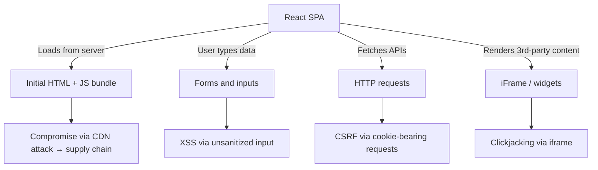
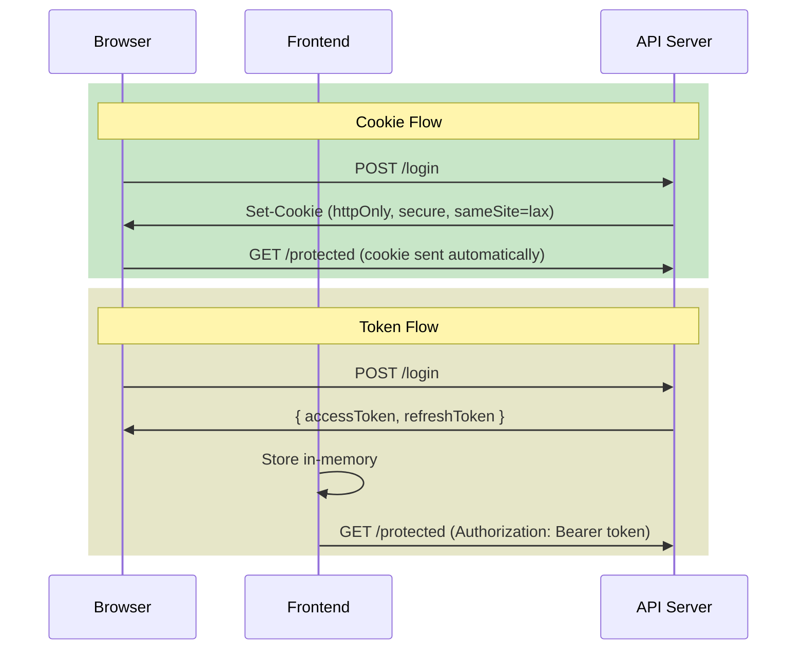
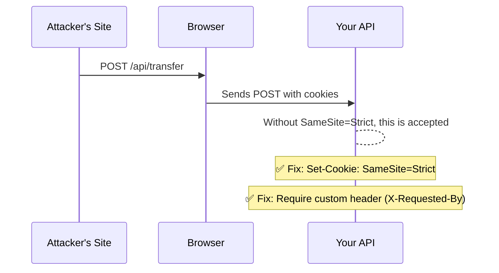

# Security and Auth Patterns in React Apps

> [!summary] Goal
> Understand the most common frontend security risks in React applications and how to handle authentication flows safely.

## Table of Contents

1. [Threat Model for a React SPA](#threat-model-for-a-react-spa)
2. [XSS in React: Where You're Safe and Where You're Not](#xss-in-react-where-youre-safe-and-where-youre-not)
3. [Auth Flows: Cookies vs Tokens](#auth-flows-cookies-vs-tokens)
4. [Storing Tokens Safely](#storing-tokens-safely)
5. [Route Protection in React Router](#route-protection-in-react-router)
6. [CSRF in Single-Page Apps](#csrf-in-single-page-apps)
7. [Security in Next.js (Server Components)](#security-in-nextjs-server-components)
8. [Pitfalls](#pitfalls)
9. [Q&A](#qa)

---

## Threat Model for a React SPA



As a frontend React developer, you care most about:

- **XSS**: preventing malicious script injection.
- **CSRF**: ensuring authenticated requests weren't forged.
- **Token storage**: keeping auth credentials safe from XSS.
- **Route access**: enforcing auth checks client-side.

---

## XSS in React: Where You're Safe and Where You're Not

### React protects you by default

React escapes all values in JSX by default:

```tsx
// ✅ Safe — React escapes the string
const userInput = '';
return <div>{userInput}</div>;
// Renders: &lt;img src=x onerror=alert(1)&gt;
```

### Where React does not protect you

```tsx
// ❌ dangerouslySetInnerHTML — bypasses escaping
function BadComponent({ html }: { html: string }) {
  return <div dangerouslySetInnerHTML={{ __html: html }} />;
}

// ❌ Strings passed to href, src, or style
function BadLink({ url }: { url: string }) {
  return <a href={url}>Click me</a>; // javascript:alert(1)
}

// ❌ Third-party widgets that inject DOM
function ThirdPartyWidget() {
  useEffect(() => {
    const el = document.getElementById('widget');
    el!.innerHTML = widgetCode; // bypasses React entirely
  }, []);
  return <div id="widget" />;
}
```

### Safe patterns for user-generated HTML

```tsx
import DOMPurify from 'dompurify';

function SafeHTML({ html }: { html: string }) {
  return <div dangerouslySetInnerHTML={{ __html: DOMPurify.sanitize(html) }} />;
}
```

### Safe URL validation

```tsx
function SafeExternalLink({ url, children }: {
  url: string;
  children: React.ReactNode;
}) {
  const safeUrl = url.startsWith('https://') || url.startsWith('mailto:')
    ? url
    : '#blocked';
  return <a href={safeUrl} rel="noopener noreferrer">{children}</a>;
}
```

---

## Auth Flows: Cookies vs Tokens

| Aspect | HTTP-only Cookie | Bearer Token (JWT) |
|--------|-----------------|-------------------|
| Storage | Browser cookie | `in-memory` / `localStorage` |
| XSS risk | Low (not readable by JS) | High (if stored in localStorage) |
| CSRF risk | Needs SameSite/CSRF token | None (not automatic) |
| Revocation | Server-based | Token expiry / refresh |
| Cross-domain | Complicated | Simple (header-based) |



---

## Storing Tokens Safely

### The safest approach: in-memory

```tsx
// Store the token in module-scoped variable (in-memory)
let accessToken: string | null = null;

export function setToken(token: string) {
  accessToken = token;
}

export function getToken(): string | null {
  return accessToken;
}

// On page reload, token is lost → user is redirected to login
```

### Acceptable approach: httpOnly cookie

- The API sets the cookie with `httpOnly`, `secure`, and `sameSite=strict`.
- JavaScript never sees the token.
- CSRF is mitigated by `sameSite=strict`.

### ❌ What to avoid

```tsx
// ❌ Never: localStorage — accessible by any JS in the same origin
localStorage.setItem('jwt', token);

// ❌ Also risky: sessionStorage (accessible via iframes)
sessionStorage.setItem('jwt', token);
```

If you must persist the session across page reloads, use:

- **Refresh token** in an httpOnly cookie.
- **Short-lived access token** in memory, refreshed on page load via the refresh token.

---

## Route Protection in React Router

```tsx
import { Navigate, useLocation } from 'react-router-dom';

function ProtectedRoute({ children }: { children: React.ReactNode }) {
  const token = useAuthToken(); // your auth hook
  const location = useLocation();

  if (!token) {
    // Redirect to login, preserving the intended page
    return <Navigate to="/login" state={{ from: location }} replace />;
  }

  return <>{children}</>;
}

// Usage in router config
<Routes>
  <Route path="/login" element={<LoginPage />} />
  <Route
    path="/dashboard"
    element={
      <ProtectedRoute>
        <Dashboard />
      </ProtectedRoute>
    }
  />
</Routes>
```

### After login, redirect back

```tsx
function LoginPage() {
  const location = useLocation();
  const from = location.state?.from?.pathname || '/dashboard';

  async function handleLogin(email: string, password: string) {
    await login(email, password);
    navigate(from, { replace: true });
  }
}
```

---

## CSRF in Single-Page Apps

CSRF (Cross-Site Request Forgery) occurs when an attacker's site makes a request to your API using the user's cookies.

### Mitigation with cookies



### Mitigation (non-cookie approach)

If you use bearer tokens and `Authorization` header, CSRF is not possible — the attacker's site cannot read the token from memory to include it in a request.

---

## Security in Next.js (Server Components)

Server Components reduce the attack surface because:

- Sensitive logic (DB queries, API calls) runs server-side, never shipped to the client.
- Server Actions validate data server-side — client validation is a UX layer, not a security boundary.

```tsx
// ✅ Server Action — validation runs on the server
'use server';

export async function createPost(formData: FormData) {
  const title = formData.get('title');

  if (!title || typeof title !== 'string') {
    throw new Error('Invalid title');
  }

  await db.post.create({ data: { title } });
}
```

**Never trust client data** — even in Server Actions, validate every input.

---

## Pitfalls

- **Storing JWTs in localStorage** — any XSS vulnerability leaks every user's token. Use httpOnly cookies or in-memory storage.
- **Client-only route protection** — an attacker can view a protected page's JS bundle. Route protection is UX, not real security; enforce access on the server/API.
- **`dangerouslySetInnerHTML` with user content** — always sanitize with DOMPurify.
- **`eval` and `new Function` in React** — these execute arbitrary code. Never use them with user input.
- **Missing `rel="noopener noreferrer"`** — external links without it expose `window.opener` to the target page, enabling tab-napping attacks.
- **Over-fetching in Server Components** — exposing fields you don't intend to (e.g., password hash) through a GQL or REST endpoint consumed by the client.

---

## Q&A

> [!question]- Is CSP enough to prevent XSS in React?

Content Security Policy (CSP) is a strong second line of defence. Set `script-src: 'self'` to block inline scripts. But React already prevents most XSS — CSP catches the edges (`dangerouslySetInnerHTML`, third-party widgets).

> [!question]- Should I validate auth on the client or server?

Always server-side. Client-side checks exist only for UX (showing/hiding UI). The real auth check must happen on every API call or Server Action.

> [!question]- What's SameSite and how does it help against CSRF?

`SameSite=Strict` tells the browser to never send the cookie with cross-site requests. `SameSite=Lax` sends it for top-level navigations (GET) but not POST. `SameSite=None` requires `Secure` (HTTPS) and provides no CSRF protection.

## References

- [OWASP XSS Prevention Cheat Sheet](https://cheatsheetseries.owasp.org/cheatsheets/Cross_Site_Scripting_Prevention_Cheat_Sheet.html)
- [React Security – dangerousSetInnerHTML](https://react.dev/reference/react-dom/components/common#dangerously-setting-the-inner-html)
- [Next.js Security](https://nextjs.org/docs/app/building-your-application/security)
- [[React/02_Core/03_Routing_with_React_Router]]
- [[React/02_Core/01_Redux_Toolkit_Essentials]]
