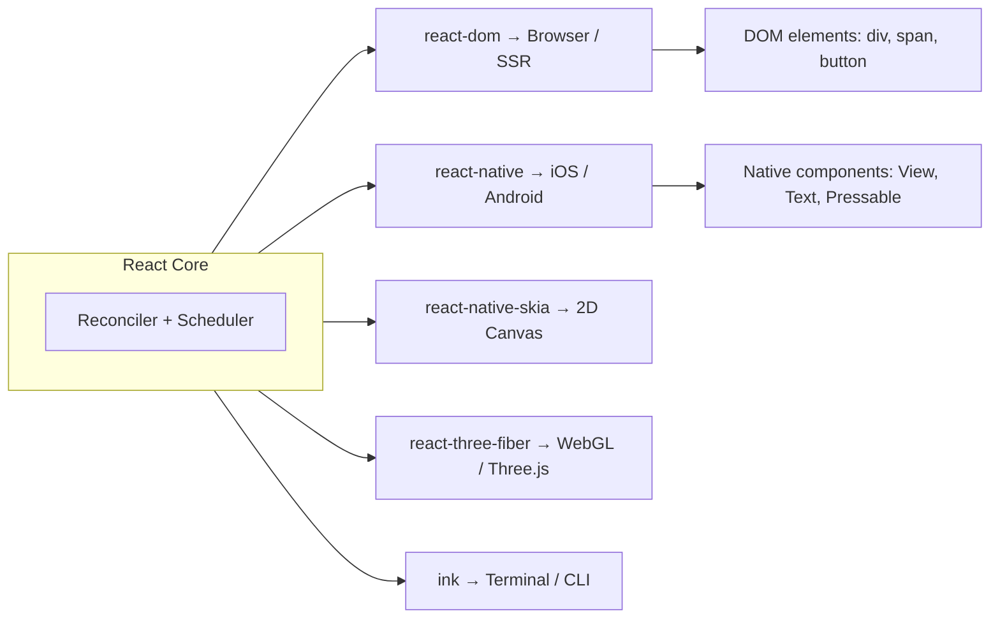

# React Beyond the Web: React Native and Ecosystem

> [!summary] Goal
> Understand how React's mental model extends beyond the browser to mobile, desktop, and other platforms.

## Table of Contents

1. [The React Host Renderer Concept](#the-react-host-renderer-concept)
2. [React Native: Mobile](#react-native-mobile)
3. [React + Desktop (Electron, Tauri)](#react--desktop-electron-tauri)
4. [Code Sharing Between Web and Native](#code-sharing-between-web-and-native)
5. [When to Consider React Native](#when-to-consider-react-native)
6. [Ecosystem Landscape](#ecosystem-landscape)
7. [Pitfalls](#pitfalls)
8. [Q&A](#qa)

---

## The React Host Renderer Concept

React is not inherently tied to the DOM. The core (reconciler + scheduler) is platform-agnostic. Different **renderers** target different hosts:



**Key insight:** Your React knowledge transfers. Only the host primitives change.

---

## React Native: Mobile

### Mental model shift

```tsx
// React DOM (web)
function Button({ label }) {
  return <button className="btn">{label}</button>;
}

// React Native (mobile)
import { TouchableOpacity, Text, StyleSheet } from 'react-native';

function Button({ label }: { label: string }) {
  return (
    <TouchableOpacity style={styles.btn}>
      <Text>{label}</Text>
    </TouchableOpacity>
  );
}

const styles = StyleSheet.create({
  btn: { backgroundColor: 'blue', padding: 12, borderRadius: 8 },
});
```

### Key differences

| Concept | React DOM | React Native |
|---------|-----------|-------------|
| Styling | CSS classes/inline | JS objects, no cascade, Flexbox default |
| Navigation | React Router | React Navigation (stack, tab, drawer) |
| State management | Same (Redux, Zustand, etc.) | Same |
| Icons | `react-icons` / SVG | `react-native-vector-icons` |
| Animations | Framer Motion | React Native `Animated` + Reanimated |
| Platform-specific code | N/A | iOS vs Android via `.ios.tsx` / `.android.tsx` |

---

## React + Desktop (Electron, Tauri)

### Electron

- Chromium + Node.js under the hood.
- Your React app runs in a Chromium window with full Node.js API access (file system, native dialogs).
- Bundle size: ~100 MB (includes Chromium).

```tsx
// main process (Electron)
const { app, BrowserWindow } = require('electron');

app.whenReady().then(() => {
  const win = new BrowserWindow({ width: 1024, height: 768 });
  win.loadURL('http://localhost:5173'); // dev, or load local build
});
```

### Tauri

- Uses your OS's native webview (smaller: ~3 MB).
- Backend in Rust, not Node.js.
- Better for small utilities and performance-sensitive apps.

**Choose Electron** if you need Node.js ecosystem (files, child processes, native addons).  
**Choose Tauri** if you want a smaller binary and are comfortable with Rust.

---

## Code Sharing Between Web and Native

### Strategy 1: Shared business logic only

```tsx
// shared/hooks/useAuth.ts — same for web and native
export function useAuth() {
  const [user, setUser] = useState<User | null>(null);
  // ...
}
```

The UI is separate per platform; hooks and state management are shared.

### Strategy 2: React Native for Web

```tsx
// Using react-native-web — same components render to DOM
import { View, Text, TouchableOpacity } from 'react-native';

function Button({ label, onClick }: { label: string; onClick: () => void }) {
  return (
    <TouchableOpacity onPress={onClick} style={{ padding: 12, backgroundColor: 'blue' }}>
      <Text>{label}</Text>
    </TouchableOpacity>
  );
}
```

With `react-native-web`, your React Native components render as `<div>` / `<span>` in the browser.

```mermaid
flowchart LR
    A[Your Components\n(react-native)] --> B[react-native]
    A --> C[react-native-web]
    B --> D[iOS]
    B --> E[Android]
    C --> F[Browser]
```

### When to use each

| Approach | Best for |
|----------|----------|
| Separate UI, shared logic | Teams with platform-specific UI requirements |
| React Native for Web | Rapid cross-platform prototyping, simple UIs |
| Expo | Most new React Native projects (managed build pipeline) |

---

## When to Consider React Native

**Good fit:**

- The app needs native performance (camera, GPS, Bluetooth).
- The app targets both iOS and Android from a single codebase.
- You have a web React team that also needs to own mobile.

**Bad fit:**

- The app is mostly text and forms — a PWA or mobile-web solution is cheaper.
- The app needs deep platform-native look-and-feel (stock calendar, mail apps).
- The team has no mobile development experience.

---

## Ecosystem Landscape

| Concern | Web (React DOM) | React Native |
|---------|----------------|--------------|
| UI Components | HTML elements | `@shopify/restyle`, NativeBase, Tamagui |
| Navigation | React Router, TanStack Router | React Navigation (stack, tab, drawer) |
| Performance | Virtual DOM + Profiler | Hermes engine, FlashList, Reanimated |
| State management | Redux, Zustand, Jotai | Same |
| Data fetching | RTK Query, React Query, SWR | Same |
| Testing | Testing Library + MSW | Testing Library + jest-native |
| Animations | Framer Motion, CSS transitions | Reanimated, Lottie |
| Forms | React Hook Form + Zod | Same |
| Accessibility | ARIA, axe | Accessibility API, screen readers |

---

## Pitfalls

- **Assuming components are identical** — `div` vs `View`, `onClick` vs `onPress`, CSS cascade vs inline styles. Expect a learning curve.
- **Native modules** — accessing phone hardware (camera, GPS) requires native code or Expo modules. It's not "write once, run anywhere."
- **Performance traps** — FlatList is not as forgiving as `map` in a div. Navigation stacks need lazy initialisation.
- **Navigation is harder** — React Router patterns don't translate. React Navigation has its own mental model (stack, tab, drawer, deep links).

---

## Q&A

> [!question]- Can I use Redux Toolkit with React Native?

Yes, exactly the same. Redux Toolkit and RTK Query work identically on web and native.

> [!question]- Should I learn React Native before or after React DOM?

After. The React mental model is the same. Learn the web fundamentals first, then add the host-specific differences.

> [!question]- Is React Native faster than a web app in a mobile browser?

For complex interactions (swipe lists, animations, camera), yes — React Native runs native code. For simple text-heavy views, a mobile web app can be just as fast and much cheaper to maintain.

## References

- [React Native Documentation](https://reactnative.dev/)
- [Expo Documentation](https://docs.expo.dev/)
- [React Native for Web](https://necolas.github.io/react-native-web/)
- [Tauri](https://tauri.app/)
- [[React/01_Foundations/01_React_Mental_Model_and_Rendering]]
- [[React/02_Core/01_Redux_Toolkit_Essentials]]
