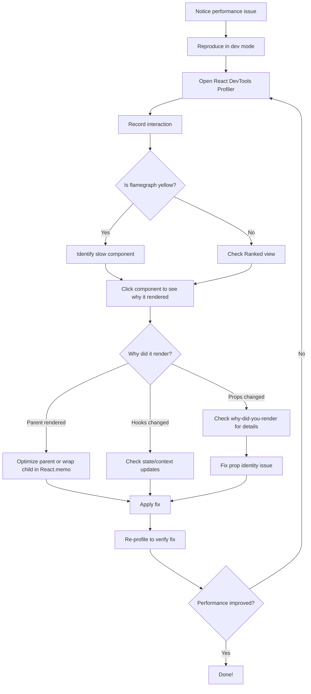
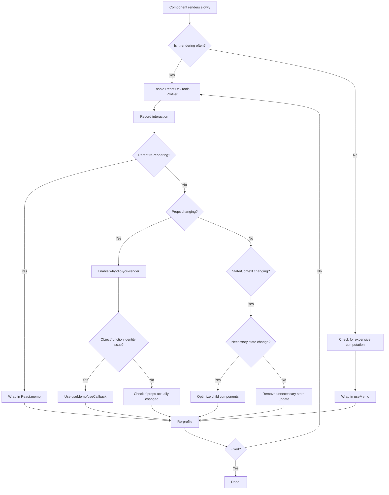

# Debug Re-renders and Performance Issues

> [!summary] Goal
> Step-by-step guide to identify, debug, and fix React re-render and performance issues using React DevTools Profiler and why-did-you-render.

## Table of Contents

- [Quick Reference](#quick-reference)
- [React DevTools Profiler Guide](#react-devtools-profiler-guide)
- [why-did-you-render Setup](#why-did-you-render-setup)
- [Common Re-render Scenarios](#common-re-render-scenarios)
- [Debugging Workflow](#debugging-workflow)
- [Performance Optimization Checklist](#performance-optimization-checklist)
- [Tools Comparison](#tools-comparison)
- [Real-World Examples](#real-world-examples)
- [Debugging Flowchart](#debugging-flowchart)
- [Quick Reference Cheat Sheet](#quick-reference-cheat-sheet)

---

## Quick Reference

### Performance Issues Checklist

```
□ Component re-renders too often?
  → Check with React DevTools Profiler
  → Enable why-did-you-render
  → Look for parent re-renders, context changes, props identity

□ Expensive computation on every render?
  → Wrap in useMemo

□ Function recreated on every render?
  → Wrap in useCallback

□ Child re-renders unnecessarily?
  → Wrap in React.memo

□ Large list rendering slowly?
  → Use react-window or react-virtualized

□ Heavy component blocking UI?
  → Code split with lazy() and Suspense
```

---

## React DevTools Profiler Guide

### Installation

```bash
# Chrome Extension
# https://chrome.google.com/webstore/detail/react-developer-tools

# Firefox Extension
# https://addons.mozilla.org/en-US/firefox/addon/react-devtools/
```

### How to Use

**Step 1: Start Profiling**
1. Open React DevTools (Inspect → React tab)
2. Click "Profiler" tab
3. Click record button (⚫)
4. Perform the action you want to profile
5. Click stop button (⏹)

**Step 2: Analyze Results**

**Flamegraph View:**
- Shows component hierarchy
- Width = render duration
- Color = time relative to other components
  - Yellow = took longer
  - Blue = took less time
  - Gray = didn't render

**Ranked View:**
- Lists components by render time
- Useful to find the slowest components

**Component Details:**
- Click a component to see:
  - Why it rendered (props changed, state changed, parent rendered)
  - How long it took
  - Props and state values

### Reading the Profiler

```
Component Render Reasons:
✓ "Props changed: value" → Props identity changed
✓ "Hooks changed" → State or context changed
✓ "Parent component rendered" → Parent re-rendered (most common)
```

**Example Analysis:**

```
ProductList (12.4ms)
├─ ProductCard (2.1ms) - Props changed: product
├─ ProductCard (2.0ms) - Props changed: product
└─ ProductCard (1.9ms) - Props changed: product

Why ProductList rendered: Hooks changed
```

**Interpretation:**
- ProductList took 12.4ms total
- It re-rendered because of a hook change (useState/useContext)
- All ProductCard children re-rendered

---

## why-did-you-render Setup

### Installation

```bash
npm install --save-dev @welldone-software/why-did-you-render
```

### Setup (Development Only)

**Create config file:**

```tsx
// src/wdyr.ts
import React from 'react';

if (process.env.NODE_ENV === 'development') {
  const whyDidYouRender = require('@welldone-software/why-did-you-render');
  
  whyDidYouRender(React, {
    trackAllPureComponents: false, // Set to true to track all
    trackHooks: true,
    trackExtraHooks: [
      [require('react-redux'), 'useSelector'],
    ],
    logOnDifferentValues: true,
    collapseGroups: true,
  });
}
```

**Import in entry point:**

```tsx
// src/main.tsx
import './wdyr'; // Must be first import
import React from 'react';
import ReactDOM from 'react-dom/client';
import App from './App';

ReactDOM.createRoot(document.getElementById('root')!).render(<App />);
```

### Mark Components to Track

```tsx
// Option 1: Named function component
const ProductCard = ({ product }: ProductCardProps) => {
  return <div>{product.name}</div>;
};

ProductCard.whyDidYouRender = true;

export default ProductCard;
```

```tsx
// Option 2: displayName
const ProductCard = ({ product }: ProductCardProps) => {
  return <div>{product.name}</div>;
};

ProductCard.displayName = 'ProductCard';
ProductCard.whyDidYouRender = true;

export default ProductCard;
```

```tsx
// Option 3: Track all pure components (in wdyr.ts)
whyDidYouRender(React, {
  trackAllPureComponents: true, // Automatic tracking
});
```

### Reading Output

**Console output:**

```
ProductCard re-rendered because of hook changes:
  different objects that are equal by value.

hooks:
  prev hook: {products: [{id: 1, name: 'Phone'}]}
  next hook: {products: [{id: 1, name: 'Phone'}]}

The objects are equal by value, but different by reference.
```

**Interpretation:**
- Component re-rendered
- Hook value (useState/useContext) changed
- Objects are equal by value but different references (common issue!)

---

## Common Re-render Scenarios

### 1. Parent Component Re-renders

**Problem:**
```tsx
const ParentList = () => {
  const [filter, setFilter] = useState('');
  const products = useGetProductsQuery().data ?? [];

  return (
    <div>
      <input value={filter} onChange={(e) => setFilter(e.target.value)} />
      {products.map(product => (
        <ProductCard key={product.id} product={product} />
      ))}
    </div>
  );
};

// Every keystroke in input re-renders ALL ProductCards
```

**Solution:**
```tsx
const ProductCard = React.memo(({ product }: { product: Product }) => {
  return <div>{product.name}</div>;
});

// Now ProductCard only re-renders if product changes
```

---

### 2. Context Re-renders All Consumers

**Problem:**
```tsx
const AppContext = createContext<AppContextValue>(null!);

const AppProvider = ({ children }: { children: ReactNode }) => {
  const [user, setUser] = useState<User | null>(null);
  const [theme, setTheme] = useState<Theme>('light');

  // ❌ New object on every render
  const value = { user, setUser, theme, setTheme };

  return <AppContext.Provider value={value}>{children}</AppContext.Provider>;
};

// Every consumer re-renders when ANY value changes
```

**Solution 1: Memoize context value**
```tsx
const AppProvider = ({ children }: { children: ReactNode }) => {
  const [user, setUser] = useState<User | null>(null);
  const [theme, setTheme] = useState<Theme>('light');

  const value = useMemo(
    () => ({ user, setUser, theme, setTheme }),
    [user, theme]
  );

  return <AppContext.Provider value={value}>{children}</AppContext.Provider>;
};
```

**Solution 2: Split contexts**
```tsx
const UserContext = createContext<UserContextValue>(null!);
const ThemeContext = createContext<ThemeContextValue>(null!);

const AppProvider = ({ children }: { children: ReactNode }) => {
  const [user, setUser] = useState<User | null>(null);
  const [theme, setTheme] = useState<Theme>('light');

  const userValue = useMemo(() => ({ user, setUser }), [user]);
  const themeValue = useMemo(() => ({ theme, setTheme }), [theme]);

  return (
    <UserContext.Provider value={userValue}>
      <ThemeContext.Provider value={themeValue}>
        {children}
      </ThemeContext.Provider>
    </UserContext.Provider>
  );
};

// Now components only re-render when their specific context changes
```

---

### 3. Object/Array Props Identity

**Problem:**
```tsx
const ProductList = () => {
  const { data } = useGetProductsQuery();

  // ❌ New array on every render
  const visibleProducts = data?.filter(p => p.visible) ?? [];

  return <ProductGrid products={visibleProducts} />;
};

const ProductGrid = React.memo(({ products }: { products: Product[] }) => {
  // Re-renders every time even if products didn't change
  return <div>{products.map(p => <ProductCard key={p.id} product={p} />)}</div>;
});
```

**Solution:**
```tsx
const ProductList = () => {
  const { data } = useGetProductsQuery();

  // ✅ Same array reference if data didn't change
  const visibleProducts = useMemo(
    () => data?.filter(p => p.visible) ?? [],
    [data]
  );

  return <ProductGrid products={visibleProducts} />;
};
```

---

### 4. Inline Function Props

**Problem:**
```tsx
const ProductList = () => {
  const products = useGetProductsQuery().data ?? [];

  return (
    <div>
      {products.map(product => (
        <ProductCard
          key={product.id}
          product={product}
          onDelete={() => deleteProduct(product.id)} // ❌ New function every render
        />
      ))}
    </div>
  );
};
```

**Solution 1: useCallback**
```tsx
const ProductList = () => {
  const products = useGetProductsQuery().data ?? [];
  const [deleteProduct] = useDeleteProductMutation();

  const handleDelete = useCallback((id: number) => {
    deleteProduct(id);
  }, [deleteProduct]);

  return (
    <div>
      {products.map(product => (
        <ProductCard
          key={product.id}
          product={product}
          onDelete={() => handleDelete(product.id)} // Still creates new function
        />
      ))}
    </div>
  );
};
```

**Solution 2: Pass ID instead**
```tsx
const ProductList = () => {
  const products = useGetProductsQuery().data ?? [];
  const [deleteProduct] = useDeleteProductMutation();

  const handleDelete = useCallback((id: number) => {
    deleteProduct(id);
  }, [deleteProduct]);

  return (
    <div>
      {products.map(product => (
        <ProductCard
          key={product.id}
          product={product}
          productId={product.id}
          onDelete={handleDelete} // ✅ Same function reference
        />
      ))}
    </div>
  );
};

const ProductCard = React.memo(({ product, productId, onDelete }: ProductCardProps) => {
  return (
    <div>
      {product.name}
      <button onClick={() => onDelete(productId)}>Delete</button>
    </div>
  );
});
```

---

### 5. State Updates in useEffect

**Problem:**
```tsx
const ProductDetails = ({ productId }: { productId: number }) => {
  const [product, setProduct] = useState<Product | null>(null);

  useEffect(() => {
    fetch(`/api/products/${productId}`)
      .then(res => res.json())
      .then(data => setProduct(data)); // Triggers re-render
  }, [productId]);

  useEffect(() => {
    // ❌ Runs after product state changes
    console.log('Product changed:', product);
    // If this effect updates state, infinite loop!
  }, [product]);

  return <div>{product?.name}</div>;
};
```

**Solution: Use RTK Query (or combine effects)**
```tsx
const ProductDetails = ({ productId }: { productId: number }) => {
  const { data: product } = useGetProductQuery(productId);

  useEffect(() => {
    if (product) {
      console.log('Product loaded:', product);
    }
  }, [product]);

  return <div>{product?.name}</div>;
};
```

---

### 6. Inline Object Props

**Problem:**
```tsx
const ProductCard = () => {
  return (
    <div>
      <Button style={{ color: 'red', fontSize: 16 }}>Delete</Button>
      {/* ❌ New object every render */}
    </div>
  );
};
```

**Solution 1: Extract constant**
```tsx
const deleteButtonStyle = { color: 'red', fontSize: 16 };

const ProductCard = () => {
  return (
    <div>
      <Button style={deleteButtonStyle}>Delete</Button>
    </div>
  );
};
```

**Solution 2: useMemo (if dynamic)**
```tsx
const ProductCard = ({ isPrimary }: { isPrimary: boolean }) => {
  const buttonStyle = useMemo(
    () => ({ color: isPrimary ? 'blue' : 'red', fontSize: 16 }),
    [isPrimary]
  );

  return (
    <div>
      <Button style={buttonStyle}>Delete</Button>
    </div>
  );
};
```

---

### 7. Expensive Computations

**Problem:**
```tsx
const ProductList = ({ products }: { products: Product[] }) => {
  // ❌ Runs on every render
  const sortedProducts = products.slice().sort((a, b) => b.price - a.price);
  const averagePrice = products.reduce((sum, p) => sum + p.price, 0) / products.length;

  return (
    <div>
      <p>Average: ${averagePrice}</p>
      {sortedProducts.map(p => <ProductCard key={p.id} product={p} />)}
    </div>
  );
};
```

**Solution:**
```tsx
const ProductList = ({ products }: { products: Product[] }) => {
  const sortedProducts = useMemo(
    () => products.slice().sort((a, b) => b.price - a.price),
    [products]
  );

  const averagePrice = useMemo(
    () => products.reduce((sum, p) => sum + p.price, 0) / products.length,
    [products]
  );

  return (
    <div>
      <p>Average: ${averagePrice}</p>
      {sortedProducts.map(p => <ProductCard key={p.id} product={p} />)}
    </div>
  );
};
```

---

### 8. useCallback Dependencies

**Problem:**
```tsx
const ProductList = ({ category }: { category: string }) => {
  const [products, setProducts] = useState<Product[]>([]);

  // ❌ handleRefresh changes when category changes
  // But it doesn't use category!
  const handleRefresh = useCallback(() => {
    fetch('/api/products').then(res => res.json()).then(setProducts);
  }, [category]);

  return <button onClick={handleRefresh}>Refresh</button>;
};
```

**Solution:**
```tsx
const ProductList = ({ category }: { category: string }) => {
  const [products, setProducts] = useState<Product[]>([]);

  const handleRefresh = useCallback(() => {
    fetch('/api/products').then(res => res.json()).then(setProducts);
  }, []); // ✅ No dependencies needed

  return <button onClick={handleRefresh}>Refresh</button>;
};
```

---

### 9. Redux Selector Re-renders

**Problem:**
```tsx
const ProductList = () => {
  // ❌ New array on every Redux state change
  const products = useAppSelector(state => 
    state.products.items.filter(p => p.visible)
  );

  return <div>{products.map(p => <ProductCard key={p.id} product={p} />)}</div>;
};
```

**Solution 1: Memoized selector**
```tsx
import { createSelector } from '@reduxjs/toolkit';

const selectVisibleProducts = createSelector(
  (state: RootState) => state.products.items,
  (items) => items.filter(p => p.visible)
);

const ProductList = () => {
  const products = useAppSelector(selectVisibleProducts);
  return <div>{products.map(p => <ProductCard key={p.id} product={p} />)}</div>;
};
```

**Solution 2: Use RTK Query**
```tsx
const ProductList = () => {
  const { data: products } = useGetProductsQuery({ visible: true });
  return <div>{products?.map(p => <ProductCard key={p.id} product={p} />)}</div>;
};
```

---

### 10. Debounced Input

**Problem:**
```tsx
const SearchInput = () => {
  const [search, setSearch] = useState('');
  const { data } = useSearchProductsQuery(search); // Queries on every keystroke

  return <input value={search} onChange={(e) => setSearch(e.target.value)} />;
};
```

**Solution:**
```tsx
import { useDebounce } from '@/shared/hooks/useDebounce';

const SearchInput = () => {
  const [search, setSearch] = useState('');
  const debouncedSearch = useDebounce(search, 300);
  const { data } = useSearchProductsQuery(debouncedSearch); // Queries after 300ms

  return <input value={search} onChange={(e) => setSearch(e.target.value)} />;
};

// useDebounce hook:
export const useDebounce = <T,>(value: T, delay: number): T => {
  const [debouncedValue, setDebouncedValue] = useState(value);

  useEffect(() => {
    const handler = setTimeout(() => setDebouncedValue(value), delay);
    return () => clearTimeout(handler);
  }, [value, delay]);

  return debouncedValue;
};
```

---

### 11. Large Lists

**Problem:**
```tsx
const ProductList = ({ products }: { products: Product[] }) => {
  // 10,000 products = 10,000 DOM nodes
  return (
    <div>
      {products.map(product => (
        <ProductCard key={product.id} product={product} />
      ))}
    </div>
  );
};
```

**Solution: Virtualization**
```tsx
import { FixedSizeList } from 'react-window';

const ProductList = ({ products }: { products: Product[] }) => {
  return (
    <FixedSizeList
      height={600}
      itemCount={products.length}
      itemSize={100}
      width="100%"
    >
      {({ index, style }) => (
        <div style={style}>
          <ProductCard product={products[index]} />
        </div>
      )}
    </FixedSizeList>
  );
};
// Renders only visible items (~6-10 DOM nodes)
```

---

### 12. Unnecessary Re-renders of Memoized Components

**Problem:**
```tsx
const ExpensiveChild = React.memo(({ data, onUpdate }: ChildProps) => {
  console.log('ExpensiveChild rendered');
  return <div>{data.name}</div>;
});

const Parent = () => {
  const [count, setCount] = useState(0);
  const data = { name: 'Product' }; // ❌ New object every render
  const handleUpdate = () => {}; // ❌ New function every render

  return (
    <div>
      <button onClick={() => setCount(count + 1)}>Count: {count}</button>
      <ExpensiveChild data={data} onUpdate={handleUpdate} />
      {/* Re-renders on every count change */}
    </div>
  );
};
```

**Solution:**
```tsx
const ExpensiveChild = React.memo(({ data, onUpdate }: ChildProps) => {
  console.log('ExpensiveChild rendered');
  return <div>{data.name}</div>;
});

const Parent = () => {
  const [count, setCount] = useState(0);
  const data = useMemo(() => ({ name: 'Product' }), []);
  const handleUpdate = useCallback(() => {}, []);

  return (
    <div>
      <button onClick={() => setCount(count + 1)}>Count: {count}</button>
      <ExpensiveChild data={data} onUpdate={handleUpdate} />
      {/* ✅ Doesn't re-render on count change */}
    </div>
  );
};
```

---

### 13. React Router Triggers Re-renders

**Problem:**
```tsx
const Layout = () => {
  const location = useLocation(); // ❌ Re-renders on every route change

  return (
    <div>
      <Header />
      <Sidebar />
      <Outlet />
    </div>
  );
};
// Header and Sidebar re-render on every route change
```

**Solution:**
```tsx
const Header = React.memo(() => {
  return <header>My App</header>;
});

const Sidebar = React.memo(() => {
  return <aside>Sidebar</aside>;
});

const Layout = () => {
  const location = useLocation();

  return (
    <div>
      <Header />
      <Sidebar />
      <Outlet />
    </div>
  );
};
// ✅ Header and Sidebar don't re-render
```

---

### 14. Form Re-renders

**Problem:**
```tsx
const LoginForm = () => {
  const [email, setEmail] = useState('');
  const [password, setPassword] = useState('');

  // ❌ Entire form re-renders on every keystroke
  return (
    <form>
      <input value={email} onChange={(e) => setEmail(e.target.value)} />
      <input value={password} onChange={(e) => setPassword(e.target.value)} />
      <ExpensiveComponent /> {/* Re-renders unnecessarily */}
    </form>
  );
};
```

**Solution 1: React.memo**
```tsx
const ExpensiveComponent = React.memo(() => {
  console.log('ExpensiveComponent rendered');
  return <div>Some heavy computation</div>;
});
```

**Solution 2: React Hook Form (no re-renders)**
```tsx
import { useForm } from 'react-hook-form';

const LoginForm = () => {
  const { register, handleSubmit } = useForm();

  // ✅ Form inputs are uncontrolled, no re-renders
  return (
    <form onSubmit={handleSubmit(data => console.log(data))}>
      <input {...register('email')} />
      <input {...register('password')} />
      <ExpensiveComponent /> {/* Doesn't re-render */}
    </form>
  );
};
```

---

### 15. Animation Frame Loop

**Problem:**
```tsx
const AnimatedComponent = () => {
  const [position, setPosition] = useState(0);

  useEffect(() => {
    let frameId: number;
    
    const animate = () => {
      setPosition(prev => prev + 1); // ❌ Re-renders 60 times per second
      frameId = requestAnimationFrame(animate);
    };
    
    frameId = requestAnimationFrame(animate);
    return () => cancelAnimationFrame(frameId);
  }, []);

  return <div style={{ transform: `translateX(${position}px)` }}>Animated</div>;
};
```

**Solution: Use ref**
```tsx
const AnimatedComponent = () => {
  const positionRef = useRef(0);
  const elementRef = useRef<HTMLDivElement>(null);

  useEffect(() => {
    let frameId: number;
    
    const animate = () => {
      positionRef.current += 1;
      if (elementRef.current) {
        // ✅ Update DOM directly, no re-render
        elementRef.current.style.transform = `translateX(${positionRef.current}px)`;
      }
      frameId = requestAnimationFrame(animate);
    };
    
    frameId = requestAnimationFrame(animate);
    return () => cancelAnimationFrame(frameId);
  }, []);

  return <div ref={elementRef}>Animated</div>;
};
```

---

## Debugging Workflow

### Step-by-Step Process



**Detailed Steps:**

1. **Identify the problem:**
   - Slow interaction (lag, freeze)
   - Excessive re-renders
   - High CPU usage

2. **Enable profiling:**
   - React DevTools Profiler
   - why-did-you-render (for deep analysis)

3. **Record the interaction:**
   - Click record
   - Perform the slow action
   - Stop recording

4. **Analyze Flamegraph:**
   - Find yellow/orange bars (slow components)
   - Check component hierarchy
   - Note render duration

5. **Click slow component:**
   - Read "Why did this component render?"
   - Check props/state values
   - Look for unnecessary re-renders

6. **Identify root cause:**
   - Parent re-render → wrap in React.memo
   - Props changed → check object/function identity
   - Hooks changed → check useState/useContext
   - Expensive computation → wrap in useMemo

7. **Apply fix:**
   - Add React.memo, useMemo, useCallback
   - Split context
   - Virtualize list
   - Code split

8. **Verify:**
   - Re-profile
   - Compare before/after
   - Ensure fix works

---

## Performance Optimization Checklist

### Before You Optimize

- [ ] Measure first (React DevTools Profiler)
- [ ] Identify the bottleneck (don't guess)
- [ ] Set a performance budget (e.g., <100ms interaction)

### Component Level

- [ ] Wrap expensive components in `React.memo`
- [ ] Use `useMemo` for expensive computations
- [ ] Use `useCallback` for functions passed to memoized children
- [ ] Avoid inline objects/arrays in props
- [ ] Extract constants outside component
- [ ] Split large components into smaller ones

### State Management

- [ ] Use local state when possible (not Redux)
- [ ] Split context to prevent unnecessary re-renders
- [ ] Memoize context value
- [ ] Use memoized selectors for Redux
- [ ] Prefer RTK Query for server data

### Lists

- [ ] Use `key` prop correctly (stable, unique ID)
- [ ] Virtualize long lists (react-window)
- [ ] Paginate or infinite scroll
- [ ] Debounce search/filter inputs

### Data Fetching

- [ ] Use RTK Query for caching
- [ ] Debounce search queries
- [ ] Prefetch data on hover
- [ ] Use stale-while-revalidate strategy

### Code Splitting

- [ ] Route-based code splitting
- [ ] Lazy load heavy components
- [ ] Vendor chunking (React, Redux separately)

### Network

- [ ] Optimize bundle size (analyze with rollup-plugin-visualizer)
- [ ] Use CDN for static assets
- [ ] Enable gzip/brotli compression
- [ ] Lazy load images

### Runtime

- [ ] Avoid expensive operations in render
- [ ] Use Web Workers for heavy computations
- [ ] Throttle scroll/resize handlers
- [ ] Batch state updates

---

## Tools Comparison

| Tool | Purpose | Pros | Cons | When to Use |
|------|---------|------|------|-------------|
| **React DevTools Profiler** | Visualize render performance | Built-in, visual flamegraph, shows render reasons | No automatic tracking | First step for any perf issue |
| **why-did-you-render** | Detect unnecessary re-renders | Detailed console logs, shows prop changes | Requires manual setup | Deep debugging of re-renders |
| **Redux DevTools** | Inspect Redux state | Time-travel, action log | Redux-specific | Debug Redux state changes |
| **React Query DevTools** | Inspect RTK Query cache | Cache visualization, network timeline | RTK Query only | Debug data fetching |
| **Lighthouse** | Overall performance audit | Comprehensive, scores | Not React-specific | Production performance check |
| **Bundle Analyzer** | Analyze bundle size | Visual treemap | Build-time only | Optimize bundle size |

---

## Real-World Examples

### Example 1: Slow Product List

**Problem:**
```tsx
const ProductList = () => {
  const { data: products } = useGetProductsQuery();
  const [search, setSearch] = useState('');

  // ❌ Filters on every render
  const filtered = products?.filter(p => 
    p.name.toLowerCase().includes(search.toLowerCase())
  ) ?? [];

  return (
    <div>
      <input value={search} onChange={(e) => setSearch(e.target.value)} />
      {filtered.map(product => (
        <ProductCard key={product.id} product={product} />
      ))}
    </div>
  );
};
```

**Profiler shows:**
- ProductList: 45ms (yellow)
- Reason: Hooks changed (search)
- All ProductCards re-rendered

**Fixes:**

1. **Memoize filter:**
```tsx
const filtered = useMemo(
  () => products?.filter(p => 
    p.name.toLowerCase().includes(search.toLowerCase())
  ) ?? [],
  [products, search]
);
```

2. **Memoize ProductCard:**
```tsx
const ProductCard = React.memo(({ product }: { product: Product }) => {
  return <div>{product.name}</div>;
});
```

**Result:**
- ProductList: 5ms (blue)
- ProductCards don't re-render if product didn't change

---

### Example 2: Context Re-renders Entire App

**Problem:**
```tsx
const AppContext = createContext<AppContextValue>(null!);

const AppProvider = ({ children }: PropsWithChildren) => {
  const [user, setUser] = useState<User | null>(null);
  const [notifications, setNotifications] = useState<Notification[]>([]);

  const value = { user, setUser, notifications, setNotifications };

  return <AppContext.Provider value={value}>{children}</AppContext.Provider>;
};

// Every notification update re-renders all consumers (even those using only user)
```

**why-did-you-render output:**
```
Header re-rendered
  reason: context changed
  prev: {user: {name: "John"}, notifications: []}
  next: {user: {name: "John"}, notifications: [{...}]}
```

**Fix:**
```tsx
const UserContext = createContext<UserContextValue>(null!);
const NotificationsContext = createContext<NotificationsContextValue>(null!);

const AppProvider = ({ children }: PropsWithChildren) => {
  const [user, setUser] = useState<User | null>(null);
  const [notifications, setNotifications] = useState<Notification[]>([]);

  const userValue = useMemo(() => ({ user, setUser }), [user]);
  const notificationsValue = useMemo(
    () => ({ notifications, setNotifications }),
    [notifications]
  );

  return (
    <UserContext.Provider value={userValue}>
      <NotificationsContext.Provider value={notificationsValue}>
        {children}
      </NotificationsContext.Provider>
    </UserContext.Provider>
  );
};

// Components using user don't re-render on notification changes
```

---

### Example 3: Expensive Calculation in List

**Problem:**
```tsx
const ProductStats = ({ products }: { products: Product[] }) => {
  // ❌ Runs on every render (even when products didn't change)
  const averagePrice = products.reduce((sum, p) => sum + p.price, 0) / products.length;
  const totalInventory = products.reduce((sum, p) => sum + p.inventory, 0);
  const categories = [...new Set(products.map(p => p.category))];

  return (
    <div>
      <p>Average Price: ${averagePrice}</p>
      <p>Total Inventory: {totalInventory}</p>
      <p>Categories: {categories.length}</p>
    </div>
  );
};
```

**Profiler shows:**
- ProductStats: 23ms (yellow)
- Reason: Parent rendered
- Expensive calculations run every time

**Fix:**
```tsx
const ProductStats = ({ products }: { products: Product[] }) => {
  const averagePrice = useMemo(
    () => products.reduce((sum, p) => sum + p.price, 0) / products.length,
    [products]
  );
  
  const totalInventory = useMemo(
    () => products.reduce((sum, p) => sum + p.inventory, 0),
    [products]
  );
  
  const categories = useMemo(
    () => [...new Set(products.map(p => p.category))],
    [products]
  );

  return (
    <div>
      <p>Average Price: ${averagePrice}</p>
      <p>Total Inventory: {totalInventory}</p>
      <p>Categories: {categories.length}</p>
    </div>
  );
};
```

**Result:**
- ProductStats: 2ms (blue)
- Calculations only run when products change

---

## Debugging Flowchart



---

## Quick Reference Cheat Sheet

### Optimization Tools

| Problem | Tool | Fix |
|---------|------|-----|
| Parent re-renders child | React DevTools → Flamegraph | `React.memo(Child)` |
| Props change but equal by value | why-did-you-render | `useMemo` for object/array props |
| Expensive computation | React DevTools → Component duration | `useMemo` |
| Function prop changes | why-did-you-render | `useCallback` |
| Context re-renders all | React DevTools → "Hooks changed" | Split context, memoize value |
| Redux selector creates new array | Redux DevTools | `createSelector` |
| Large list slow | Lighthouse | `react-window` |
| Bundle too large | Bundle Analyzer | Code splitting, tree shaking |

### Common Fixes

```tsx
// 1. Memoize component
const Child = React.memo(({ data }: Props) => <div>{data.name}</div>);

// 2. Memoize value
const value = useMemo(() => ({ name: 'Product' }), []);

// 3. Memoize callback
const handleClick = useCallback(() => alert('Clicked'), []);

// 4. Memoize expensive calculation
const total = useMemo(() => items.reduce((sum, i) => sum + i.price, 0), [items]);

// 5. Memoize context
const value = useMemo(() => ({ user, setUser }), [user]);

// 6. Memoize selector
const selectFiltered = createSelector(
  (state: RootState) => state.items,
  (items) => items.filter(i => i.visible)
);

// 7. Virtualize list
<FixedSizeList height={600} itemCount={items.length} itemSize={50}>
  {({ index, style }) => <Item style={style} data={items[index]} />}
</FixedSizeList>

// 8. Debounce input
const debouncedSearch = useDebounce(search, 300);
const { data } = useSearchQuery(debouncedSearch);
```

### Decision Tree

```
Is performance bad?
├─ Yes → Measure with React DevTools Profiler
│   ├─ Component renders too often?
│   │   ├─ Parent re-renders? → React.memo
│   │   ├─ Props change unnecessarily? → useMemo/useCallback
│   │   └─ State/context changes? → Split or optimize
│   └─ Component renders too slowly?
│       ├─ Expensive computation? → useMemo
│       ├─ Large list? → Virtualize
│       └─ Heavy component? → Code split
└─ No → Don't optimize (premature optimization)
```

---

## Related

- [[02_Performance_and_Profiling]]
- [[02_Hooks_Complete_Reference]]
- [[01_Redux_Toolkit_Essentials]]
- [[02_RTK_Query_Essentials]]

## References

- [React DevTools Profiler](https://react.dev/learn/react-developer-tools)
- [why-did-you-render](https://github.com/welldone-software/why-did-you-render)
- [React Memo Documentation](https://react.dev/reference/react/memo)
- [useMemo Hook](https://react.dev/reference/react/useMemo)
- [useCallback Hook](https://react.dev/reference/react/useCallback)
