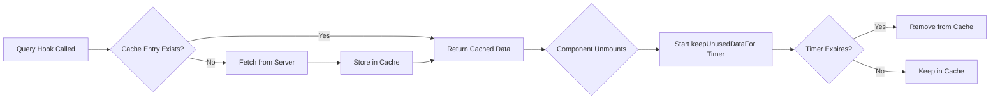
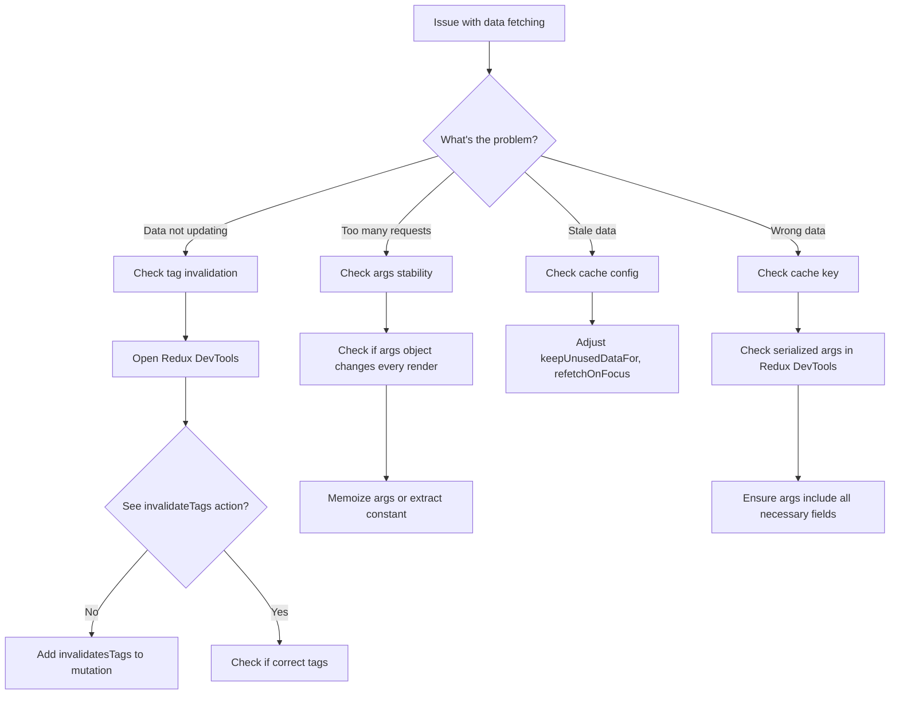
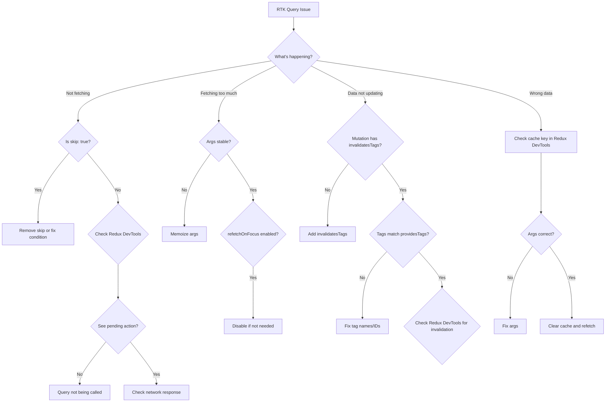

# Debug Data Fetching and Caching (RTK Query)

> [!summary] Goal
> Fix refetch loops, stale cache, and inconsistent UI by understanding query keys, tags, subscriptions, and RTK Query cache behavior.

## Table of Contents

- [RTK Query Cache Behavior](#rtk-query-cache-behavior)
- [Redux DevTools for RTK Query](#redux-devtools-for-rtk-query)
- [Common Caching Scenarios](#common-caching-scenarios)
- [Tag-Based Invalidation Debugging](#tag-based-invalidation-debugging)
- [Network Waterfall Analysis](#network-waterfall-analysis)
- [Request Deduplication](#request-deduplication)
- [Troubleshooting Guide](#troubleshooting-guide)
- [Common Pitfalls and Solutions](#common-pitfalls-and-solutions)
- [Debugging Flowchart](#debugging-flowchart)
- [Quick Reference Checklist](#quick-reference-checklist)

---

## RTK Query Cache Behavior

### How RTK Query Caches Data

RTK Query uses a **cache key** composed of:
1. **Endpoint name** (e.g., `getProducts`)
2. **Serialized arguments** (e.g., `{ category: 'electronics' }`)

```tsx
// These create different cache entries
useGetProductsQuery({ category: 'electronics' }); // Cache key: getProducts({"category":"electronics"})
useGetProductsQuery({ category: 'books' });       // Cache key: getProducts({"category":"books"})
useGetProductsQuery();                            // Cache key: getProducts(undefined)
```

### Cache Lifecycle



### Cache Configuration

```tsx
// features/products/api/productsApi.ts
export const productsApi = baseApi.injectEndpoints({
  endpoints: (builder) => ({
    getProducts: builder.query<Product[], ProductFilters | void>({
      query: (filters) => ({
        url: '/products',
        params: filters,
      }),
      // Cache for 60 seconds (default is 60)
      keepUnusedDataFor: 60,
      // Refetch when window regains focus
      refetchOnFocus: true,
      // Refetch when network reconnects
      refetchOnReconnect: true,
      // Refetch when component mounts if data is stale
      refetchOnMountOrArgChange: false, // or number of seconds
    }),
  }),
});
```

### Cache Entry States

| State | Description | When It Happens |
|-------|-------------|-----------------|
| **uninitialized** | No data, not fetched | Before first query |
| **pending** | Fetching in progress | During fetch |
| **fulfilled** | Data available | After successful fetch |
| **rejected** | Error occurred | After failed fetch |

---

## Redux DevTools for RTK Query

### Inspecting Cache State

Open Redux DevTools and check `api` reducer:

```json
{
  "api": {
    "queries": {
      "getProducts(undefined)": {
        "status": "fulfilled",
        "data": [...],
        "requestId": "xyz",
        "startedTimeStamp": 1234567890,
        "fulfilledTimeStamp": 1234567895
      },
      "getProduct({\"id\":1})": {
        "status": "fulfilled",
        "data": {...}
      }
    },
    "mutations": {
      "createProduct(...)": {
        "status": "pending"
      }
    },
    "subscriptions": {
      "getProducts(undefined)": {
        "xyz": { "refetchOnFocus": true }
      }
    }
  }
}
```

### Monitoring Actions

Watch for these actions in Redux DevTools:

```
api/executeQuery/pending       → Query started
api/executeQuery/fulfilled     → Query succeeded
api/executeQuery/rejected      → Query failed
api/executeMutation/pending    → Mutation started
api/executeMutation/fulfilled  → Mutation succeeded
invalidateTags                 → Tags invalidated
```

### Debugging with DevTools

1. **Check if query was called:**
   - Look for `api/executeQuery/pending` action
   - Check payload for endpoint name and args

2. **Check cache key:**
   - Inspect `queries` object
   - Verify serialized args match expectations

3. **Check subscriptions:**
   - Look at `subscriptions` object
   - Each active hook creates a subscription

4. **Check invalidation:**
   - Look for `invalidateTags` actions
   - See which tags were invalidated

---

## Common Caching Scenarios

### Scenario 1: Stale Data Not Updating

**Problem:**
```tsx
const ProductList = () => {
  const { data: products } = useGetProductsQuery();

  // Products don't update when someone else creates a product
  return <div>{products?.map(p => <ProductCard key={p.id} product={p} />)}</div>;
};
```

**Diagnosis:**
- Check Redux DevTools → No `invalidateTags` action after mutation
- Cache entry not invalidated

**Solution:**
```tsx
export const productsApi = baseApi.injectEndpoints({
  endpoints: (builder) => ({
    getProducts: builder.query<Product[], void>({
      query: () => '/products',
      providesTags: [{ type: 'Product', id: 'LIST' }], // ✅ Provide tag
    }),
    
    createProduct: builder.mutation<Product, Partial<Product>>({
      query: (body) => ({ url: '/products', method: 'POST', body }),
      invalidatesTags: [{ type: 'Product', id: 'LIST' }], // ✅ Invalidate tag
    }),
  }),
});
```

---

### Scenario 2: Cache Not Invalidating Specific Item

**Problem:**
```tsx
const ProductDetails = ({ id }: { id: number }) => {
  const { data: product } = useGetProductQuery(id);
  const [updateProduct] = useUpdateProductMutation();

  // After updating, product details don't refresh
  const handleUpdate = () => {
    updateProduct({ id, data: { name: 'New Name' } });
  };

  return <div>{product?.name}</div>;
};
```

**Diagnosis:**
- Mutation doesn't invalidate specific product tag
- Only invalidates LIST tag

**Solution:**
```tsx
export const productsApi = baseApi.injectEndpoints({
  endpoints: (builder) => ({
    getProduct: builder.query<Product, number>({
      query: (id) => `/products/${id}`,
      providesTags: (result, error, id) => [{ type: 'Product', id }], // ✅ Specific tag
    }),
    
    updateProduct: builder.mutation<Product, { id: number; data: Partial<Product> }>({
      query: ({ id, data }) => ({
        url: `/products/${id}`,
        method: 'PATCH',
        body: data,
      }),
      invalidatesTags: (result, error, { id }) => [
        { type: 'Product', id },              // ✅ Invalidate specific product
        { type: 'Product', id: 'LIST' },      // ✅ Also invalidate list
      ],
    }),
  }),
});
```

---

### Scenario 3: Race Condition (Old Request Overwrites New)

**Problem:**
```tsx
const ProductSearch = () => {
  const [search, setSearch] = useState('');
  const { data: products } = useGetProductsQuery({ search });

  // Type "ab" quickly → request for "a" comes back after "ab"
  // Shows results for "a" instead of "ab"
  return (
    <div>
      <input value={search} onChange={(e) => setSearch(e.target.value)} />
      {products?.map(p => <div key={p.id}>{p.name}</div>)}
    </div>
  );
};
```

**Diagnosis:**
- Multiple requests in flight
- Older request completes after newer request

**Solution: RTK Query handles this automatically**
```tsx
// RTK Query cancels previous requests by default
// But you can also debounce input to reduce requests

import { useDebounce } from '@/shared/hooks/useDebounce';

const ProductSearch = () => {
  const [search, setSearch] = useState('');
  const debouncedSearch = useDebounce(search, 300); // ✅ Debounce
  const { data: products } = useGetProductsQuery({ search: debouncedSearch });

  return (
    <div>
      <input value={search} onChange={(e) => setSearch(e.target.value)} />
      {products?.map(p => <div key={p.id}>{p.name}</div>)}
    </div>
  );
};
```

---

### Scenario 4: Duplicate Requests

**Problem:**
```tsx
const ProductPage = () => {
  // Both components make the same request
  return (
    <div>
      <ProductHeader />
      <ProductDetails />
    </div>
  );
};

const ProductHeader = () => {
  const { data: product } = useGetProductQuery(1);
  return <h1>{product?.name}</h1>;
};

const ProductDetails = () => {
  const { data: product } = useGetProductQuery(1);
  return <div>{product?.description}</div>;
};
```

**Diagnosis:**
- Redux DevTools shows only ONE `api/executeQuery/pending` action
- RTK Query automatically deduplicates

**No fix needed:** RTK Query handles this! Both hooks share the same cache entry.

---

### Scenario 5: Optimistic Update Failing

**Problem:**
```tsx
const LikeButton = ({ productId }: { productId: number }) => {
  const [likeProduct] = useLikeProductMutation();

  const handleLike = async () => {
    try {
      await likeProduct(productId).unwrap();
      // ❌ If mutation fails, optimistic update persists
    } catch (err) {
      // Error, but UI already updated
    }
  };

  return <button onClick={handleLike}>Like</button>;
};
```

**Solution: Use `onQueryStarted` for optimistic updates**
```tsx
export const productsApi = baseApi.injectEndpoints({
  endpoints: (builder) => ({
    likeProduct: builder.mutation<void, number>({
      query: (id) => ({ url: `/products/${id}/like`, method: 'POST' }),
      
      async onQueryStarted(id, { dispatch, queryFulfilled }) {
        // ✅ Optimistic update
        const patchResult = dispatch(
          productsApi.util.updateQueryData('getProduct', id, (draft) => {
            draft.likes += 1;
          })
        );
        
        try {
          await queryFulfilled;
        } catch {
          // ✅ Rollback on error
          patchResult.undo();
        }
      },
    }),
  }),
});
```

---

### Scenario 6: Authentication Token Issues

**Problem:**
```tsx
// User logs in, but subsequent requests use old (missing) token
const { data: profile } = useGetProfileQuery();
// Returns 401 Unauthorized
```

**Diagnosis:**
- Base query doesn't have access to updated token
- Token stored in Redux but not in headers

**Solution: Use `prepareHeaders`**
```tsx
// app/api/baseApi.ts
import type { RootState } from '../store';

const baseQuery = fetchBaseQuery({
  baseUrl: import.meta.env.VITE_API_URL,
  prepareHeaders: (headers, { getState }) => {
    // ✅ Get token from Redux state
    const token = (getState() as RootState).auth.token;
    if (token) {
      headers.set('Authorization', `Bearer ${token}`);
    }
    return headers;
  },
});

export const baseApi = createApi({
  baseQuery,
  // ...
});
```

---

### Scenario 7: Infinite Refetch Loop

**Problem:**
```tsx
const ProductList = () => {
  const filters = { category: 'electronics', sort: 'price' }; // ❌ New object every render
  const { data: products } = useGetProductsQuery(filters);

  return <div>{products?.map(p => <ProductCard key={p.id} product={p} />)}</div>;
};
// Infinite loop: filters change → refetch → re-render → filters change → ...
```

**Diagnosis:**
- Redux DevTools shows repeated `api/executeQuery/pending` actions
- Different cache keys on each render

**Solution:**
```tsx
const ProductList = () => {
  // ✅ Stable reference
  const filters = useMemo(() => ({ category: 'electronics', sort: 'price' }), []);
  const { data: products } = useGetProductsQuery(filters);

  return <div>{products?.map(p => <ProductCard key={p.id} product={p} />)}</div>;
};

// Or extract to constant
const FILTERS = { category: 'electronics', sort: 'price' };

const ProductList = () => {
  const { data: products } = useGetProductsQuery(FILTERS);
  return <div>{products?.map(p => <ProductCard key={p.id} product={p} />)}</div>;
};
```

---

### Scenario 8: Stale Data on Route Change

**Problem:**
```tsx
// Navigate from /products/1 to /products/2
// Still shows product 1's data briefly
```

**Diagnosis:**
- Cache keeps old data while fetching new data
- `isFetching` vs `isLoading` confusion

**Solution: Show loading state for background fetches**
```tsx
const ProductDetails = ({ id }: { id: number }) => {
  const { data: product, isLoading, isFetching } = useGetProductQuery(id);

  if (isLoading) return <Spinner />; // First time loading
  if (isFetching) return <Spinner />; // ✅ Also show spinner for background fetch

  return <div>{product?.name}</div>;
};

// Or show stale data with indicator
const ProductDetails = ({ id }: { id: number }) => {
  const { data: product, isLoading, isFetching } = useGetProductQuery(id);

  if (isLoading) return <Spinner />;

  return (
    <div className={isFetching ? 'loading' : ''}>
      {product?.name}
      {isFetching && <span>Updating...</span>}
    </div>
  );
};
```

---

### Scenario 9: Polling Not Working

**Problem:**
```tsx
const Dashboard = () => {
  const { data: stats } = useGetStatsQuery(undefined, {
    pollingInterval: 5000, // ❌ Not refetching
  });

  return <div>{stats?.totalUsers}</div>;
};
```

**Diagnosis:**
- Check Redux DevTools subscriptions
- Polling might be disabled in production

**Solution: Check configuration**
```tsx
const Dashboard = () => {
  const { data: stats } = useGetStatsQuery(undefined, {
    pollingInterval: 5000,
    skipPollingIfUnfocused: true, // ✅ Pause when tab not focused
    refetchOnFocus: true,          // ✅ Refetch when tab regains focus
  });

  return <div>{stats?.totalUsers}</div>;
};

// Check if polling is running
const { data, isLoading, isFetching, fulfilledTimeStamp } = useGetStatsQuery(undefined, {
  pollingInterval: 5000,
});

useEffect(() => {
  console.log('Last fetched:', new Date(fulfilledTimeStamp ?? 0));
}, [fulfilledTimeStamp]);
```

---

### Scenario 10: Manual Cache Updates Not Working

**Problem:**
```tsx
const CreateProductForm = () => {
  const [createProduct] = useCreateProductMutation();
  const dispatch = useAppDispatch();

  const handleSubmit = async (data: Partial<Product>) => {
    const newProduct = await createProduct(data).unwrap();
    
    // ❌ Trying to manually update cache (doesn't work)
    dispatch(productsApi.util.updateQueryData('getProducts', undefined, (draft) => {
      draft.push(newProduct);
    }));
  };

  return <form onSubmit={handleSubmit}>...</form>;
};
```

**Diagnosis:**
- Manual cache update doesn't trigger re-render
- Need to use `onQueryStarted` or `transformResponse`

**Solution: Use `onQueryStarted`**
```tsx
export const productsApi = baseApi.injectEndpoints({
  endpoints: (builder) => ({
    createProduct: builder.mutation<Product, Partial<Product>>({
      query: (body) => ({ url: '/products', method: 'POST', body }),
      
      // ✅ Update cache in mutation
      async onQueryStarted(newProduct, { dispatch, queryFulfilled }) {
        try {
          const { data } = await queryFulfilled;
          
          dispatch(
            productsApi.util.updateQueryData('getProducts', undefined, (draft) => {
              draft.push(data);
            })
          );
        } catch {
          // Error handling
        }
      },
    }),
  }),
});
```

---

### Scenario 11: Prefetch Not Working

**Problem:**
```tsx
const ProductCard = ({ product }: { product: Product }) => {
  const dispatch = useAppDispatch();

  const handleMouseEnter = () => {
    // ❌ Prefetch doesn't seem to work
    dispatch(productsApi.endpoints.getProduct.initiate(product.id));
  };

  return <div onMouseEnter={handleMouseEnter}>{product.name}</div>;
};
```

**Diagnosis:**
- Prefetch request is made but immediately cancelled
- Need to maintain subscription

**Solution: Keep subscription alive**
```tsx
const ProductCard = ({ product }: { product: Product }) => {
  const dispatch = useAppDispatch();

  const handleMouseEnter = () => {
    // ✅ Start prefetch and maintain subscription
    const promise = dispatch(
      productsApi.endpoints.getProduct.initiate(product.id, {
        forceRefetch: false, // Use cache if available
      })
    );
    
    // Unsubscribe after 5 seconds
    setTimeout(() => {
      promise.unsubscribe();
    }, 5000);
  };

  return <div onMouseEnter={handleMouseEnter}>{product.name}</div>;
};

// Or use the prefetch hook
const ProductCard = ({ product }: { product: Product }) => {
  const [prefetchProduct] = usePrefetch('getProduct');

  const handleMouseEnter = () => {
    prefetchProduct(product.id);
  };

  return <div onMouseEnter={handleMouseEnter}>{product.name}</div>;
};
```

---

### Scenario 12: Query Args Change Detection

**Problem:**
```tsx
const ProductList = ({ filters }: { filters: ProductFilters }) => {
  // Re-fetches even when filters are deeply equal
  const { data: products } = useGetProductsQuery(filters);

  return <div>{products?.map(p => <ProductCard key={p.id} product={p} />)}</div>;
};

// Parent component
const ProductPage = () => {
  const [category, setCategory] = useState('electronics');
  
  // ❌ New object every render
  return <ProductList filters={{ category }} />;
};
```

**Diagnosis:**
- RTK Query uses shallow equality for args
- New object reference triggers refetch

**Solution 1: Memoize filters**
```tsx
const ProductPage = () => {
  const [category, setCategory] = useState('electronics');
  
  const filters = useMemo(() => ({ category }), [category]);
  
  return <ProductList filters={filters} />;
};
```

**Solution 2: Use `serializeQueryArgs`**
```tsx
export const productsApi = baseApi.injectEndpoints({
  endpoints: (builder) => ({
    getProducts: builder.query<Product[], ProductFilters>({
      query: (filters) => ({ url: '/products', params: filters }),
      
      // ✅ Custom serialization (deep equality)
      serializeQueryArgs: ({ endpointName, queryArgs }) => {
        return `${endpointName}(${JSON.stringify(queryArgs)})`;
      },
    }),
  }),
});
```

---

## Tag-Based Invalidation Debugging

### Tag System Overview

```tsx
// Provide tags (what this query provides to the cache)
getProducts: builder.query<Product[], void>({
  query: () => '/products',
  providesTags: (result) =>
    result
      ? [
          ...result.map(({ id }) => ({ type: 'Product' as const, id })),
          { type: 'Product', id: 'LIST' },
        ]
      : [{ type: 'Product', id: 'LIST' }],
}),

// Invalidate tags (what tags this mutation invalidates)
createProduct: builder.mutation<Product, Partial<Product>>({
  query: (body) => ({ url: '/products', method: 'POST', body }),
  invalidatesTags: [{ type: 'Product', id: 'LIST' }],
}),
```

### Tag Invalidation Patterns

**Pattern 1: Invalidate List**
```tsx
// When creating/deleting, invalidate the list
createProduct: builder.mutation<Product, Partial<Product>>({
  invalidatesTags: [{ type: 'Product', id: 'LIST' }],
}),
deleteProduct: builder.mutation<void, number>({
  invalidatesTags: [{ type: 'Product', id: 'LIST' }],
}),
```

**Pattern 2: Invalidate Specific Item**
```tsx
// When updating, invalidate specific item
updateProduct: builder.mutation<Product, { id: number; data: Partial<Product> }>({
  invalidatesTags: (result, error, { id }) => [{ type: 'Product', id }],
}),
```

**Pattern 3: Invalidate Both**
```tsx
// When updating affects both item and list
updateProduct: builder.mutation<Product, { id: number; data: Partial<Product> }>({
  invalidatesTags: (result, error, { id }) => [
    { type: 'Product', id },
    { type: 'Product', id: 'LIST' },
  ],
}),
```

**Pattern 4: Conditional Invalidation**
```tsx
toggleProductVisibility: builder.mutation<Product, number>({
  invalidatesTags: (result, error, id) => {
    // Only invalidate list if visibility changed to true
    return result?.visible
      ? [{ type: 'Product', id }, { type: 'Product', id: 'LIST' }]
      : [{ type: 'Product', id }];
  },
}),
```

### Debugging Tag Invalidation

**Check Redux DevTools:**
```json
// Action: invalidateTags
{
  "type": "api/invalidateTags",
  "payload": [
    { "type": "Product", "id": 1 },
    { "type": "Product", "id": "LIST" }
  ]
}

// Result: Affected queries
{
  "queries": {
    "getProducts(undefined)": { "status": "uninitialized" }, // Will refetch
    "getProduct({\"id\":1})": { "status": "uninitialized" }  // Will refetch
  }
}
```

---

## Network Waterfall Analysis

### Identifying Waterfalls

**Problem: Sequential requests**
```tsx
const ProductPage = ({ id }: { id: number }) => {
  const { data: product } = useGetProductQuery(id);
  const { data: reviews } = useGetReviewsQuery(product?.id); // ❌ Waits for product
  const { data: related } = useGetRelatedQuery(product?.category); // ❌ Waits for product

  return <div>...</div>;
};

// Network waterfall:
// |-- getProduct --|
//                  |-- getReviews --|
//                  |-- getRelated --|
```

**Solution: Parallel requests**
```tsx
const ProductPage = ({ id }: { id: number }) => {
  const { data: product } = useGetProductQuery(id);
  
  // ✅ Start fetching in parallel (skip if no product yet)
  const { data: reviews } = useGetReviewsQuery(id, { skip: !product });
  const { data: related } = useGetRelatedQuery(product?.category ?? '', {
    skip: !product?.category,
  });

  return <div>...</div>;
};

// Better: Include in single endpoint
const ProductPage = ({ id }: { id: number }) => {
  const { data } = useGetProductWithDetailsQuery(id);
  // Server returns { product, reviews, related }

  return <div>...</div>;
};
```

### Prefetching to Reduce Waterfalls

```tsx
const ProductList = () => {
  const { data: products } = useGetProductsQuery();
  const [prefetchProduct] = usePrefetch('getProduct');

  return (
    <div>
      {products?.map(product => (
        <div
          key={product.id}
          onMouseEnter={() => prefetchProduct(product.id)}
        >
          <Link to={`/products/${product.id}`}>{product.name}</Link>
        </div>
      ))}
    </div>
  );
};

// When user hovers, prefetch starts
// When user clicks, data is already in cache
```

---

## Request Deduplication

### How RTK Query Deduplicates

```tsx
// Multiple components use same query
const Component1 = () => {
  const { data } = useGetProductQuery(1);
  return <div>{data?.name}</div>;
};

const Component2 = () => {
  const { data } = useGetProductQuery(1);
  return <div>{data?.price}</div>;
};

// Only ONE network request is made
// Both components share the same cache entry
```

### Verifying Deduplication

**Check Redux DevTools:**
```json
{
  "queries": {
    "getProduct({\"id\":1})": {
      "status": "fulfilled",
      "data": {...}
    }
  },
  "subscriptions": {
    "getProduct({\"id\":1})": {
      "sub1": { "refetchOnFocus": true },
      "sub2": { "refetchOnFocus": true }
    }
  }
}
```

**Check Network tab:**
- Only ONE request to `/products/1`
- Both hooks subscribe to the same query

---

## Troubleshooting Guide

### Step-by-Step Debugging Process



### Debugging Checklist

**When data doesn't update:**
- [ ] Check if mutation has `invalidatesTags`
- [ ] Check if query has `providesTags`
- [ ] Check if tags match between query and mutation
- [ ] Check Redux DevTools for `invalidateTags` action

**When too many requests:**
- [ ] Check if query args are stable (not new object every render)
- [ ] Check if multiple components use same query (should deduplicate)
- [ ] Check if `refetchOnFocus` is enabled (disable if unnecessary)
- [ ] Check if polling is enabled unintentionally

**When data is stale:**
- [ ] Check `keepUnusedDataFor` setting
- [ ] Check `refetchOnMountOrArgChange` setting
- [ ] Enable `refetchOnFocus` and `refetchOnReconnect`
- [ ] Check if tags are being invalidated

**When optimistic update fails:**
- [ ] Use `onQueryStarted` instead of manual dispatch
- [ ] Implement rollback with `patchResult.undo()`
- [ ] Check if cache update logic is correct

---

## Common Pitfalls and Solutions

### Pitfall 1: Using query result before it's ready

```tsx
// ❌ Bad
const ProductPage = ({ id }: { id: number }) => {
  const { data: product } = useGetProductQuery(id);
  const { data: reviews } = useGetReviewsQuery(product.id); // Error: product is undefined

  return <div>...</div>;
};

// ✅ Good
const ProductPage = ({ id }: { id: number }) => {
  const { data: product } = useGetProductQuery(id);
  const { data: reviews } = useGetReviewsQuery(id, { skip: !product });

  return <div>...</div>;
};
```

### Pitfall 2: Not handling loading and error states

```tsx
// ❌ Bad
const ProductList = () => {
  const { data: products } = useGetProductsQuery();
  return <div>{products.map(p => <div key={p.id}>{p.name}</div>)}</div>; // Error if undefined
};

// ✅ Good
const ProductList = () => {
  const { data: products, isLoading, error } = useGetProductsQuery();

  if (isLoading) return <Spinner />;
  if (error) return <ErrorMessage error={error} />;
  if (!products) return <EmptyState />;

  return <div>{products.map(p => <div key={p.id}>{p.name}</div>)}</div>;
};
```

### Pitfall 3: Over-invalidation

```tsx
// ❌ Bad - invalidates ALL products
updateProduct: builder.mutation<Product, { id: number; data: Partial<Product> }>({
  invalidatesTags: ['Product'], // Invalidates everything
}),

// ✅ Good - invalidates only specific product
updateProduct: builder.mutation<Product, { id: number; data: Partial<Product> }>({
  invalidatesTags: (result, error, { id }) => [{ type: 'Product', id }],
}),
```

### Pitfall 4: Not using `unwrap()`

```tsx
// ❌ Bad - can't catch errors
const handleSubmit = () => {
  createProduct({ name: 'New Product' });
  navigate('/products'); // Navigates even if mutation failed
};

// ✅ Good - handle errors
const handleSubmit = async () => {
  try {
    await createProduct({ name: 'New Product' }).unwrap();
    navigate('/products');
  } catch (error) {
    alert('Failed to create product');
  }
};
```

### Pitfall 5: Forgetting `skip` option

```tsx
// ❌ Bad - query runs with undefined id
const ProductDetails = ({ id }: { id?: number }) => {
  const { data: product } = useGetProductQuery(id!); // Runs with undefined

  return <div>{product?.name}</div>;
};

// ✅ Good - skip query if no id
const ProductDetails = ({ id }: { id?: number }) => {
  const { data: product } = useGetProductQuery(id!, { skip: !id });

  return <div>{product?.name}</div>;
};
```

---

## Debugging Flowchart



---

## Quick Reference Checklist

### Query Not Fetching
- [ ] Check `skip` option
- [ ] Check if component is rendered
- [ ] Check Redux DevTools for `pending` action
- [ ] Check network tab for request

### Too Many Requests
- [ ] Memoize query args
- [ ] Check `refetchOnFocus` setting
- [ ] Check `refetchOnMountOrArgChange` setting
- [ ] Disable unnecessary polling

### Data Not Updating
- [ ] Add `invalidatesTags` to mutation
- [ ] Add `providesTags` to query
- [ ] Ensure tags match
- [ ] Check Redux DevTools for invalidation

### Stale Data
- [ ] Increase `keepUnusedDataFor`
- [ ] Enable `refetchOnFocus`
- [ ] Enable `refetchOnReconnect`
- [ ] Check cache invalidation

### Optimistic Update Issues
- [ ] Use `onQueryStarted`
- [ ] Implement rollback with `.undo()`
- [ ] Check cache update logic

### Performance Issues
- [ ] Check for unnecessary refetches
- [ ] Verify request deduplication
- [ ] Optimize tag invalidation (avoid broad tags)
- [ ] Use prefetching for anticipated requests

---

## Related

- [[02_RTK_Query_Essentials]]
- [[01_Redux_Toolkit_Essentials]]
- [[01_Debug_Rerenders_and_Perf_Issues]]

## References

- [RTK Query - Cache Behavior](https://redux-toolkit.js.org/rtk-query/usage/cache-behavior)
- [RTK Query - Automated Refetching](https://redux-toolkit.js.org/rtk-query/usage/automated-refetching)
- [RTK Query - Optimistic Updates](https://redux-toolkit.js.org/rtk-query/usage/optimistic-updates)
- [RTK Query - Prefetching](https://redux-toolkit.js.org/rtk-query/usage/prefetching)
