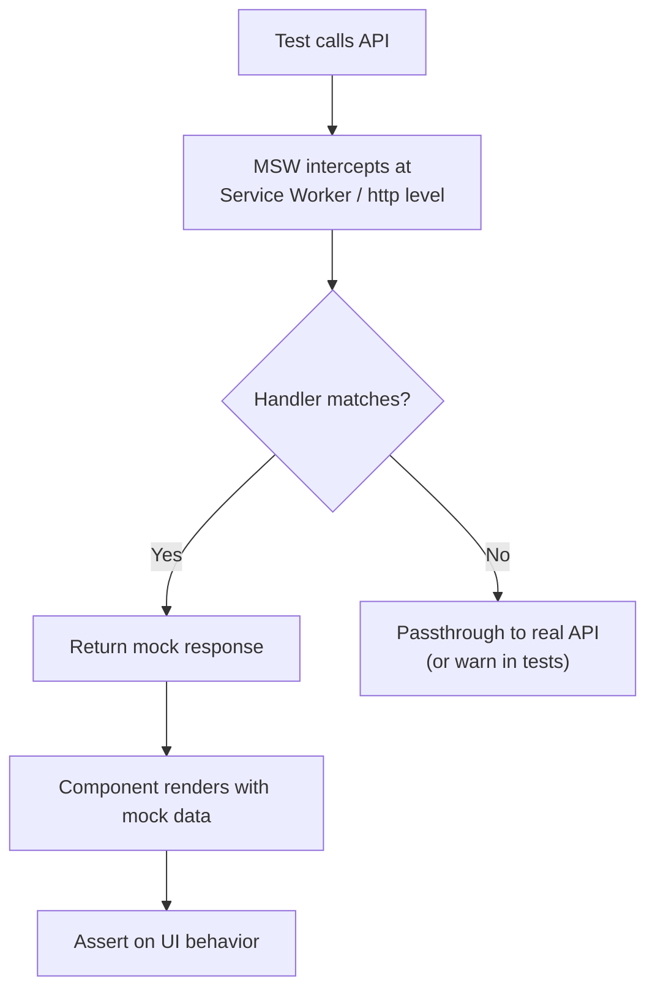

# Testing Checklist and MSW Setup

> [!summary] Goal
> Comprehensive testing checklist covering component, hook, integration, accessibility, and performance testing. Step-by-step MSW setup for mocking API calls.

## Table of Contents

- [MSW Setup Guide](#msw-setup-guide)
- [Testing Library Configuration](#testing-library-configuration)
- [Test File Organization](#test-file-organization)
- [Component Testing Checklist](#component-testing-checklist)
- [Hook Testing Checklist](#hook-testing-checklist)
- [Integration Testing Checklist](#integration-testing-checklist)
- [Accessibility Testing Checklist](#accessibility-testing-checklist)
- [Performance Testing Checklist](#performance-testing-checklist)
- [Common Testing Pitfalls](#common-testing-pitfalls)
- [CI/CD Integration](#ci-cd-integration)
- [Coverage Configuration](#coverage-configuration)
- [Test Suite Structure Example](#test-suite-structure-example)
- [Testing Utilities](#testing-utilities)
- [Best Practices](#best-practices)

---

## MSW Setup Guide

> [!info] Mock Service Worker (MSW)
> MSW intercepts network requests at the service worker level (browser) or at the `http` module level (Node). Unlike mocking `fetch` directly or using `nock`, MSW works at the network level — your application code doesn't need to know it's being mocked. Same setup works for tests and Storybook.



### Step 1: Installation

```bash
npm install --save-dev msw
```

### Step 2: Create Handlers

```tsx
// src/mocks/handlers.ts
import { http, HttpResponse } from 'msw';

export const handlers = [
  // GET request
  http.get('/api/products', () => {
    return HttpResponse.json([
      { id: 1, name: 'Product 1', price: 100 },
      { id: 2, name: 'Product 2', price: 200 },
    ]);
  }),

  // GET with params
  http.get('/api/products/:id', ({ params }) => {
    const { id } = params;
    return HttpResponse.json({
      id: Number(id),
      name: `Product ${id}`,
      price: 100,
    });
  }),

  // POST request
  http.post('/api/products', async ({ request }) => {
    const body = await request.json();
    return HttpResponse.json(
      { id: 3, ...body },
      { status: 201 }
    );
  }),

  // Error response
  http.get('/api/error', () => {
    return new HttpResponse(null, { status: 500 });
  }),

  // Delayed response
  http.get('/api/slow', async () => {
    await new Promise(resolve => setTimeout(resolve, 2000));
    return HttpResponse.json({ data: 'slow response' });
  }),
];
```

### Step 3: Setup Server

```tsx
// src/mocks/server.ts
import { setupServer } from 'msw/node';
import { handlers } from './handlers';

export const server = setupServer(...handlers);
```

### Step 4: Configure Test Setup

```tsx
// src/setupTests.ts
import '@testing-library/jest-dom';
import { server } from './mocks/server';

// Start server before all tests
beforeAll(() => server.listen({ onUnhandledRequest: 'error' }));

// Reset handlers after each test
afterEach(() => server.resetHandlers());

// Clean up after all tests
afterAll(() => server.close());
```

### Step 5: Override Handlers in Tests

```tsx
// ProductList.test.tsx
import { http, HttpResponse } from 'msw';
import { server } from '@/mocks/server';
import { render, screen } from '@testing-library/react';
import ProductList from './ProductList';

test('handles error state', async () => {
  // Override default handler for this test
  server.use(
    http.get('/api/products', () => {
      return new HttpResponse(null, { status: 500 });
    })
  );

  render(<ProductList />);

  expect(await screen.findByText(/error/i)).toBeInTheDocument();
});

test('handles empty list', async () => {
  server.use(
    http.get('/api/products', () => {
      return HttpResponse.json([]);
    })
  );

  render(<ProductList />);

  expect(await screen.findByText(/no products/i)).toBeInTheDocument();
});
```

### Advanced MSW Patterns

**Dynamic responses based on request:**
```tsx
http.get('/api/products', ({ request }) => {
  const url = new URL(request.url);
  const category = url.searchParams.get('category');

  const products = [
    { id: 1, name: 'Phone', category: 'electronics' },
    { id: 2, name: 'Book', category: 'books' },
  ];

  const filtered = category
    ? products.filter(p => p.category === category)
    : products;

  return HttpResponse.json(filtered);
}),
```

**Stateful handlers:**
```tsx
let products = [
  { id: 1, name: 'Product 1' },
  { id: 2, name: 'Product 2' },
];

export const handlers = [
  http.get('/api/products', () => {
    return HttpResponse.json(products);
  }),

  http.post('/api/products', async ({ request }) => {
    const newProduct = await request.json();
    const product = { id: products.length + 1, ...newProduct };
    products.push(product);
    return HttpResponse.json(product, { status: 201 });
  }),

  http.delete('/api/products/:id', ({ params }) => {
    const { id } = params;
    products = products.filter(p => p.id !== Number(id));
    return new HttpResponse(null, { status: 204 });
  }),
];
```

---

## Testing Library Configuration

### Custom Render Function

```tsx
// src/test-utils/test-utils.tsx
import { ReactElement, PropsWithChildren } from 'react';
import { render, RenderOptions } from '@testing-library/react';
import { Provider } from 'react-redux';
import { BrowserRouter } from 'react-router-dom';
import { configureStore } from '@reduxjs/toolkit';
import authReducer from '@/features/auth/slices/authSlice';
import { baseApi } from '@/app/api/baseApi';

// Custom render that includes providers
export const renderWithProviders = (
  ui: ReactElement,
  {
    preloadedState = {},
    store = configureStore({
      reducer: {
        [baseApi.reducerPath]: baseApi.reducer,
        auth: authReducer,
      },
      middleware: (getDefaultMiddleware) =>
        getDefaultMiddleware().concat(baseApi.middleware),
      preloadedState,
    }),
    ...renderOptions
  }: {
    preloadedState?: any;
    store?: any;
  } & Omit<RenderOptions, 'wrapper'> = {}
) => {
  const Wrapper = ({ children }: PropsWithChildren) => (
    <Provider store={store}>
      <BrowserRouter>
        {children}
      </BrowserRouter>
    </Provider>
  );

  return { store, ...render(ui, { wrapper: Wrapper, ...renderOptions }) };
};

// Re-export everything
export * from '@testing-library/react';
export { renderWithProviders as render };
```

### Usage

```tsx
// ProductList.test.tsx
import { render, screen, waitFor } from '@/test-utils/test-utils';
import ProductList from './ProductList';

test('renders product list', async () => {
  render(<ProductList />);

  await waitFor(() => {
    expect(screen.getByText('Product 1')).toBeInTheDocument();
  });
});

test('renders with preloaded auth state', () => {
  render(<ProductList />, {
    preloadedState: {
      auth: {
        user: { id: 1, name: 'John' },
        token: 'fake-token',
      },
    },
  });

  expect(screen.getByText(/welcome, john/i)).toBeInTheDocument();
});
```

---

## Test File Organization

### Folder Structure

```
src/
├── features/
│   └── products/
│       ├── components/
│       │   ├── ProductList.tsx
│       │   ├── ProductList.test.tsx
│       │   ├── ProductCard.tsx
│       │   └── ProductCard.test.tsx
│       ├── hooks/
│       │   ├── useProductFilters.ts
│       │   └── useProductFilters.test.ts
│       └── api/
│           ├── productsApi.ts
│           └── productsApi.test.ts
│
├── mocks/
│   ├── handlers.ts
│   ├── server.ts
│   └── data/
│       ├── products.ts
│       └── users.ts
│
├── test-utils/
│   ├── test-utils.tsx
│   ├── mockData.ts
│   └── testHelpers.ts
│
└── setupTests.ts
```

### Naming Conventions

- Component tests: `ComponentName.test.tsx`
- Hook tests: `useHookName.test.ts`
- Integration tests: `Feature.integration.test.tsx`
- E2E tests: `feature.e2e.test.ts`

---

## Component Testing Checklist

### Rendering

- [ ] Component renders without crashing
- [ ] Renders with default props
- [ ] Renders with various prop combinations
- [ ] Renders with edge cases (empty data, null, undefined)
- [ ] Renders children correctly
- [ ] Conditional rendering works

**Example:**
```tsx
describe('ProductCard', () => {
  test('renders product name', () => {
    const product = { id: 1, name: 'Phone', price: 100 };
    render(<ProductCard product={product} />);
    expect(screen.getByText('Phone')).toBeInTheDocument();
  });

  test('renders with no product', () => {
    render(<ProductCard product={null} />);
    expect(screen.getByText(/no product/i)).toBeInTheDocument();
  });
});
```

### User Interactions

- [ ] Click events trigger correctly
- [ ] Form inputs update state
- [ ] Form submission works
- [ ] Keyboard navigation works
- [ ] Focus management is correct
- [ ] Hover effects work (if critical)

**Example:**
```tsx
test('calls onDelete when delete button clicked', async () => {
  const onDelete = vi.fn();
  const product = { id: 1, name: 'Phone', price: 100 };

  render(<ProductCard product={product} onDelete={onDelete} />);

  const deleteButton = screen.getByRole('button', { name: /delete/i });
  await userEvent.click(deleteButton);

  expect(onDelete).toHaveBeenCalledWith(1);
});
```

### State Changes

- [ ] Component updates on state change
- [ ] Multiple state updates work correctly
- [ ] State resets when needed
- [ ] Derived state computed correctly

**Example:**
```tsx
test('toggles favorite status', async () => {
  render(<ProductCard product={product} />);

  const favoriteButton = screen.getByRole('button', { name: /favorite/i });
  
  await userEvent.click(favoriteButton);
  expect(favoriteButton).toHaveAttribute('aria-pressed', 'true');

  await userEvent.click(favoriteButton);
  expect(favoriteButton).toHaveAttribute('aria-pressed', 'false');
});
```

### Async Operations

- [ ] Loading state shows
- [ ] Success state displays data
- [ ] Error state shows error message
- [ ] Retry functionality works
- [ ] Race conditions handled

**Example:**
```tsx
test('shows loading state then data', async () => {
  render(<ProductList />);

  expect(screen.getByText(/loading/i)).toBeInTheDocument();

  await waitFor(() => {
    expect(screen.getByText('Product 1')).toBeInTheDocument();
  });

  expect(screen.queryByText(/loading/i)).not.toBeInTheDocument();
});
```

### Props Validation

- [ ] Required props work
- [ ] Optional props work
- [ ] Default props applied
- [ ] Prop types validated (TypeScript)
- [ ] Invalid props handled gracefully

### Conditional Rendering

- [ ] Shows/hides based on props
- [ ] Shows/hides based on state
- [ ] Renders different variants
- [ ] Empty states render

**Example:**
```tsx
test('shows empty state when no products', () => {
  render(<ProductList products={[]} />);
  expect(screen.getByText(/no products found/i)).toBeInTheDocument();
});

test('shows product list when products exist', () => {
  const products = [{ id: 1, name: 'Phone', price: 100 }];
  render(<ProductList products={products} />);
  expect(screen.getByText('Phone')).toBeInTheDocument();
});
```

### Side Effects

- [ ] useEffect runs correctly
- [ ] Cleanup functions called
- [ ] Event listeners added/removed
- [ ] Subscriptions managed

**Example:**
```tsx
test('adds event listener on mount and removes on unmount', () => {
  const addEventListenerSpy = vi.spyOn(window, 'addEventListener');
  const removeEventListenerSpy = vi.spyOn(window, 'removeEventListener');

  const { unmount } = render(<ProductList />);

  expect(addEventListenerSpy).toHaveBeenCalledWith('resize', expect.any(Function));

  unmount();

  expect(removeEventListenerSpy).toHaveBeenCalledWith('resize', expect.any(Function));
});
```

### Styling

- [ ] CSS classes applied correctly
- [ ] Dynamic styles based on props
- [ ] Theme variations work
- [ ] Responsive behavior (if testable)

### Error Boundaries

- [ ] Error boundary catches errors
- [ ] Fallback UI renders
- [ ] Error logged

**Example:**
```tsx
test('error boundary catches component error', () => {
  const consoleError = vi.spyOn(console, 'error').mockImplementation(() => {});

  render(
    <ErrorBoundary fallback={<div>Error occurred</div>}>
      <ThrowError />
    </ErrorBoundary>
  );

  expect(screen.getByText('Error occurred')).toBeInTheDocument();

  consoleError.mockRestore();
});
```

---

## Hook Testing Checklist

### Basic Hook Testing

- [ ] Hook returns correct initial value
- [ ] Hook updates value correctly
- [ ] Hook handles multiple updates
- [ ] Hook returns stable references (when expected)

**Example:**
```tsx
import { renderHook, act } from '@testing-library/react';
import { useCounter } from './useCounter';

test('increments counter', () => {
  const { result } = renderHook(() => useCounter());

  expect(result.current.count).toBe(0);

  act(() => {
    result.current.increment();
  });

  expect(result.current.count).toBe(1);
});
```

### Hook with Props

- [ ] Hook works with different initial values
- [ ] Hook updates when props change
- [ ] Hook handles edge case props

**Example:**
```tsx
test('initializes with custom value', () => {
  const { result } = renderHook(() => useCounter(10));
  expect(result.current.count).toBe(10);
});

test('resets when initialValue changes', () => {
  const { result, rerender } = renderHook(
    ({ initialValue }) => useCounter(initialValue),
    { initialProps: { initialValue: 0 } }
  );

  expect(result.current.count).toBe(0);

  act(() => {
    result.current.increment();
  });

  expect(result.current.count).toBe(1);

  rerender({ initialValue: 5 });

  expect(result.current.count).toBe(5);
});
```

### Async Hooks

- [ ] Hook handles async operations
- [ ] Loading state managed correctly
- [ ] Error state handled
- [ ] Cleanup on unmount

**Example:**
```tsx
test('fetches data', async () => {
  const { result } = renderHook(() => useFetchProducts());

  expect(result.current.isLoading).toBe(true);

  await waitFor(() => {
    expect(result.current.isLoading).toBe(false);
  });

  expect(result.current.data).toEqual([
    { id: 1, name: 'Product 1' },
    { id: 2, name: 'Product 2' },
  ]);
});
```

### Hooks with Dependencies

- [ ] Hook updates when dependencies change
- [ ] Hook doesn't update when dependencies stable
- [ ] Hook cleanup called correctly

**Example:**
```tsx
test('refetches when id changes', async () => {
  const { result, rerender } = renderHook(
    ({ id }) => useFetchProduct(id),
    { initialProps: { id: 1 } }
  );

  await waitFor(() => {
    expect(result.current.data?.id).toBe(1);
  });

  rerender({ id: 2 });

  await waitFor(() => {
    expect(result.current.data?.id).toBe(2);
  });
});
```

### Custom Hook Providers

- [ ] Hook works with context
- [ ] Hook throws error outside provider

**Example:**
```tsx
test('useAuth works with provider', () => {
  const wrapper = ({ children }: PropsWithChildren) => (
    <AuthProvider>{children}</AuthProvider>
  );

  const { result } = renderHook(() => useAuth(), { wrapper });

  expect(result.current.user).toBeNull();
});

test('useAuth throws without provider', () => {
  const { result } = renderHook(() => useAuth());

  expect(result.error).toBeDefined();
});
```

---

## Integration Testing Checklist

### Feature Integration

- [ ] Multiple components work together
- [ ] Data flows correctly between components
- [ ] Parent-child communication works
- [ ] Sibling communication works

**Example:**
```tsx
test('product list filters update results', async () => {
  render(<ProductsPage />);

  await waitFor(() => {
    expect(screen.getByText('Product 1')).toBeInTheDocument();
  });

  const filterInput = screen.getByLabelText(/category/i);
  await userEvent.selectOptions(filterInput, 'electronics');

  await waitFor(() => {
    expect(screen.queryByText('Product 1')).not.toBeInTheDocument();
    expect(screen.getByText('Phone')).toBeInTheDocument();
  });
});
```

### API Integration

- [ ] API calls made correctly
- [ ] API responses handled
- [ ] API errors handled
- [ ] Loading states shown
- [ ] Retry logic works

**Example:**
```tsx
test('creates product and updates list', async () => {
  render(<ProductsPage />);

  const createButton = screen.getByRole('button', { name: /create/i });
  await userEvent.click(createButton);

  const nameInput = screen.getByLabelText(/name/i);
  await userEvent.type(nameInput, 'New Product');

  const submitButton = screen.getByRole('button', { name: /submit/i });
  await userEvent.click(submitButton);

  await waitFor(() => {
    expect(screen.getByText('New Product')).toBeInTheDocument();
  });
});
```

### Routing Integration

- [ ] Navigation works
- [ ] Route params passed correctly
- [ ] Query params work
- [ ] Protected routes redirect
- [ ] 404 page shows

**Example:**
```tsx
test('navigates to product details', async () => {
  render(<App />, { initialEntries: ['/products'] });

  const productLink = screen.getByText('Product 1');
  await userEvent.click(productLink);

  await waitFor(() => {
    expect(screen.getByRole('heading', { name: 'Product 1' })).toBeInTheDocument();
  });
});
```

### State Management Integration

- [ ] Redux state updates correctly
- [ ] RTK Query cache updates
- [ ] Context updates propagate
- [ ] Local storage syncs

**Example:**
```tsx
test('adds product to cart', async () => {
  const { store } = render(<ProductsPage />);

  const addButton = screen.getByRole('button', { name: /add to cart/i });
  await userEvent.click(addButton);

  expect(store.getState().cart.items).toHaveLength(1);
});
```

### Form Integration

- [ ] Form validation works
- [ ] Form submission works
- [ ] Form errors display
- [ ] Form reset works

**Example:**
```tsx
test('validates form before submission', async () => {
  render(<CreateProductForm />);

  const submitButton = screen.getByRole('button', { name: /submit/i });
  await userEvent.click(submitButton);

  expect(screen.getByText(/name is required/i)).toBeInTheDocument();
});
```

---

## Accessibility Testing Checklist

### Semantic HTML

- [ ] Proper heading hierarchy (h1, h2, h3)
- [ ] Buttons use `<button>` not `<div>`
- [ ] Links use `<a>` with href
- [ ] Forms use `<form>` element
- [ ] Lists use `<ul>`/`<ol>`

**Example:**
```tsx
test('uses semantic HTML', () => {
  render(<ProductList products={products} />);

  expect(screen.getByRole('list')).toBeInTheDocument();
  expect(screen.getAllByRole('listitem')).toHaveLength(2);
});
```

### ARIA Attributes

- [ ] `aria-label` on icon buttons
- [ ] `aria-labelledby` connects labels
- [ ] `aria-describedby` for descriptions
- [ ] `aria-expanded` on collapsible elements
- [ ] `aria-hidden` on decorative elements
- [ ] `aria-live` for dynamic updates

**Example:**
```tsx
test('has accessible button', () => {
  render(<ProductCard product={product} />);

  const deleteButton = screen.getByLabelText(/delete product/i);
  expect(deleteButton).toBeInTheDocument();
});
```

### Keyboard Navigation

- [ ] All interactive elements focusable
- [ ] Tab order is logical
- [ ] Enter/Space activate buttons
- [ ] Escape closes modals
- [ ] Arrow keys for navigation (if applicable)

**Example:**
```tsx
test('can be navigated with keyboard', async () => {
  render(<ProductCard product={product} />);

  const deleteButton = screen.getByRole('button', { name: /delete/i });

  await userEvent.tab();
  expect(deleteButton).toHaveFocus();

  await userEvent.keyboard('{Enter}');
  expect(mockDelete).toHaveBeenCalled();
});
```

### Screen Reader Support

- [ ] Images have alt text
- [ ] Form inputs have labels
- [ ] Error messages announced
- [ ] Success messages announced
- [ ] Loading states announced

**Example:**
```tsx
test('has alt text for images', () => {
  render(<ProductCard product={product} />);

  const image = screen.getByAltText(/product 1/i);
  expect(image).toBeInTheDocument();
});
```

### Focus Management

- [ ] Focus visible on interactive elements
- [ ] Focus trapped in modals
- [ ] Focus restored after modal close
- [ ] Skip links available

**Example:**
```tsx
test('focuses first element in modal', () => {
  render(<Modal isOpen={true} />);

  const firstInput = screen.getByLabelText(/name/i);
  expect(firstInput).toHaveFocus();
});
```

### Color Contrast

- [ ] Text meets WCAG AA standards (4.5:1)
- [ ] Interactive elements visible
- [ ] Error states visible

### Tools

- [ ] Run axe-core tests
- [ ] Test with screen reader (NVDA/JAWS)
- [ ] Test keyboard-only navigation

**Example:**
```tsx
import { axe, toHaveNoViolations } from 'jest-axe';
expect.extend(toHaveNoViolations);

test('has no accessibility violations', async () => {
  const { container } = render(<ProductList products={products} />);
  const results = await axe(container);
  expect(results).toHaveNoViolations();
});
```

---

## Performance Testing Checklist

### Render Performance

- [ ] Component doesn't re-render unnecessarily
- [ ] Expensive calculations memoized
- [ ] Lists use proper keys
- [ ] Large lists virtualized

**Example:**
```tsx
test('memoizes expensive calculation', () => {
  const { rerender } = render(<ProductStats products={products} />);

  const spy = vi.spyOn(console, 'log');

  rerender(<ProductStats products={products} />);

  // Calculation shouldn't run again
  expect(spy).not.toHaveBeenCalled();
});
```

### Memory Leaks

- [ ] Event listeners cleaned up
- [ ] Timers cleared
- [ ] Subscriptions unsubscribed
- [ ] Async operations cancelled

**Example:**
```tsx
test('cleans up timer on unmount', () => {
  vi.useFakeTimers();

  const { unmount } = render(<AutoRefresh />);

  expect(setInterval).toHaveBeenCalled();

  unmount();

  expect(clearInterval).toHaveBeenCalled();

  vi.useRealTimers();
});
```

### Bundle Size

- [ ] Code splitting implemented
- [ ] Tree shaking verified
- [ ] Lazy loading used
- [ ] Dependencies optimized

---

## Common Testing Pitfalls

### Pitfall 1: Testing Implementation Details

```tsx
// ❌ Bad - tests implementation
test('increments count state', () => {
  const { result } = renderHook(() => useCounter());
  expect(result.current.count).toBe(0);
  
  // Testing internal state variable name
  expect(result.current._internalCount).toBe(0);
});

// ✅ Good - tests behavior
test('increments count', () => {
  const { result } = renderHook(() => useCounter());
  
  act(() => {
    result.current.increment();
  });
  
  expect(result.current.count).toBe(1);
});
```

### Pitfall 2: Not Waiting for Async Updates

```tsx
// ❌ Bad - doesn't wait
test('loads products', () => {
  render(<ProductList />);
  expect(screen.getByText('Product 1')).toBeInTheDocument(); // Fails
});

// ✅ Good - waits for async
test('loads products', async () => {
  render(<ProductList />);
  expect(await screen.findByText('Product 1')).toBeInTheDocument();
});
```

### Pitfall 3: Using Wrong Query

```tsx
// ❌ Bad - getBy throws if not found
test('shows error when no products', () => {
  render(<ProductList products={[]} />);
  expect(screen.getByText(/no products/i)).toBeInTheDocument();
  // Throws error if text not found
});

// ✅ Good - queryBy returns null
test('shows error when no products', () => {
  render(<ProductList products={[]} />);
  expect(screen.queryByText(/products found/i)).not.toBeInTheDocument();
});
```

### Pitfall 4: Not Cleaning Up

```tsx
// ❌ Bad - pollutes global state
test('updates user', async () => {
  localStorage.setItem('user', JSON.stringify({ name: 'John' }));
  // Test runs...
  // localStorage persists to next test
});

// ✅ Good - cleanup
test('updates user', async () => {
  localStorage.setItem('user', JSON.stringify({ name: 'John' }));
  
  // Test runs...
  
  localStorage.clear();
});
```

### Pitfall 5: Fragile Selectors

```tsx
// ❌ Bad - depends on DOM structure
test('renders product', () => {
  render(<ProductCard product={product} />);
  expect(screen.getByTestId('product-name').textContent).toBe('Phone');
});

// ✅ Good - uses accessible queries
test('renders product', () => {
  render(<ProductCard product={product} />);
  expect(screen.getByRole('heading', { name: 'Phone' })).toBeInTheDocument();
});
```

### Pitfall 6: Mocking Too Much

```tsx
// ❌ Bad - mocks everything
vi.mock('./ProductCard', () => ({
  ProductCard: () => <div>Mocked</div>,
}));

test('renders product list', () => {
  render(<ProductList />);
  // Not testing real integration
});

// ✅ Good - test real components
test('renders product list', async () => {
  render(<ProductList />);
  expect(await screen.findByText('Product 1')).toBeInTheDocument();
});
```

### Pitfall 7: Not Testing Edge Cases

```tsx
// ❌ Bad - only happy path
test('renders products', () => {
  render(<ProductList products={products} />);
  expect(screen.getByText('Product 1')).toBeInTheDocument();
});

// ✅ Good - tests edge cases
describe('ProductList', () => {
  test('renders with products', () => {
    render(<ProductList products={products} />);
    expect(screen.getByText('Product 1')).toBeInTheDocument();
  });

  test('renders empty state', () => {
    render(<ProductList products={[]} />);
    expect(screen.getByText(/no products/i)).toBeInTheDocument();
  });

  test('handles null products', () => {
    render(<ProductList products={null} />);
    expect(screen.getByText(/loading/i)).toBeInTheDocument();
  });
});
```

### Pitfall 8: Testing Library Anti-Patterns

```tsx
// ❌ Bad - container queries
const { container } = render(<ProductList />);
const products = container.querySelectorAll('.product');

// ✅ Good - accessible queries
const products = screen.getAllByRole('listitem');
```

### Pitfall 9: Not Using `userEvent`

```tsx
// ❌ Bad - fireEvent doesn't simulate real interactions
import { fireEvent } from '@testing-library/react';

fireEvent.click(button);

// ✅ Good - userEvent simulates real user interactions
import userEvent from '@testing-library/user-event';

await userEvent.click(button);
```

### Pitfall 10: Forgetting to Unwrap Promises

```tsx
// ❌ Bad - doesn't await unwrap
test('creates product', async () => {
  const [createProduct] = useCreateProductMutation();
  createProduct({ name: 'New' });
  // Doesn't wait for mutation to complete
});

// ✅ Good - awaits unwrap
test('creates product', async () => {
  const [createProduct] = useCreateProductMutation();
  await createProduct({ name: 'New' }).unwrap();
  // Mutation completed
});
```

---

## CI/CD Integration

### GitHub Actions Example

```yaml
# .github/workflows/test.yml
name: Test

on:
  push:
    branches: [main]
  pull_request:
    branches: [main]

jobs:
  test:
    runs-on: ubuntu-latest

    steps:
      - uses: actions/checkout@v3
      
      - name: Setup Node.js
        uses: actions/setup-node@v3
        with:
          node-version: '18'
          cache: 'npm'
      
      - name: Install dependencies
        run: npm ci
      
      - name: Run tests
        run: npm test -- --coverage
      
      - name: Upload coverage
        uses: codecov/codecov-action@v3
        with:
          files: ./coverage/coverage-final.json
```

### Jest Configuration

```js
// jest.config.js
export default {
  preset: 'ts-jest',
  testEnvironment: 'jsdom',
  setupFilesAfterEnv: ['<rootDir>/src/setupTests.ts'],
  moduleNameMapper: {
    '^@/(.*)$': '<rootDir>/src/$1',
    '\\.(css|less|scss|sass)$': 'identity-obj-proxy',
  },
  collectCoverageFrom: [
    'src/**/*.{ts,tsx}',
    '!src/**/*.d.ts',
    '!src/main.tsx',
    '!src/mocks/**',
  ],
  coverageThresholds: {
    global: {
      statements: 80,
      branches: 75,
      functions: 80,
      lines: 80,
    },
  },
};
```

---

## Coverage Configuration

### Package.json Scripts

```json
{
  "scripts": {
    "test": "vitest",
    "test:ui": "vitest --ui",
    "test:coverage": "vitest --coverage",
    "test:watch": "vitest --watch"
  }
}
```

### Vitest Configuration

```ts
// vite.config.ts
import { defineConfig } from 'vite';
import react from '@vitejs/plugin-react';

export default defineConfig({
  plugins: [react()],
  test: {
    globals: true,
    environment: 'jsdom',
    setupFiles: './src/setupTests.ts',
    coverage: {
      provider: 'v8',
      reporter: ['text', 'json', 'html'],
      exclude: [
        'node_modules/',
        'src/setupTests.ts',
        'src/mocks/',
        '**/*.d.ts',
        '**/*.config.*',
      ],
    },
  },
});
```

---

## Test Suite Structure Example

```
src/
├── features/
│   └── products/
│       ├── components/
│       │   ├── ProductList.tsx
│       │   ├── ProductList.test.tsx
│       │   ├── ProductCard.tsx
│       │   └── ProductCard.test.tsx
│       ├── hooks/
│       │   ├── useProductFilters.ts
│       │   └── useProductFilters.test.ts
│       ├── api/
│       │   ├── productsApi.ts
│       │   └── productsApi.test.ts
│       └── __tests__/
│           └── products.integration.test.tsx
│
├── mocks/
│   ├── handlers.ts
│   ├── server.ts
│   └── data/
│       └── products.ts
│
└── test-utils/
    ├── test-utils.tsx
    └── mockData.ts
```

---

## Testing Utilities

### Mock Data Factory

```tsx
// test-utils/mockData.ts
export const createMockProduct = (overrides?: Partial<Product>): Product => ({
  id: 1,
  name: 'Test Product',
  price: 100,
  category: 'electronics',
  ...overrides,
});

export const createMockProducts = (count: number): Product[] => {
  return Array.from({ length: count }, (_, i) => createMockProduct({ id: i + 1 }));
};
```

### Test Helpers

```tsx
// test-utils/testHelpers.ts
export const fillForm = async (fields: Record<string, string>) => {
  for (const [label, value] of Object.entries(fields)) {
    const input = screen.getByLabelText(new RegExp(label, 'i'));
    await userEvent.clear(input);
    await userEvent.type(input, value);
  }
};

export const submitForm = async () => {
  const submitButton = screen.getByRole('button', { name: /submit/i });
  await userEvent.click(submitButton);
};

// Usage:
// await fillForm({ name: 'Phone', price: '100' });
// await submitForm();
```

---

## Best Practices

### 1. Test User Behavior, Not Implementation

```tsx
// ✅ Good
test('user can add product to cart', async () => {
  render(<ProductCard product={product} />);
  
  const addButton = screen.getByRole('button', { name: /add to cart/i });
  await userEvent.click(addButton);
  
  expect(screen.getByText(/added to cart/i)).toBeInTheDocument();
});
```

### 2. Use Accessible Queries

Priority order:
1. `getByRole`
2. `getByLabelText`
3. `getByPlaceholderText`
4. `getByText`
5. `getByTestId` (last resort)

### 3. Don't Test External Libraries

```tsx
// ❌ Bad - testing React Router
test('Link renders anchor tag', () => {
  render(<Link to="/products">Products</Link>);
  expect(screen.getByRole('link')).toHaveAttribute('href', '/products');
});

// ✅ Good - test your integration
test('navigates to products page', async () => {
  render(<Navigation />);
  
  const productsLink = screen.getByRole('link', { name: /products/i });
  await userEvent.click(productsLink);
  
  expect(screen.getByRole('heading', { name: /products/i })).toBeInTheDocument();
});
```

### 4. Keep Tests Isolated

Each test should:
- Set up its own data
- Not depend on other tests
- Clean up after itself

### 5. Write Descriptive Test Names

```tsx
// ❌ Bad
test('it works', () => {});

// ✅ Good
test('displays error message when API call fails', async () => {});
```

---

## Related

- [[01_Testing_React_TL_and_MSW]]
- [[02_Performance_and_Profiling]]
- [[01_Debug_Rerenders_and_Perf_Issues]]

## References

- [Testing Library Docs](https://testing-library.com/docs/react-testing-library/intro/)
- [MSW Documentation](https://mswjs.io/)
- [Jest DOM Matchers](https://github.com/testing-library/jest-dom)
- [User Event API](https://testing-library.com/docs/user-event/intro/)
