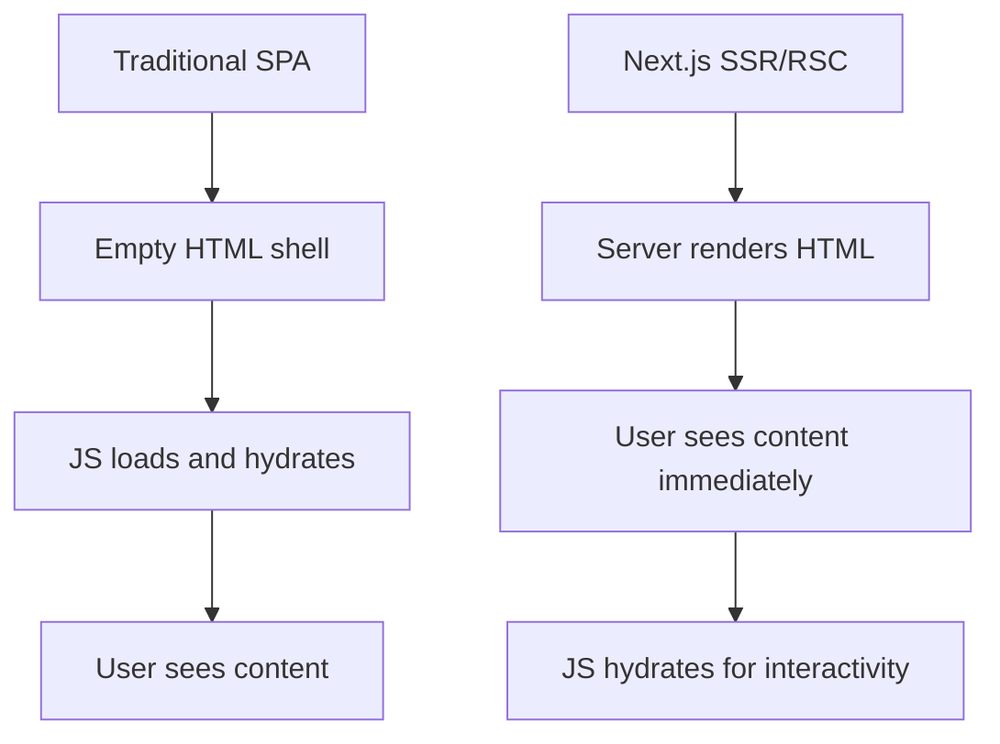
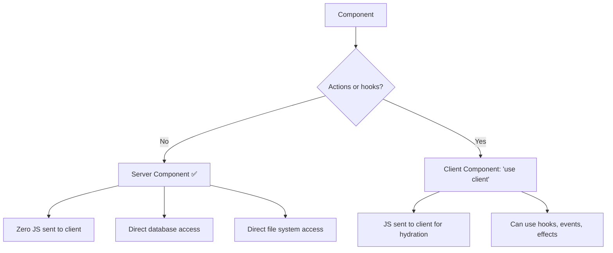
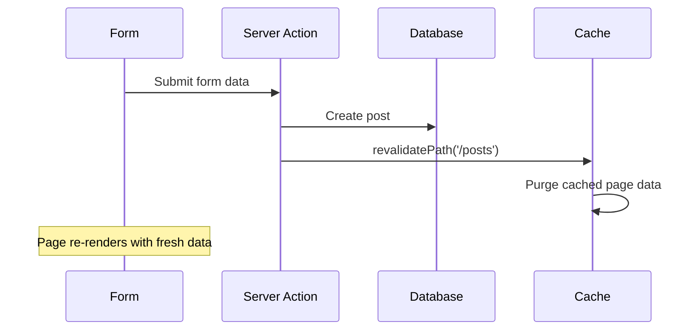
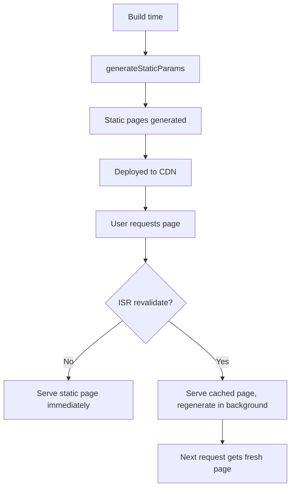

# Next.js: App Router and Server Components

> [!summary] Goal
> Build full-stack React applications with Next.js App Router, Server Components, data fetching patterns, Server Actions, and deployment strategies.

## Table of Contents

1. [Why Next.js Matters](#why-next-js-matters)
2. [App Router vs Pages Router](#app-router-vs-pages-router)
3. [Server Components vs Client Components](#server-components-vs-client-components)
4. [Data Fetching in RSC](#data-fetching-in-rsc)
5. [Server Actions](#server-actions)
6. [Route Handlers](#route-handlers)
7. [Middleware](#middleware)
8. [Static Generation (SSG) and ISR](#static-generation-and-isr)
9. [Deployment](#deployment)
10. [Pitfalls](#pitfalls)

---

## Why Next.js Matters

Next.js is the most popular React meta-framework. It provides SSR, SSG, ISR, Server Components, file-based routing, and API routes out of the box.



---

## App Router vs Pages Router

| Aspect | Pages Router | App Router |
|--------|-------------|------------|
| **Directory** | `pages/` | `app/` |
| **Component type** | Client components only | Server + Client components |
| **Data fetching** | `getServerSideProps`, `getStaticProps` | `async function Page()` — direct fetch |
| **Layouts** | Manual, per-page | `layout.tsx` — nested, persistent |
| **Loading** | Manual | `loading.tsx` — automatic Suspense |
| **Error handling** | Manual | `error.tsx` — automatic Error Boundary |
| **Routing** | File-based | File-based + groups, parallel routes |
| **Introduced** | Next.js 9 | Next.js 13.4 (stable in 14) |

### App Router file conventions

```
app/
├── layout.tsx        // Root layout — wraps all pages
├── page.tsx          // Route segment UI
├── loading.tsx       // Loading UI (Suspense fallback)
├── error.tsx         // Error UI (ErrorBoundary)
├── not-found.tsx     // 404 UI
├── page.tsx          // / route
├── about/
│   └── page.tsx      // /about route
├── blog/
│   ├── [slug]/
│   │   └── page.tsx  // /blog/hello-world
│   └── page.tsx      // /blog
└── api/
    └── route.ts      // API route at /api/...
```

---

## Server Components vs Client Components



### Server Component (default — no directive needed)

```typescript
// app/page.tsx — Server Component by default (no "use client")
async function Page() {
  const posts = await db.posts.findMany();  // Direct DB access!
  return (
    <ul>
      {posts.map(post => (
        <li key={post.id}>{post.title}</li>
      ))}
    </ul>
  );
}
```

**Characteristics:**
- Runs **only on the server**
- **Zero JavaScript** sent to the client
- Can access databases, files, backend APIs directly
- Can `await` data fetching — no `useEffect`, no loading state
- Cannot use hooks, event handlers, or browser APIs

### Client Component

```typescript
'use client';  // 👈 Must be the first line

import { useState } from 'react';

export function LikeButton({ postId }: { postId: string }) {
  const [liked, setLiked] = useState(false);
  return (
    <button onClick={() => setLiked(!liked)}>
      {liked ? '❤️' : '🤍'}
    </button>
  );
}
```

**Characteristics:**
- Runs on the **client** (also pre-rendered on server)
- Can use hooks, event handlers, browser APIs
- JS is sent to the client and hydrated
- **Use sparingly** — push interactivity down to leaf components

### When to use each

| Scenario | Server Component | Client Component |
|----------|-----------------|-----------------|
| Static content, SEO | ✅ Default | ❌ |
| Database queries | ✅ Direct | ❌ |
| Forms and interactions | Server Actions | ✅ `useState`, `useEffect` |
| Third-party hooks | ❌ | ✅ |
| Animations | ❌ | ✅ |

---

## Data Fetching in RSC

```typescript
// app/posts/page.tsx — Server Component
async function PostsPage() {
  // ✅ Direct fetch — no useEffect, no loading flag
  const posts = await fetch('https://api.example.com/posts', {
    next: { revalidate: 60 },  // ISR: revalidate every 60s
  }).then(r => r.json());

  return (
    <ul>
      {posts.map(post => (
        <li key={post.id}>{post.title}</li>
      ))}
    </ul>
  );
}
```

### Loading UI

```typescript
// app/posts/loading.tsx — shown while PostsPage's data is loading
export default function Loading() {
  return <div className="animate-pulse">Loading posts...</div>;
}
```

### Parallel data fetching

```typescript
async function Page({ params }: { params: { slug: string } }) {
  // Both fetches start in parallel
  const [post, comments] = await Promise.all([
    getPost(params.slug),
    getComments(params.slug),
  ]);

  return (
    <article>
      <h1>{post.title}</h1>
      <CommentsList comments={comments} />
    </article>
  );
}
```

---

## Server Actions

Server Actions are `async` functions that run on the server, callable from the client — no API routes needed.

```typescript
// app/actions.ts
'use server';  // 👈 This file contains Server Actions

import { revalidatePath } from 'next/cache';

export async function createPost(formData: FormData) {
  const title = formData.get('title') as string;
  const content = formData.get('content') as string;

  await db.posts.create({ title, content });

  revalidatePath('/posts');  // Refresh the posts page
}

export async function deletePost(id: string) {
  await db.posts.delete(id);
  revalidatePath('/posts');
}
```

### Using Server Actions in a form

```typescript
import { createPost } from './actions';

export function NewPostForm() {
  return (
    <form action={createPost}>    {/* No onClick handler! */}
      <input name="title" required />
      <textarea name="content" required />
      <button type="submit">Create Post</button>
    </form>
  );
}
```



### Server Action + useOptimistic (React 19)

```typescript
'use client';

import { useOptimistic, useRef } from 'react';
import { createPost } from './actions';

export function PostForm({ posts }: { posts: Post[] }) {
  const [optimisticPosts, addPost] = useOptimistic(
    posts,
    (state, newPost: Post) => [...state, newPost],
  );

  async function formAction(formData: FormData) {
    addPost({
      id: crypto.randomUUID(),
      title: formData.get('title') as string,
      pending: true,
    });
    await createPost(formData);  // Server Action
  }

  return (
    <form action={formAction}>
      <input name="title" required />
      <button type="submit">Add</button>
      <ul>
        {optimisticPosts.map(p => (
          <li key={p.id} className={p.pending ? 'opacity-50' : ''}>
            {p.title}
          </li>
        ))}
      </ul>
    </form>
  );
}
```

---

## Route Handlers

API routes in the App Router:

```typescript
// app/api/posts/route.ts
import { NextResponse } from 'next/server';

export async function GET(request: Request) {
  const posts = await db.posts.findMany();
  return NextResponse.json(posts);
}

export async function POST(request: Request) {
  const json = await request.json();
  const post = await db.posts.create(json);
  return NextResponse.json(post, { status: 201 });
}
```

---

## Middleware

```typescript
// middleware.ts — runs before every request
import { NextResponse } from 'next/server';
import type { NextRequest } from 'next/server';

export function middleware(request: NextRequest) {
  const token = request.cookies.get('session')?.value;
  const isAuth = token !== undefined;
  const isOnDashboard = request.nextUrl.pathname.startsWith('/dashboard');

  if (isOnDashboard && !isAuth) {
    return NextResponse.redirect(new URL('/login', request.url));
  }

  return NextResponse.next();
}

export const config = {
  matcher: ['/((?!api|_next/static|_next/image|favicon.ico).*)'],
};
```

---

## Static Generation (SSG) and ISR

```typescript
// app/posts/[slug]/page.tsx
export async function generateStaticParams() {
  const posts = await db.posts.findMany();
  return posts.map(post => ({ slug: post.slug }));
  // Generates pages: /posts/hello-world, /posts/nextjs-guide, etc.
}

async function PostPage({ params }: { params: { slug: string } }) {
  const post = await fetch(`https://api.example.com/posts/${params.slug}`, {
    next: { revalidate: 3600 },  // ISR: regenerate page every hour
  }).then(r => r.json());

  return <article>{post.content}</article>;
}
```



| Strategy | Build time | Runtime | Freshness |
|----------|-----------|---------|-----------|
| **SSG** (`generateStaticParams`) | ✅ Generated | Cached forever | Static |
| **ISR** (`revalidate: 3600`) | ✅ Generated | Cached, revalidates | Eventual |
| **SSR** (no generateStaticParams) | ❌ Not generated | Rendered per request | Always fresh |

---

## Deployment

### Vercel (recommended)

```bash
npm i -g vercel
vercel deploy
```

### Docker

```dockerfile
FROM node:20-alpine AS build
WORKDIR /app
COPY package*.json ./
RUN npm ci
COPY . .
RUN npm run build

FROM node:20-alpine AS run
WORKDIR /app
COPY --from=build /app/.next ./.next
COPY --from=build /app/public ./public
COPY --from=build /app/package.json ./
COPY --from=build /app/node_modules ./node_modules
EXPOSE 3000
CMD ["npm", "start"]
```

### Environment variables

```bash
# .env.local — local development (not in git)
DATABASE_URL=postgres://localhost:5432/mydb

# .env.production — production
DATABASE_URL=postgres://prod:5432/mydb
```

```typescript
// Only variables prefixed with NEXT_PUBLIC_ are available in client components
const apiUrl = process.env.NEXT_PUBLIC_API_URL!;
const dbUrl = process.env.DATABASE_URL!;  // Server only
```

---

## Pitfalls

### Server Component tries to use hooks

```typescript
// ❌ This won't work — server components don't support hooks
async function Page() {
  const [count, setCount] = useState(0); // Error!
}
```

**Fix**: Add `'use client'` or extract the interactive part into a Client Component.

### `'use client'` at the wrong level

Putting `'use client'` on a parent component means its **entire tree** is client-rendered — losing the benefits of Server Components.

**Fix**: Push `'use client'` down to the leaf interactive components. Wrap interactive islands in server-rendered content.

### Forgetting `revalidatePath` after mutation

```typescript
async function createPost(formData: FormData) {
  await db.posts.create(...);
  // Forgot revalidatePath('/posts')
  // Page still shows OLD data until next revalidation
}
```

**Fix**: Always call `revalidatePath()` or `revalidateTag()` after mutations.

---

> [!question]- Interview Questions
>
> **Q: What is the difference between Server Components and Client Components?**
> A: Server Components render on the server, have zero JS bundle size, can directly access databases and files. Client Components (`'use client'`) are sent to the browser, support hooks and interactivity, and are hydrated on the client.
>
> **Q: What are Server Actions?**
> A: Async functions marked with `'use server'` that run on the server but can be called from the client. They work with `<form action={serverAction}>` for progressive enhancement, and integrate with `revalidatePath` for cache invalidation.
>
> **Q: What is ISR and how is it different from SSR?**
> A: ISR (Incremental Static Regeneration) generates static pages on demand after the initial build, revalidating them in the background. SSR renders every request fresh. ISR trades a small staleness window for significantly faster response times.

---

## Cross-Links

- [[React/01_Foundations/01_React_Mental_Model_and_Rendering]] for component model
- [[React/01_Foundations/02_Hooks_Complete_Reference]] for client hooks (useFormStatus, useOptimistic)
- [[React/02_Core/03_Routing_with_React_Router]] for client-side SPA routing comparison

---

## References

- [Next.js Documentation](https://nextjs.org/docs)
- [React Server Components](https://react.dev/reference/rsc/server-components)
- [Next.js Data Fetching](https://nextjs.org/docs/app/building-your-application/data-fetching)
- [Server Actions](https://nextjs.org/docs/app/building-your-application/data-fetching/server-actions-and-mutations)
