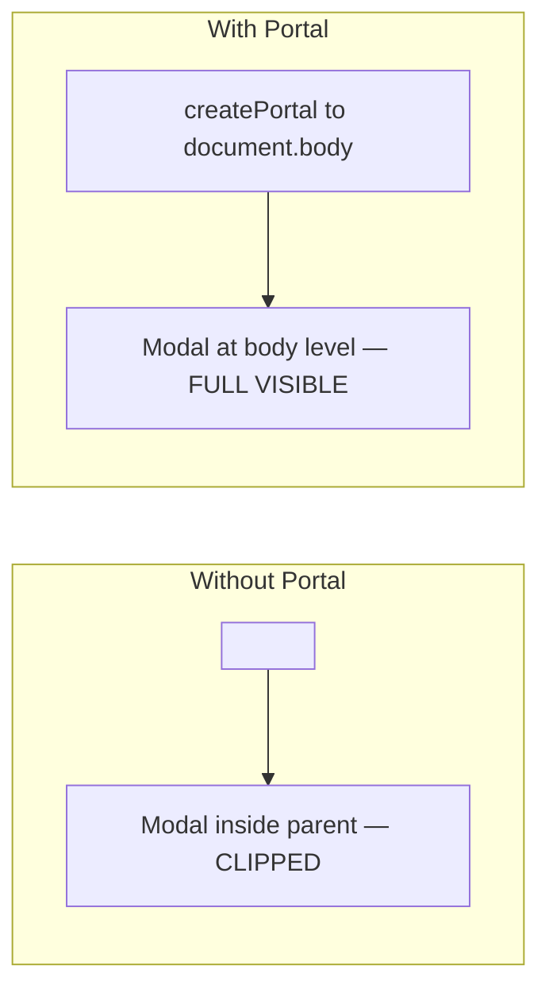
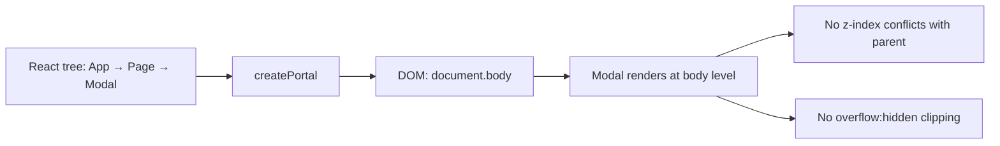
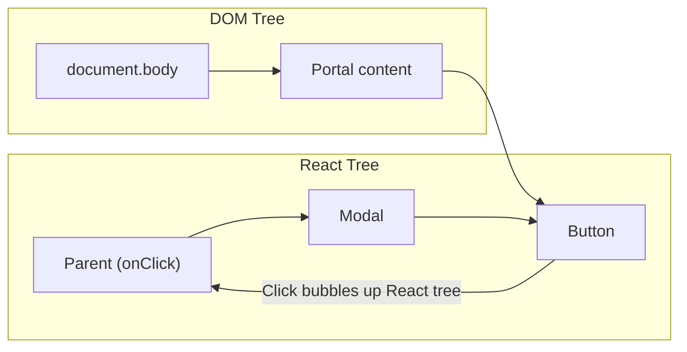

# Playbook: Portals and Teleporting UI

> [!summary] Goal
> Render content outside the parent DOM hierarchy with `createPortal` — fix z-index, clipping, and stacking context issues for modals, tooltips, dropdowns, and toasts.

## Table of Contents

1. [Why Portals Matter](#why-portals-matter)
2. [createPortal Syntax](#createportal-syntax)
3. [Modal Component](#modal-component)
4. [Tooltip with Portal](#tooltip-with-portal)
5. [Toast Notification System](#toast-notification-system)
6. [Event Bubbling Through Portals](#event-bubbling-through-portals)
7. [Pitfalls](#pitfalls)

---

## Why Portals Matter

Without portals, a modal or tooltip rendered deep in the component tree is subject to the parent's CSS — `overflow: hidden`, `z-index` stacking contexts, and parent transforms can clip or hide the overlay.



---

## `createPortal` Syntax

```typescript
import { createPortal } from 'react-dom';

function MyPortal({ children }: { children: React.ReactNode }) {
  return createPortal(
    children,          // What to render
    document.body,     // Where to render (any DOM element)
    // Optional: key for multiple portals
  );
}
```

---

## Modal Component

```typescript
'use client';

import { useEffect, useCallback, useRef, createPortal } from 'react';

interface ModalProps {
  open: boolean;
  onClose: () => void;
  children: React.ReactNode;
}

export function Modal({ open, onClose, children }: ModalProps) {
  const overlayRef = useRef<HTMLDivElement>(null);

  const handleKeyDown = useCallback((e: KeyboardEvent) => {
    if (e.key === 'Escape') onClose();
  }, [onClose]);

  useEffect(() => {
    if (!open) return;
    document.addEventListener('keydown', handleKeyDown);
    document.body.style.overflow = 'hidden';  // Lock body scroll
    return () => {
      document.removeEventListener('keydown', handleKeyDown);
      document.body.style.overflow = '';       // Restore scroll
    };
  }, [open, handleKeyDown]);

  if (!open) return null;

  return createPortal(
    <div
      ref={overlayRef}
      role="dialog"
      aria-modal="true"
      className="fixed inset-0 z-50 flex items-center justify-center"
      onClick={(e) => e.target === overlayRef.current && onClose()}
    >
      <div className="absolute inset-0 bg-black/50" />
      <div className="relative z-10 rounded-lg bg-white p-6 shadow-xl">
        {children}
      </div>
    </div>,
    document.body,
  );
}
```



---

## Tooltip with Portal

```typescript
'use client';

import { useState, useRef, useEffect } from 'react';
import { createPortal } from 'react-dom';

interface TooltipProps {
  text: string;
  children: React.ReactNode;
}

export function Tooltip({ text, children }: TooltipProps) {
  const [visible, setVisible] = useState(false);
  const [pos, setPos] = useState({ top: 0, left: 0 });
  const triggerRef = useRef<HTMLDivElement>(null);

  function show() {
    if (!triggerRef.current) return;
    const rect = triggerRef.current.getBoundingClientRect();
    setPos({ top: rect.bottom + 4, left: rect.left + rect.width / 2 });
    setVisible(true);
  }

  return (
    <>
      <div
        ref={triggerRef}
        onMouseEnter={show}
        onMouseLeave={() => setVisible(false)}
        onFocus={show}
        onBlur={() => setVisible(false)}
        className="inline-block"
      >
        {children}
      </div>
      {visible && createPortal(
        <div
          role="tooltip"
          style={{ top: pos.top, left: pos.left }}
          className="fixed z-[9999] rounded bg-gray-900 px-2 py-1 text-sm text-white"
        >
          {text}
        </div>,
        document.body,
      )}
    </>
  );
}
```

---

## Toast Notification System

```typescript
'use client';

import { createPortal } from 'react-dom';
import { useEffect, useState, useCallback } from 'react';

type ToastType = 'success' | 'error' | 'info';

interface Toast {
  id: string;
  message: string;
  type: ToastType;
}

let addToastExternal: (toast: Omit<Toast, 'id'>) => void;

export function addToast(message: string, type: ToastType = 'info') {
  addToastExternal?.({ message, type });
}

function ToastContainer() {
  const [toasts, setToasts] = useState<Toast[]>([]);

  addToastExternal = useCallback((toast: Omit<Toast, 'id'>) => {
    const id = crypto.randomUUID();
    setToasts(prev => [...prev, { ...toast, id }]);
    setTimeout(() => {
      setToasts(prev => prev.filter(t => t.id !== id));
    }, 4000);
  }, []);

  if (typeof document === 'undefined') return null;

  return createPortal(
    <div className="fixed bottom-4 right-4 z-[9999] flex flex-col gap-2">
      {toasts.map(toast => (
        <div
          key={toast.id}
          className={`rounded-lg px-4 py-3 text-white shadow-lg ${
            toast.type === 'success' ? 'bg-green-600' :
            toast.type === 'error' ? 'bg-red-600' :
            'bg-blue-600'
          }`}
        >
          {toast.message}
        </div>
      ))}
    </div>,
    document.body,
  );
}
```

---

## Event Bubbling Through Portals

Events still bubble through the **React tree**, not the DOM tree:

```typescript
function Parent() {
  const [clicked, setClicked] = useState(false);

  return (
    <div onClick={() => setClicked(true)}>
      <Modal>
        <button>Click me</button>
      </Modal>
    </div>
  );
}

// The click on the button inside the portal STILL triggers Parent's onClick
// because in React's component tree, Modal is a child of Parent
```



---

## Pitfalls

### Portal container doesn't exist on SSR

```typescript
if (typeof document === 'undefined') return null;  // SSR guard
```

**Fix**: Always guard `createPortal` with a client-side check or wrap in `'use client'`.

### Body scroll lock not restored

If the modal unmounts unexpectedly (error, parent unmount), `document.body.style.overflow` stays as `'hidden'`.

**Fix**: Store the previous overflow value and always restore it in the cleanup function.

### Focus management

When a modal opens, focus should move inside the modal. When it closes, focus should return to the trigger element.

**Fix**: Use `useEffect` to `focus()` the first focusable element inside the portal on mount. Store the previously focused element and restore focus on unmount.

---

## Cross-Links

- [[React/03_Advanced/03_React_App_Architecture_Playbook]] for component patterns
- [[React/02_Core/04_Forms_and_Validation]] for form modals
- [[React/04_Playbooks/06_Tailwind_CSS_and_Styling_Strategies]] for styling portals
