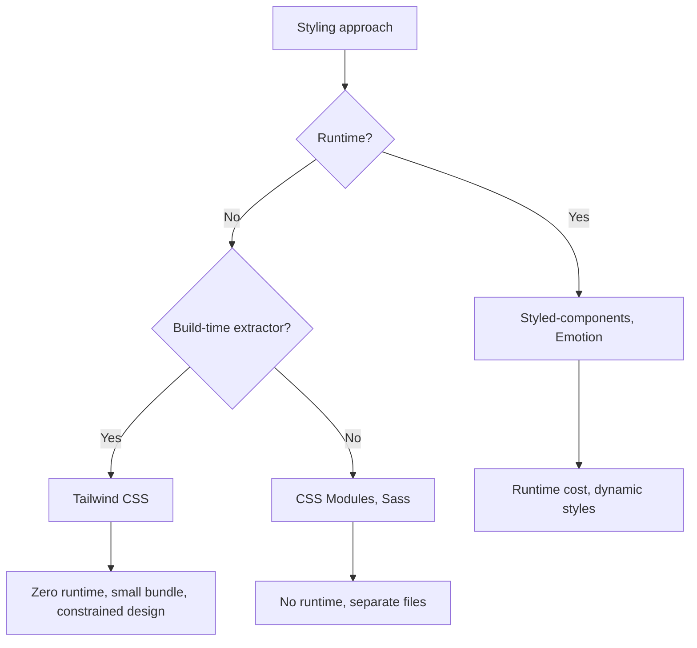

# Playbook: Tailwind CSS and Styling Strategies

> [!summary] Goal
> Style React applications with Tailwind CSS — utility-first approach, component extraction, responsive design, dark mode, and CSS-in-JS vs Tailwind tradeoffs.

## Table of Contents

1. [Why Tailwind CSS Matters](#why-tailwind-css-matters)
2. [Setup with Vite](#setup-with-vite)
3. [Core Concepts](#core-concepts)
4. [Component Extraction](#component-extraction)
5. [Responsive and State Variants](#responsive-and-state-variants)
6. [Styling Approaches Comparison](#styling-approaches-comparison)
7. [Pitfalls](#pitfalls)

---

## Why Tailwind CSS Matters

Tailwind is a utility-first CSS framework — you compose UIs from small, single-purpose classes directly in JSX.



---

## Setup with Vite

```bash
npm create vite@latest my-app -- --template react-ts
npm install tailwindcss @tailwindcss/vite
```

```typescript
// vite.config.ts
import { defineConfig } from 'vite';
import react from '@vitejs/plugin-react';
import tailwindcss from '@tailwindcss/vite';

export default defineConfig({
  plugins: [react(), tailwindcss()],
});
```

```css
/* src/index.css */
@import "tailwindcss";
```

---

## Core Concepts

```typescript
function Card({ title, children }: { title: string; children: React.ReactNode }) {
  return (
    <div className="rounded-xl border border-gray-200 bg-white p-6 shadow-sm">
      <h2 className="mb-2 text-lg font-semibold text-gray-900">{title}</h2>
      <div className="text-sm text-gray-600">{children}</div>
    </div>
  );
}
```

| Category | Examples | Description |
|----------|----------|-------------|
| **Layout** | `flex`, `grid`, `block`, `hidden`, `container` | Display and positioning |
| **Spacing** | `p-4`, `px-2`, `m-3`, `gap-4`, `space-y-2` | Padding, margin, gap |
| **Typography** | `text-sm`, `font-bold`, `leading-6`, `tracking-wide` | Font size, weight, line height |
| **Colors** | `bg-blue-500`, `text-white`, `border-red-300` | Background, text, border colors |
| **Borders** | `rounded-lg`, `border`, `shadow-md` | Border radius, border, box shadow |
| **Transitions** | `transition`, `hover:scale-105`, `duration-200` | Animation and transforms |

---

## Component Extraction

### cn() utility for conditional classes

```bash
npm install clsx tailwind-merge
```

```typescript
import { clsx, type ClassValue } from 'clsx';
import { twMerge } from 'tailwind-merge';

export function cn(...inputs: ClassValue[]) {
  return twMerge(clsx(inputs));
}
```

### Button component

```typescript
interface ButtonProps extends React.ComponentProps<'button'> {
  variant?: 'primary' | 'secondary' | 'ghost';
  size?: 'sm' | 'md' | 'lg';
}

export function Button({
  variant = 'primary',
  size = 'md',
  className,
  children,
  ...props
}: ButtonProps) {
  return (
    <button
      className={cn(
        'inline-flex items-center justify-center rounded-lg font-medium transition-colors focus:outline-none focus:ring-2 focus:ring-offset-2 disabled:pointer-events-none disabled:opacity-50',
        {
          'bg-blue-600 text-white hover:bg-blue-700 focus:ring-blue-500': variant === 'primary',
          'border border-gray-300 bg-white text-gray-700 hover:bg-gray-50': variant === 'secondary',
          'text-gray-600 hover:text-gray-900 hover:bg-gray-100': variant === 'ghost',
        },
        {
          'h-8 px-3 text-sm': size === 'sm',
          'h-10 px-4 text-base': size === 'md',
          'h-12 px-6 text-lg': size === 'lg',
        },
        className,
      )}
      {...props}
    >
      {children}
    </button>
  );
}
```

---

## Responsive and State Variants

```typescript
<div className="
  grid grid-cols-1 gap-4        /* Mobile: single column */
  sm:grid-cols-2                /* Tablet: two columns */
  lg:grid-cols-3                /* Desktop: three columns */
">
  {items.map(item => (
    <div
      key={item.id}
      className="
        rounded-lg border p-4
        hover:shadow-lg           /* Hover state */
        focus-within:ring-2       /* Focus within */
        active:scale-95           /* Press state */
        dark:bg-gray-800          /* Dark mode */
        dark:text-white
        motion-safe:transition-all  /* Respect reduced motion */
      "
    >
      {item.content}
    </div>
  ))}
</div>
```

| Prefix | CSS equivalent |
|--------|---------------|
| `sm:` | `@media (min-width: 640px)` |
| `md:` | `@media (min-width: 768px)` |
| `lg:` | `@media (min-width: 1024px)` |
| `xl:` | `@media (min-width: 1280px)` |
| `hover:` | `&:hover` |
| `focus:` | `&:focus` |
| `active:` | `&:active` |
| `dark:` | `@media (prefers-color-scheme: dark)` or `.dark &` |
| `motion-safe:` | `@media (prefers-reduced-motion: no-preference)` |

---

## Styling Approaches Comparison

| Aspect | Tailwind CSS | CSS Modules | Styled Components | Inline Styles |
|--------|-------------|-------------|-------------------|---------------|
| **Runtime** | Zero (build-time) | Zero (build-time) | Runtime (injects styles) | Zero |
| **File separation** | No (co-located in JSX) | Separate `.module.css` | Co-located (CSS-in-JS) | Co-located |
| **Dynamic styles** | `cn()` function | Dynamic class names | Props → styles | Direct |
| **Media queries** | Responsive prefixes | In `.module.css` | In template literals | ❌ |
| **Pseudo-classes** | State variants (`hover:`) | In CSS file | In template literals | ❌ |
| **Bundle size** | Minimal (purged) | Full CSS per component | Runtime library | Minimal |
| **Learning curve** | Medium (class names) | Low (regular CSS) | Medium | Low |
| **Best for** | New projects, teams | Existing CSS knowledge | Design systems, dynamic themes | Quick prototypes |

---

## Pitfalls

### Not purging unused styles

If a class name is constructed dynamically (e.g., `text-${color}-500`), the JIT engine may not detect it and won't generate that class.

**Fix**: Use full class names: `text-blue-500`, or add a safelist in `tailwind.config.js`:

```typescript
safelist: ['text-blue-500', 'text-red-500', 'text-green-500'],
```

### `@apply` in wrong layer

```css
/* ❌ Wrong — component classes should be in components layer */
.btn { @apply rounded-lg bg-blue-500 px-4 py-2; }

/* ✅ Correct */
@layer components {
  .btn { @apply rounded-lg bg-blue-500 px-4 py-2; }
}
```

### Conflicting classes with `twMerge`

Without `tailwind-merge`, two class strings can have conflicting utilities:

```typescript
<div className={cn('px-4', className)} />
// If className = 'px-6', twMerge keeps px-6 (last wins)
```

---

## Cross-Links

- [[React/01_Foundations/02_Hooks_Complete_Reference]] for useInsertionEffect (CSS-in-JS)
- [[React/04_Playbooks/05_Portals_and_Teleporting_UI]] for portal + Tailwind combination
- [[React/02_Core/04_Forms_and_Validation]] for form styling

---

## References

- [Tailwind CSS Documentation](https://tailwindcss.com/docs)
- [tailwind-merge](https://github.com/dcastil/tailwind-merge)
- [clsx](https://github.com/lukeed/clsx)
