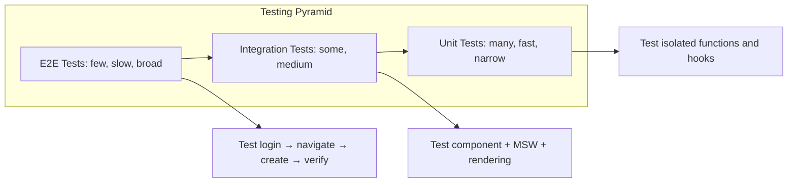
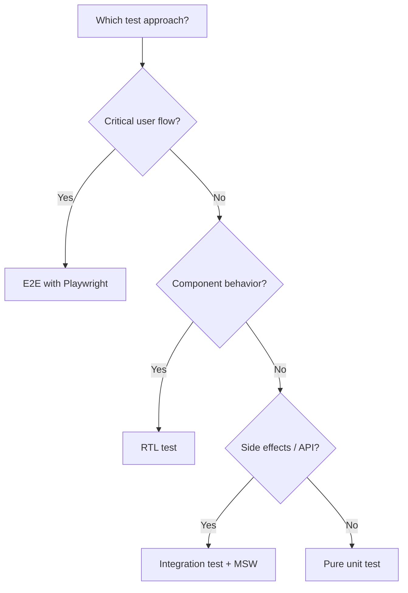

# Playbook: E2E Testing with Playwright

> [!summary] Goal
> Test your React application end-to-end with Playwright — real browser, real interactions, real network. Complement unit/integration tests with full-system confidence.

## Table of Contents

1. [Why E2E Testing Matters](#why-e2e-testing-matters)
2. [Setup](#setup)
3. [Core API](#core-api)
4. [Component Testing vs E2E](#component-testing-vs-e2e)
5. [MSW Integration](#msw-integration)
6. [Authentication](#authentication)
7. [CI Integration](#ci-integration)
8. [Pitfalls](#pitfalls)

---

## Why E2E Testing Matters

Unit and integration tests verify isolated pieces. E2E tests verify the **whole system** — from user action in the browser to the database and back.



---

## Setup

```bash
npm init playwright@latest
```

```typescript
// playwright.config.ts
import { defineConfig, devices } from '@playwright/test';

export default defineConfig({
  testDir: './e2e',
  fullyParallel: true,
  forbidOnly: !!process.env.CI,
  retries: process.env.CI ? 2 : 0,
  workers: process.env.CI ? 1 : undefined,
  reporter: 'html',

  use: {
    baseURL: 'http://localhost:5173',
    trace: 'on-first-retry',
    screenshot: 'only-on-failure',
  },

  projects: [
    { name: 'chromium', use: { ...devices['Desktop Chrome'] } },
    { name: 'firefox', use: { ...devices['Desktop Firefox'] } },
    { name: 'webkit', use: { ...devices['Desktop Safari'] } },
    { name: 'Mobile Chrome', use: { ...devices['Pixel 5'] } },
  ],

  webServer: {
    command: 'npm run dev',
    url: 'http://localhost:5173',
    reuseExistingServer: !process.env.CI,
  },
});
```

---

## Core API

```typescript
// e2e/login.spec.ts
import { test, expect } from '@playwright/test';

test('user can log in and see dashboard', async ({ page }) => {
  // Navigate to login page
  await page.goto('/login');
  await expect(page.getByRole('heading', { name: 'Sign In' })).toBeVisible();

  // Fill in credentials
  await page.getByLabel('Email').fill('alice@example.com');
  await page.getByLabel('Password').fill('password123');
  await page.getByRole('button', { name: 'Sign In' }).click();

  // Wait for successful navigation
  await expect(page).toHaveURL('/dashboard');
  await expect(page.getByText('Welcome, Alice')).toBeVisible();
});
```

### Locators

```typescript
// Prefer user-facing attributes (role, label, text) over selectors
await page.getByRole('button', { name: 'Submit' }).click();
await page.getByLabel('Email').fill('user@example.com');
await page.getByText('Success!').isVisible();
await page.getByTestId('user-card').isVisible();   // fallback
```

### Assertions

```typescript
await expect(page).toHaveURL('/dashboard');
await expect(page.getByRole('heading')).toHaveText('Dashboard');
await expect(page.locator('.error')).not.toBeVisible();
await expect(page.getByTestId('loading')).toHaveCount(0);
```

---

## Component Testing vs E2E

| Aspect | RTL (Unit/Integration) | Playwright E2E |
|--------|------------------------|-----------------|
| **Environment** | Node.js (jsdom) | Real browser |
| **Speed** | Fast (ms) | Slower (seconds) |
| **Network** | Mocked (MSW) | Real or mocked |
| **Reliability** | Stable | Flakier (timing, network) |
| **Debugging** | Terminal output | Screenshots, traces, video |
| **Coverage** | Component isolated | Full system |
| **When to add** | Every feature | Critical user flows only |



---

## MSW Integration

Mock API responses for E2E tests to ensure consistent test data:

```typescript
// e2e/mocks/handlers.ts
import { http, HttpResponse } from 'msw';

export const handlers = [
  http.get('/api/users/me', () => {
    return HttpResponse.json({ id: '1', name: 'Alice', role: 'admin' });
  }),
  http.post('/api/login', async ({ request }) => {
    const { email, password } = await request.json();
    if (email === 'alice@example.com' && password === 'correct') {
      return HttpResponse.json({ token: 'mock-jwt' });
    }
    return new HttpResponse(null, { status: 401 });
  }),
];
```

```typescript
// playwright.config.ts — use MSW as middleware
import { test as base, expect } from '@playwright/test';
import { createWorker } from 'msw/browser';

export const test = base.extend({
  page: async ({ page }, use) => {
    await page.addInitScript(() => {
      // MSW worker setup runs before the app loads
    });
    await use(page);
  },
});
```

---

## Authentication

```typescript
// Store authentication state
test('authenticate and reuse state', async ({ browser }) => {
  const context = await browser.newContext();
  const page = await context.newPage();
  await page.goto('/login');
  await page.getByLabel('Email').fill('alice@example.com');
  await page.getByLabel('Password').fill('correct');
  await page.getByRole('button', { name: 'Sign In' }).click();
  await context.storageState({ path: 'e2e/.auth/user.json' });
  await context.close();
});

// Reuse in subsequent tests
test.use({ storageState: 'e2e/.auth/user.json' });

test('dashboard shows user data', async ({ page }) => {
  await page.goto('/dashboard');
  await expect(page.getByText('Welcome, Alice')).toBeVisible();
});
```

---

## CI Integration

```yaml
# .github/workflows/e2e.yml
name: E2E Tests
on: [deployment_status]
jobs:
  test:
    if: github.event_name == 'deployment_status' && github.event.deployment_status.state == 'success'
    runs-on: ubuntu-latest
    steps:
      - uses: actions/checkout@v4
      - uses: actions/setup-node@v4
        with: { node-version: 20 }
      - run: npm ci
      - name: Install Playwright
        run: npx playwright install --with-deps
      - name: Run E2E tests
        run: npx playwright test
        env: { CI: 'true' }
      - uses: actions/upload-artifact@v4
        if: failure()
        with:
          name: playwright-report
          path: playwright-report/
```

---

## Pitfalls

### Flaky tests from timing

```typescript
// ❌ BAD — fixed wait
await page.waitForTimeout(2000);

// ✅ GOOD — wait for condition
await expect(page.getByText('Success')).toBeVisible();
```

### Over-relying on `data-testid`

`data-testid` bypasses how users interact with the app — it's a last resort.

**Fix**: Use `getByRole`, `getByLabel`, `getByText` first. Only use `getByTestId` when there's no accessible alternative.

---

## Cross-Links

- [[React/03_Advanced/01_Testing_React_TL_and_MSW]] for unit/integration testing
- [[React/04_Playbooks/03_Testing_Checklist_and_MSW_Setup]] for testing checklist
- [[React/02_Core/03_Routing_with_React_Router]] for E2E routing scenarios

---

## References

- [Playwright Documentation](https://playwright.dev/docs/intro)
- [MSW + Playwright](https://mswjs.io/docs/integrations/browser)
- [Playwright CI](https://playwright.dev/docs/ci)
