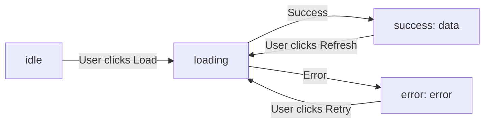

# Playbook: React + TypeScript Advanced Patterns

> [!summary] Goal
> Type React components safely with generics, discriminated unions for state, `as const` for constants, template literal types for events, and utility types for props.

## Table of Contents

1. [Why TypeScript with React Matters](#why-typescript-with-react-matters)
2. [Generic Components](#generic-components)
3. [Discriminated Unions for State](#discriminated-unions-for-state)
4. [`as const` and `satisfies`](#as-const-and-satisfies)
5. [Utility Types for Props](#utility-types-for-props)
6. [Template Literal Types for Events](#template-literal-types-for-events)
7. [Pitfalls](#pitfalls)

---

## Why TypeScript with React Matters

TypeScript catches prop mismatches, missing handlers, and impossible state combinations at compile time — before they reach the browser.

---

## Generic Components

```typescript
// Generic list component that preserves item type
interface ListProps<T extends { id: string }> {
  items: T[];
  renderItem: (item: T, index: number) => React.ReactNode;
  onItemClick?: (item: T) => void;
}

function List<T extends { id: string }>({
  items,
  renderItem,
  onItemClick,
}: ListProps<T>) {
  return (
    <ul>
      {items.map((item, i) => (
        <li
          key={item.id}
          onClick={() => onItemClick?.(item)}
          className="cursor-pointer hover:bg-gray-100"
        >
          {renderItem(item, i)}
        </li>
      ))}
    </ul>
  );
}

// Usage — T is inferred from items:
<List
  items={[
    { id: '1', name: 'Alice', email: 'a@b.com' },
    { id: '2', name: 'Bob', email: 'b@c.com' },
  ]}
  renderItem={(user) => <span>{user.name}</span>}
  onItemClick={(user) => console.log(user.email)}  // user has full type
/>
```

### Generic table component

```typescript
interface Column<T> {
  key: keyof T;
  header: string;
  render?: (value: T[keyof T], row: T) => React.ReactNode;
}

function Table<T extends Record<string, any>>({
  data,
  columns,
}: {
  data: T[];
  columns: Column<T>[];
}) {
  return (
    <table>
      <thead>
        <tr>{columns.map(col => <th key={String(col.key)}>{col.header}</th>)}</tr>
      </thead>
      <tbody>
        {data.map((row, i) => (
          <tr key={i}>
            {columns.map(col => (
              <td key={String(col.key)}>
                {col.render?.(row[col.key], row) ?? String(row[col.key])}
              </td>
            ))}
          </tr>
        ))}
      </tbody>
    </table>
  );
}
```

---

## Discriminated Unions for State

Model complex component states as discriminated unions — make impossible states unrepresentable:

```typescript
type AsyncState<T, E = Error> =
  | { status: 'idle' }
  | { status: 'loading' }
  | { status: 'success'; data: T }
  | { status: 'error'; error: E };

function UserProfile({ userId }: { userId: string }) {
  const [state, setState] = useState<AsyncState<User>>({ status: 'idle' });

  useEffect(() => {
    setState({ status: 'loading' });
    fetchUser(userId)
      .then(data => setState({ status: 'success', data }))
      .catch(error => setState({ status: 'error', error }));
  }, [userId]);

  // Exhaustive switch — every state is handled
  switch (state.status) {
    case 'idle':
      return <button onClick={() => setState({ status: 'loading' })}>Load</button>;
    case 'loading':
      return <Spinner />;
    case 'success':
      return <UserCard user={state.data} />;
    case 'error':
      return <ErrorDisplay error={state.error} onRetry={() => setState({ status: 'idle' })} />;
  }
}
```



### Form state as discriminated union

```typescript
type FormState<T> =
  | { status: 'editing'; values: T; errors: Partial<Record<keyof T, string>> }
  | { status: 'submitting'; values: T }
  | { status: 'success' }
  | { status: 'error'; error: string };

function useForm<T extends Record<string, any>>(initial: T) {
  const [state, setState] = useState<FormState<T>>({
    status: 'editing',
    values: initial,
    errors: {},
  });
  // ... state.status narrowing ensures only valid operations per state
  return { state, setState };
}
```

---

## `as const` and `satisfies`

### `as const` for literal types

```typescript
// Without as const — TypeScript infers string
const ROUTES = {
  home: '/',
  settings: '/settings',
  profile: '/users/:id',
};
// type: { home: string; settings: string; profile: string }

// With as const — literal types preserved
const ROUTES = {
  home: '/',
  settings: '/settings',
  profile: '/users/:id',
} as const;
// type: { readonly home: '/'; readonly settings: '/settings'; readonly profile: '/users/:id' }
```

### `satisfies` — validate shape without widening

```typescript
type RouteConfig = Record<string, `/${string}`>;

const ROUTES = {
  home: '/',
  settings: '/settings',
  // bad: 'invalid'  ← ❌ TS catches this
} as const satisfies RouteConfig;

// ROUTES.home is still type '/', not string
```

### `as const` for event handlers map

```typescript
const EVENT_HANDLERS = {
  'user:created': (userId: string) => { /* ... */ },
  'user:updated': (userId: string, changes: string[]) => { /* ... */ },
  'order:placed': (orderId: string, total: number) => { /* ... */ },
} as const;

type EventHandlerMap = typeof EVENT_HANDLERS;
// { readonly 'user:created': (userId: string) => void; ... }
```

---

## Utility Types for Props

### Extending native HTML props

```typescript
// Extend all button props, add custom variants
interface ButtonProps extends React.ComponentProps<'button'> {
  variant?: 'primary' | 'secondary';
  isLoading?: boolean;
}

// Omit conflicting props
interface InputProps extends Omit<React.ComponentProps<'input'>, 'type'> {
  type?: 'text' | 'email' | 'password';
  error?: string;
}

function Input({ type = 'text', error, className, ...props }: InputProps) {
  return (
    <div>
      <input
        type={type}
        className={cn('border rounded px-3 py-2', error && 'border-red-500', className)}
        {...props}
      />
      {error && <p className="mt-1 text-sm text-red-500">{error}</p>}
    </div>
  );
}
```

### `Pick`, `Omit`, `Partial` for variations

```typescript
interface UserFormData {
  id: string;
  email: string;
  name: string;
  role: 'admin' | 'user';
  createdAt: Date;
}

// Create form — id and createdAt are generated
type CreateUserForm = Omit<UserFormData, 'id' | 'createdAt'>;

// Update form — all fields optional
type UpdateUserForm = Partial<CreateUserForm> & { id: string };

// Display — only show safe fields
type UserDisplay = Pick<UserFormData, 'id' | 'email' | 'name'>;
```

---

## Template Literal Types for Events

```typescript
type EventName = `on${Capitalize<string>}`;
// 'onClick' | 'onChange' | 'onSubmit' | ...

// Typed event emitter
type AppEvents = {
  'user:login': { userId: string };
  'user:logout': { userId: string };
  'cart:add': { productId: string; quantity: number };
};

function createEmitter<T extends Record<string, unknown>>() {
  return {
    on<K extends keyof T>(event: K, handler: (data: T[K]) => void) {},
    emit<K extends keyof T>(event: K, data: T[K]) {},
  };
}

const emitter = createEmitter<AppEvents>();
emitter.on('user:login', (data) => console.log(data.userId)); // typed
emitter.on('cart:add', (data) => console.log(data.productId, data.quantity)); // typed
```

---

## Pitfalls

### Missing `extends` on generic type parameter

```typescript
// ❌ T has no constraint — you can't access .id
function List<T>({ items }: { items: T[] }) {}
// ✅ T must have id
function List<T extends { id: string }>({ items }: { items: T[] }) {}
```

### `React.FC` with generics doesn't work

```typescript
// ❌ React.FC<Props> doesn't support generics
const List: React.FC<ListProps<T>> = ...  // impossible

// ✅ Use function syntax
function List<T>(props: ListProps<T>) { ... }
```

---

> [!question]- Interview Questions
>
> **Q: How do you type a generic list component in React?**
> A: Use `function List<T extends { id: string }>({ items, renderItem }: ListProps<T>)`. `T` is inferred from the `items` prop, and `renderItem` receives typed items.
>
> **Q: What is the advantage of discriminated unions for component state?**
> A: Only valid operations are possible per state — you can't access `data` while loading. The switch/case provides exhaustiveness checking, so adding a new state forces updates everywhere.

---

## Cross-Links

- [[React/01_Foundations/02_Hooks_Complete_Reference]] for typed hooks
- [[TypeScript/01_Foundations/01_TS_Basics_Types_and_Inference]] for TypeScript fundamentals
- [[TypeScript/03_Advanced/04_Typing_Patterns_for_APIs]] for API type patterns

---

## References

- [React TypeScript Cheatsheet](https://react-typescript-cheatsheet.netlify.app/)
- [TypeScript Handbook: Generics](https://www.typescriptlang.org/docs/handbook/2/generics.html)
- [TypeScript 4.1 Template Literal Types](https://www.typescriptlang.org/docs/handbook/2/template-literal-types.html)
