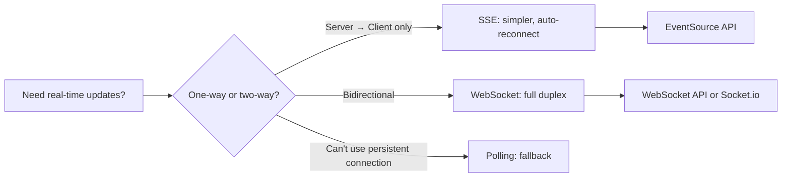
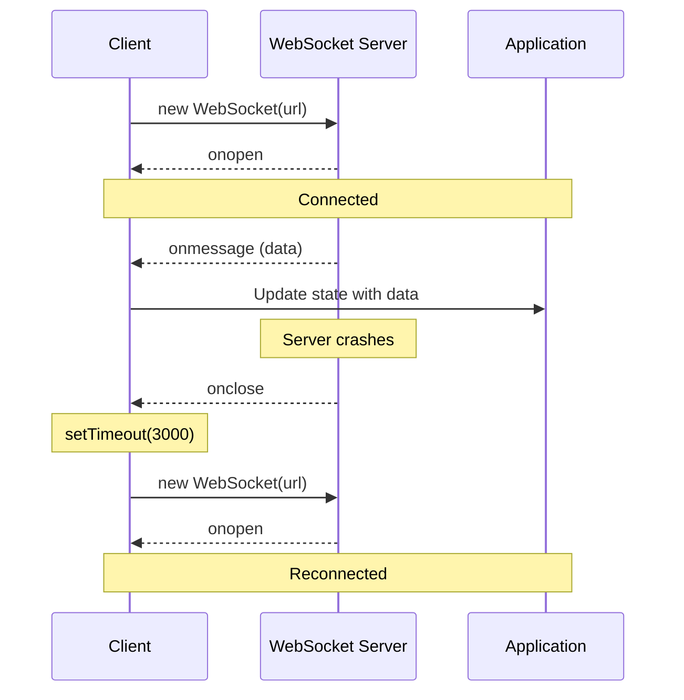
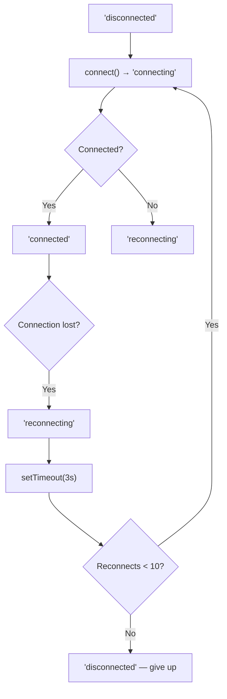

# Playbook: WebSocket and Real-Time Patterns

> [!summary] Goal
> Add real-time features to React applications using WebSocket, Server-Sent Events (SSE), and fallback strategies — with connection lifecycle management, reconnection, and Redux integration.

## Table of Contents

1. [Why Real-Time Matters](#why-real-time-matters)
2. [Protocol Decision Guide](#protocol-decision-guide)
3. [WebSocket with useEffect](#websocket-with-useeffect)
4. [WebSocket with Redux Toolkit](#websocket-with-redux-toolkit)
5. [Server-Sent Events (SSE)](#server-sent-events)
6. [Connection Lifecycle](#connection-lifecycle)
7. [Pitfalls](#pitfalls)

---

## Why Real-Time Matters

Users expect instant updates — new messages, live notifications, real-time collaboration. Polling wastes resources and adds latency.



---

## WebSocket with useEffect

```typescript
'use client';

import { useEffect, useRef, useState, useCallback } from 'react';

type ConnectionStatus = 'connecting' | 'connected' | 'disconnected' | 'reconnecting';

interface UseWebSocketOptions {
  url: string;
  onMessage?: (data: unknown) => void;
  reconnectInterval?: number;
  maxReconnects?: number;
}

export function useWebSocket({
  url,
  onMessage,
  reconnectInterval = 3000,
  maxReconnects = 10,
}: UseWebSocketOptions) {
  const [status, setStatus] = useState<ConnectionStatus>('disconnected');
  const wsRef = useRef<WebSocket | null>(null);
  const reconnectCount = useRef(0);
  const reconnectTimer = useRef<ReturnType<typeof setTimeout>>();

  const connect = useCallback(() => {
    if (reconnectCount.current >= maxReconnects) {
      setStatus('disconnected');
      return;
    }

    setStatus(reconnectCount.current > 0 ? 'reconnecting' : 'connecting');
    const ws = new WebSocket(url);
    wsRef.current = ws;

    ws.onopen = () => {
      reconnectCount.current = 0;
      setStatus('connected');
    };

    ws.onmessage = (event) => {
      try {
        const data = JSON.parse(event.data);
        onMessage?.(data);
      } catch {
        onMessage?.(event.data);
      }
    };

    ws.onclose = () => {
      setStatus('disconnected');
      reconnectCount.current++;
      reconnectTimer.current = setTimeout(connect, reconnectInterval);
    };

    ws.onerror = () => {
      ws.close();
    };
  }, [url, onMessage, reconnectInterval, maxReconnects]);

  const send = useCallback((data: unknown) => {
    if (wsRef.current?.readyState === WebSocket.OPEN) {
      wsRef.current.send(JSON.stringify(data));
    }
  }, []);

  useEffect(() => {
    connect();
    return () => {
      clearTimeout(reconnectTimer.current);
      wsRef.current?.close();
    };
  }, [connect]);

  return { status, send };
}
```



---

## WebSocket with Redux Toolkit

```typescript
import { createSlice, createListenerMiddleware } from '@reduxjs/toolkit';

// Listen for WebSocket messages and dispatch actions
const wsMiddleware = createListenerMiddleware();

wsMiddleware.startListening({
  predicate: (action) => action.type === 'ws/messageReceived',
  effect: async (action, listenerApi) => {
    const { type, payload } = action.payload;
    switch (type) {
      case 'order:update':
        listenerApi.dispatch(orderUpdated(payload));
        break;
      case 'notification':
        listenerApi.dispatch(notificationReceived(payload));
        break;
    }
  },
});

// RTK Query streaming updates
const api = createApi({
  reducerPath: 'api',
  baseQuery: fetchBaseQuery({ baseUrl: '/api' }),
  endpoints: (builder) => ({
    getMessages: builder.query<Message[], void>({
      query: () => '/messages',
      async onCacheEntryAdded(_, { cacheDataLoaded, cacheEntryRemoved, updateCachedData }) {
        const ws = new WebSocket('wss://api.example.com/messages');
        try {
          await cacheDataLoaded;
          const listener = (event: MessageEvent) => {
            const message = JSON.parse(event.data);
            updateCachedData((draft) => {
              draft.push(message);
            });
          };
          ws.addEventListener('message', listener);
          await cacheEntryRemoved;
        } finally {
          ws.close();
        }
      },
    }),
  }),
});
```

---

## Server-Sent Events (SSE)

SSE is simpler than WebSocket — native browser support, auto-reconnect, one-directional from server to client:

```typescript
function useSSE<T>(url: string) {
  const [data, setData] = useState<T | null>(null);
  const [status, setStatus] = useState<'connecting' | 'connected'>('connecting');

  useEffect(() => {
    const source = new EventSource(url);

    source.onopen = () => setStatus('connected');

    source.onmessage = (event) => {
      setData(JSON.parse(event.data));
    };

    source.onerror = () => {
      // EventSource auto-reconnects
      setStatus('connecting');
    };

    return () => source.close();
  }, [url]);

  return { data, status };
}
```

| Aspect | WebSocket | SSE (EventSource) |
|--------|-----------|-------------------|
| **Direction** | Bidirectional | Server → Client only |
| **Protocol** | ws:// | http:// |
| **Auto-reconnect** | Manual | ✅ Built-in |
| **Browser support** | ✅ All modern | ✅ All modern (except IE) |
| **Use case** | Chat, games, collaborative editing | Live notifications, stock tickers, log streams |

---

## Connection Lifecycle



---

## Pitfalls

### Memory leaks from missed cleanup

```typescript
useEffect(() => {
  ws = new WebSocket(url);
  return () => ws.close();  // ✅ Essential — closes WS on unmount
}, [url]);
```

### Reconnect storms

If the server is down, all clients reconnect simultaneously — causing a thundering herd.

**Fix**: Add jitter: `Math.random() * reconnectInterval + reconnectInterval`.

### Stale closures in `onmessage`

```typescript
// ❌ Stale closure — onmessage sees stale state
useEffect(() => {
  ws.onmessage = () => {
    console.log(state);  // state is stale (captured at effect creation)
  };
}, []);  // Empty deps

// ✅ Use ref
const stateRef = useRef(state);
stateRef.current = state;
ws.onmessage = () => {
  console.log(stateRef.current);  // Always fresh
};
```

---

## Cross-Links

- [[React/02_Core/01_Redux_Toolkit_Essentials]] for RTK Query streaming updates
- [[React/04_Playbooks/02_Debug_Data_Fetching_and_Caching_RTKQ]] for RTKQ cache debugging
- [[React/04_Playbooks/08_React_TypeScript_Advanced_Patterns]] for typed event emitters

---

## References

- [MDN: WebSocket](https://developer.mozilla.org/en-US/docs/Web/API/WebSocket)
- [MDN: Server-Sent Events](https://developer.mozilla.org/en-US/docs/Web/API/Server-sent_events)
- [Socket.io](https://socket.io/docs/v4/)
