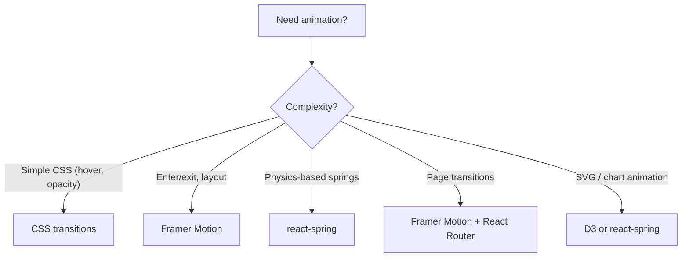

# Animation in React: Framer Motion and react-spring

> [!summary] Goal
> Add animations to React applications using Framer Motion and react-spring. Cover layout animations, gestures, exit/enter transitions, spring physics, shared layout animations (layoutId), and SVG animation.

## Table of Contents

1. [Why Animation Frameworks?](#why-animation-frameworks)
2. [Framer Motion Basics](#framer-motion-basics)
3. [Gestures and Drag](#gestures-and-drag)
4. [Layout Animations](#layout-animations)
5. [Pitfalls](#pitfalls)

---

## Why Animation Frameworks?

> [!info] Animation in React
> CSS transitions work for simple hover/enter states. For complex, orchestrated animations (shared layout, drag, gesture, spring physics), dedicated libraries save thousands of lines of code. Framer Motion is the most popular (React-centric, declarative API). react-spring is a physics-based alternative with a hooks-based API.



---

## Framer Motion Basics

```tsx
import { motion, AnimatePresence } from 'framer-motion';

// Basic animate prop
<motion.div
  animate={{ x: 100, opacity: 0.5 }}
  transition={{ duration: 0.5 }}
/>

// Initial + animate (enter animation)
<motion.div
  initial={{ opacity: 0, y: 20 }}
  animate={{ opacity: 1, y: 0 }}
  transition={{ duration: 0.3, ease: 'easeOut' }}
>
  Content
</motion.div>

// Exit animation (needs AnimatePresence)
<AnimatePresence>
  {isVisible && (
    <motion.div
      initial={{ opacity: 0 }}
      animate={{ opacity: 1 }}
      exit={{ opacity: 0 }}
      key="modal"
    >
      Modal content
    </motion.div>
  )}
</AnimatePresence>
```

### Variants — reusable animation states

```tsx
const variants = {
  hidden: { opacity: 0, x: -20 },
  visible: { opacity: 1, x: 0, transition: { staggerChildren: 0.1 } },
  exit: { opacity: 0, x: 20 },
};

// Parent orchestrates children
<motion.ul variants={variants} initial="hidden" animate="visible" exit="exit">
  {items.map(item => (
    <motion.li key={item.id} variants={variants}>
      {item.name}
    </motion.li>
  ))}
</motion.ul>
```

---

## Layout Animations

```tsx
// Layout animation — animate changes in size/position automatically
<motion.div layout transition={{ type: 'spring', stiffness: 300 }} />

// Shared layout (layoutId) — morph one element into another
// When two elements share a layoutId, they animate between positions
{selectedId ? (
  <motion.div layoutId={selectedId} className="card-expanded" />
) : (
  items.map(item => (
    <motion.div
      key={item.id}
      layoutId={item.id}
      className="card"
      onClick={() => setSelectedId(item.id)}
    />
  ))
)}
```

---

## Pitfalls

### AnimatePresence requires a unique `key`

Without unique `key` props, `AnimatePresence` can't track which elements entered/exited. Always provide stable keys.

### Layout animations and transforms

Layout animations can conflict with `transform` animations. Use `positionTransition` for smooth layout shifts when items are reordered.

### Performance — animating `width`/`height` vs `transform`

Animating `width`, `height`, `top`, `left` triggers layout recalculations (reflow). Animate `transform` (scale, translateX, translateY) and `opacity` instead — they're composited on the GPU and don't trigger reflow.

---

> [!question]- Interview Questions
>
> **Q: How does Framer Motion differ from CSS transitions?**
> A: Framer Motion provides declarative React props (`animate`, `initial`, `exit`), orchestration (variants with staggerChildren), layout animations (layoutId), gestures (drag, hover, tap), and `AnimatePresence` for enter/exit animations. CSS transitions work for simple hover effects but can't easily handle shared layout morphing, drag, or orchestrated children animations.
>
> **Q: What is layoutId and when would you use it?**
> A: `layoutId` lets two different elements share an identity across renders. When one element hides and another shows with the same `layoutId`, Framer Motion automatically morphs the position and size — creating a seamless transition. Commonly used for: expanding cards (list → detail), tab content transitions, and modal entrance/exit.

---

## Cross-Links

- [[React/03_Advanced/02_Performance_and_Profiling]] for animation performance
- [[React/02_Core/03_Routing_with_React_Router]] for page transitions
- [[React/01_Foundations/01_React_Mental_Model_and_Rendering]] for understanding re-renders during animation
