# Rust

> [!summary] Scope
> Rust from the ownership model upward: memory safety without a garbage collector, expressive enums and pattern matching, error handling, iterators, traits, closures, Deref/Drop/RAII, testing, smart pointers, Pin/Unpin, concurrency, async, serde, unsafe Rust, macros (incl. procedural), lifetimes deep, memory layout, build scripts, no_std, global allocators, const generics, Cargo features, and production-grade tooling.

## Overview

Rust is best understood as a language built around a few core promises:
- memory safety without garbage collection
- fearless concurrency through type-driven aliasing rules
- zero-cost abstractions where high-level APIs compile down to efficient machine code
- explicitness around ownership, mutability, failure, and lifetime relationships

That means most Rust topics are connected:
- ownership affects API design
- borrowing affects iteration and pattern matching
- lifetimes affect references and trait bounds
- `Send` / `Sync` affect concurrency
- async affects ownership and pinning behavior
- smart pointers encode who owns what, on which thread, and with what mutation model

---

## Learning Path

```mermaid
flowchart TD
    A[Ownership and Borrowing] --> B[Structs Enums and Pattern Matching]
    B --> C[Error Handling]
    C --> D[Iterators Collections and Slices]
    D --> E[Traits Generics and Lifetimes Intro]
    E --> F[Modules Crates Cargo and Tooling]
    F --> G[Owned vs Borrowed Types]
    G --> H[Smart Pointers]
    H --> I[Closures and Fn Traits]
    I --> J[Deref Drop and RAII Patterns]
    J --> K[Testing in Rust]
    K --> L[Concurrency: Threads Mutex Channels]
    L --> M[Async Await and Tokio]
    M --> N[Serde JSON and Data Modeling]
    N --> O[Pin and Unpin Deep Dive]
    O --> P[Lifetimes in Depth]
    P --> Q[Unsafe Rust and FFI]
    Q --> R[Procedural Macros]
    R --> S[Performance Profiling and Allocation]
    S --> T[Macros Intro and Derive]
    T --> U[Memory Layout and repr]
    U --> V[Const Generics and GATs]
    V --> W[Build Scripts and FFI Deep]
    W --> X[no_std and Embedded Rust]
    X --> Y[Global Allocators]
    Y --> Z[Cargo Features and cfg]
    Z --> AA[Playbooks and Projects]

    style A fill:#e1f5ff
    style H fill:#fff4cc
    style I fill:#e1f5ff
    style J fill:#e1f5ff
    style K fill:#e1f5ff
    style O fill:#fff4cc
    style Q fill:#ffe1e1
    style R fill:#ffe1e1
    style T fill:#ffe1e1
    style AA fill:#d9f7d6
```

## How To Read This Topic

### Foundations

These explain Rust's core mental model:
- ownership
- borrowing
- pattern matching
- error propagation
- iterators and slices
- traits, generics, and introductory lifetimes
- testing, assertions, and mocking

### Core

These explain the APIs and patterns you use in real applications:
- borrowed vs owned inputs in APIs
- smart pointers and shared ownership
- closures and the Fn/FnMut/FnOnce hierarchy
- Deref, Drop, and RAII resource management
- thread-based concurrency and message passing
- async runtimes and executors
- serialization and strongly typed data models
- Pin, Unpin, and self-referential types
- advanced iterator patterns
- conversion traits (From, Into, AsRef, Cow)
- system string types (OsStr, CStr, Path)

### Advanced

These explain the parts people usually misuse or fear:
- deep lifetimes and borrow-checker reasoning
- `unsafe` and FFI boundaries
- procedural macros and code generation
- performance measurement, allocations, and cost modeling
- macros and derive-based code generation
- memory layout and repr attributes
- const generics and generic associated types
- build scripts and FFI integration
- `no_std` and embedded development
- global allocators and allocation profiling
- Cargo features and conditional compilation
- property-based testing and fuzzing
- edition migration

---

## Topic Map

### Foundations

#### [[Rust/01_Foundations/01_Ownership_and_Borrowing]]
- ownership rules
- move semantics
- borrowing rules
- mutable vs shared references
- lifetime intuition and stack/heap mental model

#### [[Rust/01_Foundations/02_Structs_Enums_and_Pattern_Matching]]
- product vs sum types
- `match`, `if let`, `while let`
- state modeling and exhaustive handling

#### [[Rust/01_Foundations/03_Error_Handling_Result_and_ThisError]]
- `Result`, `Option`, `?`
- typed error enums
- `thiserror` and application ergonomics

#### [[Rust/01_Foundations/04_Iterators_Collections_and_Slices]]
- iterator laziness
- adapters and consumers
- slices and view types
- standard collection tradeoffs

#### [[Rust/01_Foundations/05_Traits_Generics_and_Lifetimes_Intro]]
- trait-based behavior
- monomorphization
- trait bounds
- basic lifetime relationships

#### [[Rust/01_Foundations/06_Modules_Crates_Cargo_and_Tooling]]
- crates, packages, modules
- Cargo workflows
- formatting, linting, testing, docs

#### [[Rust/01_Foundations/07_Testing_in_Rust]]
- unit tests, integration tests, doc tests
- assertions, should_panic, parameterized tests
- benchmarking with Criterion
- property-based testing with proptest
- mocking patterns

### Core

#### [[Rust/02_Core/01_Owned_vs_Borrowed_Types_StringStr_Path]]
- `String` vs `&str`
- `PathBuf` vs `&Path`
- API boundary design

#### [[Rust/02_Core/02_Smart_Pointers_Box_Rc_Arc]]
- heap indirection
- reference counting
- thread-safe sharing
- interior mutability crossovers

#### [[Rust/02_Core/03_Concurrency_Threads_Mutex_Channels]]
- `std::thread`
- `Mutex`, `RwLock`, channels
- `Send` and `Sync`
- avoiding shared mutable-state traps

#### [[Rust/02_Core/04_Async_Await_Tokio_Basics]]
- futures and polling
- executors and runtimes
- blocking vs async IO
- Tokio usage patterns

#### [[Rust/02_Core/05_Serde_JSON_and_Data_Modeling]]
- `Serialize`/`Deserialize`
- schema evolution and enum tagging
- API payload modeling

#### [[Rust/02_Core/06_Closures_and_Fn_Traits]]
- closure syntax and capture modes
- `Fn`/`FnMut`/`FnOnce` trait hierarchy
- `move` closures and ownership
- closures vs function pointers

#### [[Rust/02_Core/07_Pin_and_Unpin_Deep_Dive]]
- why Pin exists (self-referential types)
- `Unpin` auto-trait
- pinning in async futures
- pinning projections with `pin_project`

#### [[Rust/02_Core/08_Deref_Drop_and_RAII_Patterns]]
- `Deref` trait and deref coercion
- `Drop` trait and destructors
- RAII patterns (MutexGuard, scoped timers)
- drop order guarantees

#### [[Rust/02_Core/09_Into_From_AsRef_AsMut_and_Cow]]
- `From`/`Into` for infallible conversions
- `AsRef`/`AsMut` for borrowed views
- `Cow` for clone-on-write
- choosing the right conversion trait

#### [[Rust/02_Core/10_OsStr_OsString_CStr_CString_and_System_Types]]
- platform-native strings (OsStr/OsString)
- NUL-terminated C strings (CStr/CString)
- Path/PathBuf relationship
- conversion matrix between string types

#### [[Rust/02_Core/11_Advanced_Iterator_Patterns]]
- implementing `IntoIterator` for custom types
- custom iterator types (stateful, wrapping)
- iterator adapters (Fuse, Peekable, Cycle)
- three iterator variants (iter, iter_mut, into_iter)

#### [[Rust/02_Core/12_LinkedList_BinaryHeap_and_Lesser_Collections]]
- `LinkedList` (when to never use it)
- `BinaryHeap` for priority queues
- `VecDeque` for double-ended queues
- `BTreeMap` vs `HashMap` tradeoffs

### Advanced

#### [[Rust/03_Advanced/01_Lifetimes_In_Depth_and_Borrow_Checker_Mental_Model]]
- non-lexical lifetimes intuition
- elision rules
- references in structs and APIs

#### [[Rust/03_Advanced/02_Unsafe_Rust_and_FFI_Basics]]
- raw pointers
- invariants at unsafe boundaries
- C interop mental model

#### [[Rust/03_Advanced/03_Performance_Profiling_and_Allocation]]
- stack vs heap cost model
- allocation hotspots
- benchmarking and profiling workflow

#### [[Rust/03_Advanced/04_Macros_Intro_and_Derive]]
- declarative macros
- derive macros
- when macro abstraction is worth it

#### [[Rust/03_Advanced/05_Procedural_Macros]]
- TokenStream API, syn/quote ecosystem
- derive macros (full worked example)
- attribute macros and function-like macros
- testing with trybuild and cargo expand

#### [[Rust/03_Advanced/06_Const_Generics_and_GATs]]
- const generic syntax (`const N: usize`)
- fixed-size buffers, matrix types
- generic associated traits (GATs)
- lending iterators and pooled connections

#### [[Rust/03_Advanced/07_Memory_Layout_and_repr_Attributes]]
- repr(Rust) vs repr(C) vs repr(transparent)
- repr(packed) and repr(align)
- enum layout and niche optimization
- size_of, align_of, offset_of!

#### [[Rust/03_Advanced/08_Build_Scripts_and_FFI_Deep]]
- build.rs lifecycle and Cargo directives
- cc crate for C compilation
- bindgen for auto-generated bindings
- -sys crate conventions

#### [[Rust/03_Advanced/09_no_std_and_Embedded_Rust]]
- core vs std vs alloc
- global allocator, panic handler
- embedded-hal traits
- when and why to use no_std

#### [[Rust/03_Advanced/10_Global_Allocators_and_Allocation]]
- #[global_allocator] setup
- jemalloc vs mimalloc vs system
- custom allocator implementation
- allocation profiling with dhat

#### [[Rust/03_Advanced/11_Cargo_Features_and_Conditional_Compilation]]
- feature declarations and resolution
- cfg/cfg_attr/cfg! for conditional code
- target-specific compilation
- semver considerations

#### [[Rust/03_Advanced/12_Rustdoc_and_API_Documentation]]
- doc comments (/// and //!)
- doc tests and conditional compilation
- linking items, re-exports
- crate-level documentation

#### [[Rust/03_Advanced/13_Property_Based_Testing_Proptest]]
- invariants vs specific assertions
- proptest strategies and shrinking
- when to use vs example-based tests
- custom strategies and filtering

#### [[Rust/03_Advanced/14_Edition_Migration]]
- edition overview (2015, 2018, 2021, 2024)
- cargo fix --edition workflow
- per-crate edition rules

#### [[Rust/03_Advanced/15_MaybeUninit_NonNull_and_Raw_Pointer_Patterns]]
- `MaybeUninit<T>` deep dive (batch init, lazy init, Vec-like structures)
- `NonNull<T>` (guarantees, niche optimization, collection internals)
- pointer provenance (Strict Provenance API, addr, with_exposed_provenance)
- pointer arithmetic, Layout, ptr::read/write/copy/drop_in_place
- when to use *const T vs NonNull vs MaybeUninit

#### [[Rust/03_Advanced/16_Variance_PhantomData_and_HRTB]]
- variance: covariant, contravariant, invariant (full table for all std types)
- PhantomData for drop check, variance control, type-level state machines
- Higher-Ranked Trait Bounds (for<'a>), when implicit vs explicit
- subtyping and coercion rules
- pitfalls: fn argument contravariance, HRTB in structs

#### [[Rust/03_Advanced/17_Tracing_Logging_and_Observability]]
- tracing crate: spans, events, structured fields
- subscribers (fmt, JSON, env-filter, non-blocking file)
- #[instrument] macro for function-level tracing
- metrics collection (metrics crate + prometheus exporter)
- OpenTelemetry integration (OTLP, distributed trace propagation)
- log crate compatibility bridge

#### [[Rust/03_Advanced/18_Inline_Assembly_and_Miri]]
- core::arch::asm! syntax, operands (in/out/inout/reg), clobbers, options
- architecture-specific examples (rdtsc, cpuid, dmb, cmpxchg)
- Miri for UB detection (use-after-free, uninit reads, provenance violations, misalignment)
- Miri CI integration, loom for concurrent UB detection
- testing strategy for unsafe code

#### [[Rust/03_Advanced/19_Workspaces_PGO_and_Advanced_Build]]
- Cargo workspaces (member inheritance, shared deps, commands)
- Profile-Guided Optimization (PGO): 3-step workflow, training data quality, CI integration
- BOLT binary optimization (perf2bolt, reorder-blocks, reorder-functions, split-functions)
- advanced Cargo: [patch], feature resolution, cfg/cfg_attr, build cache optimization (sccache)
- release profile tuning (lto, codegen-units, panic=abort)

### Playbooks

#### [[Rust/04_Playbooks/01_Debug_Borrow_Checker_Errors]]
- common error patterns with fixes (moved values, borrow conflicts, lifetime mismatches, NLL patterns)
- async borrow checker patterns (MutexGuard across .await)
- practical method for reading diagnostics

#### [[Rust/04_Playbooks/02_Debug_Panic_Backtraces_and_Error_Contexts]]
- RUST_BACKTRACE and RUST_LIB_BACKTRACE flags
- custom panic hooks for structured logging
- catch_unwind for FFI boundary safety
- abort vs unwind configuration and tradeoffs

#### [[Rust/04_Playbooks/03_Debug_Async_Deadlocks_and_Blocking]]
- async deadlock patterns (blocking on runtime, mutex across await, select! starvation, bounded channels)
- Tokio Console for task-level diagnostics
- async backtraces with tokio_unstable
- prevention patterns (spawn_blocking, scoped guards, timeouts)

#### [[Rust/04_Playbooks/04_Production_Readiness_Checklist]]
- observability, concurrency/async, resource management, error handling
- build configuration, testing coverage, deployment checklist
- health/readiness probes, graceful shutdown, distributed tracing

### Projects

#### [[Rust/05_Projects/01_CLI_with_Clap_and_Serde]]
- clap derive argument parsing, serde config (YAML/JSON/TOML), subcommand dispatch
- thiserror + anyhow error handling, tracing integration
- assert_cmd + predicates testing, tempfile for test isolation
- 250+ line project with full structure (config, commands, error modules)

#### [[Rust/05_Projects/02_HTTP_API_with_Axum_and_Postgres]]
- Axum router with application state, sqlx async Postgres, clean error handling
- CRUD endpoints with validation, database migrations
- tower-http tracing layer, containerized integration tests with testcontainers
- 250+ line project with models, routes, db, error modules

#### [[Rust/05_Projects/03_Async_Worker_with_Kafka]]
- rdkafka StreamConsumer with graceful shutdown via tokio::sync::watch
- structured message processing with serde, configurable retry logic
- metrics collection with prometheus exporter
- 200+ line project covering consumer lifecycle, error handling, DB writes

---

## Rust Mental Model

The most important thing to remember:
- Rust is not “hard because syntax is weird”
- Rust is demanding because it makes memory, aliasing, and failure explicit

Once that mental model clicks, the rest of the language becomes much more coherent.

---

## Cross-Links

- [[Go/00_MOC/00_Go_MOC]] for a contrasting concurrency/runtime model
- [[Linux/00_MOC/00_Linux_MOC]] for systems-level operational context
- [[SystemDesign/00_MOC/00_SystemDesign_MOC]] for backpressure, queues, and production tradeoffs

---

## References

- [The Rust Programming Language](https://doc.rust-lang.org/book/)
- [Rust Reference](https://doc.rust-lang.org/reference/)
- [Rust by Example](https://doc.rust-lang.org/rust-by-example/)
- [The Rust Standard Library](https://doc.rust-lang.org/std/)
- [The Rustonomicon](https://doc.rust-lang.org/nomicon/)
