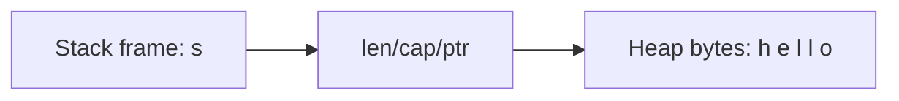
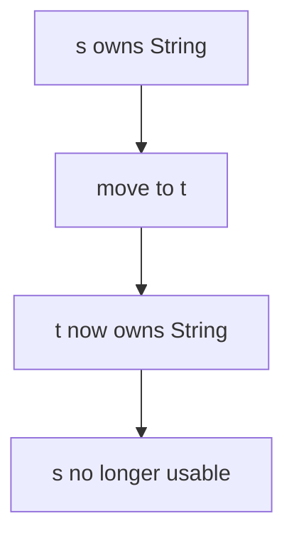
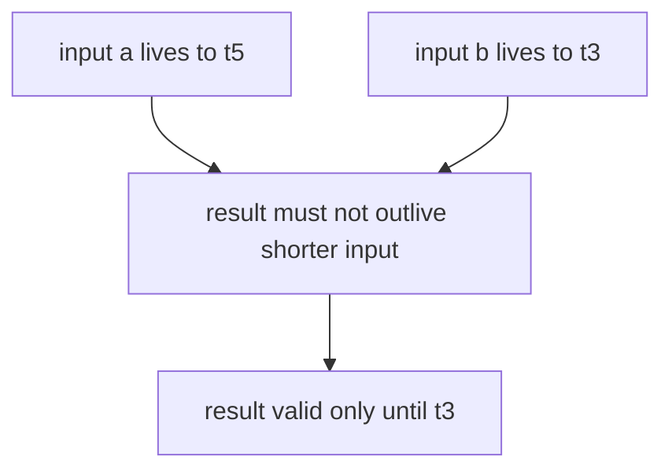

# Ownership and Borrowing

> [!summary] Goal
> Understand the core Rust model for memory safety: who owns a value, when it is dropped, how references are validated, and why these rules eliminate use-after-free and data races without a garbage collector.

## Table of Contents

1. [Why Ownership Exists](#why-ownership-exists)
2. [Stack, Heap, and Moves](#stack-heap-and-moves)
3. [The Three Ownership Rules](#the-three-ownership-rules)
4. [Borrowing](#borrowing)
5. [Mutable Borrowing and Aliasing](#mutable-borrowing-and-aliasing)
6. [Lifetimes Intuition](#lifetimes-intuition)
7. [Why the Borrow Checker Rejects Code](#why-the-borrow-checker-rejects-code)
8. [Common Scenarios](#common-scenarios)
9. [Pitfalls](#pitfalls)

---

## Why Ownership Exists

Rust wants to guarantee memory safety without a runtime garbage collector.

That means the compiler must know:
- who is responsible for freeing each value
- whether references remain valid
- whether mutation aliases with reads unsafely

Ownership is the static accounting model that makes that possible.

### What problems ownership prevents

- use-after-free
- double free
- dangling references
- data races through unsafely shared mutable state

---

## Stack, Heap, and Moves

### Stack values

Small fixed-size values often live directly on the stack.

```rust
let x: i32 = 42;
let y = x; // copy, because i32 is Copy
```

### Heap-backed values

Types like `String` own heap data.

```rust
let s = String::from("hello");
```

`String` itself contains metadata on the stack, but its UTF-8 bytes live on the heap.



### Move semantics

Rust does not implicitly deep-copy most heap-owning values.

```rust
let s = String::from("hi");
let t = s;        // move, not clone
// println!("{}", s); // error: use of moved value
println!("{}", t);
```

After the move, `t` is now the owner.



### Why move instead of hidden copy?

- avoids accidental expensive deep copies
- avoids confusion about who frees heap memory
- makes ownership transfer explicit in APIs

If you want a deep copy, say so explicitly with `.clone()`.

---

## The Three Ownership Rules

> [!tip] Definition
> Rust’s ownership model is usually summarized with three rules:
> 1. each value has one owner
> 2. only one owner exists at a time
> 3. when the owner goes out of scope, the value is dropped

### Example

```rust
{
    let s = String::from("hello");
    println!("{s}");
} // s goes out of scope, drop runs here
```

The destructor logic (`Drop`) runs automatically when ownership ends.

---

## Borrowing

Borrowing lets you access data without taking ownership.

### Shared borrow: `&T`

```rust
fn print_len(s: &String) {
    println!("{}", s.len());
}

let s = String::from("hello");
print_len(&s);
println!("{s}"); // still valid, ownership was not moved
```

Many shared borrows are allowed at once because none of them can mutate.

### Mutable borrow: `&mut T`

```rust
fn push_exclamation(s: &mut String) {
    s.push('!');
}

let mut s = String::from("hey");
push_exclamation(&mut s);
```

Only one mutable borrow is allowed at a time.

---

## Mutable Borrowing and Aliasing

Rust’s rule is often remembered as:

> [!tip] Definition
> **Many readers OR one writer**.

This is the core aliasing rule.

### Why Rust enforces it
\
If a value could be mutated while another part of the code still assumes a stable view, references could become invalid or logic could race.

### Invalid example

```rust
let mut s = String::from("hello");
let r1 = &s;
let r2 = &s;
// let r3 = &mut s; // error: cannot borrow as mutable while immutably borrowed
println!("{r1} {r2}");
```

### Valid separation by scope / last use

```rust
let mut s = String::from("hello");

let r1 = &s;
println!("{r1}");

let r2 = &mut s;
r2.push('!');
```

With non-lexical lifetime analysis, Rust often ends a borrow at its last actual use, not only at the end of the block.

---

## Lifetimes Intuition

Lifetimes describe how long references remain valid relative to the data they point to.

They are mostly a compile-time reasoning tool, not a runtime object.

### Simple intuition

If you return a reference, Rust needs to know which input it is tied to.

```rust
fn longest<'a>(a: &'a str, b: &'a str) -> &'a str {
    if a.len() >= b.len() { a } else { b }
}
```

This does **not** mean values live longer because of `'a`. It means the compiler checks that the returned reference cannot outlive the shorter valid input relationship.



### Important definition

> [!tip] Definition
> A **lifetime annotation** describes relationships between references. It does not allocate memory and it does not extend object lifetime by itself.

---

## Why the Borrow Checker Rejects Code

The borrow checker is conservative on purpose.

When it rejects code, it is usually protecting one of these invariants:
- a reference might outlive its referent
- mutation would alias with existing borrows
- ownership was moved and later reused

### Classic dangling-reference attempt

```rust
// fn bad_ref() -> &String {
//     let s = String::from("oops");
//     &s
// }
```

Why rejected:
- `s` is dropped when the function returns
- returned reference would dangle

### Why this matters operationally

In C/C++, this kind of bug might compile and then fail in production. In Rust, the compiler stops you before runtime.

---

## Common Scenarios

## Passing borrowed input into APIs

```rust
fn greet(name: &str) {
    println!("hello, {name}");
}

let owned = String::from("rust");
greet(&owned);
greet("world");
```

This is ergonomic because `&str` accepts string slices from both owned strings and string literals.

## Returning owned data when needed

```rust
fn make_message() -> String {
    format!("hello {}", 42)
}
```

If the result must outlive local state, return ownership instead of fighting lifetimes.

## Mutating through one clear owner

```rust
let mut values = vec![1, 2, 3];
values.push(4);
```

Prefer mutation through a single owner over complex aliasing.

---

## Pitfalls

### Cloning to silence the compiler everywhere

Sometimes cloning is correct, but using `.clone()` reflexively can hide poor ownership design and add unnecessary allocation.

### Returning references to local data

This is a conceptual bug, not just a syntax issue.

### Fighting borrows instead of redesigning API boundaries

Often the clean solution is:
- return owned data
- narrow borrow scope
- separate read and write phases

### Confusing `Copy` with `Clone`

- `Copy` types duplicate trivially by assignment
- `Clone` is explicit and may allocate or do heavier work

---

## Best Practices

- Borrow when you only need temporary access.
- Own when you need to store, return, or outlive the caller’s data.
- Prefer short borrow scopes.
- Return owned values instead of overcomplicating lifetimes.
- Use `&str`, `&Path`, and slices at API boundaries where ownership is not needed.
- Treat borrow-checker errors as design feedback, not just syntax friction.

---

> [!question]- Interview Questions
>
> **Q: What problem does ownership solve in Rust?**
> A: It gives the compiler a static model for freeing memory safely and validating aliasing, preventing use-after-free and many concurrency bugs.
>
> **Q: What is the difference between moving and borrowing?**
> A: Moving transfers ownership; borrowing gives temporary access without transferring ownership.
>
> **Q: Why can Rust allow many immutable references but only one mutable reference?**
> A: Because shared reads are safe together, but mutation plus aliasing can invalidate assumptions and create unsafe behavior.
>
> **Q: Do lifetime annotations make data live longer?**
> A: No. They describe relationships between references so the compiler can verify validity.
>
> **Q: When should you return an owned value instead of a reference?**
> A: When the data is created inside the function or must outlive local state/borrow relationships.

---

## Cross-Links

- [[Rust/01_Foundations/02_Structs_Enums_and_Pattern_Matching]]
- [[Rust/01_Foundations/05_Traits_Generics_and_Lifetimes_Intro]]
- [[Rust/03_Advanced/01_Lifetimes_In_Depth_and_Borrow_Checker_Mental_Model]]
- [[Rust/04_Playbooks/01_Debug_Borrow_Checker_Errors]]

---

## References

- [Ownership](https://doc.rust-lang.org/book/ch04-01-what-is-ownership.html)
- [References and Borrowing](https://doc.rust-lang.org/book/ch04-02-references-and-borrowing.html)
- [The Slice Type](https://doc.rust-lang.org/book/ch04-03-slices.html)
