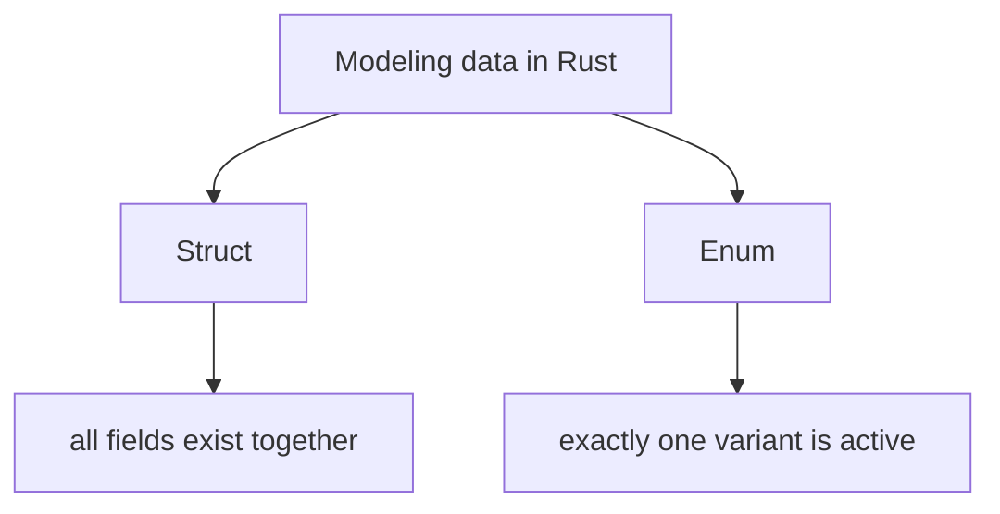
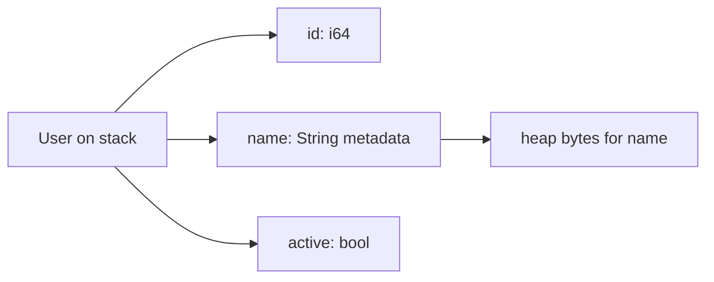

# Structs, Enums, and Pattern Matching

> [!summary] Goal
> Model data precisely using product types and sum types, and use pattern matching to make state handling explicit, exhaustive, and hard to get wrong.

## Table of Contents

1. [Why Rust Data Modeling Feels Different](#why-rust-data-modeling-feels-different)
2. [Structs](#structs)
3. [Enums](#enums)
4. [Pattern Matching](#pattern-matching)
5. [Option and Result as Enums](#option-and-result-as-enums)
6. [Common Scenarios](#common-scenarios)
7. [Pitfalls](#pitfalls)

---

## Why Rust Data Modeling Feels Different

Rust encourages you to model states explicitly instead of relying on:
- nulls
- magic strings
- boolean flag combinations
- partially initialized objects

The two most important building blocks are:
- **structs** for product types: values with fields that exist together
- **enums** for sum types: values that are one of several variants



---

## Structs

Structs group related fields into one named type.

### Basic struct

```rust
#[derive(Debug)]
struct User {
    id: i64,
    name: String,
    active: bool,
}
```

### Methods with `impl`

```rust
impl User {
    fn new(id: i64, name: String) -> Self {
        Self { id, name, active: true }
    }

    fn deactivate(&mut self) {
        self.active = false;
    }
}
```

### Why structs matter

- make invalid field groupings harder
- give names to domain concepts
- work well with ownership and borrowing rules

### Named-field vs tuple structs

```rust
struct Point {
    x: i32,
    y: i32,
}

struct UserId(i64);
```

Tuple structs are useful when you want a strong type wrapper without field names.

### Memory intuition



Important point:
- the struct itself may live on the stack
- fields like `String` may own heap allocations

---

## Enums

Enums represent one of several variants.

```rust
enum State {
    Idle,
    Running { job_id: i64 },
    Failed(String),
}
```

### Why enums are powerful

- each variant can carry different data
- code must handle all possible states
- state machines become explicit

### Memory intuition

An enum stores:
- a discriminant (which variant is active)
- the data for the active variant

```mermaid
flowchart TD
    A[State enum value] --> B[discriminant]
    A --> C[payload for active variant]
    B --> D[Idle | Running | Failed]
```

### Why enums beat flag-based modeling

Bad model:

```rust
struct Job {
    running: bool,
    failed: bool,
    job_id: Option<i64>,
}
```

This allows impossible combinations.

Better:

```rust
enum JobState {
    Idle,
    Running { job_id: i64 },
    Failed { message: String },
}
```

---

## Pattern Matching

Pattern matching is Rust’s primary tool for inspecting structured data.

### `match`

`match` is exhaustive.

```rust
match state {
    State::Idle => println!("idle"),
    State::Running { job_id } => println!("running job {job_id}"),
    State::Failed(msg) => eprintln!("failed: {msg}"),
}
```

This is a major safety feature: if you add a new enum variant later, existing matches often stop compiling until you handle it.

### `if let`

Use `if let` when you only care about one case.

```rust
if let State::Running { job_id } = state {
    println!("current job {job_id}");
}
```

### Destructuring

Rust patterns can destructure structs, tuples, enums, and references.

```rust
let point = Point { x: 3, y: 4 };
let Point { x, y } = point;
```

### Match guards

```rust
match value {
    Some(x) if x > 10 => println!("large"),
    Some(_) => println!("small"),
    None => println!("missing"),
}
```

---

## Option and Result as Enums

Both `Option<T>` and `Result<T, E>` are ordinary enums from the standard library.

```rust
enum Option<T> {
    None,
    Some(T),
}
```

```rust
enum Result<T, E> {
    Ok(T),
    Err(E),
}
```

This is one of Rust’s biggest design wins: absence and failure are modeled as explicit, typed possibilities.

---

## Common Scenarios

### HTTP/API payload modeling

```rust
#[derive(Debug)]
enum ApiResponse {
    Success { user_id: i64 },
    ValidationError { field: String, message: String },
    InternalError,
}
```

### State machine modeling

```rust
enum ConnectionState {
    Disconnected,
    Connecting,
    Connected { peer: String },
    Closed,
}
```

### Strong ID types

```rust
struct OrderId(u64);
struct UserId(u64);
```

This avoids mixing unrelated IDs accidentally.

---

## Pitfalls

### Using structs where enums are needed

If the value can be in distinct exclusive states, an enum is usually a better model.

### Overusing `_ => ...` in `match`

Catch-all arms are sometimes fine, but overusing them can hide missing cases that should be handled explicitly.

### Storing too many `Option` fields in one struct

This often means the real model wants an enum with separate variants.

### Confusing data layout with domain modeling

Good types are about correctness and clarity first; low-level layout concerns come later unless performance proves otherwise.

---

> [!question]- Interview Questions
>
> **Q: What is the difference between a struct and an enum in Rust?**
> A: A struct groups fields that exist together; an enum represents one of several possible variants.
>
> **Q: Why is pattern matching safer than chained `if` logic?**
> A: Because `match` is exhaustive and makes state handling explicit.
>
> **Q: Why are `Option` and `Result` important in Rust?**
> A: They make absence and failure explicit in the type system instead of relying on nulls or hidden exceptions.
>
> **Q: When should you prefer an enum over multiple booleans?**
> A: When the value has a fixed set of mutually exclusive states.

---

## Cross-Links

- [[Rust/01_Foundations/01_Ownership_and_Borrowing]]
- [[Rust/01_Foundations/03_Error_Handling_Result_and_ThisError]]
- [[Rust/02_Core/05_Serde_JSON_and_Data_Modeling]]

---

## References

- [Defining and Instantiating Structs](https://doc.rust-lang.org/book/ch05-01-defining-structs.html)
- [Enums and Pattern Matching](https://doc.rust-lang.org/book/ch06-00-enums.html)
