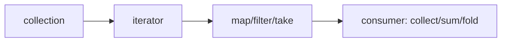

# Iterators, Collections, and Slices

> [!summary] Goal
> Write idiomatic Rust by understanding lazy iteration, slice-based borrowing, and the cost model behind standard collections.

## Table of Contents

1. [Why Iterators Matter in Rust](#why-iterators-matter-in-rust)
2. [Slices](#slices)
3. [Iterator Model](#iterator-model)
4. [Ownership and Iterator Variants](#ownership-and-iterator-variants)
5. [Core Collections](#core-collections)
6. [Common Patterns](#common-patterns)
7. [Pitfalls](#pitfalls)

---

## Why Iterators Matter in Rust

Rust iteration is not just syntax sugar. It is a central abstraction for:
- composable traversal
- lazy transformation
- safe borrowing during iteration
- zero-cost abstraction over loops in optimized builds

---

## Slices

### `&[T]`

A slice is a borrowed view into contiguous elements.

```rust
let xs = vec![10, 20, 30, 40];
let sub: &[i32] = &xs[1..3];
```

### `&str`

A string slice is a borrowed view of UTF-8 bytes.

```rust
let name = String::from("rust");
let prefix: &str = &name[..2];
```

### Memory intuition

```mermaid
flowchart LR
    A[Vec<T> owner] --> B[heap buffer]
    C[&[T] slice] --> D[start pointer + length]
    D --> B
```

Why slices matter:
- let APIs borrow without taking ownership
- avoid copying
- make “view into data” explicit

---

## Iterator Model

Iterators are lazy until consumed.

```rust
let xs = vec![1, 2, 3];
let ys: Vec<_> = xs.iter().map(|x| x * 2).collect();
```

### Important categories

- **adapters**: transform an iterator (`map`, `filter`, `take`)
- **consumers**: finish iteration (`collect`, `sum`, `count`, `fold`)



### Why this matters

Rust code often reads declaratively but still compiles to tight loops.

---

## Ownership and Iterator Variants

### `iter()`

Yields `&T`.

```rust
let xs = vec![1, 2, 3];
for x in xs.iter() {
    println!("{x}");
}
```

### `iter_mut()`

Yields `&mut T`.

```rust
let mut xs = vec![1, 2, 3];
for x in xs.iter_mut() {
    *x *= 2;
}
```

### `into_iter()`

Consumes the collection and yields owned values.

```rust
let xs = vec![1, 2, 3];
for x in xs.into_iter() {
    println!("{x}");
}
// xs is moved
```

This is one of the most important ownership distinctions in everyday Rust.

---

## Core Collections

### `Vec<T>`

Rust’s default growable contiguous collection.

Use it when:
- ordering matters
- append/iteration are common
- you want cache-friendly storage

### `HashMap<K, V>`

Use when keyed lookup matters.

### `HashSet<T>`

Use when membership/uniqueness matters.

### `VecDeque<T>`

Good for queue/deque patterns.

### `BTreeMap` / `BTreeSet`

Useful when sorted order/range queries matter.

---

## Common Patterns

### Transform and collect

```rust
let xs = vec![1, 2, 3, 4];
let evens: Vec<_> = xs.into_iter().filter(|x| x % 2 == 0).collect();
```

### Fold

```rust
let total = [1, 2, 3].iter().fold(0, |acc, x| acc + x);
```

### Borrowing with slices in APIs

```rust
fn average(values: &[i32]) -> f64 {
    let sum: i32 = values.iter().sum();
    sum as f64 / values.len() as f64
}
```

---

## Pitfalls

### Calling `into_iter()` accidentally

This moves the collection.

### Collecting too early

Sometimes code becomes less efficient or less clear if you materialize intermediate collections unnecessarily.

### Forgetting `&str` is UTF-8

String indexing by byte offset is not the same as character indexing.

### Reaching for `HashMap` automatically

Sometimes `Vec`, `VecDeque`, or `BTreeMap` is the better fit depending on access patterns and ordering requirements.

---

> [!question]- Interview Questions
>
> **Q: What is the difference between `iter()`, `iter_mut()`, and `into_iter()`?**
> A: `iter()` yields shared references, `iter_mut()` yields mutable references, and `into_iter()` consumes the collection and yields owned values.
>
> **Q: Why are iterators considered lazy?**
> A: Because adapter chains do not do work until a consuming operation drives them.
>
> **Q: Why are slices important in Rust APIs?**
> A: They let functions borrow views into data without taking ownership or forcing copies.

---

## Cross-Links

- [[Rust/01_Foundations/01_Ownership_and_Borrowing]]
- [[Rust/02_Core/01_Owned_vs_Borrowed_Types_StringStr_Path]]

---

## References

- [Common Collections](https://doc.rust-lang.org/book/ch08-00-common-collections.html)
- [Iterators](https://doc.rust-lang.org/book/ch13-02-iterators.html)
