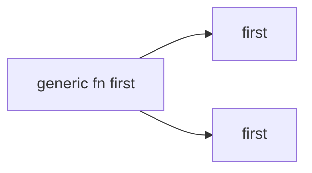
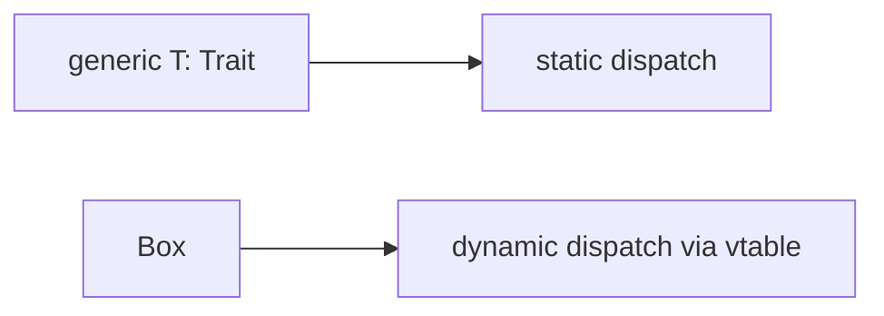

# Traits, Generics, and Lifetimes (Intro)

> [!summary] Goal
> Learn how Rust expresses reusable behavior with traits, reusable types with generics, and borrow relationships with lifetimes.

## Table of Contents

1. [Why These Three Topics Belong Together](#why-these-three-topics-belong-together)
2. [Traits](#traits)
3. [Generics](#generics)
4. [Trait Bounds](#trait-bounds)
5. [Trait Objects and Dynamic Dispatch](#trait-objects-and-dynamic-dispatch)
6. [Associated Types and Object Safety](#associated-types-and-object-safety)
7. [Coherence, Orphan Rule, and Blanket Impls](#coherence-orphan-rule-and-blanket-impls)
8. [Lifetime Intuition in Generic APIs](#lifetime-intuition-in-generic-apis)
9. [Pitfalls](#pitfalls)

---

## Why These Three Topics Belong Together

These are Rust’s main abstraction tools:
- **traits** describe behavior
- **generics** make code reusable across types
- **lifetimes** describe valid borrowing relationships

Together they let Rust express high-level APIs without losing static safety.

---

## Traits

Traits define shared behavior.

```rust
trait Storage {
    fn get(&self, key: &str) -> Option<String>;
}
```

### Implementing a trait

```rust
struct MemoryStore;

impl Storage for MemoryStore {
    fn get(&self, key: &str) -> Option<String> {
        Some(format!("value-for-{key}"))
    }
}
```

Traits are roughly analogous to interfaces, but are tightly integrated with bounds, static dispatch, and blanket implementations.

---

## Generics

Generics let one implementation work for many types.

```rust
fn first<T>(xs: &[T]) -> Option<&T> {
    xs.first()
}
```

### Why generics matter

- avoid duplication
- preserve type safety
- keep APIs expressive without using `Any` / dynamic typing style patterns

### Monomorphization intuition

Rust usually generates specialized code for concrete generic uses.



This is why generics can remain efficient without runtime polymorphism by default.

---

## Trait Bounds

Generic code often needs constraints.

```rust
fn print_item<T: std::fmt::Debug>(value: T) {
    println!("{value:?}");
}
```

This says: `T` can be any type, as long as it implements `Debug`.

### `impl Trait`

```rust
fn log_name(name: impl AsRef<str>) {
    println!("{}", name.as_ref());
}
```

Useful for ergonomic boundaries, though sometimes an explicit generic form is clearer for more complex APIs.

---

## Trait Objects and Dynamic Dispatch

Traits can be used via:
- static dispatch with generics
- dynamic dispatch with trait objects like `dyn Trait`

```rust
trait Draw {
    fn draw(&self);
}

fn render(items: &[Box<dyn Draw>]) {
    for item in items {
        item.draw();
    }
}
```



Use trait objects when heterogeneous values must share a behavior boundary.

---

## Associated Types and Object Safety

Associated types let trait implementations specify related concrete types.

```rust
trait IteratorLike {
    type Item;
    fn next(&mut self) -> Option<Self::Item>;
}
```

Object safety is the set of rules determining whether a trait can be used as `dyn Trait`.

Practical intuition:
- some traits are meant for generic use only
- some traits are suitable for runtime polymorphism

---

## Coherence, Orphan Rule, and Blanket Impls

Rust restricts implementations to keep trait resolution coherent and conflict-free.

### Orphan rule intuition

You generally cannot implement a foreign trait for a foreign type.

### Blanket impls

Broad implementations can apply to many types at once and are a major part of Rust’s ergonomic trait ecosystem.

---

## Lifetime Intuition in Generic APIs

If a function returns a reference, Rust needs to know how that output relates to the inputs.

```rust
fn pick<'a>(a: &'a str, b: &'a str) -> &'a str {
    if a.len() >= b.len() { a } else { b }
}
```

This does not say both values live forever. It says the returned reference is valid for the common valid lifetime Rust can prove.

### Common mental model

- ownership answers who frees memory
- lifetimes answer whether references stay valid long enough

---

## Pitfalls

### Adding lifetime annotations mechanically

Lifetimes should express relationships, not be added randomly until code compiles.

### Overusing trait abstraction too early

Sometimes plain concrete types are clearer until you actually need reuse or polymorphism.

### Confusing static dispatch and dynamic dispatch

Traits plus generics usually mean compile-time specialization; trait objects are a separate tool.

### Ignoring object safety when designing traits

Not every trait is naturally meant to become `dyn Trait`.

### Forgetting the orphan rule

Newtype wrappers are often the right escape hatch when coherence rules block an impl.

---

> [!question]- Interview Questions
>
> **Q: What is a trait in Rust?**
> A: A trait defines shared behavior that types can implement.
>
> **Q: Why are generics efficient in Rust?**
> A: Because Rust typically monomorphizes generic code into specialized concrete implementations.
>
> **Q: Why do lifetime annotations appear mostly around references?**
> A: Because lifetimes describe relationships between borrowed references and their validity.
>
> **Q: When would you use a trait object instead of generics?**
> A: When you need runtime polymorphism or heterogeneous collections behind a shared behavior interface.
>
> **Q: What problem does the orphan rule solve?**
> A: It prevents conflicting trait implementations across crates and keeps trait resolution coherent.

---

## Cross-Links

- [[Rust/01_Foundations/01_Ownership_and_Borrowing]]
- [[Rust/03_Advanced/01_Lifetimes_In_Depth_and_Borrow_Checker_Mental_Model]]

---

## References

- [Generic Types, Traits, and Lifetimes](https://doc.rust-lang.org/book/ch10-00-generics.html)
