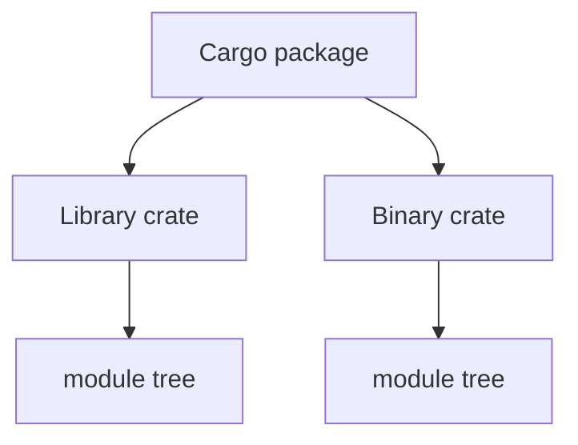

# Modules, Crates, Cargo, and Tooling

> [!summary] Goal
> Understand how Rust code is organized, built, tested, linted, documented, and published so you can work effectively in real Rust repositories instead of only writing isolated files.

## Table of Contents

1. [Package, Crate, Module: What Is What](#package-crate-module-what-is-what)
2. [Cargo Workflow](#cargo-workflow)
3. [Module System](#module-system)
4. [Dependency Management](#dependency-management)
5. [Testing and Docs](#testing-and-docs)
6. [Workspaces Features and Profiles](#workspaces-features-and-profiles)
7. [Tooling You Will Use Constantly](#tooling-you-will-use-constantly)
8. [Pitfalls](#pitfalls)

---

## Package, Crate, Module: What Is What

### Package

A Cargo package is a project described by `Cargo.toml`.

### Crate

A crate is a compilation unit.

Common forms:
- binary crate: `src/main.rs`
- library crate: `src/lib.rs`

One package can contain:
- one library crate
- one or more binaries

### Module

Modules organize code within a crate.



---

## Cargo Workflow

### Common commands

```bash
cargo new myapp
cargo build
cargo run
cargo test
cargo fmt
cargo clippy
```

### Why Cargo matters

Cargo standardizes:
- builds
- tests
- dependency resolution
- feature flags
- publishing metadata
- docs generation

That consistency is one reason Rust tooling feels cohesive compared with many language ecosystems.

---

## Module System

### Declaring modules

```rust
mod config;
mod http;
```

### Exporting items

```rust
pub struct AppConfig {
    pub port: u16,
}
```

### Visibility rule of thumb

- private by default
- `pub` only where boundary exposure is intentional

This encourages explicit API surfaces.

---

## Dependency Management

### `Cargo.toml`

Declares metadata and dependencies.

```toml
[dependencies]
serde = { version = "1", features = ["derive"] }
tokio = { version = "1", features = ["rt-multi-thread", "macros"] }
```

### `Cargo.lock`

- records exact resolved versions
- checked in for binaries/apps
- often not relied on in the same way for reusable libraries

---

## Testing and Docs

### `cargo test`

Rust testing typically includes unit tests, integration tests, and doc tests.

### `cargo doc`

Rustdoc is a normal part of the workflow, and examples in documentation can be compiled/tested.

---

## Workspaces Features and Profiles

### Workspaces

Useful when one repo contains multiple related crates.

### Features

Cargo features expose optional capability/dependency switches.

### Profiles

Build profiles such as `dev` and `release` affect optimization/debug tradeoffs.

---

## Tooling You Will Use Constantly

### `cargo fmt`

Formatting via `rustfmt`.

### `cargo clippy`

Linting and idiom guidance.

### `cargo test`

Unit and integration testing.

### `cargo doc`

Generate documentation from code and doc comments.

### Other common tools

- `cargo bench`
- `cargo expand`
- `cargo audit`
- `cargo deny`

### Why this matters

Rust teams usually lean heavily on tooling. Good Rust development is not just about writing code; it is about using the compiler and toolchain as active design feedback.

---

## Pitfalls

### Overexposing internals with `pub`

This weakens crate boundaries.

### Ignoring Clippy warnings blindly

Not every lint must be followed mechanically, but many reveal genuinely idiomatic improvements.

### Treating Cargo as only a build command

Cargo is the center of Rust workflow, not just a compiler wrapper.

---

> [!question]- Interview Questions
>
> **Q: What is the difference between a package, crate, and module?**
> A: A package is a Cargo project, a crate is a compilation unit, and modules organize code inside a crate.
>
> **Q: Why is Cargo considered such a strength of Rust?**
> A: It unifies builds, tests, dependencies, formatting, linting, and docs into one consistent workflow.
>
> **Q: Why are doc tests valuable in Rust?**
> A: Because documentation examples can be compiled and tested, which keeps docs closer to real behavior.

---

## Cross-Links

- [[Rust/02_Core/04_Async_Await_Tokio_Basics]]
- [[Rust/04_Playbooks/04_Production_Readiness_Checklist]]

---

## References

- [Cargo Book](https://doc.rust-lang.org/cargo/)
- [Managing Growing Projects with Packages, Crates, and Modules](https://doc.rust-lang.org/book/ch07-00-managing-growing-projects-with-packages-crates-and-modules.html)
