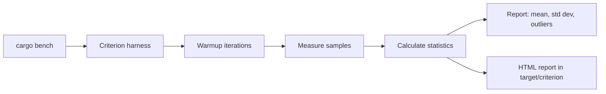

# Testing in Rust

> [!summary] Goal
> Write tests that are part of Rust's compilation model: unit tests, integration tests, doc tests, benchmarks, and property-based testing — all integrated with `cargo test`.

## Table of Contents

1. [Why Testing Feels Different in Rust](#why-testing-feels-different-in-rust)
2. [Unit Tests](#unit-tests)
3. [Integration Tests](#integration-tests)
4. [Doc Tests](#doc-tests)
5. [Assertions and Matchers](#assertions-and-matchers)
6. [Test Organization](#test-organization)
7. [Benchmark Tests](#benchmark-tests)
8. [Property-Based Testing](#property-based-testing)
9. [Mocking Patterns](#mocking-patterns)
10. [Testing Async Code](#testing-async-code)
11. [Pitfalls](#pitfalls)

---

## Why Testing Feels Different in Rust

Rust bakes testing into the language toolchain. Tests are first-class citizens, not an afterthought.

```mermaid
flowchart LR
    A[Source code] --> B[`cargo test`]
    B --> C[Compile with #[cfg(test)]]
    B --> D[Run unit tests in parallel]
    B --> E[Run integration tests]
    B --> F[Run doc tests]
    B --> G[Run benches]
    C --> H[Test-only code excluded from release builds]
```

> [!tip] Definition
> **`#[cfg(test)]`**: a conditional compilation attribute that includes the annotated module only when compiling for tests. This means test code adds zero overhead to release builds.

---

## Unit Tests

Unit tests live alongside your source code, inside `#[cfg(test)]` modules:

```rust
// src/math.rs
pub fn add(a: i32, b: i32) -> i32 {
    a + b
}

#[cfg(test)]
mod tests {
    use super::*;

    #[test]
    fn test_add() {
        assert_eq!(add(2, 3), 5);
    }

    #[test]
    fn test_add_negative() {
        assert_eq!(add(-1, 1), 0);
    }
}
```

### Testing private functions

Because unit tests are in the same module, they can test private functions directly:

```rust
// Private helper — tested through unit tests
fn internal_parse(input: &str) -> Option<i32> {
    input.trim().parse().ok()
}

#[cfg(test)]
mod tests {
    use super::*;

    #[test]
    fn test_internal_parse() {
        assert_eq!(internal_parse(" 42 "), Some(42));
        assert_eq!(internal_parse("abc"), None);
    }
}
```

### The `#[test]` attribute

```rust
#[test]                          // marks this function as a test
fn it_works() {
    assert!(true);
}

#[test]
#[ignore]                        // skip this test (run with `--ignored`)
fn expensive_test() {
    // slow computation
}

#[test]
#[should_panic(expected = "divide by zero")]  // test must panic
fn test_divide_by_zero() {
    divide(10, 0);
}
```

---

## Integration Tests

Integration tests live in the `tests/` directory at the crate root. Each file is compiled as a separate crate.

```
my-crate/
├── Cargo.toml
├── src/
│   └── lib.rs
└── tests/
    ├── api_tests.rs
    └── e2e_tests.rs
```

```rust
// tests/api_tests.rs
use my_crate;  // integration tests can only access public API

#[test]
fn test_public_function() {
    assert!(my_crate::do_something());
}

#[test]
fn test_end_to_end() {
    let result = my_crate::process("input data");
    assert!(result.is_ok());
}
```

### Integration tests with common helpers

Place shared setup code in `tests/common/mod.rs` (rust treats this as a module, not a test file):

```rust
// tests/common/mod.rs
pub fn setup_test_db() -> TestDb {
    TestDb::new()
}
```

```rust
// tests/api_tests.rs
mod common;  // imports common module

#[test]
fn test_with_db() {
    let db = common::setup_test_db();
    // test using db
}
```

### What integration tests cannot do

- Cannot test private functions or non-`pub` types
- Each test file is its own crate — no shared state between files

---

## Doc Tests

Documentation examples are executable tests:

```rust
/// Adds two numbers.
///
/// ```
/// use my_crate::add;
/// assert_eq!(add(2, 3), 5);
/// ```
pub fn add(a: i32, b: i32) -> i32 {
    a + b
}
```

Run with `cargo test` — doc tests are included automatically.

### Hiding lines from docs (but still running them)

```rust
/// ```
/// # // The # hides the line from rendered docs, but it still compiles
/// # use my_crate::setup;
/// let data = setup();
/// assert!(data.is_valid());
/// ```
```

### Failing doc tests for error cases

```rust
/// ```should_panic
/// assert_eq!(1 + 1, 3);  // this test expects failure
/// ```
```

```rust
/// ```compile_fail
/// let x: i32 = "hello";  // this test must fail to compile
/// ```
```

### Doc test benefits

- Documentation examples are always up to date
- Users can copy-paste examples knowing they work
- Every public API function should ideally have a doc test

---

## Assertions and Matchers

### Standard assertions

```rust
assert!(condition);
assert!(condition, "custom message: {value}");  // with format args

assert_eq!(expected, actual);
assert_ne!(value, unexpected);

// Floating point comparison with epsilon:
assert!((a - b).abs() < 1e-6);
```

### `should_panic`

```rust
#[test]
#[should_panic(expected = "index out of bounds")]
fn test_out_of_bounds() {
    let v = vec![1, 2, 3];
    v[100];  // panics
}
```

### `assert_matches!` from the `matches` crate

```toml
[dependencies]
matches = "0.1"
```

```rust
use matches::assert_matches;

#[test]
fn test_match() {
    let result = process();
    assert_matches!(result, Ok(value) if value > 0);
}
```

### Custom failure messages

```rust
#[test]
fn test_user() {
    let user = create_user("alice");
    assert!(
        user.is_active(),
        "Expected user '{}' to be active, but was inactive",
        user.name(),
    );
}
```

---

## Test Organization

### Grouping with modules

```rust
#[cfg(test)]
mod tests {
    use super::*;

    mod math_tests {
        use super::*;

        #[test]
        fn test_add() {}
        #[test]
        fn test_subtract() {}
    }

    mod string_tests {
        use super::*;

        #[test]
        fn test_trim() {}
    }
}
```

### Test fixtures

```rust
#[cfg(test)]
mod tests {
    use super::*;

    fn setup_user(name: &str) -> User {
        User::new(name, "active")
    }

    #[test]
    fn test_user_active() {
        let user = setup_user("alice");
        assert!(user.is_active());
    }

    #[test]
    fn test_user_deactivate() {
        let mut user = setup_user("bob");
        user.deactivate();
        assert!(!user.is_active());
    }
}
```

### Running specific tests

```bash
cargo test                    # run all tests
cargo test test_add           # run tests whose name contains "test_add"
cargo test -- --ignored       # run only ignored tests
cargo test --test api_tests   # run only integration tests in tests/api_tests.rs
cargo test --doc              # run only doc tests
cargo test -- --nocapture     # show println! output
cargo test -- --test-threads=1  # run tests sequentially (useful for shared state)
```

---

## Benchmark Tests

### Using Criterion (stable Rust)

```toml
[dev-dependencies]
criterion = { version = "0.5", features = ["html_reports"] }

[[bench]]
name = "my_bench"
harness = false
```

```rust
// benches/my_bench.rs
use criterion::{black_box, criterion_group, criterion_main, Criterion};

fn fibonacci(n: u64) -> u64 {
    match n {
        0 => 0,
        1 => 1,
        n => fibonacci(n - 1) + fibonacci(n - 2),
    }
}

fn bench_fib(c: &mut Criterion) {
    c.bench_function("fib 20", |b| b.iter(|| fibonacci(black_box(20))));
}

criterion_group!(benches, bench_fib);
criterion_main!(benches);
```

Run with: `cargo bench`



### Microbenchmarks with `std::time::Instant`

For quick manual benchmarks without criterion:

```rust
fn simple_bench<F>(f: F, iterations: u32)
where
    F: Fn(),
{
    let start = std::time::Instant::now();
    for _ in 0..iterations {
        f();
    }
    let elapsed = start.elapsed();
    println!("Average: {:?}", elapsed / iterations);
}
```

---

## Property-Based Testing

Instead of writing specific inputs and expected outputs, you write *invariants* and let the framework find inputs.

```toml
[dev-dependencies]
proptest = "1"
```

```rust
use proptest::prelude::*;

// Property: reversing a list twice gives back the original
proptest! {
    #[test]
    fn reverse_twice_is_identity(mut xs: Vec<i32>) {
        xs.reverse();
        xs.reverse();
        assert_eq!(xs, xs.clone());  // well, that's tautological. Let me fix:
    }
}

// Better property:
proptest! {
    #[test]
    fn sort_then_sort_is_idempotent(mut xs: Vec<i32>) {
        xs.sort();
        let sorted = xs.clone();
        xs.sort();
        assert_eq!(xs, sorted);
    }
}
```

### Strategies

```rust
proptest! {
    #[test]
    fn parse_never_crashes(s in ".*") {  // any string
        let _ = my_parser::parse(&s);
    }

    #[test]
    fn adding_commutes(a in 0i32..1000, b in 0i32..1000) {
        assert_eq!(a + b, b + a);
    }
}
```

### Shrinking

When proptest finds a failing input, it tries to *shrink* it to the smallest failing case:

```
Test failed: assertion failed: parsed.len() > 0
minimal failing input: ""
shrinks to: ""
```

---

## Mocking Patterns

Rust uses trait-based mocking — define a trait, create a mock implementation for tests.

### Manual mocking

```rust
pub trait Repository {
    fn find_user(&self, id: u64) -> Option<User>;
}

// Real implementation
struct DbRepository { /* connection pool */ }
impl Repository for DbRepository { /* ... */ }

// Mock for tests
struct MockRepository {
    users: HashMap<u64, User>,
}

impl Repository for MockRepository {
    fn find_user(&self, id: u64) -> Option<User> {
        self.users.get(&id).cloned()
    }
}

fn process_user<R: Repository>(repo: &R, id: u64) -> String {
    repo.find_user(id)
        .map(|u| u.name)
        .unwrap_or_else(|| "unknown".into())
}

#[test]
fn test_process_user() {
    let mut mock = MockRepository { users: HashMap::new() };
    mock.users.insert(1, User { id: 1, name: "Alice".into() });

    assert_eq!(process_user(&mock, 1), "Alice");
    assert_eq!(process_user(&mock, 99), "unknown");
}
```

### Using `mockall`

```toml
[dev-dependencies]
mockall = "0.12"
```

```rust
use mockall::automock;

#[automock]
pub trait Repository {
    fn find_user(&self, id: u64) -> Option<User>;
}

#[test]
fn test_with_mockall() {
    let mut mock = MockRepository::new();
    mock.expect_find_user()
        .with(predicate::eq(1u64))
        .returning(|_| Some(User { id: 1, name: "Alice".into() }));

    mock.expect_find_user()
        .with(predicate::eq(99u64))
        .returning(|_| None);

    assert_eq!(process_user(&mock, 1), "Alice");
    assert_eq!(process_user(&mock, 99), "unknown");
}
```

---

## Testing Async Code

```toml
[dev-dependencies]
tokio = { version = "1", features = ["rt", "macros"] }
```

```rust
#[tokio::test]
async fn test_async_function() {
    let result = async_add(2, 3).await;
    assert_eq!(result, 5);
}

#[tokio::test]
async fn test_timeout() {
    let result = tokio::time::timeout(
        std::time::Duration::from_millis(100),
        slow_function(),
    ).await;
    assert!(result.is_err());  // timed out
}
```

### Testing with `#[tokio::test]` flavors

```rust
#[tokio::test]                          // single-threaded runtime
async fn test_single_thread() {}

#[tokio::test(flavor = "multi_thread")]  // multi-threaded runtime
async fn test_multi_thread() {}
```

---

## Pitfalls

### Tests passing in isolation but failing together

Shared state (environment variables, file system, global statics) causes flaky tests:

```rust
// BAD — depends on environment variable
#[test]
fn test_config() {
    std::env::set_var("MODE", "test");
    assert_eq!(get_config().mode, "test");
    // Other tests may see MODE=test too!
}
```

**Fix**: Reset state in setup or use scoped values:

```rust
struct EnvGuard;
impl Drop for EnvGuard {
    fn drop(&mut self) { std::env::remove_var("MODE"); }
}

#[test]
fn test_config() {
    let _guard = EnvGuard;
    std::env::set_var("MODE", "test");
    assert_eq!(get_config().mode, "test");
}
```

### Over-testing internals

```rust
// BAD — tests how, not what
#[test]
fn test_internal_helper() {
    let result = internal_helper();
    assert_eq!(result, 42);
}

// GOOD — tests public behavior
#[test]
fn test_public_api() {
    assert_eq!(process(10), 42);
}
```

### Flaky async tests from timing

```rust
// BAD — depends on exact timing
#[tokio::test]
async fn test_race_condition() {
    tokio::time::sleep(Duration::from_millis(10)).await;
    // assertion depends on sleep being "enough"
}
```

**Fix**: use structured synchronization (channels, `tokio::sync::Barrier`, etc.) instead of sleeps.

### Not testing error paths

```rust
// INCOMPLETE — only tests happy path
#[test]
fn test_parse_success() {
    assert!(parse("42").is_ok());
}

// ALSO NEED
#[test]
fn test_parse_empty() { assert!(parse("").is_err()); }
#[test]
fn test_parse_overflow() { assert!(parse("9999999999999999").is_err()); }
```

---

> [!question]- Interview Questions
>
> **Q: What are the three types of tests in Rust?**
> A: Unit tests (in `#[cfg(test)]` modules alongside source), integration tests (in `tests/` directory), and doc tests (in `///` documentation comments). All are run by `cargo test`.
>
> **Q: What is the difference between unit tests and integration tests in Rust?**
> A: Unit tests live inside source files in `#[cfg(test)]` modules and can test private functions. Integration tests live in `tests/`, are compiled as separate crates, and can only test the public API.
>
> **Q: How do doc tests work?**
> A: Code blocks in `///` documentation comments are compiled and run as tests. `cargo test --doc` runs only doc tests. Use `#` to hide setup code from rendered docs, `should_panic` for error examples, `compile_fail` for code that must not compile.
>
> **Q: What is property-based testing?**
> A: You define invariants (properties) that should always hold, and the test framework generates random inputs to verify them. `proptest` is the most popular crate. It also shrinks failing inputs to minimal reproducers.
>
> **Q: How do you mock dependencies in Rust tests?**
> A: Use trait-based mocking: define a trait for the dependency, provide a mock implementation in tests. The `mockall` crate auto-generates mock implementations with method expectation APIs.

---

## Cross-Links

- [[Rust/01_Foundations/06_Modules_Crates_Cargo_and_Tooling]] for cargo test, cargo bench configuration
- [[Rust/03_Advanced/03_Performance_Profiling_and_Allocation]] for benchmark-driven optimization
- [[Rust/02_Core/04_Async_Await_Tokio_Basics]] for testing async code with `#[tokio::test]`
- [[Rust/02_Core/06_Closures_and_Fn_Traits]] for closures in test assertions and mock setups

---

## References

- [The Rust Book: Testing](https://doc.rust-lang.org/book/ch11-00-testing.html)
- [Rust by Example: Testing](https://doc.rust-lang.org/rust-by-example/testing.html)
- [cargo test documentation](https://doc.rust-lang.org/cargo/commands/cargo-test.html)
- [Criterion.rs](https://docs.rs/criterion/)
- [proptest](https://docs.rs/proptest/)
- [mockall](https://docs.rs/mockall/)
