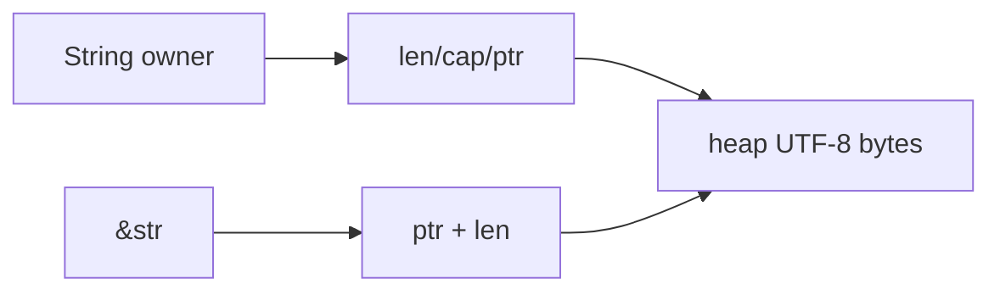

# Owned vs Borrowed Types: `String`/`&str`, `Path`/`PathBuf`

> [!summary] Goal
> Design Rust APIs that communicate ownership clearly and avoid unnecessary allocation by choosing borrowed and owned types intentionally.

## Why This Topic Matters

Many real Rust API decisions reduce to one question:

**Does this function need to own the data, or only inspect it temporarily?**

If you answer that correctly, APIs become:
- more ergonomic
- more efficient
- easier to compose

---

## `String` vs `&str`

### `String`

- owned
- growable
- heap allocated

### `&str`

- borrowed string slice
- non-owning view into UTF-8 bytes



### Good API default

Prefer accepting `&str` when you only need read-only access.

```rust
fn greet(name: &str) {
    println!("hi {name}");
}
```

This accepts:
- string literals
- `&String`
- existing string slices

### When to take `String`

Take `String` when you need to:
- store the value long term
- mutate/extend the owned string
- consume ownership as part of API semantics

---

## `PathBuf` vs `&Path`

### `PathBuf`

- owned path buffer

### `&Path`

- borrowed path view

The same ownership rule applies here as with strings.

### Flexible boundary pattern

```rust
use std::path::Path;

fn read_config(path: impl AsRef<Path>) {
    let path = path.as_ref();
    println!("reading {}", path.display());
}
```

This accepts:
- `&Path`
- `PathBuf`
- `&str`
- `String`

---

## Design Guidance

### Accept borrowed types by default

Examples:
- `&str`
- `&Path`
- `&[T]`

### Return owned values when the function creates data

Examples:
- `String`
- `PathBuf`
- `Vec<T>`

This keeps ownership simple.

---

## Pitfalls

### Taking ownership unnecessarily

If the function only reads the input, taking `String` or `PathBuf` can force needless allocations or moves.

### Returning borrowed data tied to short-lived locals

If the data is produced inside the function, returning ownership is usually the right answer.

---

> [!question]- Interview Questions
>
> **Q: Why is `&str` often preferred as a function parameter?**
> A: Because it is flexible, non-owning, and accepts both owned strings and borrowed string slices.
>
> **Q: When should a function take `String` instead of `&str`?**
> A: When it needs to own, store, or consume the string.

---

## Cross-Links

- [[Rust/01_Foundations/01_Ownership_and_Borrowing]]
- [[Rust/01_Foundations/04_Iterators_Collections_and_Slices]]

---

## References

- [Strings](https://doc.rust-lang.org/book/ch08-02-strings.html)
- [std::path](https://doc.rust-lang.org/std/path/)
