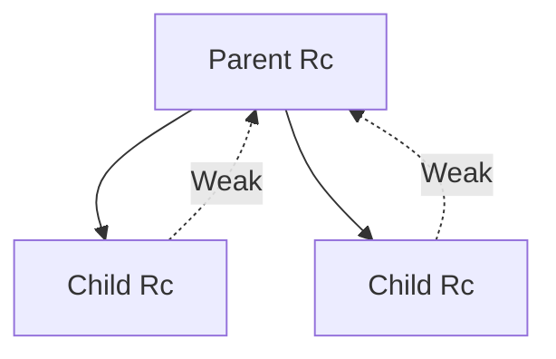

# Smart Pointers: `Box`, `Rc`, `Arc`

> [!summary] Goal
> Understand when plain ownership is enough and when you need heap indirection, shared ownership, or thread-safe reference counting.

## Table of Contents

1. [Why Smart Pointers Exist](#why-smart-pointers-exist)
2. [`Box<T>`](#boxt)
3. [`Rc<T>`](#rct)
4. [`Arc<T>`](#arct)
5. [Interior Mutability: `Cell<T>` and `RefCell<T>`](#interior-mutability-cellt-and-refcellt)
6. [`Weak<T>` and Cycle Breaking](#weakt-and-cycle-breaking)
7. [Choosing Between Them](#choosing-between-them)
8. [Common Design Patterns](#common-design-patterns)
9. [Pitfalls](#pitfalls)

## Why Smart Pointers Exist

Rust’s basic ownership model handles many cases directly, but some patterns need extra structure:
- recursive types
- shared ownership
- shared ownership across threads

---

## `Box<T>`

`Box<T>` owns a value on the heap.

Use it when:
- you need heap indirection
- you have recursive types
- you want to move a large value without copying the entire payload by value semantics

```rust
enum List {
    Cons(i32, Box<List>),
    Nil,
}
```

### Memory intuition


---

## `Rc<T>`

`Rc<T>` provides shared ownership via non-atomic reference counting.

Use it when:
- multiple parts of one thread need to own the same value
- no cross-thread sharing is required

```rust
use std::rc::Rc;

let shared = Rc::new(String::from("hello"));
let a = Rc::clone(&shared);
let b = Rc::clone(&shared);
```

Why it is single-threaded only:
- reference count updates are not atomic

---

## `Arc<T>`

`Arc<T>` is atomically reference counted and safe to share across threads.

```rust
use std::sync::Arc;

let shared = Arc::new(String::from("hello"));
```

Use it when:
- multiple threads need ownership of the same immutable value
- or when paired with synchronization for shared mutation

```rust
use std::sync::{Arc, Mutex};

let counter = Arc::new(Mutex::new(0));
```

---

## Interior Mutability: `Cell<T>` and `RefCell<T>`

Interior mutability means a type can mutate internal state even when accessed through an immutable outer reference.

This is useful when:
- the outer API should remain shared or immutable
- mutation is conceptually local implementation detail
- compile-time borrowing is too restrictive for the intended pattern

### `Cell<T>`

`Cell<T>` is for small `Copy`-friendly values where you want set/get style replacement, not borrowed references into the inside.

```rust
use std::cell::Cell;

let count = Cell::new(0);
count.set(count.get() + 1);
```

### `RefCell<T>`

`RefCell<T>` enforces Rust’s borrowing rules at runtime instead of compile time.

```rust
use std::cell::RefCell;

let value = RefCell::new(String::from("hi"));
value.borrow_mut().push('!');
```

If you violate the borrow rules, `RefCell<T>` panics.


### Mental model

- `Cell<T>`: replace values directly
- `RefCell<T>`: borrow dynamically in one thread
- `Mutex<T>`: borrow dynamically across threads with locking

---

## `Weak<T>` and Cycle Breaking

Reference counting alone does not reclaim cycles.

```rust
use std::rc::{Rc, Weak};
use std::cell::RefCell;

struct Node {
    parent: RefCell<Weak<Node>>,
    children: RefCell<Vec<Rc<Node>>>,
}
```

Typical pattern:
- strong `Rc`/`Arc` edges represent ownership
- `Weak` edges represent non-owning back-references



`Weak<T>` does not keep the allocation alive on its own. You must `upgrade()` it to get an `Rc<T>`/`Arc<T>` if the value still exists.

---

## Choosing Between Them

| Type | Ownership | Thread-safe | Typical use |
|------|-----------|-------------|-------------|
| `Box<T>` | single owner | N/A | heap indirection |
| `Rc<T>` | shared | no | shared graph in one thread |
| `Arc<T>` | shared | yes | shared data across threads |
| `Cell<T>` | single-thread interior mutability | no | small copyable state |
| `RefCell<T>` | single-thread interior mutability | no | runtime borrow checks |
| `Weak<T>` | non-owning reference | depends on `Rc`/`Arc` | break cycles / caches |

---

## Common Design Patterns

### Recursive ownership

Use `Box<T>` when the data structure is tree-shaped and has one owner per child.

### Shared immutable graph

Use `Rc<T>` when many nodes need shared read access in one thread.

### Shared mutable graph in one thread

Use `Rc<RefCell<T>>` when structure sharing is necessary and local mutation is unavoidable.

### Shared state across threads

Use `Arc<T>` for shared immutable state, or `Arc<Mutex<T>>` / `Arc<RwLock<T>>` when mutation must be synchronized.

### Parent-child trees with back-references

Use strong references downward and `Weak<T>` upward.

---

## Pitfalls

### Using `Rc<T>` across threads

This is rejected by Rust and is conceptually unsafe.

### Reaching for `Arc<Mutex<T>>` too quickly

Sometimes message passing, ownership transfer, or immutable snapshots are cleaner.

### Ignoring cycles

Reference counting does not automatically solve cyclic ownership leaks.

### Overusing `Rc<RefCell<T>>`

This is sometimes necessary, but it can also mean the data model has not been simplified enough.

### Treating interior mutability like free mutability

`RefCell<T>` moves borrow checking to runtime; it does not remove the need for clear ownership reasoning.

### Assuming `Arc<T>` makes mutation safe by itself

`Arc<T>` gives shared ownership, not automatic synchronized mutation.

---

> [!question]- Interview Questions
>
> **Q: When should you use `Box<T>`?**
> A: When you need heap indirection, especially for recursive types or explicit ownership of heap data.
>
> **Q: What is the difference between `Rc<T>` and `Arc<T>`?**
> A: `Rc<T>` is single-threaded reference counting; `Arc<T>` uses atomic reference counting and is safe across threads.
>
> **Q: When would you choose `RefCell<T>`?**
> A: When single-threaded code needs interior mutability and compile-time borrowing is too restrictive for the design.
>
> **Q: Why does `Weak<T>` exist?**
> A: To model non-owning relationships and avoid keeping reference-counted cycles alive forever.

---

## Cross-Links

- [[Rust/01_Foundations/01_Ownership_and_Borrowing]]
- [[Rust/02_Core/03_Concurrency_Threads_Mutex_Channels]]
- [[Rust/03_Advanced/01_Lifetimes_In_Depth_and_Borrow_Checker_Mental_Model]]

---

## References

- [Smart Pointers](https://doc.rust-lang.org/book/ch15-00-smart-pointers.html)
