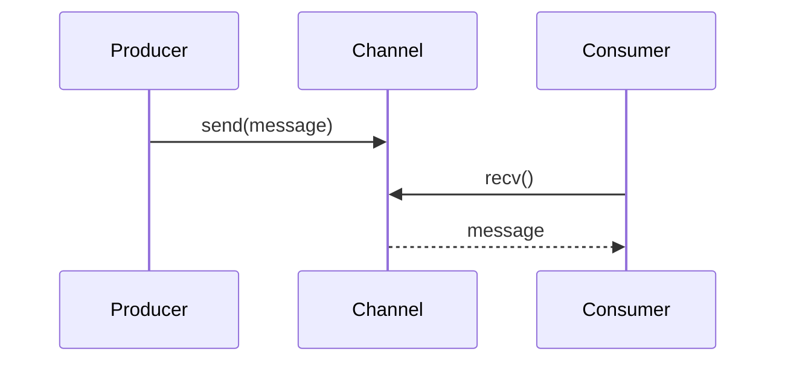
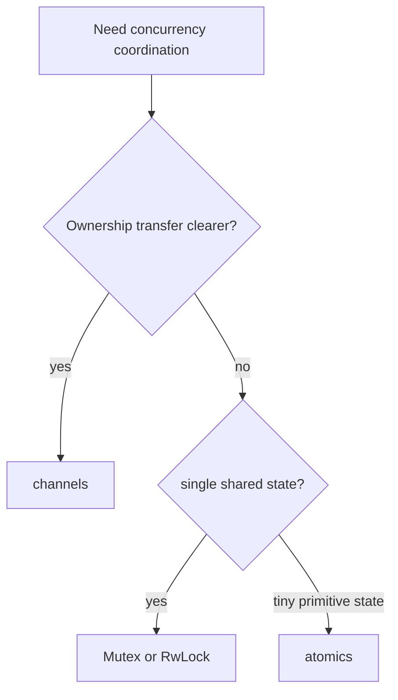

# Concurrency: Threads, Mutex, Channels

> [!summary] Goal
> Use Rust’s type system and synchronization primitives to build concurrent programs that avoid data races and make sharing explicit.

## Table of Contents

1. [Why Rust Concurrency Feels Different](#why-rust-concurrency-feels-different)
2. [Threads](#threads)
3. [Mutex](#mutex)
4. [`RwLock<T>`](#rwlockt)
5. [`Condvar`](#condvar)
6. [Channels](#channels)
7. [Atomics and Memory Ordering](#atomics-and-memory-ordering)
8. [Scoped Threads](#scoped-threads)
9. [Design Guidance](#design-guidance)
10. [Pitfalls](#pitfalls)

## Why Rust Concurrency Feels Different

Rust tries to make unsound sharing impossible by default.

Two traits are central:
- `Send`: a value can be transferred to another thread
- `Sync`: a value can be referenced safely from multiple threads

This is why many concurrency design mistakes are caught at compile time instead of becoming runtime heisenbugs.

---

## Threads

```rust
let h = std::thread::spawn(|| {
    1 + 1
});
let v = h.join().unwrap();
```

### Why ownership matters here

Spawned closures often need `'static` ownership or safe sharing because the new thread may outlive the current stack frame.

---

## Mutex

`Mutex<T>` provides exclusive access to shared mutable state.

```rust
use std::sync::{Arc, Mutex};

let v = Arc::new(Mutex::new(0));
```

Typical usage:

```rust
let mut guard = v.lock().unwrap();
*guard += 1;
```

### Important concept

The guard unlocks automatically when dropped.

---

## `RwLock<T>`

`RwLock<T>` allows multiple readers or one writer.

```rust
use std::sync::RwLock;

let config = RwLock::new(String::from("v1"));
```

Use it when:
- reads are much more common than writes
- the shared model is still naturally one object

Important caveat:
- it is not automatically faster than `Mutex<T>`
- write-heavy workloads can make it worse

---

## `Condvar`

A condition variable lets threads wait for a state change while paired with a mutex-protected condition.

```rust
use std::sync::{Arc, Condvar, Mutex};

let pair = Arc::new((Mutex::new(false), Condvar::new()));
```

Typical pattern:
- lock mutex
- check predicate in a loop
- wait on `Condvar`
- re-check after wakeup

Why a loop matters:
- wakeups can be spurious
- another thread may consume the condition first

---

## Channels

Channels support message passing instead of shared mutable-state coordination.

```rust
use std::sync::mpsc;

let (tx, rx) = mpsc::channel();
tx.send(String::from("hello")).unwrap();
let msg = rx.recv().unwrap();
```



Why channels matter:
- explicit ownership transfer
- fewer shared-state hazards
- natural fit for work pipelines

---

## Atomics and Memory Ordering

Atomics are for low-level lock-free coordination on primitive values.

```rust
use std::sync::atomic::{AtomicBool, Ordering};

let shutdown = AtomicBool::new(false);
shutdown.store(true, Ordering::Release);
let seen = shutdown.load(Ordering::Acquire);
```

Common orderings:
- `Relaxed`: atomicity only
- `Acquire` / `Release`: synchronize visibility across threads
- `SeqCst`: strongest and easiest to reason about globally

Rule of thumb:
- use atomics only when the synchronization story is genuinely simple
- otherwise prefer higher-level primitives first

---

## Scoped Threads

Scoped threads let child threads borrow from the parent stack safely because the scope guarantees joins before exit.

```rust
let mut values = vec![1, 2, 3];

std::thread::scope(|s| {
    s.spawn(|| {
        println!("{}", values.len());
    });
});
```

This avoids forcing `'static` in cases where structured thread lifetimes are enough.

---

## Design Guidance

Prefer message passing when:
- work naturally flows between stages
- ownership transfer is clearer than shared mutation

Prefer `Arc<Mutex<T>>` when:
- one shared mutable state object is the natural model
- lock scope is small and understandable

Prefer `RwLock<T>` when:
- reads dominate and critical sections are simple

Prefer atomics when:
- the shared state is tiny and the memory-ordering story is intentionally designed



---

## Atomics and Memory Ordering Deep Dive

> [!info] Atomics in Rust
> `std::sync::atomic` provides lock-free primitives for integer and boolean types. Unlike `Mutex`, atomics don't block—they use CPU instructions (`CMPXCHG`, `XADD` on x86). The Rust compiler guarantees atomic reads/writes are not torn, but to guarantee ordering between threads, you must choose a memory ordering.

### Available atomic types

```rust
use std::sync::atomic::{
    AtomicBool,      // Boolean flag
    AtomicI8,        // Signed 8-bit
    AtomicI16,       // Signed 16-bit
    AtomicI32,       // Signed 32-bit
    AtomicI64,       // Signed 64-bit
    AtomicIsize,     // Signed pointer-sized
    AtomicU8,        // Unsigned 8-bit
    AtomicU16,       // Unsigned 16-bit
    AtomicU32,       // Unsigned 32-bit
    AtomicU64,       // Unsigned 64-bit
    AtomicUsize,     // Unsigned pointer-sized
};
```

### The five memory orderings

```rust
use std::sync::atomic::Ordering;

// Relaxed — fastest, NO ordering guarantees
// Use for: counters where eventual consistency is fine
Ordering::Relaxed;

// Release — all prior writes are visible to an Acquire read
// Use for: publishing data (the store side)
Ordering::Release;

// Acquire — subsequent reads see data published before a Release store
// Use for: reading published data (the load side)
Ordering::Acquire;

// AcqRel — Acquire + Release (for read-modify-write operations)
// Use for: fetch_add with ordering for both sides
Ordering::AcqRel;

// SeqCst — Sequential Consistency (strongest, most expensive)
// All SeqCst ops appear in a single global order visible to ALL threads
// Use for: when you need total ordering (or when unsure — default)
Ordering::SeqCst;
```

### When each ordering is correct

```rust
use std::sync::atomic::{AtomicBool, AtomicUsize, Ordering};

// ✅ Relaxed: simple counter (no data published)
struct Metrics {
    requests: AtomicUsize,
}

impl Metrics {
    fn record_request(&self) {
        self.requests.fetch_add(1, Ordering::Relaxed);
        // Relaxed is fine — we only need the approximate count
    }
}

// ✅ Release/Acquire: flag with data
struct DataPublisher {
    ready: AtomicBool,
    data: std::cell::UnsafeCell<[u8; 1024]>,
}

unsafe impl Sync for DataPublisher {}

impl DataPublisher {
    fn publish(&self, bytes: &[u8]) {
        // 1. Write the data
        unsafe { (*self.data.get()).copy_from_slice(bytes); }
        // 2. Release barrier: all prior writes are visible to Acquire readers
        self.ready.store(true, Ordering::Release);
    }

    fn try_read(&self) -> Option<&[u8; 1024]> {
        if self.ready.load(Ordering::Acquire) {
            // Acquire: all writes before the Release store are visible here
            Some(unsafe { &*self.data.get() })
        } else {
            None
        }
    }
}

// ✅ SeqCst: when multiple atomics must agree on global order
// (rare — most code should use Release/Acquire and only reach for
//  SeqCst when proven necessary via careful reasoning)
```

### CPU mapping: x86 vs ARM

```text
On x86 (TSO — Total Store Order):
  - Relaxed:    no extra cost (plain mov)
  - Release:    no extra cost (x86 stores already have release semantics)
  - Acquire:    no extra cost (x86 loads already have acquire semantics)
  - SeqCst:    store is 'mov + mfence' (or 'lock xchg') ~30-50ns

On ARM (weak memory model):
  - Relaxed:    no extra cost (ldr/str)
  - Release:   dmb ishst (~20-30ns)
  - Acquire:   dmb ish (~20-30ns)
  - SeqCst:    dmb ish full barrier (~50-100ns)

Key insight: Relaxed on x86 is "free" (same cost as non-atomic).
On ARM, even Acquire/Release cost ~20-30ns due to explicit DMB barriers.
SeqCst is significantly more expensive on ALL architectures.
```

### CAS operations: `compare_exchange` vs `compare_exchange_weak`

```rust
use std::sync::atomic::{AtomicU64, Ordering};

let counter = AtomicU64::new(0);

// Strong CAS: guarantees "compare and set" succeeds OR fails with no spurious failure
// Use for: retry loops, most application code
let old = counter.compare_exchange(0, 1, Ordering::SeqCst, Ordering::SeqCst);
match old {
    Ok(previous) => println!("Was 0, now 1 (was {previous})"),
    Err(current) => println!("CAS failed, current value is {current}"),
}

// Weak CAS: MAY fail spuriously (even if the value matches)
// Use for: spin loops where spurious failure just means retrying
// Weak CAS is faster on ARM (LL/SC) than strong CAS.
loop {
    let v = counter.load(Ordering::Relaxed);
    if counter.compare_exchange_weak(v, v + 1, Ordering::Relaxed, Ordering::Relaxed).is_ok() {
        break;
    }
}

// When to use weak vs strong:
// - Strong: most application code, non-spinning contexts
// - Weak: tight CAS loops, hot paths on ARM
```

### `fetch_update` — functional CAS loop

```rust
use std::sync::atomic::{AtomicU64, Ordering};

let counter = AtomicU64::new(0);

// fetch_update runs a closure in a CAS loop.
// The closure receives the current value; returns Ok(new_value) or Err(abort).
// This is the idiomatic way to do atomic updates.

// Increment if < 100:
let result = counter.fetch_update(
    Ordering::SeqCst,
    Ordering::SeqCst,
    |x| {
        if x < 100 {
            Some(x + 1)   // CAS: try to set x+1
        } else {
            None           // Abort: don't modify
        }
    },
);

match result {
    Ok(old) => println!("Was {old}, incremented"),
    Err(current) => println!("Not incremented, current = {current}"),
}
```

### `fence` — standalone memory barrier

```rust
use std::sync::atomic::{AtomicBool, Ordering, fence};

// fence() inserts a memory barrier without an atomic operation.
// Use in advanced patterns where you need ordering but the atomic
// itself is just a plain load/store.

let flag = AtomicBool::new(false);
let mut data: [u8; 1024] = [0; 1024];

// Thread A (writer):
data.copy_from_slice(&[1; 1024]);
fence(Ordering::Release);  // All prior writes are visible to Acquire fences
flag.store(true, Ordering::Relaxed);  // Just a flag, ordering from fence above

// Thread B (reader):
if flag.load(Ordering::Relaxed) {
    fence(Ordering::Acquire);  // Sees all writes before the Release fence
    // data is now guaranteed to be [1; 1024]
}
```

### Decision guide for atomics

```text
What do I need?                Use this ordering
─────────────────────────────────────────────────────────────
Counter (approximate count)    Relaxed
Publish data, single producer  Release (store) / Acquire (load)
Flag + associated data         Release (set) / Acquire (check)
Multiple atomics agreement     SeqCst (rare, proves necessary via proof)
RMW with ordering needs        AcqRel (for fetch_add, swap, etc.)
Sequential consistency         SeqCst (default when uncertain)
Performance-critical hot path  Relaxed + proof of correctness

When to use atomics vs Mutex:
  - Atomics: single integer/boolean, simple protocol, lock-free needed
  - Mutex: complex invariant, multiple fields, blocking acceptable
```

### Common atomic anti-patterns

```rust
// ❌ Relaxed for flag + data (may read stale data)
// ✅ Must use Release/Acquire for the flag to guarantee data visibility

// ❌ SeqCst everywhere (overkill — correct but slow on ARM)
// ✅ Use Release/Acquire for publish/consume, Relaxed for counters

// ❌ Sequential CAS in a contended loop (spins forever)
// ✅ Use fetch_update with a max-retry or fall back to Mutex

// ❌ Atomic instead of Mutex for >1 field invariant
// ✅ Multiple atomics can't be updated atomically as a group
//    If (x, y) must be consistent, use a Mutex or a single atomic reference
```

---

## Pitfalls

### Holding mutex guards too long

This increases contention and can create deadlock chains.

### Using shared mutable state when message passing is clearer

This often creates unnecessary complexity.

### Ignoring poisoning / unwrap behavior blindly

Be deliberate about how your application treats poisoned locks.

### Using atomics without a memory-ordering model

Lock-free code is not simpler just because it avoids a mutex.

### Using `RwLock<T>` for write-heavy contention

Theoretical read parallelism does not help if writers are frequent.

### Waiting on `Condvar` without a looped predicate check

Condition variables coordinate state transitions, not one-shot guarantees.

---

> [!question]- Interview Questions
>
> **Q: What do `Send` and `Sync` mean in Rust?**
> A: `Send` means a value can move across threads; `Sync` means shared references can be used safely across threads.
>
> **Q: When are channels preferable to `Mutex`?**
> A: When ownership transfer and staged message passing are clearer than shared mutable state.
>
> **Q: When should you use atomics instead of a mutex?**
> A: When the shared state is very small and the synchronization semantics are simple enough to reason about precisely.
>
> **Q: What problem do scoped threads solve?**
> A: They allow safe borrowing from parent stack data without forcing `'static` thread closures.

---

## Cross-Links

- [[Rust/02_Core/02_Smart_Pointers_Box_Rc_Arc]]
- [[Rust/02_Core/04_Async_Await_Tokio_Basics]]
- [[SystemDesign/03_Advanced/02_Backpressure_and_Load_Shedding]]

---

## References

- [Fearless Concurrency](https://doc.rust-lang.org/book/ch16-00-concurrency.html)
