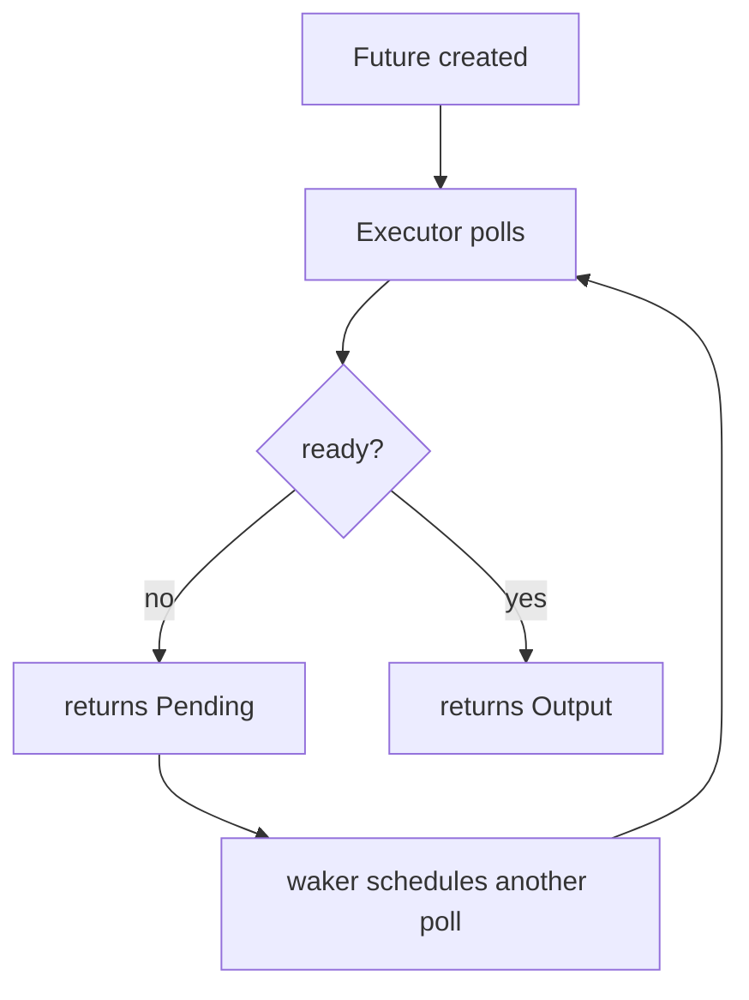
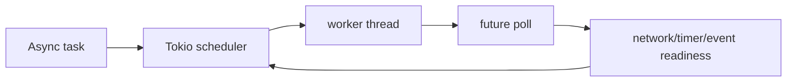
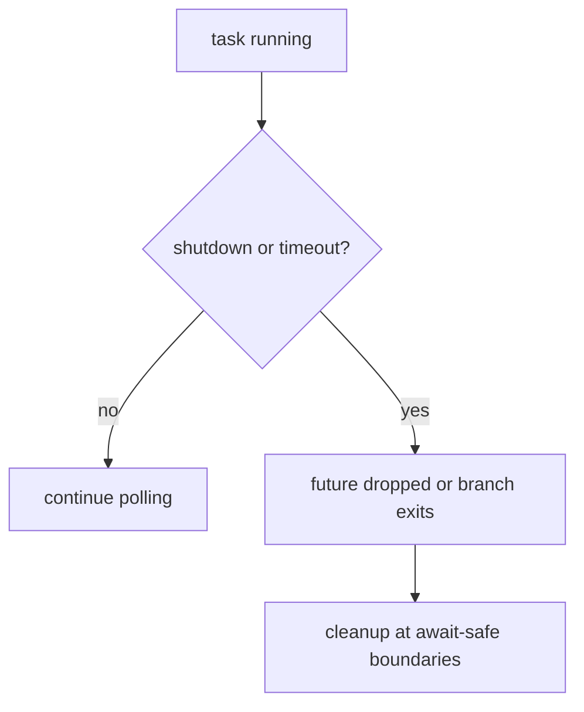

# Async/Await and Tokio (Basics)

> [!summary] Goal
> Understand async Rust as a runtime model, not just syntax: futures, polling, executors, Tokio tasks, and the operational consequences of blocking or holding resources across `.await` points.

## Table of Contents

1. [Why Async Exists](#why-async-exists)
2. [What `async fn` Really Returns](#what-async-fn-really-returns)
3. [Polling and Executors](#polling-and-executors)
4. [Tokio Runtime Model](#tokio-runtime-model)
5. [Tasks, Spawning, and Join Handles](#tasks-spawning-and-join-handles)
6. [`Send`, `'static`, and Spawn Boundaries](#send-static-and-spawn-boundaries)
7. [Coordination with `select!` and `join!`](#coordination-with-select-and-join)
8. [Blocking vs Async Work](#blocking-vs-async-work)
9. [Cancellation and Shutdown Design](#cancellation-and-shutdown-design)
10. [Pinning and Self-Referential Intuition](#pinning-and-self-referential-intuition)
11. [Streams and Backpressure](#streams-and-backpressure)
12. [Common Scenarios](#common-scenarios)
13. [Pitfalls](#pitfalls)

---

## Why Async Exists

Async is about handling many mostly-waiting operations efficiently.

Good fit:
- network servers
- HTTP clients
- message consumers
- concurrent IO-heavy services

Bad fit by itself:
- CPU-heavy work
- code that blocks threads frequently

---

## What `async fn` Really Returns

`async fn` does not execute immediately. It returns a value implementing `Future`.

```rust
async fn fetch_user() -> String {
    String::from("ada")
}
```

Conceptually similar to:

```rust
fn fetch_user() -> impl Future<Output = String> {
    async { String::from("ada") }
}
```

The body runs only when a runtime/executor polls the future.

---

## Polling and Executors

Rust futures are lazy state machines.



### Why this matters

- a future that is never polled does no work
- a runtime is responsible for scheduling progress
- `.await` means “yield until this future makes progress or completes”

---

## Tokio Runtime Model

Tokio is the dominant async runtime in Rust.

It provides:
- task scheduler
- async IO integration
- timers
- synchronization primitives for async contexts
- utilities like `spawn`, `select!`, and `timeout`

Typical entrypoint:

```rust
#[tokio::main]
async fn main() {
    println!("runtime started");
}
```



---

## Tasks, Spawning, and Join Handles

Spawn tasks for concurrent async work.

```rust
let handle = tokio::spawn(async {
    1 + 1
});

let value = handle.await.unwrap();
```

### Important note

Spawning is not free. Use it for concurrency structure, not just because a function is async.

---

## `Send`, `'static`, and Spawn Boundaries

`tokio::spawn` usually requires the spawned future to be `Send + 'static`.

Why:
- the runtime may move the task between worker threads
- the task may outlive the current stack frame

This is why borrowed references and non-`Send` values often fail at spawn boundaries.

Common fixes:
- move owned values into the task
- avoid holding non-`Send` values across `.await`
- use `spawn_local` only when intentionally running on a local executor

---

## Coordination with `select!` and `join!`

### `join!`

Use `join!` when multiple async operations should all be awaited together.

```rust
let (user, orders) = tokio::join!(fetch_user(), fetch_orders());
```

### `select!`

Use `select!` when the first completed branch should decide what happens next.

```rust
tokio::select! {
    msg = rx.recv() => {
        println!("message: {:?}", msg);
    }
    _ = tokio::time::sleep(std::time::Duration::from_secs(1)) => {
        println!("timeout");
    }
}
```

`select!` is central for timeouts, shutdown signals, fan-in loops, and cancellation-aware coordination.

---

## Blocking vs Async Work

### The core rule

Do not perform long blocking work inside async tasks on runtime worker threads.

Bad:

```rust
async fn handler() {
    std::thread::sleep(std::time::Duration::from_secs(1));
}
```

Better:

```rust
async fn handler() {
    tokio::time::sleep(std::time::Duration::from_secs(1)).await;
}
```

For unavoidable blocking code:

```rust
let result = tokio::task::spawn_blocking(|| {
    expensive_blocking_call()
}).await.unwrap();
```

---

## Cancellation and Shutdown Design

Cancellation in Rust async is usually cooperative.

Important intuition:
- dropping a future stops polling it
- aborting a task requests that it stop making progress
- cleanup only happens where your code actually handles cancellation safely

Good async design includes:
- bounded work queues
- timeout boundaries
- shutdown channels or cancellation tokens
- idempotent cleanup when partial work was started



---

## Pinning and Self-Referential Intuition

Pinning matters because some futures and async state machines must not be moved after certain internal references become meaningful.

Practical intuition:
- most async Rust code uses pinning indirectly
- libraries and advanced combinators sometimes expose `Pin`, `Unpin`, or pinned projection concerns

If you see `Pin<&mut T>`, read it as: this value may no longer be safely movable in memory.

---

## Streams and Backpressure

A `Future` yields one result. A stream yields many results over time.

Typical stream use cases:
- incoming messages
- paginated async producers
- event pipelines

Backpressure still matters in async systems:
- unbounded channels can hide overload until memory usage grows
- fast producers can outpace slow consumers
- concurrency limits are usually explicit, not automatic

---

## Common Scenarios

### Parallel requests

```rust
let a = tokio::spawn(fetch_user());
let b = tokio::spawn(fetch_orders());

let (user, orders) = tokio::join!(a, b);
```

### Timeout protection

```rust
let result = tokio::time::timeout(
    std::time::Duration::from_millis(200),
    fetch_user(),
).await;
```

### Cancellation intuition

Dropping a future or aborting a task changes whether it will continue making progress. Async cancellation must be treated as a real design concern, especially for cleanup and partially completed work.

### Graceful shutdown loop

```rust
tokio::select! {
    _ = shutdown_token.cancelled() => {
        // stop accepting new work
    }
    maybe_job = rx.recv() => {
        // process next job
    }
}
```

---

## Pitfalls

### Blocking the runtime

This stalls unrelated tasks and creates latency spikes.

### Holding locks across `.await`

This can create starvation and deadlock-like stalls.

### Spawning every little thing

Too many tasks can make ownership and error propagation harder to reason about.

### Forgetting backpressure

Async does not automatically solve overload. It only changes scheduling style.

### Assuming `tokio::spawn` accepts borrowed data naturally

Spawned tasks often need owned values because the future must be `'static`.

### Ignoring cancellation safety

If a branch can be dropped midway, resource cleanup and partial writes must still make sense.

### Treating pinning as magic syntax noise

It represents real movement guarantees that matter in advanced future and stream implementations.

---

> [!question]- Interview Questions
>
> **Q: What does `async fn` return in Rust?**
> A: A future that is lazy until polled by an executor/runtime.
>
> **Q: Why is Tokio needed?**
> A: Rust futures need an executor/runtime to be polled and to integrate with timers and async IO readiness.
>
> **Q: Why is blocking code dangerous in async Rust?**
> A: Because it occupies runtime worker threads and prevents unrelated futures from making progress.
>
> **Q: When should you use `spawn_blocking`?**
> A: When unavoidable blocking or CPU-heavy work must be isolated from async worker threads.
>
> **Q: What is `tokio::select!` for?**
> A: It waits on multiple async branches and runs whichever branch becomes ready first.
>
> **Q: Why do spawned tasks often require `Send + 'static`?**
> A: Because the runtime may move them across threads and keep them alive beyond the current stack frame.
>
> **Q: Why does backpressure still matter in async systems?**
> A: Because async changes waiting behavior, not the physical capacity limits of CPUs, memory, connections, or downstream services.

---

## Cross-Links

- [[Rust/02_Core/03_Concurrency_Threads_Mutex_Channels]]
- [[Rust/04_Playbooks/03_Debug_Async_Deadlocks_and_Blocking]]

---

## References

- [Async Programming in Rust](https://rust-lang.github.io/async-book/)
- [Tokio](https://tokio.rs/)
