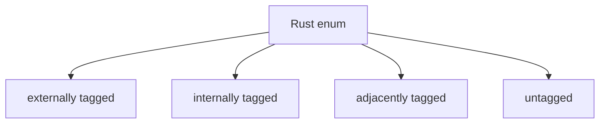

# Serde, JSON, and Data Modeling

> [!summary] Goal
> Serialize and deserialize strongly typed Rust data safely, model external payloads explicitly, and understand how enums, field attributes, and schema evolution affect real systems.

## Why Serde Matters

Serde is the standard way Rust applications map typed structs/enums to formats like JSON.

It matters because it connects:
- API requests/responses
- config files
- message payloads
- persistence formats

---

## Basic Derive

```rust
use serde::{Deserialize, Serialize};

#[derive(Debug, Serialize, Deserialize)]
struct User {
    id: i64,
    name: String,
}
```

### Why derive is powerful

- keeps serialization logic near the type
- avoids hand-written boilerplate
- works naturally with enums and nested structs

---

## Data Modeling Guidance

Prefer explicit modeling with enums and structs over generic JSON maps.

Good:

```rust
#[derive(Debug, Serialize, Deserialize)]
enum PaymentStatus {
    Pending,
    Settled,
    Failed { reason: String },
}
```

This preserves domain meaning and catches invalid states early.

---

## Common Attributes

```rust
#[derive(Debug, Serialize, Deserialize)]
struct ApiUser {
    #[serde(rename = "userId")]
    user_id: i64,

    #[serde(default)]
    tags: Vec<String>,

    #[serde(skip_serializing_if = "Option::is_none")]
    email: Option<String>,
}
```

These attributes help align Rust naming, defaults, and optional fields with real external schemas.

---

## Enum Representation

Serde supports multiple enum encoding strategies.



Choose representations deliberately, because compatibility and parsing behavior depend on them.

---

## JSON Workflow Example

```rust
#[derive(Debug, Serialize, Deserialize)]
struct Config {
    port: u16,
    debug: bool,
}

fn main() -> Result<(), Box<dyn std::error::Error>> {
    let json = r#"{"port":8080,"debug":true}"#;
    let config: Config = serde_json::from_str(json)?;
    println!("{:?}", config);
    Ok(())
}
```

---

## Pitfalls

### Using `serde_json::Value` everywhere

This throws away much of Rust’s type safety.

### Ignoring schema evolution

Be deliberate about defaults, optional fields, renamed fields, and enum tagging when payloads evolve over time.

### Treating external JSON as trusted

Always model optionality and failure paths explicitly.

---

> [!question]- Interview Questions
>
> **Q: Why is Serde so important in Rust?**
> A: It provides ergonomic, strongly typed serialization/deserialization that fits Rust structs and enums naturally.
>
> **Q: Why is a typed struct often better than `serde_json::Value`?**
> A: Because it preserves domain constraints and catches invalid payload assumptions at compile time and parse time.

---

## Cross-Links

- [[Rust/01_Foundations/02_Structs_Enums_and_Pattern_Matching]]
- [[Rust/01_Foundations/03_Error_Handling_Result_and_ThisError]]

---

## References

- [Serde](https://serde.rs/)
- [serde_json](https://docs.rs/serde_json/)
