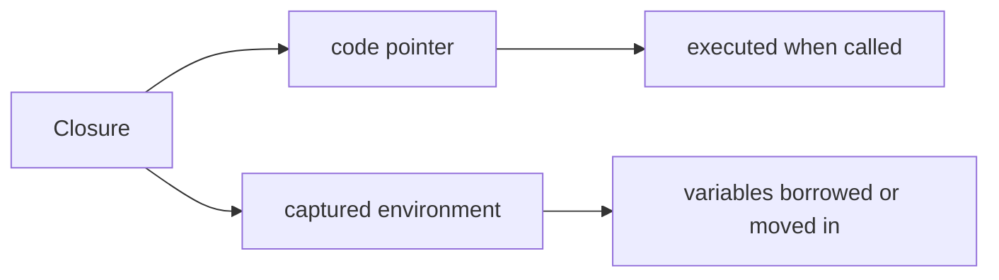
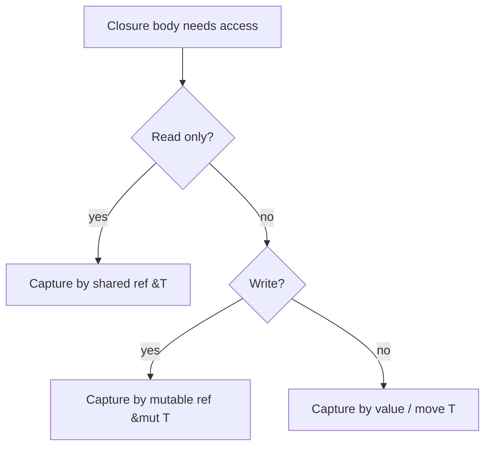
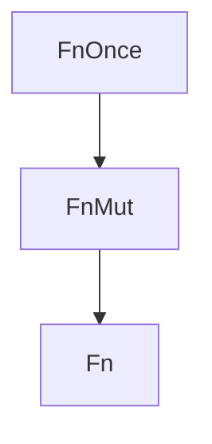

# Closures and `Fn` Traits

> [!summary] Goal
> Understand Rust's closure model: how closures capture variables from their environment, the `Fn`/`FnMut`/`FnOnce` trait hierarchy, and when each form is required by APIs.

## Table of Contents

1. [Why Closures Matter](#why-closures-matter)
2. [Syntax and Basic Usage](#syntax-and-basic-usage)
3. [Three Capture Modes](#three-capture-modes)
4. [The `Fn`/`FnMut`/`FnOnce` Hierarchy](#the-fn-fnmut-fnonce-hierarchy)
5. [`move` Closures](#move-closures)
6. [Closures vs Function Pointers](#closures-vs-function-pointers)
7. [Writing APIs That Accept Closures](#writing-apis-that-accept-closures)
8. [Lifetime Capture in Closures](#lifetime-capture-in-closures)
9. [Common Patterns](#common-patterns)
10. [Pitfalls](#pitfalls)

---

## Why Closures Matter

A **closure** is an anonymous function that can capture variables from its enclosing scope.

```rust
let factor = 2;
let double = |x| x * factor;  // captures `factor`
println!("{}", double(5));     // 10
```

Closures are fundamental to Rust because they appear everywhere:
- iterator adapters (`map`, `filter`, `for_each`)
- thread spawning (`thread::spawn(|| ...)`)
- async blocks and task spawning
- error handling (`unwrap_or_else`)
- custom callbacks and event handling



> [!tip] Definition
> **Closure**: a value that bundles a function body with the variables it references from the surrounding scope. The compiler automatically determines what to capture and how.

---

## Syntax and Basic Usage

### Full form

```rust
|param1: Type1, param2: Type2| -> ReturnType {
    body
}
```

### Type inference — types are usually omitted

```rust
let add = |a, b| a + b;             // both parameters inferred
let greet = |name| format!("hi {name}");  // single param, no parens needed
let noop = || println!("hello");     // no params
```

### Calling a closure

```rust
let square = |x| x * x;
let result = square(4);  // calling syntax is the same as functions
```

Closures can be called multiple times (unless they are `FnOnce`):

```rust
let mul = |a, b| a * b;
assert_eq!(mul(2, 3), 6);
assert_eq!(mul(4, 5), 20);  // works — `mul` is Fn
```

---

## Three Capture Modes

The compiler captures variables by the *minimum* access needed. There are three levels:



### 1. By shared reference (`&T`)

```rust
let name = "Rust".to_string();
let print = || println!("{name}");  // captures &String
print();
println!("still usable: {name}");   // ✓ — only borrowed
```

### 2. By mutable reference (`&mut T`)

```rust
let mut count = 0;
let mut inc = || count += 1;  // captures &mut i32
inc();
inc();
// println!("{count}");  // would need mutable borrow while inc lives
println!("{count}");      // OK after inc is last used
```

### 3. By value (`T`) — moves ownership in

```rust
let data = vec![1, 2, 3];
let consume = || {
    println!("{:?}", data);  // captures by & by default
    drop(data);              // but drop needs ownership — forces capture by value!
};
// println!("{:?}", data);  // ERROR: data was moved
```

### The compiler chooses the minimal mode

If the closure only reads, it borrows. If it writes, it mutably borrows. If it moves some captured value out of the closure, it captures by value.

```rust
let v = vec![1, 2, 3];

// Captures by &Vec
let len = || v.len();

// Captures by &mut Vec — need to declare mut
let mut push = || v.push(4);

// Captures by value — forces move
let consume = || v.into_iter().sum::<i32>();
```

---

## The `Fn`/`FnMut`/`FnOnce` Hierarchy

These three traits form a hierarchy. Every closure automatically implements as many as it can.



| Trait | Call signature | Can be called | Captures | Example closure |
|-------|---------------|---------------|----------|-----------------|
| `FnOnce` | `call_once(self)` | Once | By value (T) | `let x = move || drop(data)` |
| `FnMut` | `call_mut(&mut self)` | Multiple times (mut) | By mutable ref | `let mut x = || count += 1` |
| `Fn` | `call(&self)` | Multiple times (any) | By shared ref | `let x = \|\| println!("hello")` |

### `FnOnce` — can be called once

```rust
let s = String::from("hello");
let consume = move || s.len();  // have to move in
// `consume` is FnOnce because it consumes `s` (dropped after closure drops)
// Actually no — since s.len() borrows, it's still Fn/FnMut. Let me fix:

let s = String::from("hello");
let consume = || drop(s);  // drops s, so can only be called once
// consume();  // this would work
// consume();  // ERROR: use of moved value: `s`
```

Any closure that moves a value *out* of the closure body implements only `FnOnce`:

```rust
fn call_it<F: FnOnce() -> String>(f: F) -> String {
    f()  // can only call f once
}

let s = String::from("x");
let result = call_it(|| s);  // closure moves s out
```

### `FnMut` — can be called multiple times, may mutate captures

```rust
fn call_twice<F: FnMut()>(mut f: F) {
    f();
    f();
}

let mut count = 0;
call_twice(|| count += 1);
assert_eq!(count, 2);
```

### `Fn` — the most permissive

```rust
fn call_many<F: Fn(i32) -> i32>(f: F, n: i32) -> i32 {
    f(f(f(n)))  // call three times
}

let double = |x| x * 2;  // `double` is Fn
assert_eq!(call_many(double, 1), 8);
```

### How the compiler decides

```rust
let x = 10;
let a = || x;              // Fn — reads x
let mut b = || x += 1;     // FnMut — writes x
let c = move || drop(x);   // FnOnce — consumes x
```

---

## `move` Closures

The `move` keyword forces the closure to take ownership of all captured variables.

```rust
let data = vec![1, 2, 3];

// Without `move`: closure borrows `data`
let borrowed = || println!("{:?}", data);

// With `move`: closure takes ownership
let owned = move || println!("{:?}", data);
// println!("{:?}", data);  // ERROR: data moved into closure
```

### When `move` is required

**Thread spawning** — the closure must own its data because the thread may outlive the caller:

```rust
let data = vec![1, 2, 3];
let handle = std::thread::spawn(move || {
    println!("{:?}", data);  // `move` is required here
});
handle.join().unwrap();
```

**Async blocks** — futures need `'static` if spawned:

```rust
let data = vec![1, 2, 3];
tokio::spawn(async move {
    process(&data).await;
});
```

**Returning closures** — returning from a function requires owned data:

```rust
fn make_counter() -> impl FnMut() -> i32 {
    let mut count = 0;
    move || {
        count += 1;
        count
    }
}
```

---

## Closures vs Function Pointers

| Aspect | Closure (capturing) | Function pointer (`fn` type) |
|--------|---------------------|------------------------------|
| Captures environment | Yes | No |
| Size | Variable (stored on stack or heap) | Single pointer |
| Type | Anonymous, unique per closure | Named `fn(Type) -> Ret` |
| Can coerce to fn pointer | Only if no captures | Natively |
| Dispatch | Static (monomorphized) | Static or dynamic |

A non-capturing closure coerces to a function pointer:

```rust
let add = |a, b| a + b;           // closure, no captures
let fp: fn(i32, i32) -> i32 = add; // coerces to fn pointer

// This works because add captures nothing
fn accepts_fn_ptr(f: fn(i32, i32) -> i32) {
    println!("{}", f(2, 3));
}
accepts_fn_ptr(add);              // works

// But a capturing closure cannot coerce:
let x = 10;
let add_x = |a| a + x;
// let fp: fn(i32) -> i32 = add_x;  // ERROR: closure has captures
```

---

## Writing APIs That Accept Closures

### Generic with trait bound

```rust
fn apply_twice<F>(f: F, x: i32) -> i32
where
    F: Fn(i32) -> i32,
{
    f(f(x))
}

let double = |x| x * 2;
assert_eq!(apply_twice(double, 3), 12);  // 3*2 = 6, 6*2 = 12
```

### Use the most general bound your API needs

```rust
// Only need to call once → FnOnce (most general)
fn with_resource<F>(f: F) where F: FnOnce(&Resource) {
    let r = Resource::new();
    f(&r);
}

// Need to call multiple times → FnMut
fn for_each_item<F>(items: &[i32], mut f: F) where F: FnMut(&i32) {
    for item in items {
        f(item);
    }
}

// No mutation needed, call anywhere → Fn (most restrictive)
fn process_items<F>(items: &[i32], f: F) where F: Fn(&i32) -> bool {
    items.iter().any(|x| f(x))
}
```

### Returning closures (use `impl Fn`)

```rust
fn make_adder(x: i32) -> impl Fn(i32) -> i32 {
    move |y| x + y
}

let add5 = make_adder(5);
assert_eq!(add5(3), 8);
```

### Closure traits in iterator chains

```rust
// map accepts FnMut
// filter accepts FnMut
// for_each accepts FnMut
// unwrap_or_else accepts FnOnce

let v: Vec<i32> = vec![1, 2, 3]
    .into_iter()
    .map(|x| x * 2)    // FnMut
    .filter(|&x| x > 2) // FnMut
    .collect();
```

---

## Lifetime Capture in Closures

Closures borrow by default — the compiler infers the minimum lifetime needed:

```rust
let name = String::from("rust");
let check = || name.len() > 3;  // borrows `name`
// The borrow lasts as long as `check` is alive
```

### When lifetimes cause errors

```rust
fn returns_closure() -> impl Fn() -> usize {
    let local = vec![1, 2, 3];
    || local.len()   // ERROR: `local` does not live long enough
}
```

**Fix**: use `move` to take ownership:

```rust
fn returns_closure() -> impl Fn() -> usize {
    let local = vec![1, 2, 3];
    move || local.len()  // OK: closure owns `local`
}
```

### Closure lifetime bounds

```rust
// Closure that borrows from its argument
fn apply<F>(f: F) where F: Fn(&str) -> usize {
    let s = String::from("hello");
    println!("{}", f(&s));
}
```

---

## Common Patterns

### Builder pattern with closures

```rust
struct Config {
    name: String,
}

struct ConfigBuilder {
    name: Option<String>,
}

impl ConfigBuilder {
    fn with_name(mut self, f: impl FnOnce(&mut Option<String>)) -> Self {
        f(&mut self.name);
        self
    }

    fn build(self) -> Config {
        Config {
            name: self.name.unwrap_or_default(),
        }
    }
}
```

### Conditional initialization with `unwrap_or_else`

```rust
let value = cache.get(&key).unwrap_or_else(|| {
    compute_expensive(key)
});
// The closure only runs if the Option is None — lazy evaluation
```

### Closure as a factory

```rust
type UserFactory = Box<dyn Fn(String) -> User>;

fn create_user_factory(default_active: bool) -> UserFactory {
    Box::new(move |name| User {
        name,
        active: default_active,
    })
}
```

---

## Pitfalls

### Unintended move

```rust
let data = vec![1, 2, 3];
let bad = || drop(data);        // FnOnce — compiler warns if called once
// but if you do:
// let bad = || {
//     println!("{:?}", data);  // borrow
//     drop(data);               // forces move
// };
```

**Fix**: avoid mixing borrow and move in the same closure. Use separate closures.

### Closure outliving captures

```rust
let result: &i32;
{
    let x = 10;
    let r = || &x;
    result = r();  // ERROR: `x` does not live long enough
}
```

**Fix**: use `move` closures or restructure lifetimes.

### `Fn` vs `FnOnce` mismatch

```rust
fn takes_fn(f: impl Fn() -> i32) {
    println!("{}", f());
}

let data = vec![1, 2, 3];
// takes_fn(|| data.len());          // OK — Fn
takes_fn(move || data.len());        // also OK — Fn (borrows inside)
```

But this fails:

```rust
fn takes_fn_once(f: impl FnOnce() -> String) {
    println!("{}", f());
}

let s = String::from("x");
takes_fn_once(|| s);      // OK — FnOnce
// takes_fn(|| s);         // ERROR — needs Fn, closure is FnOnce
```

### Overusing `move` when borrowing is sufficient

```rust
let data = vec![1, 2, 3];
let closure = move || data.len();  // moves an entire Vec only to call .len()
```

**Fix**: let the compiler borrow unless you need ownership.

### Large captured values on the stack

Closures store their captured environment inline. Large captured structs increase closure size:

```rust
struct BigData([u8; 1024]);
let big = BigData([0; 1024]);
let heavy = move || big.0[0];  // closure is 1024 bytes!
```

---

> [!question]- Interview Questions
>
> **Q: What is the difference between `Fn`, `FnMut`, and `FnOnce`?**
> A: `FnOnce` can be called once (might consume captures), `FnMut` can be called multiple times and can mutate captures, `Fn` can be called multiple times without mutation. Every `Fn` is also `FnMut`, and every `FnMut` is also `FnOnce`.
>
> **Q: When would you use a `move` closure?**
> A: When the closure must outlive the scope of its captures (e.g., spawning a thread or async task, returning a closure from a function) or when you need to explicitly transfer ownership of captured variables into the closure.
>
> **Q: What is the difference between a closure and a function pointer?**
> A: A closure can capture variables from its environment; a function pointer cannot. A non-capturing closure can coerce to a function pointer. Function pointers have a named type (`fn(T) -> R`), closures have anonymous types.
>
> **Q: How does the compiler determine what a closure captures?**
> A: The compiler analyzes the closure body and captures by the minimum access needed: shared reference for reads, mutable reference for writes, and by value only when the closure takes ownership (e.g., calling `.into_iter()` on a captured value, or using `move`).

---

## Cross-Links

- [[Rust/01_Foundations/04_Iterators_Collections_and_Slices]] for iterator closures
- [[Rust/01_Foundations/05_Traits_Generics_and_Lifetimes_Intro]] for trait bounds on closure parameters
- [[Rust/02_Core/03_Concurrency_Threads_Mutex_Channels]] for `thread::spawn` requiring `move` closures
- [[Rust/02_Core/04_Async_Await_Tokio_Basics]] for async blocks and `Send + 'static` bounds
- [[Rust/02_Core/08_Deref_Drop_and_RAII_Patterns]] for how closures interact with Drop and RAII

---

## References

- [The Rust Book: Closures](https://doc.rust-lang.org/book/ch13-01-closures.html)
- [The Rust Reference: Closure expressions](https://doc.rust-lang.org/reference/expressions/closure-expr.html)
- [Rust by Example: Closures](https://doc.rust-lang.org/rust-by-example/fn/closures.html)
- [std::ops::Fn](https://doc.rust-lang.org/std/ops/trait.Fn.html)
- [std::ops::FnMut](https://doc.rust-lang.org/std/ops/trait.FnMut.html)
- [std::ops::FnOnce](https://doc.rust-lang.org/std/ops/trait.FnOnce.html)
