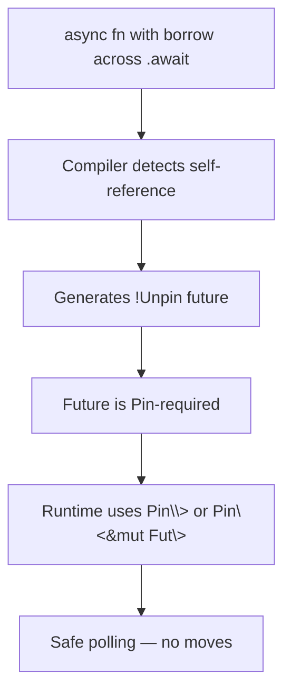

# `Pin` and `Unpin` Deep Dive

> [!summary] Goal
> Understand why `Pin` exists, how it makes self-referential types safe, and how it integrates with async Rust, smart pointers, and intrusive data structures.

## Table of Contents

1. [Why Pin Exists](#why-pin-exists)
2. [The `Pin` Type](#the-pin-type)
3. [`Unpin` Auto-Trait](#unpin-auto-trait)
4. [Pin and Async Futures](#pin-and-async-futures)
5. [Creating Pinned Values](#creating-pinned-values)
6. [Working with Pinned Values](#working-with-pinned-values)
7. [Pinning Projections](#pinning-projections)
8. [Pinning in Practice](#pinning-in-practice)
9. [Pitfalls](#pitfalls)

---

## Why Pin Exists

Some types must not be moved in memory after they are created. A **self-referential** struct holds a pointer to one of its own fields:

```rust
struct SelfReferential {
    data: String,
    ptr: *const String,  // points to self.data
}
```

If this struct is moved, the pointer becomes dangling:

```mermaid
flowchart LR
    subgraph Before move
        A[SelfRef] --> B[data: \"hello\"]
        A --> C[ptr -> data]
    end
    subgraph After move
        D[SelfRef MOVED] --> E[data: \"hello\"]
        D --> F[ptr -> OLD address! DEN]
        E -.->|still at old addr| G[memory: \"hello\"]
    end
```

`Pin` guarantees the value stays at the same memory address once pinned.

> [!tip] Definition
> **`Pin<P>`**: a wrapper that ensures the value `P` points to will not be moved in memory. Once a value is pinned, it stays pinned for its lifetime. `Unpin` types are exceptions — they can be moved even when pinned.

---

## The `Pin` Type

```rust
pub struct Pin<P> {
    pointer: P,
}
```

`Pin<P>` wraps a pointer type `P` (which dereferences to `T`). Common forms:

| Form | Description |
|------|-------------|
| `Pin<Box<T>>` | Owns T on the heap, pinned. Most common. |
| `Pin<&mut T>` | Borrows T mutably, pinned. Used in APIs. |
| `Pin<&T>` | Borrows T immutably, pinned. Less common. |
| `Pin<Arc<T>>` | Shared ownership, pinned. Rare. |

### Safety invariant

`Pin` does not prevent moving — it makes moving *unsafe*. The compiler enforces that you cannot get `&mut T` from `Pin<&mut T>` without `unsafe` (unless `T: Unpin`).

```rust
use std::pin::Pin;

let mut data = String::from("hello");
let pinned = Pin::new(&mut data);  // ERROR: Pin::new requires Unpin
// String is Unpin, so this actually works, but for !Unpin types it won't.
```

For `!Unpin` types:

```rust
// This is a simplified sketch — real Pin::new requires T: Unpin
// For !Unpin types, you need unsafe or Box::pin
use std::marker::PhantomPinned;

struct NonMovable {
    data: String,
    _pinned: PhantomPinned,  // makes this !Unpin
}
```

---

## `Unpin` Auto-Trait

`Unpin` is an auto-trait — most types implement it automatically. If a type is `Unpin`, `Pin` has no effect on it; you can move it freely.

```rust
use std::marker::Unpin;

// Most types are Unpin
fn is_unpin<T: Unpin>() {}
is_unpin::<i32>();       // ✓
is_unpin::<String>();    // ✓
is_unpin::<Vec<u8>>();   // ✓
```

### Types that are `!Unpin`

Only types that explicitly opt out with `PhantomPinned`:

```rust
use std::marker::PhantomPinned;

struct NeedsPin {
    field: i32,
    _pin: PhantomPinned,  // makes this !Unpin
}

// Generated futures from async blocks are !Unpin
// when they hold borrowed references across .await points.
```

### `!Unpin` types are rare

In practice, you will almost always encounter `!Unpin` in:
- Generated async state machines (some of them)
- Intrusive data structures (linked lists, tree nodes)
- Custom self-referential types

---

## Pin and Async Futures

Every `async fn` returns a future — an anonymous state machine. If the future holds a reference to one of its own fields across an `.await`, it becomes self-referential and `!Unpin`.

```rust
async fn example() {
    let x = String::from("hello");
    let y = &x;           // reference to x
    some_other().await;   // x may have moved!
    println!("{y}");       // y is dangling if x moved
}
```

The compiler detects this case and generates a `!Unpin` future:

```rust
// Compiler-generated state machine (simplified)
struct ExampleFuture {
    x: String,
    y: &String,       // points to self.x — SELF-REFERENTIAL!
    _pin: PhantomPinned,  // automatically added
}
```



### Why this matters at the API level

```rust
// This function needs Pin because the future may be !Unpin
fn poll(self: Pin<&mut Self>, cx: &mut Context<'_>) -> Poll<Self::Output>;

// Pin<&mut Self> instead of &mut Self — signals the future cannot be moved
```

---

## Creating Pinned Values

### `Box::pin` — heap allocation

```rust
use std::pin::Pin;

let pinned: Pin<Box<String>> = Box::pin(String::from("hello"));
// String is Unpin, so this works fine
```

For `!Unpin` types — this is the primary way:

```rust
use std::pin::Pin;
use std::marker::PhantomPinned;

struct NonMovable {
    data: String,
    _marker: PhantomPinned,
}

impl NonMovable {
    fn new(data: String) -> Pin<Box<Self>> {
        let value = NonMovable { data, _marker: PhantomPinned };
        Box::pin(value)  // safe because Pin<Box<T>> owns T on the heap
    }
}
```

### `pin!` macro — stack pinning

Available from `tokio::pin!` or `std::pin::pin!` (Rust 1.68+):

```rust
use std::pin::pin;

let mut pinned = pin!(NonMovable::new("hello".into()));
// pinned is Pin<&mut NonMovable>

// Use with async:
let fut = async { /* ... */ };
tokio::pin!(fut);
fut.await;  // fut is pinned, safe to move across awaits
```

### `Pin::new_unchecked` — unsafe manual pinning

Only for experts implementing `Pin` wrappers:

```rust
unsafe {
    let mut val = NonMovable { data: "hello".into(), _marker: PhantomPinned };
    let pinned = Pin::new_unchecked(&mut val);
    // Must guarantee val will not be moved or dropped before pinned
}
```

---

## Working with Pinned Values

### Getting immutable access

`Pin` dereferences to `T`, so you can read it freely:

```rust
let pinned = Box::pin(String::from("hello"));
println!("{}", pinned.len());    // Deref to String
println!("{}", &*pinned);        // explicit deref
```

### Getting mutable access (when `T: Unpin`)

```rust
let mut pinned = Box::pin(String::from("hello"));
pinned.push_str(" world");  // works because String: Unpin
```

### For `!Unpin` types — needs unsafe or projection

```rust
let mut pinned = Box::pin(NonMovable::new("hello".into()));
// pinned.data = "world".into();  // ERROR: cannot access field
// Need pin projection (see next section)
```

### Calling pinned methods

Types that need pinning stability declare methods with `self: Pin<&mut Self>`:

```rust
impl NonMovable {
    fn mutate(self: Pin<&mut Self>) {
        // safe to modify non-pinned fields
    }
}
```

---

## Pinning Projections

A **projection** accesses a field of a pinned struct. Fields that are `Unpin` can be safely projected; fields that are `!Unpin` need unsafe.

### Safe projection for `Unpin` fields

```rust
struct Data {
    value: i32,          // Unpin — safe to project
    _pin: PhantomPinned, // !Unpin — cannot project safely
}

impl Data {
    fn project_value(self: Pin<&mut Self>) -> &mut i32 {
        // SAFETY: i32 is Unpin, moving it doesn't break anything
        unsafe { &mut self.get_unchecked_mut().value }
    }
}
```

### Using `pin_project` crate

```toml
[dependencies]
pin-project = "1"
```

```rust
use pin_project::pin_project;

#[pin_project]
struct TwoFields {
    #[pin]        // this field is !Unpin — pinned
    future: SomeFuture,

    data: i32,    // this field is Unpin — not pinned
}

impl TwoFields {
    fn project(self: Pin<&mut Self>) {
        let this = self.project();
        this.data += 1;           // mutable ref to Unpin field
        this.future.poll(cx);     // Pin<&mut SomeFuture>
    }
}
```

The `#[pin]` attribute marks fields that participate in the pinning guarantee. Non-`#[pin]` fields can be projected safely.

---

## Pinning in Practice

### When you need `Pin<Box<T>>`

- Spawning async tasks (`tokio::spawn` may need `Pin<Box<dyn Future>>`)
- Storing `!Unpin` futures in struct fields
- Self-referential data structures

### When you need `Pin<&mut T>`

- Implementing `Future::poll`
- Calling methods on pinned values
- Passing pinned values to functions

### Real-world example: storing a future in a struct

```rust
use std::future::Future;
use std::pin::Pin;
use std::task::{Context, Poll};

struct Task {
    future: Pin<Box<dyn Future<Output = ()> + Send>>,
}

impl Task {
    fn new<F>(f: F) -> Self
    where
        F: Future<Output = ()> + Send + 'static,
    {
        Self {
            future: Box::pin(f),
        }
    }

    fn poll(&mut self, cx: &mut Context<'_>) -> Poll<()> {
        self.future.as_mut().poll(cx)
    }
}
```

### Pin and the stack

```rust
fn process() {
    let fut = async { /* !Unpin future */ };
    tokio::pin!(fut);           // pin to the stack
    fut.await;                  // safe to move across await
}
```

---

## Pitfalls

### Assuming Pin makes a type immovable

```rust
let mut val = 42;
let pinned = Pin::new(&mut val);
// Even though pinned exists, val is still Unpin:
std::mem::swap(&mut val, &mut 0);  // no error!
```

**Pin only prevents moves for `!Unpin` types.**

### Creating dangling pointers from pin projections

```rust
// UNSAFE — incorrect projection
unsafe fn bad_projection<X, Y>(pinned: Pin<&mut (X, Y)>) -> (&mut X, Pin<&mut Y>) {
    let this = pinned.get_unchecked_mut();
    (&mut this.0, Pin::new_unchecked(&mut this.1))
    // If Y is !Unpin and gets moved through &mut X, pinning is violated!
}
```

**Fix**: Only project `!Unpin` fields through `#[pin]` attributes and safe abstractions.

### Forgetting that Box::pin allocates

`Box::pin` does a heap allocation. For hot paths, use stack pinning with `pin!`.

### Confusing Pin with immutability

Pin prevents moves, not mutations:

```rust
let mut pinned = Box::pin(String::from("hello"));
pinned.push_str(" world");  // mutation is fine (String: Unpin)
```

### Pin is not a "lock"

Multiple `Pin<&mut T>` can exist as long as they don't alias:

```rust
let mut val = NonMovable::new("hello".into());
let ref1 = val.as_mut();
// let ref2 = val.as_mut();  // ERROR: cannot borrow as mutable more than once
```

---

> [!question]- Interview Questions
>
> **Q: Why does Pin exist in Rust?**
> A: To guarantee a value stays at the same memory address after being pinned. This is essential for self-referential types (like some async state machines) where moving the value would invalidate internal pointers.
>
> **Q: What is the difference between Pin and Unpin?**
> A: `Pin<P>` is a wrapper that prevents the pointed-to value from being moved. `Unpin` is an auto-trait — types that implement it can be moved even when pinned. Most types are `Unpin`; only self-referential types are `!Unpin`.
>
> **Q: How does Pin relate to async Rust?**
> A: Some generated async futures are `!Unpin` because they hold references to their own fields across `.await` points. The `Future::poll` method takes `self: Pin<&mut Self>` to ensure the future cannot be moved during polling.
>
> **Q: How do you create a pinned value?**
> A: Use `Box::pin(val)` for heap allocation, `pin!(val)` macro for stack pinning (Rust 1.68+), or `Pin::new_unchecked(&mut val)` in unsafe code.
>
> **Q: What is a pin projection?**
> A: Accessing a field of a pinned struct. If the field is `Unpin`, projection is safe. If `!Unpin`, projection requires unsafe and the `pin_project` crate to handle correctly.

---

## Cross-Links

- [[Rust/02_Core/04_Async_Await_Tokio_Basics]] for pinning in async context
- [[Rust/02_Core/08_Deref_Drop_and_RAII_Patterns]] for Drop guarantees and pin interaction
- [[Rust/03_Advanced/02_Unsafe_Rust_and_FFI_Basics]] for unsafe code needed in pin projections
- [[Rust/02_Core/02_Smart_Pointers_Box_Rc_Arc]] for Box::pin

---

## References

- [The Rust Book: Pin](https://doc.rust-lang.org/book/ch17-04-pinning.html)
- [std::pin](https://doc.rust-lang.org/std/pin/index.html)
- [Rust Async Book: Pinning](https://rust-lang.github.io/async-book/04_pinning/01_chapter.html)
- [The Rustonomicon: Pin](https://doc.rust-lang.org/nomicon/pin.html)
- [pin-project crate](https://docs.rs/pin-project/)
