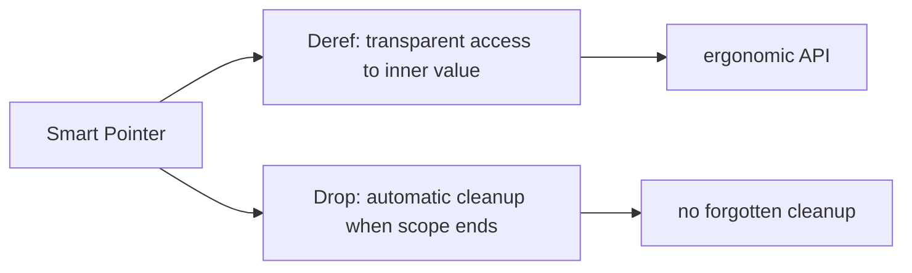
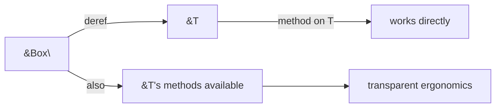
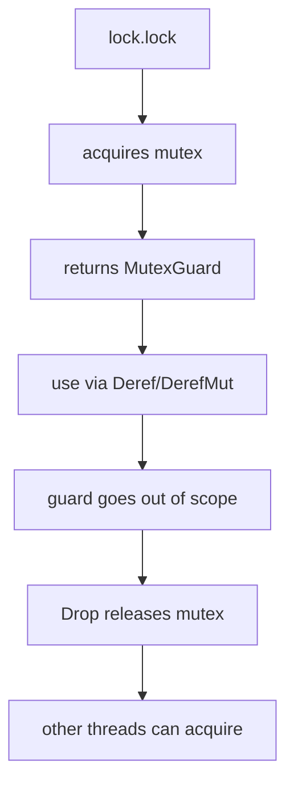

# `Deref`, `Drop`, and RAII Patterns

> [!summary] Goal
> Understand how `Deref` enables ergonomic smart pointers, `Drop` controls resource lifecycle, and RAII patterns manage everything from mutex locks to file handles.

## Table of Contents

1. [Why Deref and Drop Matter](#why-deref-and-drop-matter)
2. [The `Deref` Trait](#the-deref-trait)
3. [Deref Coercion](#deref-coercion)
4. [`DerefMut`](#derefmut)
5. [The `Drop` Trait](#the-drop-trait)
6. [RAII in Practice](#raii-in-practice)
7. [Drop Order](#drop-order)
8. [`std::mem::drop` for Early Release](#stdmemdrop-for-early-release)
9. [Common RAII Patterns](#common-raii-patterns)
10. [Pitfalls](#pitfalls)

---

## Why Deref and Drop Matter

Two traits make Rust's smart pointers and resource management work seamlessly:

- **`Deref`**: lets a type behave like a reference. When you use `*box_val` or call methods on a smart pointer, `Deref` makes it transparent.
- **`Drop`**: runs code when a value goes out of scope. This is the foundation of RAII — Resource Acquisition Is Initialization.



> [!tip] Definition
> **RAII (Resource Acquisition Is Initialization)**: a pattern where acquiring a resource (file, lock, memory) happens in a constructor, and releasing it happens in the destructor (`Drop`). Rust guarantees `Drop` runs when the value goes out of scope, making resource leaks much harder.

---

## The `Deref` Trait

### Definition

```rust
trait Deref {
    type Target: ?Sized;
    fn deref(&self) -> &Self::Target;
}
```

A type that implements `Deref` can be dereferenced with `*`:

```rust
use std::ops::Deref;

struct MyBox<T>(T);

impl<T> Deref for MyBox<T> {
    type Target = T;

    fn deref(&self) -> &T {
        &self.0  // return reference to inner value
    }
}

let my = MyBox(42);
assert_eq!(*my, 42);  // *my calls deref() → &i32, then copies
```

### Why this matters

Every smart pointer in the standard library implements `Deref`:

| Type | Target | Allows you to use... |
|------|--------|---------------------|
| `Box<T>` | `T` | `*box_val` — access heap value |
| `Rc<T>` | `T` | `*rc_val` — access shared value |
| `Arc<T>` | `T` | `*arc_val` — access thread-safe shared value |
| `String` | `str` | `&s[..]` — string slicing |
| `Vec<T>` | `[T]` | `&v[..]` — vector slicing |
| `MutexGuard<T>` | `T` | `*guard` — access locked data |

---

## Deref Coercion

Deref coercion automatically converts a reference to a smart pointer into a reference to its target:

```rust
fn greet(name: &str) {
    println!("Hello, {name}!");
}

let s = String::from("Rust");
greet(&s);  // &String → &str via Deref coercion (String: Deref<Target=str>)

let v = vec![1, 2, 3];
fn sum_slice(s: &[i32]) -> i32 { s.iter().sum() }
assert_eq!(sum_slice(&v), 6);  // &Vec<i32> → &[i32]
```

### How method resolution uses Deref

When you call a method on a value, Rust follows the Deref chain to find matching methods:

```rust
let s = String::from("hello");
let len = s.len();  // len() comes from str, not String
// Rust sees: &s → Deref → &str → finds len()
```

This chain can go multiple levels:

```rust
// Box<Rc<String>> → Deref → Rc<String> → Deref → String → Deref → str
let nested: Box<Rc<String>> = Box::new(Rc::new("hello".into()));
let len = nested.len();  // works! walks the entire Deref chain
```



### Rules for Deref coercion

Coercion happens automatically for:

1. `&T` where `T: Deref<Target=U>` → `&U`
2. `&mut T` where `T: Deref<Target=U>` → `&U`
3. `&mut T` where `T: DerefMut<Target=U>` → `&mut U`

Rule 3 shows that `&mut T` coerces to `&U` but NOT `&T` to `&mut U` (that would violate aliasing).

---

## `DerefMut`

The mutable counterpart — enables `*x = value` and mutable method resolution:

```rust
trait DerefMut: Deref {
    fn deref_mut(&mut self) -> &mut Self::Target;
}
```

```rust
struct MyBox<T>(T);

impl<T> Deref for MyBox<T> {
    type Target = T;
    fn deref(&self) -> &T { &self.0 }
}

impl<T> DerefMut for MyBox<T> {
    fn deref_mut(&mut self) -> &mut T { &mut self.0 }
}

let mut my = MyBox(42);
*my = 100;           // deref_mut → writes through
assert_eq!(*my, 100); // deref → reads
```

---

## The `Drop` Trait

### Definition

```rust
trait Drop {
    fn drop(&mut self);
}
```

`Drop` is called automatically when a value goes out of scope:

```rust
struct Resource {
    name: String,
}

impl Drop for Resource {
    fn drop(&mut self) {
        println!("Releasing resource: {}", self.name);
    }
}

{
    let r = Resource { name: "db-connection".into() };
    // use r...
}   // ← drop(&mut r) is called here automatically
```

### What Drop guarantees

- `Drop::drop` runs **once** per value, when it exits its scope
- Field drop order: fields of a struct are dropped in declaration order
- Variable drop order: local variables are dropped in reverse declaration order
- Drop can be used for: closing files, releasing locks, freeing memory, logging, metrics

### Drop and the borrow checker

You cannot call `drop` explicitly (that's `std::mem::drop`), and you cannot call `self.drop()` inside a `Drop` impl — that would cause double-free:

```rust
impl Drop for Foo {
    fn drop(&mut self) {
        // self.drop();  // ERROR: explicit use of destructor
        // Do cleanup here...
    }
}
```

---

## RAII in Practice

### MutexGuard — the canonical example

```rust
use std::sync::Mutex;

let lock = Mutex::new(42);
{
    let mut guard = lock.lock().unwrap();   // acquire lock
    // guard implements DerefMut → transparent access
    *guard += 1;
    // guard goes out of scope → Drop releases the lock
}
// Lock is released here — even if the code above panics!
println!("done");
```



### File — automatically closed

```rust
fn write_data() -> std::io::Result<()> {
    let mut file = std::fs::File::create("output.txt")?;
    // file implements Deref<Target=File> — well, actually File itself
    file.write_all(b"hello")?;
    // file.close() is NOT needed — Drop closes the file descriptor
    Ok(())
}   // File::drop → close the OS file handle
```

### Custom RAII guard

```rust
struct Timer {
    label: &'static str,
    start: std::time::Instant,
}

impl Timer {
    fn new(label: &'static str) -> Self {
        Self { label, start: std::time::Instant::now() }
    }
}

impl Drop for Timer {
    fn drop(&mut self) {
        let elapsed = self.start.elapsed();
        println!("{} took {:?}", self.label, elapsed);
    }
}

fn process() {
    let _timer = Timer::new("process");  // starts timer
    std::thread::sleep(std::time::Duration::from_millis(100));
}   // ← Drop logs the duration
```

---

## Drop Order

### Local variables — reverse declaration order

```rust
struct Name(&'static str);

impl Drop for Name {
    fn drop(&mut self) {
        println!("dropping {}", self.0);
    }
}

fn main() {
    let a = Name("first");
    let b = Name("second");
}   // drops "second" then "first"
```

Output:
```
dropping second
dropping first
```

### Struct fields — declaration order

```rust
struct Pair {
    x: Name,
    y: Name,
}

impl Drop for Pair {
    fn drop(&mut self) {
        println!("dropping Pair");
    }
}

// Fields are dropped AFTER the struct's Drop runs
// x is dropped first, then y
```

### Why order matters

- If `y` borrows from `x`, dropping `x` before `y` would create dangling references
- Rust's drop order (fields in declaration order, locals in reverse) is designed to minimize such problems
- Nested values: outer `Drop` runs first, then inner fields are dropped in order

---

## `std::mem::drop` for Early Release

The `std::mem::drop` function calls `Drop::drop` immediately:

```rust
fn std::mem::drop<T>(_x: T) { }

let lock = Mutex::new(());
let guard = lock.lock().unwrap();
// use guard...
std::mem::drop(guard);  // release lock early
// other threads can now acquire the lock
// guard is no longer accessible
```

```rust
// Useful pattern: release a lock before an expensive operation
let data = cache.get(&key).unwrap();
// process... takes time
std::mem::drop(data);  // release borrow early
do_expensive_work();   // no longer holding the borrow
```

---

## Common RAII Patterns

### Scoped timer (production observability)

```rust
struct ScopedTimer<'a> {
    name: &'a str,
    start: std::time::Instant,
}

impl<'a> ScopedTimer<'a> {
    fn new(name: &'a str) -> Self {
        let start = std::time::Instant::now();
        Self { name, start }
    }
}

impl<'a> Drop for ScopedTimer<'a> {
    fn drop(&mut self) {
        metrics::histogram(self.name, self.start.elapsed());
    }
}

fn handle_request() {
    let _timer = ScopedTimer::new("request.duration");
    // process...
}
```

### Connection pool guard

```rust
struct PoolConnection<'pool> {
    conn: TcpStream,
    pool: &'pool ConnectionPool,
}

impl<'pool> Deref for PoolConnection<'pool> {
    type Target = TcpStream;
    fn deref(&self) -> &TcpStream { &self.conn }
}

impl<'pool> DerefMut for PoolConnection<'pool> {
    fn deref_mut(&mut self) -> &mut TcpStream { &mut self.conn }
}

impl<'pool> Drop for PoolConnection<'pool> {
    fn drop(&mut self) {
        self.pool.return_connection(self.conn);
    }
}
```

### Write-ahead logging guard

```rust
struct JournalEntry {
    // ...
}

impl Drop for JournalEntry {
    fn drop(&mut self) {
        // if not committed, roll back
        if !self.committed {
            self.rollback();
        }
    }
}
```

---

## Pitfalls

### Panicking in Drop

```rust
impl Drop for Fragile {
    fn drop(&mut self) {
        panic!("oops!");  // BAD
    }
}
```

If a `Drop` panics while already panicking, the program aborts. **Never let `Drop` panic** — use `catch_unwind` if cleanup can fail.

### Using `mem::forget` skips Drop

```rust
use std::mem;

let guard = lock.lock().unwrap();
mem::forget(guard);  // Drop is NOT called! Lock stays held forever!
```

`ManuallyDrop<T>` and `mem::forget` are `unsafe`-wrapped tools for special cases. Normal code should never skip Drop.

### Deref ambiguity

If your smart pointer has methods that shadow the inner type's methods, you can get confusion:

```rust
struct Wrapper(String);

impl Wrapper {
    fn len(&self) -> usize {
        self.0.len() + 100  // custom behavior
    }
}

impl Deref for Wrapper {
    type Target = String;
    fn deref(&self) -> &String { &self.0 }
}

let w = Wrapper("hello".into());
println!("{}", w.len());      // calls Wrapper::len → 105
println!("{}", (*w).len());   // calls String::len → 5
println!("{}", (&*w).len());  // also String::len → 5
```

**Fix**: be explicit with `(*wrapper).method()` when you need the inner type's method.

### Deref to types with inherent methods that shadow

`String` inherits methods from `str` via `Deref`. If you add a method with the same name, it gets shadowed:

```rust
trait MyTrait {
    fn len(&self) -> usize;
}

impl MyTrait for String {
    fn len(&self) -> usize { 99 }
}

let s = String::from("hello");
println!("{}", s.len());         // 5 (String's own method)
println!("{}", MyTrait::len(&s));  // 99 (trait method)
```

### Deref coercion only applies to references

```rust
fn takes_str(s: &str) {}

let s = String::from("hello");
takes_str(&s);     // ✓ Deref coercion: &String → &str
takes_str(s);      // ERROR: expected &str, found String
```

---

> [!question]- Interview Questions
>
> **Q: What is Deref coercion and how does it work?**
> A: Deref coercion automatically converts a reference to a type implementing `Deref<Target=U>` into a reference to `U`. For example, `&String` becomes `&str`, `&Vec<T>` becomes `&[T]`. It happens automatically at function arguments and method calls, making smart pointers transparent.
>
> **Q: What is RAII in Rust?**
> A: Resource Acquisition Is Initialization — resources (locks, files, memory) are acquired in constructors and released in `Drop`. Rust's ownership system guarantees `Drop` runs when the value goes out of scope, preventing resource leaks.
>
> **Q: What is the difference between `Deref` and `DerefMut`?**
> A: `Deref` provides immutable access to the inner value (`&self → &Target`). `DerefMut` provides mutable access (`&mut self → &mut Target`). `DerefMut` requires `Deref`. Mutable references coerce to immutable but not vice versa.
>
> **Q: What is the drop order in Rust?**
> A: Local variables drop in reverse declaration order. Struct fields drop in declaration order. The struct's `Drop` implementation runs BEFORE its fields are dropped. This minimizes dangling references.
>
> **Q: Should you panic in Drop?**
> A: No. A panic during a panic causes an abort. Use `catch_unwind` around cleanup code that might fail, or silently handle errors in `Drop`.

---

## Cross-Links

- [[Rust/02_Core/02_Smart_Pointers_Box_Rc_Arc]] for smart pointers that implement Deref
- [[Rust/02_Core/03_Concurrency_Threads_Mutex_Channels]] for MutexGuard RAII pattern
- [[Rust/02_Core/06_Closures_and_Fn_Traits]] for closures and their interaction with drop
- [[Rust/01_Foundations/01_Ownership_and_Borrowing]] for the ownership model that RAII builds on
- [[Rust/02_Core/07_Pin_and_Unpin_Deep_Dive]] for Pin's interaction with Drop guarantees

---

## References

- [std::ops::Deref](https://doc.rust-lang.org/std/ops/trait.Deref.html)
- [std::ops::DerefMut](https://doc.rust-lang.org/std/ops/trait.DerefMut.html)
- [std::ops::Drop](https://doc.rust-lang.org/std/ops/trait.Drop.html)
- [The Rust Book: Deref](https://doc.rust-lang.org/book/ch15-02-deref.html)
- [The Rust Book: Drop](https://doc.rust-lang.org/book/ch15-03-drop.html)
- [The Rustonomicon: Drop Check](https://doc.rust-lang.org/nomicon/dropck.html)
- [RAII in Rust](https://doc.rust-lang.org/rust-by-example/scope/raii.html)
