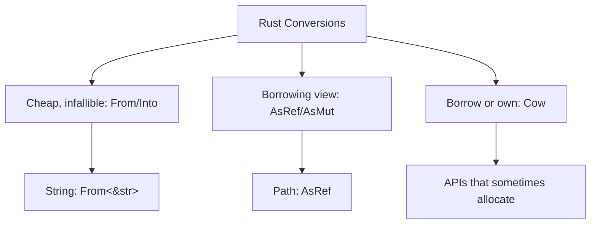
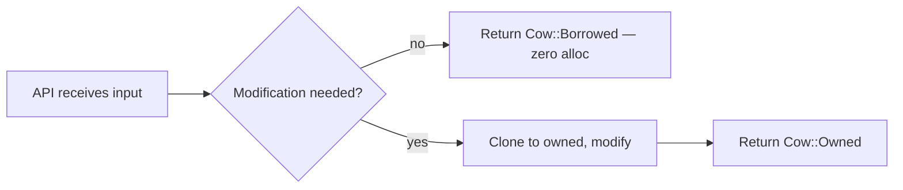

# `From`, `Into`, `AsRef`, `AsMut`, and `Cow`

> [!summary] Goal
> Design APIs that accept borrowed-or-owned data ergonomically using Rust's conversion traits.

## Table of Contents

1. [Why Conversion Traits Matter](#why-conversion-traits-matter)
2. [`From` and `Into`](#from-and-into)
3. [`AsRef` and `AsMut`](#asref-and-asmut)
4. [`Cow` (Clone-on-Write)](#cow)
5. [Choosing the Right Conversion](#choosing-the-right-conversion)
6. [Pitfalls](#pitfalls)

---

## Why Conversion Traits Matter



> [!tip] Definition
> **`From<T>`**: defines how to construct `Self` from `T`. **`Into<T>`**: the reciprocal — `T::into()` is `From<T>::from()` in reverse. **`AsRef<T>`**: provides a shared reference to `T`. **`Cow<T>`**: a type that is either borrowed (`&T`) or owned (`T`), with clone-on-write semantics.

---

## `From` and `Into`

### `From` — conversion constructor

```rust
trait From<T> {
    fn from(value: T) -> Self;
}
```

Standard library examples:

```rust
let s: String = String::from("hello");
let s: String = "hello".to_string();  // also works

let num: i64 = i64::from(42u32);  // u32 to i64 is safe
let addr: std::net::IpAddr = std::net::Ipv4Addr::new(127, 0, 0, 1).into();
```

### `Into` — blanket reciprocal

```rust
trait Into<T> {
    fn into(self) -> T;
}
// Blanket impl: impl<T, U> Into<U> for T where U: From<T>
```

This means every `From` automatically provides `Into`:

```rust
fn takes_string(s: String) {}

let s = "hello";
takes_string(s.to_string());
takes_string(String::from(s));
takes_string(s.into());  // infers String from context
```

### Implementing `From` for your types

```rust
struct UserId(i64);

impl From<i64> for UserId {
    fn from(id: i64) -> Self {
        UserId(id)
    }
}

// Into is automatically available
let uid: UserId = 42.into();
```

```rust
// Multi-step conversion
impl From<&str> for Config {
    fn from(raw: &str) -> Self {
        let parts: Vec<&str> = raw.split('=').collect();
        Config {
            key: parts[0].to_string(),
            value: parts[1].to_string(),
        }
    }
}

let config: Config = "timeout=30".into();
```

### When to implement `From` vs provide a constructor

```rust
impl From<&str> for User {  // GOOD: conversion is natural
    fn from(name: &str) -> Self { User { name: name.into() } }
}

// BAD: From should be intuitive
// impl From<(&str, &str, u8)> for ComplexConfig { ... }
// Better to have a named constructor:
impl ComplexConfig {
    fn new(host: &str, user: &str, port: u8) -> Self { /* ... */ }
}
```

---

## `AsRef` and `AsMut`

### `AsRef` — borrow as a reference

```rust
trait AsRef<T> {
    fn as_ref(&self) -> &T;
}
```

Use it to accept "anything that can be viewed as T":

```rust
// Accept any string-like type
fn open_file(path: impl AsRef<std::path::Path>) -> std::io::Result<std::fs::File> {
    std::fs::File::open(path.as_ref())
}

// Works with:
open_file("config.toml");                    // &str
open_file(Path::new("config.toml"));         // &Path
open_file(PathBuf::from("config.toml"));     // PathBuf
open_file(String::from("config.toml"));      // String
```

### Common `AsRef` implementations

```rust
// String implements AsRef<str>, AsRef<Path>, AsRef<[u8]>
// PathBuf implements AsRef<Path>
// OsString implements AsRef<OsStr>
// &str implements AsRef<Path> on Unix

fn write_file(path: impl AsRef<Path>, data: impl AsRef<[u8]>) {
    let path = path.as_ref();
    let data = data.as_ref();
    std::fs::write(path, data).unwrap();
}
```

### `AsMut` — mutable borrow

```rust
trait AsMut<T> {
    fn as_mut(&mut self) -> &mut T;
}

fn reset(buf: &mut impl AsMut<[u8]>) {
    buf.as_mut().fill(0);
}
```

---

## `Cow` (Clone-on-Write)

`Cow<'a, B>` is an enum that represents either borrowed (`&'a B`) or owned (`B::Owned`) data:

```rust
pub enum Cow<'a, B: ToOwned + ?Sized> {
    Borrowed(&'a B),
    Owned(<B as ToOwned>::Owned),
}
```

### When to use `Cow`

When an API sometimes needs to modify data and sometimes doesn't:

```rust
use std::borrow::Cow;

fn titlecase_name<'a>(name: &'a str) -> Cow<'a, str> {
    match name.chars().next() {
        Some(c) if c.is_uppercase() => Cow::Borrowed(name),  // no allocation
        _ => {
            let mut owned = name.to_string();  // allocate only when needed
            owned.make_ascii_uppercase();
            Cow::Owned(owned)
        }
    }
}

// Usage — no allocation if already uppercase:
let name = "Alice";
let result = titlecase_name(name);
assert_eq!(result, "Alice");
assert!(matches!(result, Cow::Borrowed(_)));

// Allocation required:
let name = "alice";
let result = titlecase_name(name);
assert_eq!(result, "ALICE");
assert!(matches!(result, Cow::Owned(_)));
```



### `Cow` in practice

```rust
// std::path::Path::to_string_lossy returns Cow<str>
// — Most paths are valid UTF-8 → borrowed
// — Invalid paths get replacement characters → owned

let path = Path::new("/valid/utf8");
let display = path.to_string_lossy();  // Cow::Borrowed — no alloc
```

### `Cow` with `to_mut` and `into_owned`

```rust
let mut cow: Cow<'_, str> = Cow::Borrowed("hello");

// Only clone when mutation is needed:
cow.to_mut().push_str(" world");  // now Cow::Owned

// Force owned regardless:
let owned: String = cow.into_owned();
```

---

## Choosing the Right Conversion

| Trait | Direction | Allocation? | Use when |
|-------|-----------|-------------|----------|
| `From<T>` | `T → Self` | Maybe | Definite conversion into your type |
| `Into<T>` | `self → T` | Maybe | Passing to functions that take T |
| `AsRef<T>` | `&Self → &T` | No | Accepting borrowed views of data |
| `AsMut<T>` | `&mut Self → &mut T` | No | Accepting mutable borrowed views |
| `Cow<'a, T>` | Borrowed or owned | Only on mutation | Return that may need modification |
| `Borrow<T>` | `&Self → &T` | No | Hash/eq semantics (HashMap keys) |
| `ToOwned` | `&Self → Owned` | Yes | Create owned from borrow (for `Cow`) |

### Guidelines

```rust
// 1. Accept AsRef<Path> for file paths — ergonomic for callers
fn read_config(path: impl AsRef<Path>) -> String { /* ... */ }

// 2. Return Cow when the rare case allocates
fn normalize<'a>(s: &'a str) -> Cow<'a, str> {
    // Most strings are already normalized
    if is_normalized(s) { Cow::Borrowed(s) } else { Cow::Owned(do_normalize(s)) }
}

// 3. Use From for clear infallible conversions
// 4. Avoid Into for function parameters — use concrete types or AsRef
// 5. Avoid implementing both From<T> and From<U> for the same T and U
//    when they could conflict
```

---

## Pitfalls

### Over-using Into in function parameters

```rust
// AMBIGUOUS — callers don't know what T will be inferred as
fn process(value: impl Into<String>) {
    let s: String = value.into();
}

process("hello");     // &str -> String (via From)
process("hello".to_string());  // String -> String (identity)
```

**Fix**: accept `&str` and let callers decide:

```rust
fn process(s: &str) { /* ... */ }
// or
fn process(s: String) {}
```

### From/Into orphan rule conflicts

```rust
// Can't implement From<Vec<T>> for MyType if Vec is from std
// Can't implement From<MyType> for Vec if Vec is from std
```

**Fix**: use a wrapper struct or a method.

### Cow lifetime issues

```rust
fn process(data: &str) -> Cow<'_, str> {
    Cow::Borrowed(data)  // OK — borrows from data
}

fn wrong(data: &str) -> Cow<'_, str> {
    let owned = data.to_string();
    // Cow::Borrowed(&owned)  // ERROR: owned does not live long enough
    Cow::Owned(owned)  // OK — moves ownership
}
```

### AsRef does not guarantee round-trip

```rust
// AsRef<str> for String returns &str, but AsRef<String> for &str does not exist
// Not all conversions are symmetric — choose carefully
```

---

> [!question]- Interview Questions
>
> **Q: What is the difference between `From`/`Into` and `AsRef`?**
> A: `From`/`Into` are for infallible conversions that may allocate (e.g., `&str` → `String`). `AsRef` is for zero-allocation borrowed views (e.g., `String` → `&str`, `PathBuf` → `&Path`).
>
> **Q: What is `Cow` and when is it useful?**
> A: `Cow` (Clone-on-Write) is an enum that is either borrowed or owned. It is useful when an API sometimes needs to modify data and sometimes doesn't — avoiding allocations in the common case (e.g., `titlecase_name`, `Path::to_string_lossy`).
>
> **Q: Why does `Into<U> for T` have a blanket impl based on `From<T> for U`?**
> A: They are reciprocal — implementing `From` is the canonical way. `Into` is automatically available because of `impl<T, U> Into<U> for T where U: From<T>`. This prevents redundant implementations.

---

## Cross-Links

- [[Rust/01_Foundations/05_Traits_Generics_and_Lifetimes_Intro]] for trait bound patterns
- [[Rust/02_Core/08_Deref_Drop_and_RAII_Patterns]] for Deref vs AsRef
- [[Rust/02_Core/10_OsStr_OsString_CStr_CString_and_System_Types]] for conversion between string types

---

## References

- [std::convert::From](https://doc.rust-lang.org/std/convert/trait.From.html)
- [std::convert::Into](https://doc.rust-lang.org/std/convert/trait.Into.html)
- [std::convert::AsRef](https://doc.rust-lang.org/std/convert/trait.AsRef.html)
- [std::borrow::Cow](https://doc.rust-lang.org/std/borrow/enum.Cow.html)
- [Rust Book: Effective Rust Conversions](https://doc.rust-lang.org/rust-by-example/conversion.html)
