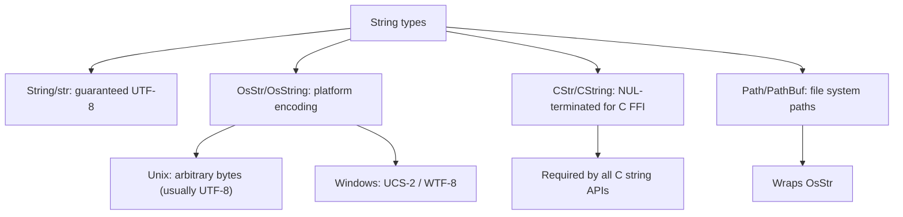
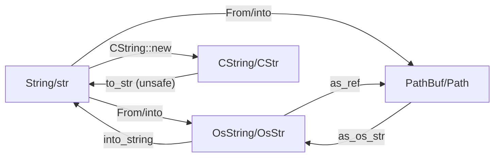

# `OsStr`, `OsString`, `CStr`, `CString`, and System Types

> [!summary] Goal
> Handle platform-native string encodings and C-compatible string types safely.

## Table of Contents

1. [Why System String Types Exist](#why-system-string-types-exist)
2. [OsStr and OsString](#osstr-and-osstring)
3. [CStr and CString](#cstr-and-cstring)
4. [Path and PathBuf](#path-and-pathbuf)
5. [Conversion Between String Types](#conversion-between-string-types)
6. [Pitfalls](#pitfalls)

---

## Why System String Types Exist



> [!tip] Definition
> **`OsStr`**: a string type that matches the platform's native encoding (UTF-8 on Unix, potentially WTF-8 on Windows). **`CStr`**: a string type that is NUL-terminated and compatible with C's `char*`.

---

## OsStr and OsString

`OsString` is to `OsStr` as `String` is to `str` — owned vs borrowed.

```rust
use std::ffi::{OsStr, OsString};

// Creating
let os_string = OsString::from("hello");
let os_str: &OsStr = OsStr::new("world");

// Conversion from String
let s = String::from("hello");
let os = OsString::from(s);

// Conversion back (may fail if not valid UTF-8)
let os = OsString::from("hello");
match os.into_string() {
    Ok(s) => println!("valid UTF-8: {s}"),
    Err(os) => println!("not valid UTF-8: {:?}", os),
}
```

### Why OsStr exists

On Unix, file names are arbitrary bytes (except NUL). On Windows, they are UCS-2. `OsStr` provides a platform-independent abstraction:

```rust
use std::fs;
use std::ffi::OsStr;

// Reading a directory with non-UTF-8 file names
for entry in std::fs::read_dir("/tmp")? {
    let entry = entry?;
    let name: &OsStr = entry.file_name();  // may not be valid UTF-8
    println!("{:?}", name);  // Debug works, Display may not
}
```

---

## CStr and CString

`CString` is to `CStr` as `String` is to `str` — owned vs borrowed.

```rust
use std::ffi::{CStr, CString};

// Creating CString (checks for interior NUL bytes)
let c_string = CString::new("hello").expect("interior NUL found");
let ptr: *const i8 = c_string.as_ptr();  // pass to C functions

// Creating CStr from C pointer
unsafe {
    let c_str = CStr::from_ptr(ptr);
    println!("{:?}", c_str);  // "hello"
}
```

### NUL termination

C strings end at the first NUL byte (`\0`). `CString` guarantees NUL termination and rejects interior NULs:

```rust
let valid = CString::new("hello");       // Ok
let with_nul = CString::new("hello\0");  // Err: interior NUL
let empty = CString::new("");            // Ok: produces "\0"

// CString always NUL-terminates — the actual length is len + 1
```

---

## Path and PathBuf

`PathBuf` is to `Path` as `OsString` is to `OsStr`:

```rust
use std::path::{Path, PathBuf};

let path = PathBuf::from("/usr/local/bin");
let parent = path.parent();  // Some(Path::new("/usr/local"))

// Path wraps OsStr
let os: &OsStr = path.as_os_str();
```

---

## Conversion Between String Types



### Conversion matrix

| From \ To | `String` | `OsString` | `PathBuf` | `CString` |
|-----------|----------|------------|-----------|-----------|
| `String` | — | `From` | `From` | `CString::new` |
| `OsString` | `into_string` (fallible) | — | `From` | `CString::new` |
| `PathBuf` | `into_os_string().into_string()` | `into_os_string` | — | `as_path().to_str()` |
| `CString` | `into_string` (unsafe) | — | — | — |

---

## Pitfalls

### Interior NUL in CString

```rust
let data = vec![0x48, 0x65, 0x00, 0x6c, 0x6c];  // has a NUL in the middle
let c_str = CString::new(data);  // Err: NulError
```

**Fix**: sanitize input to remove or replace interior NULs.

### Non-UTF-8 OsStr loss

```rust
let os = OsStr::new("hello");
let s = os.to_str();           // Option<&str> — may fail on non-UTF-8
let s = os.to_string_lossy();  // Cow<'_, str> — replaces invalid with <20>FFFD
```

**Fix**: use `to_string_lossy()` for display purposes, handle the error for correctness.

### CStr from raw pointer safety

```rust
unsafe {
    // MUST ensure ptr is a valid NUL-terminated C string
    let c_str = CStr::from_ptr(ptr);
}
```

The pointer must be non-null, NUL-terminated, and valid for the entire string.

---

> [!question]- Interview Questions
>
> **Q: What is the difference between `OsStr` and `CStr`?**
> A: `OsStr` matches the platform's native encoding (for file names, environment variables). `CStr` is NUL-terminated and matches C's `char*` convention for FFI.
>
> **Q: Why does `CString::new` return a `Result`?**
> A: It validates there are no interior NUL bytes, which would break C string semantics. Returns `NulError` if the input contains a NUL.
>
> **Q: How do you convert a `CStr` to a `&str`?**
> A: `c_str.to_str()` returns `Result<&str, Utf8Error>`. Use `to_string_lossy()` if you want to replace invalid sequences with replacement characters.

---

## Cross-Links

- [[Rust/01_Foundations/01_Ownership_and_Borrowing]] for owned/borrowed relationship
- [[Rust/02_Core/01_Owned_vs_Borrowed_Types_StringStr_Path]] for String/str vs Path/PathBuf
- [[Rust/03_Advanced/02_Unsafe_Rust_and_FFI_Basics]] for C string safety in FFI
- [[Rust/03_Advanced/08_Build_Scripts_and_FFI_Deep]] for CStr/CString in bindings

---

## References

- [std::ffi::OsStr](https://doc.rust-lang.org/std/ffi/struct.OsStr.html)
- [std::ffi::CStr](https://doc.rust-lang.org/std/ffi/struct.CStr.html)
- [std::ffi::CString](https://doc.rust-lang.org/std/ffi/struct.CString.html)
- [std::path::Path](https://doc.rust-lang.org/std/path/struct.Path.html)
