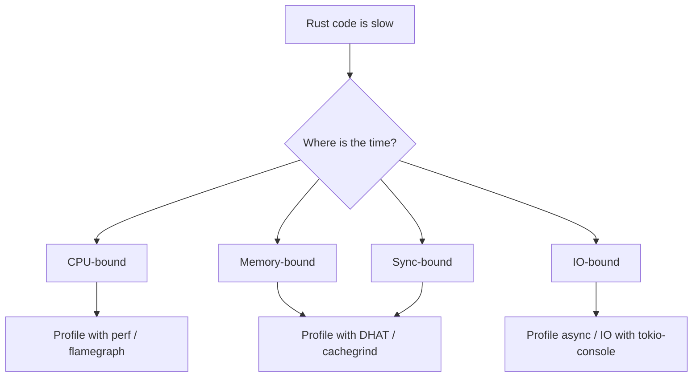

# Performance: Profiling, Allocation, and Data Layout

> [!summary] Goal
> Reason about Rust performance with evidence: where CPU time goes, where allocation happens, how cache behavior affects throughput, and which optimizations produce measurable gains.

## Table of Contents

1. [Why Performance Is Not Automatic](#why-performance-is-not-automatic)
2. [Measure First](#measure-first)
3. [CPU Profiling with perf and Flamegraphs](#cpu-profiling-with-perf-and-flamegraphs)
4. [Allocation Profiling with DHAT](#allocation-profiling-with-dhat)
5. [Cache Locality and Data Layout](#cache-locality-and-data-layout)
6. [Rust-Specific Optimizations](#rust-specific-optimizations)
7. [Allocation Mental Model](#allocation-mental-model)
8. [Pitfalls](#pitfalls)

---

## Why Performance Is Not Automatic

Rust's zero-cost abstractions mean high-level code compiles to efficient machine code — but only if the abstractions are genuinely zero-cost. Common costs still matter:

- Allocation frequency and churn
- Cache misses from poor data layout
- Synchronization contention
- Hash function overhead
- Bounds checks that the optimizer can't eliminate
- `Clone` of heap-heavy types



---

## Measure First

Do NOT optimize based on intuition. Use tools:

| Tool | What it measures | When to use |
|------|:----------------:|-------------|
| **Criterion** | Wall-clock time, statistical regression | Micro-benchmarks, before/after comparisons |
| **`perf`** | CPU cycles, instructions, cache misses | CPU hotspots, branch mispredictions |
| **Flamegraph** | CPU time stack traces | Identifying hot methods in a profile |
| **DHAT** | Heap allocation count, size, lifetime | Reducing allocator pressure |
| **Cachegrind** | L1/L2/LLC cache misses, branch mispredictions | Data layout optimization |
| **`/usr/bin/time -v`** | Page faults, context switches, max RSS | Quick resource check |
| **coz** (profiler) | "Roofline" — which optimization has the most impact | Finding optimization ROI |

---

## CPU Profiling with `perf` and Flamegraphs

### perf basics (Linux)

```bash
# Profile a running process for 10 seconds
perf record -F 99 -p $(pgrep my-rust-app) -g -- sleep 10

# Profile a command from start to finish
perf record -F 99 --call-graph dwarf ./target/release/my-app

# View top functions
perf report -n --stdio --sort=comm,dso,symbol

# Annotate a specific function
perf annotate -s my_function

# Generate stack collapse for flamegraph
perf script > out.perf
./stackcollapse-perf.pl out.perf > out.folded
./flamegraph.pl out.folded > flame.svg
```

### What to look for in a CPU profile

```text
1. Hot functions (high % in `perf report`)
   - Are they doing unnecessary work?
   - Can the algorithm be improved?

2. Instruction-level bottlenecks
   - perf stat -e cycles,instructions,branches,branch-misses
   - High branch-miss rate → predictable vs unpredictable branches
   - Low IPC (instructions per cycle) → likely memory-bound (cache misses)

3. LLVM/clang optimization boundaries
   - Rust uses LLVM. -C target-cpu=native enables CPU-specific instructions.
   - Profile-guided optimization (PGO) can improve branch prediction.

4. The "performance cliff" pattern:
   - A function runs fine at 80% load, then latency spikes at 90%.
   - Likely: queue buildup, lock contention, or allocator pressure.
   - Profile at BOTH loads to see what changes.
```

### Flamegraph interpretation

```bash
# Generate (requires perf + flamegraph scripts):
cargo install flamegraph
cargo flamegraph --bin my-app -- --my-args
# Opens flamegraph.svg in browser

# Reading a flamegraph:
# - X-axis: stack frequency (width = CPU time)
# - Y-axis: call stack depth
# - Wide bars at the top = hot code paths
# - Color: random (or color by LLVM function type)
```

---

## Allocation Profiling with DHAT

> [!info] DHAT
> DHAT is a Valgrind tool that tracks heap allocations: count, size, total bytes, and lifetime. It's the best tool for finding allocation hot spots in Rust. Install: `valgrind --tool=dhat`.

### Running DHAT

```bash
# Run your program under DHAT
valgrind --tool=dhat ./target/release/my-app

# Output: dhat.out.{pid} — view with dhat viewer
# Install viewer:
cargo install dhat-view
dhat-view dhat.out.*

# Or upload dhat.out to https://nnethercote.github.io/dhat-view/
```

### Interpreting DHAT output

```text
DHAT gives you a table of ALL allocation call sites (sorted by total bytes):

  ┌──────────┬────────┬────────┬──────────┬────────┬──────────┐
  │ Total    │  Count │  Max   │  At t    │ Access │ Location │
  │ 5,120 B  │  10    │ 512 B  │ 0.5s    │  R+W   │ src/main.rs:12 │
  │ 2,048 B  │  100   │ 2,048 B│ 0.1s    │  W     │ src/parse.rs:45│
  │ ...      │        │        │          │        │              │
  └──────────┴────────┴────────┴──────────┴────────┴──────────────┘

  Key metrics:
  - Total bytes: allocation volume for this call site
  - Count: number of allocations
  - Max: largest single allocation
  - At t: when in the program's run the allocations happened
  - Access: whether the allocated memory is read, written, or both

  What to look for:
  - Call sites with high "total bytes" and "count" → allocation hot spots
  - Allocations that are immediately freed → churn (look for Vec::resize, clone)
  - Many small allocations → consider bump allocator or pre-allocation
```

### Rust-specific DHAT pattern: string building

```rust
// ❌ High allocation churn:
fn build_path(parts: &[&str]) -> String {
    let mut s = String::new();
    for part in parts {
        s.push_str(part);   // Repeated re-allocation as String grows
        s.push('/');
    }
    s
}

// ✅ Pre-allocate exact capacity:
fn build_path(parts: &[&str]) -> String {
    let total: usize = parts.iter().map(|p| p.len()).sum::<usize>() + parts.len();
    let mut s = String::with_capacity(total);
    for part in parts {
        s.push_str(part);
        s.push('/');
    }
    s
}

// DHAT will show the first version with many reallocation events
// and the second with just one allocation.
```

### `dhat` crate for runtime heap profiling

```rust
// The dhat crate (not Valgrind DHAT) tracks allocations at runtime.
// Add to Cargo.toml: dhat = "0.1"

#[cfg(feature = "dhat-heap")]
#[global_allocator]
static ALLOC: dhat::Alloc = dhat::Alloc;

fn main() {
    #[cfg(feature = "dhat-heap")]
    let _profiler = dhat::Profiler::new_heap();

    // ... your code ...

    // At the end, dhat writes profiling data
}
```

---

## Cache Locality and Data Layout

> [!info] Cache effects
> Modern CPUs are 50-100× faster than main memory. The L1 cache fills in ~4 cycles (1 ns). Main memory takes ~200 cycles (50-70 ns). A cache miss on a hot path can cost more than the actual computation.

### Struct layout affects cache behavior

```rust
// ❌ Poor cache behavior: hot and cold fields interleaved
struct User {
    id: u64,          // Hot field: accessed on every request
    bio: String,      // Cold field: rarely accessed
    name: String,     // Warm field: sometimes accessed
    last_login: u64,  // Hot field: updated on every request
    preferences: Preferences, // Cold field: rarely accessed
}

// ✅ Better: group hot fields together (fit in one cache line)
struct User {
    // Hot section (fits in 64-byte cache line)
    id: u64,          // 8 bytes
    last_login: u64,  // 8 bytes
    name: String,     // 24 bytes (ptr + len + cap)
    // Total: 40 bytes — fits in one cache line with room

    // Cold section (rarely accessed — no cache pressure)
    bio: String,
    preferences: Preferences,
}
```

### Struct of arrays vs array of structs

```rust
// Array of Structs (AoS) — typical Rust:
struct Particle {
    x: f32, y: f32, z: f32,
    vx: f32, vy: f32, vz: f32,
    mass: f32,
}
let particles: Vec<Particle> = vec![];

// Access pattern: iterate positions only
for p in &particles {
    process(p.x, p.y, p.z);  // Each iteration reads 28 bytes, uses only 12
    // Cache line waste: 28 bytes per particle, only 12 used
}

// Struct of Arrays (SoA) — simd-friendly:
struct Particles {
    x: Vec<f32>,
    y: Vec<f32>,
    z: Vec<f32>,
    vx: Vec<f32>,
    vy: Vec<f32>,
    vz: Vec<f32>,
    mass: Vec<f32>,
}

// Access pattern: only positions in contiguous arrays
for ((&x, &y), &z) in particles.x.iter()
    .zip(particles.y.iter())
    .zip(particles.z.iter())
{
    process(x, y, z);  // Contiguous f32 access → perfect cache utilization
}

// When to use SoA:
//   - SIMD-amenable workloads (particle systems, game physics, ML)
//   - When you access a subset of fields much more often
//   - Column-oriented data processing

// When to use AoS:
//   - Most application code
//   - When all fields are usually accessed together
//   - When the struct is infrequently iterated
```

### Cachegrind for cache analysis

```bash
# Run under Cachegrind
valgrind --tool=cachegrind ./target/release/my-app

# Output: cachegrind.out.{pid}
# View:
cg_annotate cachegrind.out.*
# Or use KCachegrind GUI for visual analysis

# Key metrics:
# - D1 misses (L1 data cache)
# - LL misses (last level / LLC cache)
# - Miss rate: miss / (reference + miss)
# - High D1 miss rate (> 10%) → poor data locality
```

---

## Rust-Specific Optimizations

### Bounds check elimination

```rust
// Rust inserts bounds checks on all array indexing. The optimizer can
// eliminate them in common patterns, but not always.

// ❌ Bounds check NOT eliminated:
fn sum_v1(data: &[i32], indices: &[usize]) -> i32 {
    let mut sum = 0;
    for &i in indices {
        sum += data[i];  // Bounds check: i could be > data.len()
    }
    sum
}

// ✅ Bounds check eliminated (using iter):
fn sum_v2(data: &[i32], indices: &[usize]) -> i32 {
    let max = data.len();
    indices.iter()
        .filter(|&&i| i < max)     // Manual bounds check
        .map(|&i| unsafe { *data.get_unchecked(i) })  // No bounds check
        .sum()
}

// ✅ Even better: use iterators directly
fn sum_v3(data: &[i32], indices: &[usize]) -> i32 {
    let max = data.len();
    indices.iter()
        .filter(|&&i| i < max)
        .map(|&i| data[i])  // With filter, optimizer may eliminate bounds check
        .sum()
}
```

### `Option` and `Result` niche optimization

```rust
// Rust uses "niche optimization" to make Option<T> the same size as T
// when T has unused bit patterns.

// Example: NonNull<T> has a niche (0 is not a valid value)
use std::ptr::NonNull;
assert_eq!(size_of::<Option<NonNull<i32>>>(), size_of::<*mut i32>());
// The None variant uses the 0 bit pattern (null).

// Example: bool has a niche
assert_eq!(size_of::<Option<bool>>(), 1);  // bool is 1 byte, Option<bool> is 1 byte

// Example: ManuallyDrop doesn't have a niche
// ManuallyDrop wraps any type but doesn't have the "drop" niche.
// size_of::<Option<ManuallyDrop<String>>>() == size_of::<String>() + 1 (discriminant)

// Design types with niches when you want Option optimization:
struct NonZero(i32);  // ❌ No niche — Option<NonZero> = size + 1

use std::num::NonZeroI32;
// ✅ NonZeroI32 has a niche — Option<NonZeroI32> = size of i32
```

### `Box<[T]>` vs `Vec<T>`

```rust
// Vec<T> has (ptr, len, cap) — 3 words.
// Box<[T]> has (ptr, len) — 2 words (no capacity).
// Use Box<[T]> when you don't need to grow:
let data: Vec<i32> = (0..100).collect();
let frozen: Box<[i32]> = data.into_boxed_slice();
// Saves 8 bytes per allocation, and makes the type immutably sized.
```

### `#[inline]` and code generation

```rust
// #[inline] — hint to the compiler to inline a function.
// Use when:
//   - The function is small and called from a hot loop
//   - It benefits from constant propagation
//   - It's generic and used with different types

// #[inline(always)] — force inline (can increase binary size)
// #[inline(never)] — prevent inline (save icache, or work around compiler issues)

#[inline]
fn small_hot_function(x: i32) -> i32 {
    x.wrapping_mul(7) ^ 0xFF
}
```

---

## Allocation Mental Model

### Common allocation triggers

```rust
// These operations allocate or MAY allocate:
String::from("hello");         // Allocates
format!("{a} {b}");            // Allocates
vec![0; 1000];                 // Allocates
"a".to_string();               // Allocates
"a".to_owned();                // Allocates
a.clone()                      // Allocates IF a contains heap-allocated data
HashMap::new()                 // Allocates (initial capacity)
collect::<Vec<_>>()            // Allocates (may re-allocate during growth)
Box::new(x)                    // Allocates
Rc::new(x)                     // Allocates

// These operations NEVER allocate:
x + 1                          // Arithmetic
&x                             // Borrow
x.iter()                       // Iterator creation
.iter().map().filter()         // Lazy adapters
[0; 100] on stack              // Stack array
```

### Pre-allocation patterns

```rust
// ❌ Many re-allocations:
let data: Vec<i32> = (0..10_000)
    .filter(|x| x % 2 == 0)
    .map(|x| x * 2)
    .collect();  // Vec may re-allocate 10+ times during growth

// ✅ Pre-allocate capacity:
let mut data = Vec::with_capacity(5_000);
for x in 0..10_000 {
    if x % 2 == 0 {
        data.push(x * 2);
    }
}
// Zero re-allocations during filling

// ✅ For known-size collections:
let v: Vec<i32> = vec![0; 1_000_000];  // One allocation
let s: String = String::with_capacity(1000);
```

### `Box` and indirection cost

```text
Type          Stack size   Allocation
─────────────────────────────────────
i32            4 bytes     None (in-place)
Box<i32>       8 bytes     Heap (16 bytes for value + allocator overhead)
String         24 bytes    Heap (for the actual characters)
Vec<i32>       24 bytes    Heap (for the elements)
Box<[i32]>     16 bytes    Heap (for the elements, no capacity)

Rule of thumb:
- Boxing a small type that's frequently dereferenced adds indirection cost.
- Boxing a large type that's moved infrequently saves stack space.
- Box<dyn Trait>: 16 bytes (pointer + vtable pointer), no allocation for the vtable.
```

---

## Pitfalls

### Optimizing before measuring

The #1 performance mistake. Profile first, then optimize the bottleneck you found. The bottleneck is never where you expect.

### Ignoring cache effects

Rust's zero-cost abstractions focus on CPU instruction count, but cache misses dominate modern CPU performance. A function with fewer instructions but worse cache behavior can be 10× slower.

### Assuming `clone()` is always cheap

`clone()` can be:
- Free for `Copy` types (memcpy or inline)
- Expensive for heap-owned types (`String`, `Vec<T>`, `HashMap`)
- Very expensive for deep trees or graph structures

Use `Clone::clone` deliberately, and profile to ensure it's not the bottleneck.

### Over-optimizing cold paths

99% of a program's runtime is in 1% of the code. Spending hours optimizing error-handling paths or startup code that runs once is wasted effort. Profile to find the 1%.

---

> [!question]- Interview Questions
>
> **Q: What is the most common cause of poor Rust performance?**
> A: Unnecessary allocation and cloning in hot paths — especially string building, `Vec` growth without pre-allocation, and `clone()` on heap-heavy types. Followed by poor cache behavior (traversing large structures in non-contiguous order).
>
> **Q: How does Struct of Arrays (SoA) improve cache performance?**
> A: SoA groups fields of the same type into contiguous arrays. When iterating only one field (e.g., particle positions), all accessed data fits in fewer cache lines. Array of Structs (AoS) would load the entire struct (including cold fields), wasting cache capacity.
>
> **Q: What is DHAT and what does it measure?**
> A: DHAT (a Valgrind tool) tracks every heap allocation: count, total bytes, max size, and lifetime. It tells you which call sites allocate the most, whether allocations are short-lived (churn) or long-lived (retention), and whether you're re-allocating unnecessarily.
>
> **Q: How does niche optimization work in Rust?**
> A: When a type has invalid bit patterns (a "niche"), Rust uses that niche to represent `None` in `Option<T>`, making `Option<T>` the same size as `T`. Examples: `bool` (only 0 and 1 are valid, niche is 2+), `NonNull<T>` (null is never valid), `NonZeroI32` (0 is never valid).

---

## Cross-Links

- [[Rust/01_Foundations/01_Ownership_and_Borrowing]] for allocation-free borrowing patterns
- [[Rust/02_Core/01_Owned_vs_Borrowed_Types_StringStr_Path]] for reducing string allocation
- [[Rust/03_Advanced/10_Global_Allocators_and_Allocation]] for custom allocators (jemalloc, mimalloc)
- [[Rust/03_Advanced/19_Workspaces_PGO_and_Advanced_Build]] for PGO and BOLT
