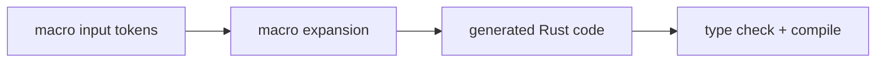

# Macros (Intro) and `derive`

> [!summary] Goal
> Understand what macros are doing in Rust, when they are worth using, and how to read or design macro-heavy code without treating it as magic.

## Why Macros Exist

Macros generate Rust code from structured input.

They are useful for:
- reducing boilerplate
- building ergonomic DSL-like APIs
- implementing derive-based repetitive code

---

## `derive` Macros

Common derives:
- `Debug`
- `Clone`
- `PartialEq`
- `Serialize`
- `Deserialize`

```rust
#[derive(Debug, Clone)]
struct User {
    id: i64,
}
```

These expand into generated impls.

---

## `macro_rules!`

Declarative macros are pattern-based.

```rust
macro_rules! say_hello {
    () => {
        println!("hello");
    };
}
```

Use them when you want syntactic abstraction without jumping straight to procedural macros.

---

## Macro Mental Model



This is why macro errors can feel indirect: the compiler often reports issues in expanded generated code.

---

## Pitfalls

### Overusing macros where functions or traits are clearer

Macros are powerful, but they can reduce readability if used too aggressively.

### Treating derive as magic

Derives are generated code. Knowing roughly what gets produced helps debugging and API design.

---

> [!question]- Interview Questions
>
> **Q: Why use macros in Rust at all?**
> A: To generate repetitive or pattern-based code that cannot be expressed as ordinary functions alone.
>
> **Q: What is the difference between `macro_rules!` and derive macros at a high level?**
> A: `macro_rules!` is declarative pattern-based expansion; derive macros generate impls from annotated types.

---

## Cross-Links

- [[Rust/02_Core/05_Serde_JSON_and_Data_Modeling]]

---

## References

- [Macros](https://doc.rust-lang.org/book/ch19-06-macros.html)
- [Rust Reference: Macros](https://doc.rust-lang.org/reference/macros.html)
