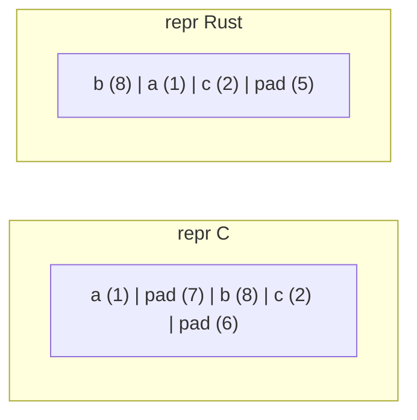
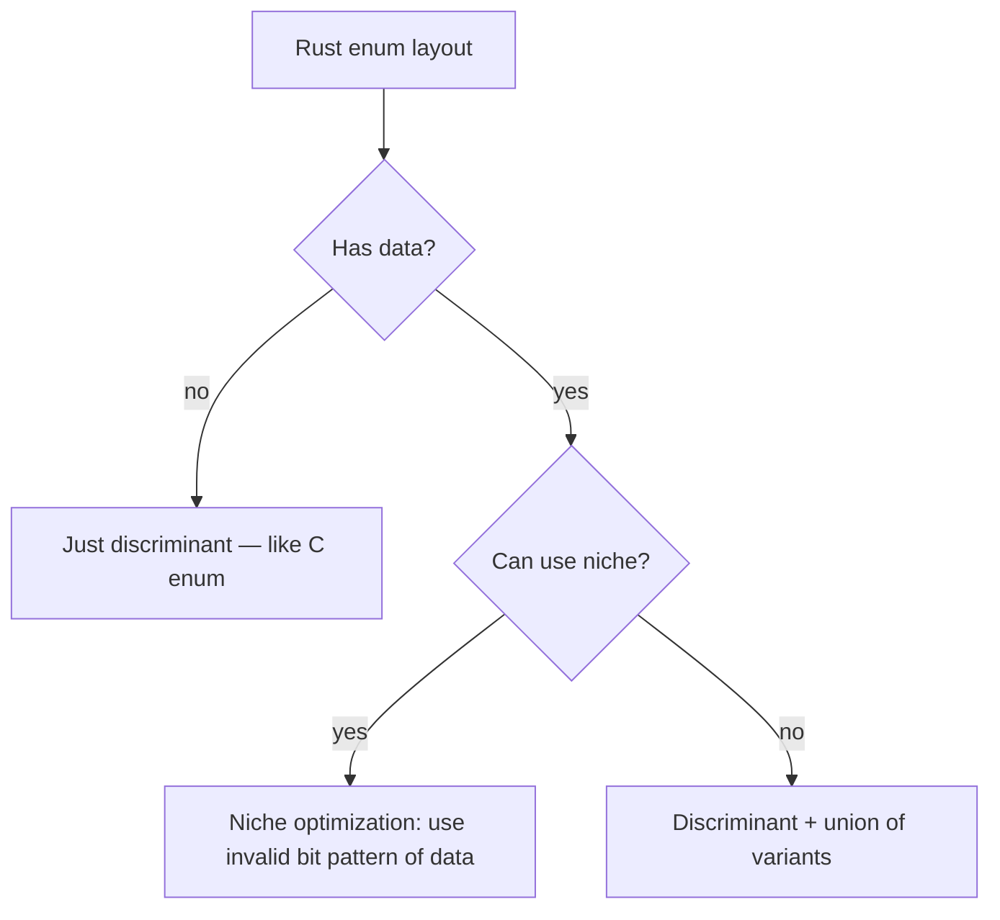

# Memory Layout and `repr` Attributes

> [!summary] Goal
> Control how Rust lays out types in memory for FFI compatibility, predictable size, and optimal alignment.

## Table of Contents

1. [Why Memory Layout Matters](#why-memory-layout-matters)
2. [Default `repr(Rust)`](#default-repr)
3. [`repr(C)` for FFI](#repr-for-ffi)
4. [`repr(transparent)`](#repr)
5. [`repr(packed)`](#repr)
6. [`repr(align(N))`](#repr)
7. [Enum Layout and Niche Optimization](#enum-layout-and-niche-optimization)
8. [Size and Alignment Queries](#size-and-alignment-queries)
9. [Pitfalls](#pitfalls)

---

## Why Memory Layout Matters

Rust's default layout is optimized for performance but is unspecified. When you need:
- **FFI**: match a C struct layout exactly
- **Predictable size**: serialize/deserialize byte-for-byte
- **Minimal padding**: reduce memory usage
- **Cache efficiency**: control field ordering

You use `repr` attributes to override the default layout.

```mermaid
flowchart TD
    A[Need memory layout] --> B{FFI with C?}
    B -->|yes| C[repr(C)]
    B -->|no| D{Predictable size?}
    D -->|yes| E[repr(C) or repr(packed)]
    D -->|no| F{Wrapping single field?}
    F -->|yes| G[repr(transparent)]
    F -->|no| H[Higher alignment?]
    H -->|yes| I[repr(align)]
    H -->|no| J[Let repr(Rust) optimize]
```

---

## Default `repr(Rust)`

Rust's default layout is **unspecified**:
- The compiler may reorder fields to minimize padding
- The layout may change between compiler versions
- No guarantees about field offsets

```rust
// Fields may be reordered to minimize padding
struct Data {
    a: u8,    // 1 byte
    b: u64,   // 8 bytes — would need 7 bytes padding after a
    c: u16,   // 2 bytes
}
// repr(Rust) may reorder to: b (8), a (1), c (2) = 11 bytes + padding
// repr(C) keeps order: a (1) + 7 pad + b (8) + c (2) + 6 pad = 24 bytes
```



---

## `repr(C)` for FFI

`repr(C)` lays out fields in declaration order, matching C's struct layout rules:

```rust
#[repr(C)]
struct Point {
    x: f64,       // offset 0, 8 bytes
    y: f64,       // offset 8, 8 bytes
    z: u8,        // offset 16, 1 byte
    // 7 bytes padding to align struct size to 8
}
// sizeof(Point) == 24
```

### Use with FFI

```rust
// C struct: struct timespec { time_t tv_sec; long tv_nsec; };
#[repr(C)]
struct Timespec {
    tv_sec: i64,
    tv_nsec: i64,
}

extern "C" {
    fn clock_gettime(clk_id: i32, tp: *mut Timespec) -> i32;
}
```

### `repr(C)` and enums

```rust
#[repr(C)]
enum Color {
    Red = 0,
    Green = 1,
    Blue = 2,
}
// sizeof(Color) == sizeof(i32) — just the discriminant
```

---

## `repr(transparent)`

Ensures a type has the same layout as its single non-zero-sized field:

```rust
#[repr(transparent)]
struct Wrapper(u64);  // Wrapper has the exact same layout as u64

#[repr(transparent)]
struct Id(usize);     // Id is layout-compatible with usize

#[repr(transparent)]
struct MyWrapper<T>(T);  // Same layout as T for any T
```

### When to use

- **Newtype wrappers** for FFI — safe to transmute between `Wrapper` and inner type
- **Adding traits** to foreign types without layout change
- **Zero-cost abstractions** — no runtime overhead

### Rules

- Must have exactly one non-zero-sized field
- Zero-sized fields (like `PhantomData`) are allowed
- The wrapper must not be `repr(C)` or `repr(packed)` simultaneously

```rust
#[repr(transparent)]
struct SendWrapper<T>(T, PhantomData<*const ()>);  // PhantomData is ZST — OK
```

---

## `repr(packed)`

Removes padding bytes between fields. Fields may be unaligned:

```rust
#[repr(packed)]
struct Packed {
    a: u8,    // offset 0
    b: u32,   // offset 1 — NOT aligned to 4 bytes!
    c: u16,   // offset 5 — NOT aligned to 2 bytes!
}
// sizeof(Packed) == 7 (no padding)
```

### Risks

**Unaligned access** is undefined behavior on some architectures (ARM) and slow on x86:

```rust
#[repr(packed)]
struct Misaligned {
    x: u8,
    y: u64,  // offset 1 — alignment = 8, but address mod 8 = 1
}

let m = Misaligned { x: 0, y: 42 };
// let val = m.y;  // UB: creating a reference to an unaligned field
```

**Fix**: copy fields by value instead of referencing:

```rust
let val = m.y;  // Copy by value — OK (no reference created)
```

### `repr(packed(N))`

Specify the packing alignment:

```rust
#[repr(packed(2))]  // pack to 2-byte alignment
struct Packed2 {
    a: u8,    // offset 0
    b: u32,   // offset 2 (align to 2, not 4)
    c: u16,   // offset 6
}
```

---

## `repr(align(N))`

Increases the alignment of a type beyond its natural alignment:

```rust
#[repr(align(64))]  // align to 64-byte cache line
struct CacheAligned {
    data: [u8; 32],
}

// Useful for:
// - Avoiding false sharing in concurrent code
// - DMA buffers requiring specific alignment
// - SIMD data (16/32/64 byte alignment)
```

```rust
#[repr(C, align(4096))]  // page-aligned for mmap
struct Page {
    data: [u8; 4096],
}
```

---

## Enum Layout and Niche Optimization



### Niche optimization

`Option<&T>` is the classic example — it uses the null pointer value as the `None` variant:

```rust
println!("{}", size_of::<&i32>());      // 8
println!("{}", size_of::<Option<&i32>>()); // 8 — same size!
// None is represented as a null pointer
```

Other niches:
- `Option<Box<T>>` — `Box<T>` is `NonNull`, so `None` uses the null value
- `Option<bool>` — `bool` has 256 possible bit patterns, but only 2 valid values. The remaining 254 are niches.
- `Option<NonZeroI32>` — `None` is zero

### Explicit `repr` for enums

```rust
#[repr(u8)]       // discriminant is u8
#[repr(C)]        // C-compatible layout
enum Small {
    A = 1,
    B = 2,
    C = 3,
}
// sizeof(Small) == 1
```

---

## Size and Alignment Queries

```rust
use std::mem;

println!("size_of::<i32>() = {}", size_of::<i32>());     // 4
println!("align_of::<i64>() = {}", align_of::<i64>());   // 8
println!("size_of_val(&x) = {}", size_of_val(&x));       // runtime size

// offset_of! (Rust 1.77+)
println!("offset_of!(Point, y) = {}", offset_of!(Point, y));
```

### Common sizes

| Type | Size | Alignment |
|------|------|-----------|
| `u8` | 1 | 1 |
| `u32` | 4 | 4 |
| `u64` | 8 | 8 |
| `usize` | 8 (64-bit) | 8 |
| `&T` / `&mut T` | 8 | 8 |
| `Box<T>` | 8 | 8 |
| `String` | 24 | 8 |

---

## Pitfalls

### Forgetting that repr(Rust) can reorder fields

```rust
// Assumes specific layout — BROKEN under repr(Rust)
let ptr = &data as *const Data as usize;
let field_ptr = unsafe { ptr.add(4) as *const u32 };  // offset may be wrong
```

**Fix**: use `repr(C)` when you need specific field offsets.

### Creating references to packed fields

```rust
#[repr(packed)]
struct S { x: u8, y: u16 }

let s = S { x: 0, y: 42 };
// let ry = &s.y;   // UB: reference to unaligned field
let ry = s.y;        // OK: copy by value
```

**Fix**: access packed fields by value, not by reference.

### Assuming Option<&T> is always the same size as &T

The niche optimization works only for types with a known invalid bit pattern. For `Option<&dyn Trait>`, the size doubles (two pointers: data + vtable).

### `repr(transparent)` with ZST only

```rust
#[repr(transparent)]
struct Foo;  // ERROR: no non-zero-sized field
```

**Fix**: `repr(transparent)` requires at least one non-ZST field.

---

> [!question]- Interview Questions
>
> **Q: What is the difference between `repr(Rust)` and `repr(C)`?**
> A: `repr(Rust)` is the default — layout is unspecified and may be optimized. `repr(C)` guarantees C-compatible field order, padding, and alignment rules. Use `repr(C)` for FFI.
>
> **Q: What is `repr(transparent)` used for?**
> A: It guarantees a type has the same layout as its single non-ZST field. Used for newtype wrappers that should be transparent to layout, enabling safe transmutation between the wrapper and inner type.
>
> **Q: What is niche optimization?**
> A: Rust uses invalid bit patterns of a type to represent enum variants like `None` in `Option`. For example, `Option<&T>` uses the null pointer value for `None`, making it the same size as `&T`.

---

## Cross-Links

- [[Rust/03_Advanced/02_Unsafe_Rust_and_FFI_Basics]] for FFI use cases
- [[Rust/03_Advanced/08_Build_Scripts_and_FFI_Deep]] for FFI in practice
- [[Rust/03_Advanced/03_Performance_Profiling_and_Allocation]] for cache-line alignment optimization
- [[Rust/03_Advanced/10_no_std_and_Embedded_Rust]] for embedded layout control

---

## References

- [Type Layout (Rust Reference)](https://doc.rust-lang.org/reference/type-layout.html)
- [Rustonomicon: repr(C)](https://doc.rust-lang.org/nomicon/other-reprs.html)
- [std::mem::offset_of!](https://doc.rust-lang.org/std/mem/macro.offset_of.html)
- [Rust RFC 2195: repr(transparent)](https://rust-lang.github.io/rfcs/2195-rep-transparent.html)
