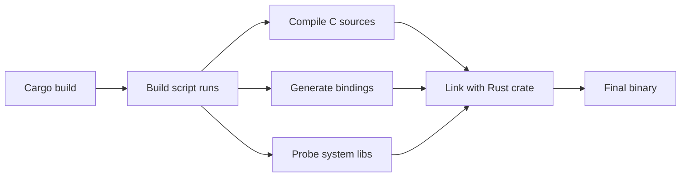

# Build Scripts and FFI in Depth

> [!summary] Goal
> Extend Rust with C dependencies, build scripts, and native library integration.

## Table of Contents

1. [Why Build Scripts Exist](#why-build-scripts-exist)
2. [`build.rs` Lifecycle](#build-rs-lifecycle)
3. [`cc` Crate for C Compilation](#cc-crate-for-c-compilation)
4. [`bindgen` for Auto-Generated Bindings](#bindgen-for-auto-generated-bindings)
5. [`pkg-config` for System Libraries](#pkg-config-for-system-libraries)
6. [Manual FFI Patterns](#manual-ffi-patterns)
7. [Pitfalls](#pitfalls)

---

## Why Build Scripts Exist

A `build.rs` file runs before your crate is compiled. It can:
- Compile C/C++/assembly source files
- Generate Rust bindings from C headers
- Probe the system for libraries
- Generate code at build time



> [!tip] Definition
> **`build.rs`**: a Rust script at your crate root (next to `Cargo.toml`) that Cargo compiles and runs before building your crate. It communicates with Cargo via stdout directives like `cargo:rustc-link-lib=z`.

---

## `build.rs` Lifecycle

### Basic structure

```rust
// build.rs
fn main() {
    println!("cargo:rerun-if-changed=src/c_code/");
    // build commands...
}
```

### Environment variables available

| Variable | Meaning |
|----------|---------|
| `CARGO_MANIFEST_DIR` | Directory of your crate's `Cargo.toml` |
| `OUT_DIR` | Output directory (for generated files) |
| `TARGET` | Target triple (e.g., `x86_64-unknown-linux-gnu`) |
| `HOST` | Host triple |
| `OPT_LEVEL` | Optimization level (`0`, `1`, `2`, `s`, `z`) |

### Cargo directives (printed to stdout)

```rust
// Tell cargo to link to a native library
println!("cargo:rustc-link-lib=z");  // link -lz
println!("cargo:rustc-link-search=/path/to/libs");  // -L flag

// Specify that certain files trigger a rebuild
println!("cargo:rerun-if-changed=wrapper.h");
println!("cargo:rerun-if-env-changed=CXXFLAGS");

// Pass cfg flags
println!("cargo:rustc-cfg=feature=\"custom_alloc\"");
```

---

## `cc` Crate for C Compilation

```toml
[build-dependencies]
cc = "1"
```

```rust
// build.rs
fn main() {
    cc::Build::new()
        .file("src/c_code/helper.c")
        .file("src/c_code/optimized.c")
        .include("src/c_code")  // -I flag
        .define("NDEBUG", None) // -DNDEBUG
        .opt_level(2)           // -O2
        .compile("helper");     // output: libhelper.a
}
```

Then in your Rust code:

```rust
extern "C" {
    fn helper_process(data: *const u8, len: usize) -> i32;
}
```

### `cc` with C++

```rust
cc::Build::new()
    .cpp(true)
    .std("c++17")
    .file("src/cpp/bridge.cpp")
    .compile("bridge");
```

---

## `bindgen` for Auto-Generated Bindings

```toml
[build-dependencies]
bindgen = "0.69"
```

```rust
// build.rs
fn main() {
    let bindings = bindgen::Builder::default()
        .header("wrapper.h")  // C header to parse
        .allowlist_function("my_rust_.*")  // only these functions
        .allowlist_type("MyConfig")
        .parse_callbacks(Box::new(bindgen::CargoCallbacks::new()))
        .generate()
        .expect("Unable to generate bindings");

    let out_path = std::path::PathBuf::from(std::env::var("OUT_DIR").unwrap());
    bindings
        .write_to_file(out_path.join("bindings.rs"))
        .expect("Could not write bindings");
}
```

```rust
// In your lib.rs
include!(concat!(env!("OUT_DIR"), "/bindings.rs"));
```

### `wrapper.h`

```c
// wrapper.h
#include "my_lib.h"
#include "other_lib.h"
```

---

## `pkg-config` for System Libraries

```toml
[build-dependencies]
pkg-config = "0.3"
```

```rust
fn main() {
    // Find system library via pkg-config
    let lib = pkg_config::Config::new()
        .atleast_version("1.2")
        .probe("libssl")
        .expect("libssl >= 1.2 not found");

    // pkg-config automatically outputs cargo:rustc-link-lib directives
}
```

### Manual probing

```rust
fn main() {
    // Check if a library exists
    if pkg_config::probe_library("libsodium").is_ok() {
        println!("cargo:rustc-cfg=have_sodium");
    }
}
```

---

## Manual FFI Patterns

### The `extern "C"` block

```rust
extern "C" {
    fn strlen(s: *const c_char) -> usize;
    fn malloc(size: usize) -> *mut c_void;
    fn free(ptr: *mut c_void);
}

unsafe {
    let len = strlen(std::ffi::CString::new("hello").unwrap().as_ptr());
}
```

### The `-sys` crate convention

Create a separate `*-sys` crate that only provides raw FFI bindings:

```
libzstd-sys/
├── Cargo.toml     # build-dependencies: cc, bindgen
├── build.rs        # compiles/links zstd
└── src/
    └── lib.rs      # raw extern "C" bindings
```

Higher-level crates then depend on `*-sys`:

```rust
// high-level crate
use libzstd_sys;
pub fn compress(data: &[u8]) -> Vec<u8> {
    unsafe {
        // Call low-level zstd functions
    }
}
```

---

## Pitfalls

### Cross-compilation

`build.rs` runs on the host machine but the output targets a different architecture:

```rust
fn main() {
    // HOST is the machine running the build
    // TARGET is the machine the binary will run on
    let target = std::env::var("TARGET").unwrap();
    if target.contains("arm") {
        // cross-compile flags
    }
}
```

### ABI mismatch

```rust
// C struct may have different alignment on different platforms
#[repr(C)]
struct CPoint {
    x: i32,
    y: i64,  // alignment differs between x86 and ARM
}
```

**Fix**: always match the C header exactly, test on all targets.

### Forgetting `rerun-if-changed`

Without this, cargo may not rebuild when C sources change:

```rust
fn main() {
    // Without this, changing helper.c won't trigger rebuild
    println!("cargo:rerun-if-changed=helper.c");
}
```

### Linking order

Static libraries must be linked in dependency order:

```rust
// If libB depends on libA:
println!("cargo:rustc-link-lib=B");
println!("cargo:rustc-link-lib=A");
```

---

> [!question]- Interview Questions
>
> **Q: What is the purpose of `build.rs`?**
> A: It's a build script that runs before crate compilation. Used for compiling C sources, generating bindings, probing system libraries, and generating code at build time.
>
> **Q: What is the `-sys` crate convention?**
> A: A separate crate that provides only raw FFI bindings to a native library (e.g., `libzstd-sys`). Higher-level crates depend on the `-sys` crate to provide safe Rust wrappers.
>
> **Q: How does `bindgen` work?**
> A: It parses C/C++ headers using libclang and generates Rust FFI bindings (extern "C" declarations, repr(C) structs, constants) automatically.

---

## Cross-Links

- [[Rust/03_Advanced/02_Unsafe_Rust_and_FFI_Basics]] for unsafe FFI fundamentals
- [[Rust/03_Advanced/07_Memory_Layout_and_repr_Attributes]] for repr(C) layout
- [[Rust/02_Core/10_OsStr_OsString_CStr_CString_and_System_Types]] for CString/CStr

---

## References

- [Cargo Build Scripts Guide](https://doc.rust-lang.org/cargo/reference/build-scripts.html)
- [cc crate](https://docs.rs/cc/)
- [bindgen](https://docs.rs/bindgen/)
- [pkg-config crate](https://docs.rs/pkg-config/)
- [The Rustonomicon: FFI](https://doc.rust-lang.org/nomicon/ffi.html)
