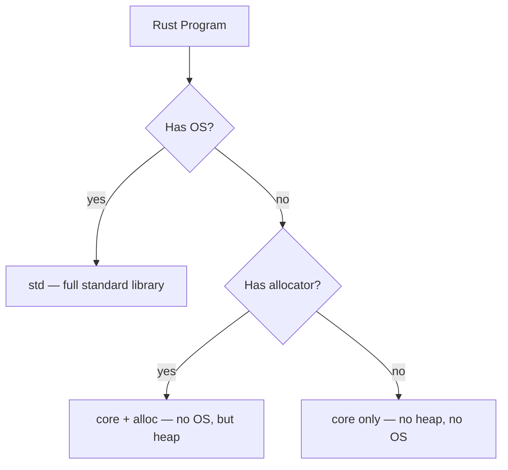

# `no_std` and Embedded Rust

> [!summary] Goal
> Use Rust without the standard library in embedded systems, kernels, and other constrained environments.

## Table of Contents

1. [Why `no_std` Exists](#why-nostd-exists)
2. [`core` vs `std` vs `alloc`](#core-vs-std-vs-alloc)
3. [Setting Up a `no_std` Project](#setting-up-a-nostd-project)
4. [Global Allocator](#global-allocator)
5. [`#[panic_handler]`](#panichandler)
6. [Embedded HAL](#embedded-hal)
7. [Pitfalls](#pitfalls)

---

## Why `no_std` Exists

Not all Rust targets have an operating system or heap allocator:
- Embedded microcontrollers (ARM Cortex-M, RISC-V)
- Kernels and operating systems
- Bootloaders and firmware
- WASM without std



---

## `core` vs `std` vs `alloc`

| Module | Available in `no_std` | Provides |
|--------|----------------------|----------|
| `core` | Always | Primitives, iterators, traits, cells, `Option`, `Result`, `mem` |
| `alloc` | With `#[global_allocator]` | `Box`, `Vec`, `String`, `Rc`, `Arc`, `HashMap` |
| `std` | Never in `no_std` | OS: files, networking, threads, I/O, processes, time |

### What `core` provides

```rust
// All of these work in #![no_std]:
use core::cell::RefCell;
use core::ops::Deref;
use core::option::Option;
use core::result::Result;
use core::iter::Iterator;
use core::marker::PhantomData;
use core::mem::{self, MaybeUninit};
use core::ptr;
use core::sync::atomic;
```

### What `std` adds that `core` does not have

| Feature | Alternative in `no_std` |
|---------|------------------------|
| `File`, `TcpStream` | Embedded HAL, raw registers |
| `thread::spawn` | Interrupt handling, cooperative tasks |
| `std::time::Instant` | Hardware timers |
| `std::sync::Mutex` | `critical_section` crate |
| `println!` | Custom serial output (`rtt`, `semihosting`) |
| Panic message output | Custom `panic_handler` |

---

## Setting Up a `no_std` Project

```rust
// main.rs (or lib.rs)
#![no_std]        // removes std linkage
#![no_main]       // no default main entry point

use core::panic::PanicInfo;

// Required: define a panic handler
#[panic_handler]
fn panic(_info: &PanicInfo) -> ! {
    loop {}
}

// Required for embedded: define entry point
// (depends on target — cortex-m-rt provides this)
```

```toml
# Cargo.toml
[package]
name = "firmware"
version = "0.1.0"
edition = "2021"

[dependencies]
cortex-m = "0.7"
cortex-m-rt = "0.7"
embedded-hal = "1.0"
```

---

## Global Allocator

If you need `alloc` (`Box`, `Vec`, `String`) in `no_std`:

```rust
#![no_std]

extern crate alloc;  // enable alloc crate

use alloc::vec::Vec;
use alloc::boxed::Box;
```

But you must provide a global allocator:

```rust
// Using a simple bump allocator or a pre-existing crate
use embedded_alloc::Heap;

#[global_allocator]
static HEAP: Heap = Heap::empty();

// Initialize the heap at runtime
fn init_heap() {
    const HEAP_SIZE: usize = 1024 * 16;  // 16 KB
    static mut HEAP_MEM: [u8; HEAP_SIZE] = [0; HEAP_SIZE];
    unsafe { HEAP.init(HEAP_MEM.as_mut_ptr() as usize, HEAP_SIZE) }
}
```

---

## `#[panic_handler]`

Every `no_std` program must define a panic handler — the function called when a panic occurs:

```rust
#![no_std]

use core::panic::PanicInfo;

// Minimal: just halt
#[panic_handler]
fn panic(_info: &PanicInfo) -> ! {
    loop {}
}

// With debug output (if you have serial)
#[panic_handler]
fn panic(info: &PanicInfo) -> ! {
    if let Some(location) = info.location() {
        write_serial!("Panic at {}:{}", location.file(), location.line());
    }
    loop {}
}
```

---

## Embedded HAL

`embedded-hal` provides portable abstractions for microcontroller peripherals:

```rust
use embedded_hal::digital::OutputPin;
use embedded_hal::delay::DelayNs;

fn blink(led: &mut impl OutputPin, delay: &mut impl DelayNs) {
    led.set_high().unwrap();
    delay.delay_ms(500);
    led.set_low().unwrap();
    delay.delay_ms(500);
}
```


### MCU-specific HALs

```rust
// STM32 example
use stm32f4xx_hal::gpio::GpioA;
use stm32f4xx_hal::pac::Peripherals;

let dp = Peripherals::take().unwrap();
let gpioa = GpioA::new(dp.GPIOA);
let mut led = gpioa.pa5.into_push_pull_output();
```

---

## Pitfalls

### Forgetting `#[global_allocator]`

```rust
#![no_std]
extern crate alloc;
use alloc::vec::Vec;

fn process() {
    let v = vec![1, 2, 3];  // ERROR: no global allocator found
}
```

**Fix**: define a `#[global_allocator]` or don't use `alloc`.

### Floating point in `no_std`

Basic float operations work (`f32`, `f64`), but transcendental functions (`sin`, `cos`, `sqrt`) are not available on all targets. Use `libm` crate:

```toml
[dependencies]
libm = "0.2"
```

### Stack overflow

```rust
fn recurses_forever() {
    recurses_forever();  // no guard page in embedded — may silently corrupt memory
}
```

**Fix**: use stack limit checks and avoid deep recursion in `no_std`.

### Panic in `no_std`

A panic without a proper handler just hangs. Always provide a `#[panic_handler]`.

---

> [!question]- Interview Questions
>
> **Q: What is the difference between `core` and `std`?**
> A: `core` is the subset of the standard library that doesn't depend on an OS (primitives, traits, cells, iterators). `std` adds OS-dependent features (files, networking, threading, time).
>
> **Q: What do you need to set up a `no_std` project?**
> A: `#![no_std]`, `#![no_main]` (usually), a `#[panic_handler]`, and an entry point (provided by platform-specific crates like `cortex-m-rt`). If using `alloc`, also a `#[global_allocator]`.
>
> **Q: What is `embedded-hal`?**
> A: A set of portable traits for embedded peripherals (GPIO, SPI, I2C, timers). Code written against `embedded-hal` can run on any microcontroller that has a HAL implementation.

---

## Cross-Links

- [[Rust/03_Advanced/10_Global_Allocators_and_Allocation]] for global allocator details
- [[Rust/03_Advanced/06_Const_Generics_and_GATs]] for compile-time fixed buffers
- [[Rust/03_Advanced/03_Performance_Profiling_and_Allocation]] for allocation cost analysis

---

## References

- [The Embedded Rust Book](https://docs.rust-embedded.org/book/)
- [The Embedonomicon](https://docs.rust-embedded.org/embedonomicon/)
- [embedded-hal crate](https://docs.rs/embedded-hal/)
- [cortex-m-quickstart](https://github.com/rust-embedded/cortex-m-quickstart)
- [Rust no_std Reference](https://docs.rust-embedded.org/book/intro/no-std.html)
