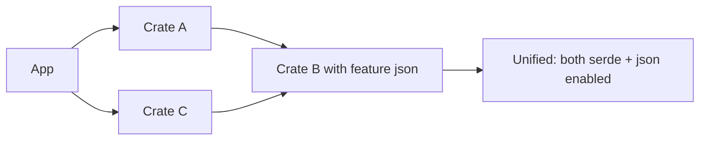

# Cargo Features and Conditional Compilation

> [!summary] Goal
> Build flexible crates with compile-time feature selection that doesn't break semver.

## Table of Contents

1. [Why Features Matter](#why-features-matter)
2. [Declaring Features](#declaring-features)
3. [Feature Resolution](#feature-resolution)
4. [`cfg` and `cfg_attr`](#cfg-and-cfgattr)
5. [Target-Specific Code](#target-specific-code)
6. [Pitfalls](#pitfalls)

---

## Why Features Matter

Cargo features allow crates to offer optional functionality:
- Feature-gated dependencies (`serde` support behind a feature)
- Different implementations for different platforms
- Reducing compile time by omitting unused code

```mermaid
flowchart LR
    A[Cargo.toml features] --> B[Feature resolution]
    B --> C[Unified feature set for crate]
    C --> D[#\[cfg(feature = "foo")\] blocks enabled]
    C --> E[Optional dependencies included]
```

> [!tip] Definition
> **Cargo feature**: a named flag that enables conditional compilation and optional dependencies. Features are additive — enabling more features only adds code, never removes it.

---

## Declaring Features

```toml
[package]
name = "my-crate"

[features]
default = ["std"]              # features enabled by default
std = []                        # empty feature = flag only
serde = ["dep:serde", "dep:serde_json"]  # enables optional deps
extra = ["std"]                 # feature that depends on another feature
nightly = []                    # unstable features

[dependencies]
serde = { version = "1", optional = true }
serde_json = { version = "1", optional = true }
```

```rust
// In src/lib.rs
#![cfg_attr(not(feature = "std"), no_std)]

#[cfg(feature = "serde")]
impl Serialize for MyType { /* ... */ }

#[cfg(feature = "nightly")]
fn experimental() { /* ... */ }
```

### Optional dependencies as features

Since Rust 1.60, you can use `dep:` prefix to avoid namespace conflicts:

```toml
[dependencies]
serde = { version = "1", optional = true }
regex = { version = "1", optional = true }

[features]
default = []
serde = ["dep:serde"]   # enables cfg(feature = "serde")
my-regex = ["dep:regex"]
```

---

## Feature Resolution

### The additive assumption

Features must be **additive** — enabling more features should never break existing code:

```rust
// BAD — enabling "json" feature changes behavior
#[cfg(not(feature = "json"))]
fn parse(input: &str) -> Result<Data, Error> { /* simple parser */ }

#[cfg(feature = "json")]
fn parse(input: &str) -> Result<Data, Error> { /* json parser */ }
// If one crate enables "json" and another doesn't, they get different behaviors!
```

### Feature unification

When crate A depends on crate B, features from both are unified:

```rust
// Crate A depends on "serde" feature of B
// Crate C depends on "json" feature of B
// Both B features are enabled (unified)
```



### Mutually exclusive features (not natively supported)

```toml
# Features that shouldn't be combined need runtime or compile-time checks
[features]
default = ["backend-a"]
backend-a = []
backend-b = []
```

```rust
#[cfg(all(feature = "backend-a", feature = "backend-b"))]
compile_error!("features backend-a and backend-b are mutually exclusive");
```

---

## `cfg` and `cfg_attr`

### `cfg` predicate forms

```rust
#[cfg(target_os = "linux")]           // specific OS
#[cfg(not(target_os = "windows"))]    // NOT windows
#[cfg(any(feature = "a", feature = "b"))]  // any of
#[cfg(all(unix, feature = "std"))]    // all of
#[cfg(target_arch = "x86_64")]        // architecture
#[cfg(debug_assertions)]              // debug build
```

### `cfg_attr` — conditional attributes

```rust
// Apply repr(C) only on wasm
#[cfg_attr(target_arch = "wasm32", repr(C))]
struct Exportable {
    x: i32,
    y: i32,
}
```

### `cfg!` macro — runtime check

```rust
if cfg!(target_os = "linux") {
    // Linux-specific code path
} else if cfg!(target_os = "macos") {
    // macOS-specific code path
}
```

---

## Target-Specific Code

```rust
#[cfg(target_os = "linux")]
fn get_platform_info() -> String {
    String::from("Linux")
}

#[cfg(target_os = "windows")]
fn get_platform_info() -> String {
    String::from("Windows")
}

#[cfg(not(any(target_os = "linux", target_os = "windows")))]
fn get_platform_info() -> String {
    String::from("Unknown")
}
```

### Common `cfg` conditions

| Condition | Values |
|-----------|--------|
| `target_os` | `linux`, `macos`, `windows`, `android`, `freebsd`, `none` |
| `target_arch` | `x86_64`, `x86`, `aarch64`, `arm`, `wasm32`, `riscv64` |
| `target_family` | `unix`, `windows`, `wasm` |
| `target_env` | `gnu`, `msvc`, `musl` |
| `feature` | User-defined in `[features]` |
| `debug_assertions` | Enabled in debug builds |
| `test` | Enabled when compiling tests |

---

## Pitfalls

### Semver hazard with feature addition

Adding a new default feature is a semver-major change. Never add a default feature in a patch release.

### Feature explosion

Multiple optional dependencies can create a combinatorial explosion of features. Use `dep:` prefix to minimize.

### `cfg` vs conditional compilation

`#[cfg(feature = "...")]` is compile-time. Don't use it for runtime decisions — use `if cfg!(...)` or match on environment variables.

### Feature names as identifiers

Feature names become `cfg` identifiers. Avoid Rust keywords and use `kebab-case`:

```toml
[features]
my-feature = []  # accessible as cfg(feature = "my-feature")
```

---

> [!question]- Interview Questions
>
> **Q: What is feature resolution in Cargo?**
> A: When multiple crates depend on the same dependency, Cargo unifies the features — all requested features are enabled. Features must be additive to prevent breaking changes.
>
> **Q: What is the `dep:` prefix in features?**
> A: `dep:serde` means "enable the optional serde dependency without creating a feature named `serde`". Prevents namespace conflicts between dependency names and feature flags.
>
> **Q: What is the difference between `#[cfg]` and `if cfg!(...)`?**
> A: `#[cfg]` is compile-time conditional compilation — the excluded code is not compiled. `cfg!(...)` is a runtime boolean check — both branches are compiled but only one executes.

---

## Cross-Links

- [[Rust/01_Foundations/06_Modules_Crates_Cargo_and_Tooling]] for Cargo fundamentals
- [[Rust/02_Core/05_Serde_JSON_and_Data_Modeling]] for optional serde dependency pattern
- [[Rust/03_Advanced/08_Build_Scripts_and_FFI_Deep]] for build.rs cfg directives

---

## References

- [Cargo Features](https://doc.rust-lang.org/cargo/reference/features.html)
- [Conditional Compilation (Rust Reference)](https://doc.rust-lang.org/reference/conditional-compilation.html)
- [cfg macro](https://doc.rust-lang.org/std/macro.cfg.html)
- [Cargo SemVer Compatibility](https://doc.rust-lang.org/cargo/reference/semver.html)
