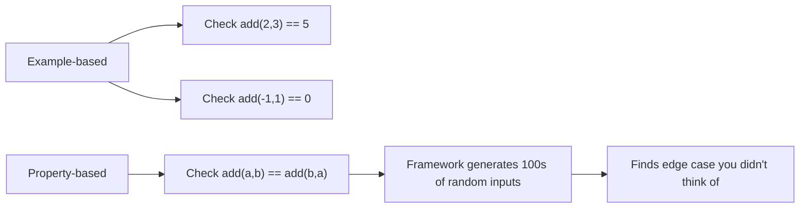
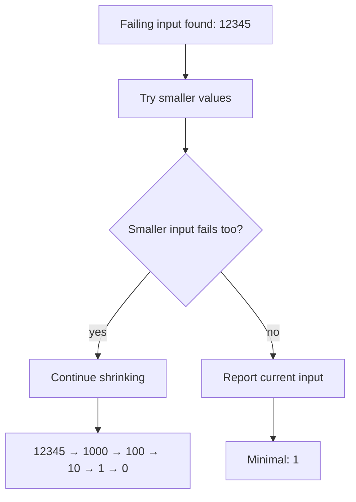

# Property-Based Testing with `proptest`

> [!summary] Goal
> Find edge cases automatically by testing invariants with randomly generated inputs.

## Table of Contents

1. [Why Property-Based Testing](#why-property-based-testing)
2. [Basic Usage with `proptest`](#basic-usage-with-proptest)
3. [Strategies](#strategies)
4. [Shrinking](#shrinking)
5. [When to Use vs Example-Based Tests](#when-to-use-vs-example-based-tests)
6. [Pitfalls](#pitfalls)

---

## Why Property-Based Testing

Instead of writing specific inputs and expected outputs, you write *invariants* (properties) and let the framework find failing inputs.



> [!tip] Definition
> **Property-based testing**: test approach where you define properties that must hold for all inputs, and the framework generates random inputs to verify them. When a failure is found, it *shrinks* the input to the minimal failing example.

---

## Basic Usage with `proptest`

```toml
[dev-dependencies]
proptest = "1"
```

```rust
use proptest::prelude::*;

// Property: reversing twice gives the original
proptest! {
    #[test]
    fn reverse_twice_is_identity(mut xs: Vec<i32>) {
        let original = xs.clone();
        xs.reverse();
        xs.reverse();
        assert_eq!(xs, original);
    }
}

// Property: sorting is idempotent
proptest! {
    #[test]
    fn sort_twice_is_identity(mut xs: Vec<i32>) {
        xs.sort();
        let sorted_once = xs.clone();
        xs.sort();
        assert_eq!(xs, sorted_once);
    }
}
```

---

## Strategies

### Core strategies

```rust
proptest! {
    #[test]
    fn test_strategies(
        a in any::<i32>(),                             // any i32
        b in 0i32..100,                                // range
        c in prop::collection::vec(any::<u8>(), 0..100), // vec of 0-100 u8s
        d in "[a-zA-Z0-9]+",                           // regex-generated string
        e in prop::option::of(any::<bool>()),           // Option<bool>
        f in prop::collection::hash_set(any::<u32>(), 0..50), // HashSet
    ) {
        // test with all these inputs
    }
}
```

### Custom strategies

```rust
#[derive(Debug, Clone)]
struct User {
    name: String,
    age: u8,
}

fn valid_user() -> impl Strategy<Value = User> {
    ("[a-zA-Z]+", 0u8..150).prop_map(|(name, age)| User { name, age })
}

proptest! {
    #[test]
    fn test_user_processing(user in valid_user()) {
        let result = process_user(&user);
        assert!(result.is_ok());
    }
}
```

### Filtering

```rust
proptest! {
    #[test]
    fn only_even(x in (0i32..1000).prop_filter("must be even", |x| x % 2 == 0)) {
        assert_eq!(x % 2, 0);
    }
}
```

---

## Shrinking

When proptest finds a failure, it shrinks the input to the minimal failing case:

```
Test failed: 'attempt to subtract with overflow' on inputs:
  a: 0, b: 2147483647
Shrinking completed: minimal failing input:
  a: 0, b: 1
```

This is the killer feature — instead of "test failed with random input X", you get "test failed with the simplest possible input that reproduces the bug."

### How shrinking works



---

## When to Use vs Example-Based Tests

| Aspect | Example-based | Property-based |
|--------|---------------|----------------|
| Inputs | Fixed, hand-picked | Random, generated |
| Coverage | What you thought of | What the framework explores |
| Output | Specific expected value | Invariant / property |
| Setup | Simple | Needs strategy + property |
| Debugging | Easy — known input | May need shrinking |
| Best for | Happy path, known edge cases | Invariants, edge case discovery |

### When to use property-based

- **Commutativity**: `a + b == b + a`
- **Idempotency**: `sort(sort(x)) == sort(x)`
- **Round-trip**: `decode(encode(x)) == x`
- **Invariants**: `result.len() <= input.len()`
- **No crashes**: `parse(s)` never panics for any string

---

## Pitfalls

### Property is wrong

```rust
// BAD property — tautological
proptest! {
    #[test]
    fn bad_property(xs: Vec<i32>) {
        let cloned = xs.clone();
        assert_eq!(xs, cloned);  // always true — tests nothing
    }
}
```

### Too slow

Complex strategies with many iterations can be slow. Reduce `cases`:

```rust
proptest! {
    #![proptest_config(ProptestConfig {
        cases: 100,  // default is 256
        .. ProptestConfig::default()
    })]
    #[test]
    fn expensive_test(xs: Vec<String>) { /* ... */ }
}
```

### Non-deterministic failures

Tests that depend on external state (file system, network) are bad for property tests. Use example-based tests for those.

### Flaky tests from timing

Don't use property tests for timing-sensitive or concurrent code where random interleaving matters. Use loom or shuttle instead.

---

> [!question]- Interview Questions
>
> **Q: What is property-based testing?**
> A: You define invariants that must hold for all inputs, and the test framework generates random inputs to find failures. When a failure is found, the framework shrinks the input to the minimal reproducing case.
>
> **Q: How does shrinking work?**
> A: When a failing input is found, the framework tries progressively smaller/simpler inputs until it finds the smallest input that still reproduces the failure.
>
> **Q: When should you use property-based vs example-based tests?**
> A: Property-based for invariants, round-trips, and edge case discovery. Example-based for known happy paths, specific bug regression tests, and tests requiring complex setup.

---

## Cross-Links

- [[Rust/01_Foundations/07_Testing_in_Rust]] for general testing framework
- [[Rust/03_Advanced/03_Performance_Profiling_and_Allocation]] for benchmarking property tests

---

## References

- [proptest crate](https://docs.rs/proptest/)
- [proptest book](https://proptest-rs.github.io/proptest/intro.html)
- [quickcheck crate](https://docs.rs/quickcheck/)
- [Property-Based Testing (Talk)](https://www.youtube.com/watch?v=shAvhB9A2x0)
