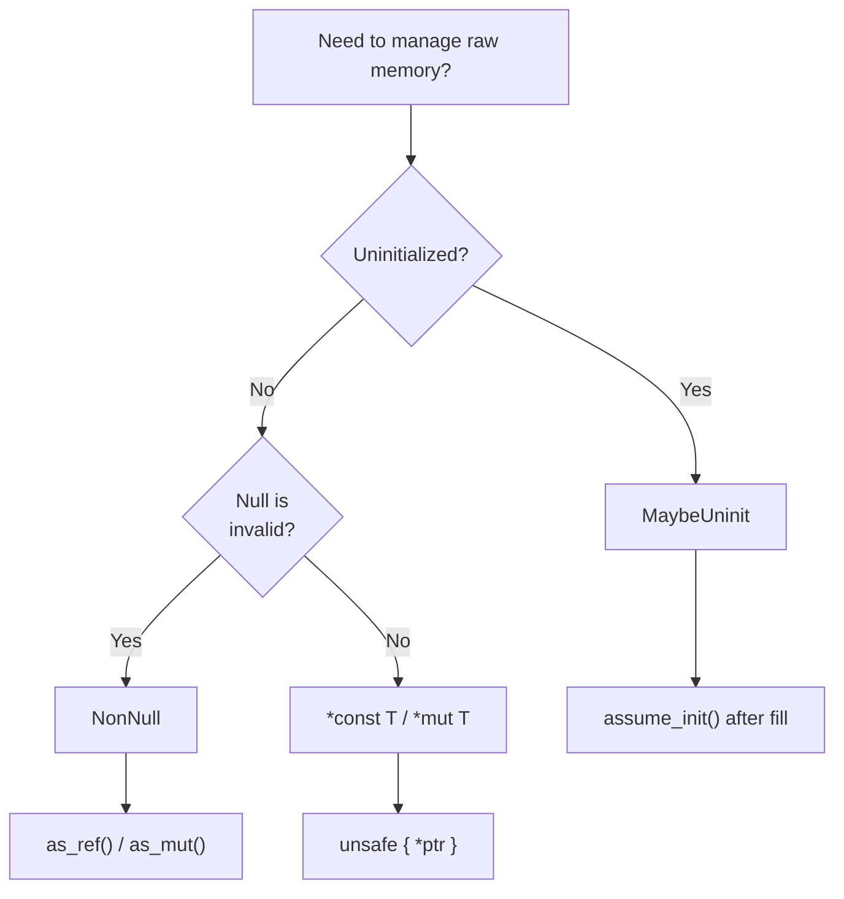

# `MaybeUninit`, `NonNull`, and Raw Pointer Patterns

> [!summary] Goal
> Master the three tools for working with raw memory safely: `MaybeUninit` for uninitialized data, `NonNull` for non-null pointer semantics, and raw pointer patterns (provenance, read/write, arithmetic). Write unsafe code that is auditable, documented, and correct.

## Table of Contents

1. [Why Raw Memory Tools Exist](#why-raw-memory-tools-exist)
2. [MaybeUninit](#maybeuninit)
3. [NonNull](#nonnull)
4. [Pointer Provenance](#pointer-provenance)
5. [Pointer Arithmetic and Layout](#pointer-arithmetic-and-layout)
6. [ptr::read, ptr::write, ptr::copy](#ptrread-ptrwrite-ptrcopy)
7. [Decision Guide](#decision-guide)
8. [Pitfalls](#pitfalls)

---

## Why Raw Memory Tools Exist

Safe Rust provides references (`&T`, `&mut T`) and ownership. But some patterns require bypassing the borrow checker: self-referential structures, custom allocators, FFI buffers, and low-level data structures. For these, you need `*const T`/`*mut T`, `MaybeUninit`, and `NonNull`.



---

## MaybeUninit

(already covered in A02 — cross-reference)

> [!tip] This section covers `MaybeUninit` in depth. For the core API and basic usage, see [[Rust/03_Advanced/02_Unsafe_Rust_and_FFI_Basics#maybeuninit|the introduction in A02]].

### Advanced patterns

```rust
use std::mem::MaybeUninit;

// Pattern: batch initialization of an array
fn fill_array<T, F>(f: F) -> [T; 1024]
where
    F: FnMut(usize) -> T,
{
    // Starting from Rust 1.82, you can use [MaybeUninit; N] with const generics
    let mut arr: [MaybeUninit<T>; 1024] = unsafe {
        MaybeUninit::uninit().assume_init()
    };
    // SAFETY: MaybeUninit can start uninitialized (it's a union).
    // Initializing an array of MaybeUninit<T> from a single MaybeUninit
    // is safe because MaybeUninit has no drop and no validity constraints.

    for (i, elem) in arr.iter_mut().enumerate() {
        elem.write(f(i));
    }

    // SAFETY: all 1024 elements were initialized above
    unsafe { std::mem::transmute_copy(&arr) }
}

// Pattern: drop-in-place for Vec-like structures
struct RawVec<T> {
    ptr: *mut T,
    cap: usize,
}

impl<T> Drop for RawVec<T> {
    fn drop(&mut self) {
        unsafe {
            // Deallocate without dropping elements
            std::alloc::dealloc(
                self.ptr as *mut u8,
                std::alloc::Layout::array::<T>(self.cap).unwrap(),
            );
        }
    }
}

// Pattern: lazy initialization with MaybeUninit
struct LazyBuffer {
    data: MaybeUninit<[u8; 65536]>,
    initialized: bool,
}

impl LazyBuffer {
    fn new() -> Self {
        Self {
            data: MaybeUninit::uninit(),
            initialized: false,
        }
    }

    fn ensure_initialized(&mut self) -> &mut [u8; 65536] {
        if !self.initialized {
            let ptr = self.data.as_mut_ptr();
            unsafe { ptr.write([0u8; 65536]); }
            self.initialized = true;
        }
        unsafe { self.data.assume_init_mut() }
    }
}
```

### When to use `MaybeUninit` (decision)

```text
Use MaybeUninit when:
  - You're constructing a large array element-by-element and zero-init cost matters.
  - C/Fortran gives you a buffer and fills it in — you need uninit memory.
  - You're building a Vec-like structure that manages its own allocation.
  - You need to avoid the drop of intermediate values during swap/initialization.

Don't use MaybeUninit when:
  - Default::default() or zero-init is acceptable.
  - The type is Copy and initialized trivially.
  - Option<T> or Box<MaybeUninit<T>> would be simpler.
```

---

## NonNull

(already covered in A02 — cross-reference)

> [!tip] For core `NonNull` API, see [[Rust/03_Advanced/02_Unsafe_Rust_and_FFI_Basics#nonnull|A02's NonNull section]].

### Advanced NonNull patterns

```rust
use std::ptr::NonNull;

// Pattern: NonNull in custom collection internals
struct MyVec<T> {
    ptr: NonNull<T>,
    len: usize,
    cap: usize,
}

impl<T> MyVec<T> {
    fn new() -> Self {
        // Even empty Vec has a valid NonNull (pointer from Layout::array)
        let layout = std::alloc::Layout::array::<T>(0).unwrap();
        let ptr = unsafe { std::alloc::alloc(layout) as *mut T };
        Self {
            ptr: NonNull::new(ptr).expect("Layout::array(0) should never fail"),
            len: 0,
            cap: 0,
        }
    }

    fn as_ptr(&self) -> *const T {
        self.ptr.as_ptr()
    }

    fn as_mut_ptr(&mut self) -> *mut T {
        self.ptr.as_ptr()
    }
}

// Pattern: NonNull with FFI opaque handles
struct OpaqueHandle(NonNull<std::ffi::c_void>);

impl OpaqueHandle {
    fn from_raw(ptr: *mut std::ffi::c_void) -> Option<Self> {
        Some(Self(NonNull::new(ptr)?))
    }

    fn as_raw(&self) -> *mut std::ffi::c_void {
        self.0.as_ptr()
    }
}
```

### `NonNull` vs `*mut T` when to use

```text
Use NonNull when:
  - You want the type system to guarantee non-nullness.
  - You're storing a pointer in a struct and null is never valid.
  - You want Option<NonNull<T>> to be pointer-sized (niche optimization).
  - You're building a collection or smart pointer (like std does for Box, Vec, Rc).

Use *mut T / *const T when:
  - Null is a valid sentinel value.
  - You're writing FFI where C returns NULL to indicate "not found" or "error".
  - The pointer may legitimately be null during initialization.
  - You're just passing through to FFI without storing.
```

---

## Pointer Provenance

> [!info] Pointer provenance
> In Rust (and C/C++), a pointer is not just an integer address. It carries **provenance** — information about which allocation it was derived from. Using a pointer to access memory outside its original allocation is UB, even if the address happens to be correct. This is the foundation of aliasing-based optimizations.

### What provenance means

```rust
// Provenance = the "origin" of a pointer.
// A pointer derived from allocation A can ONLY access bytes within allocation A.

let a = [1, 2, 3];
let b = [4, 5, 6];

let ptr_a = &a as *const i32;

// ❌ UB: accessing b through ptr_a (wrong provenance)
// let val_b = unsafe { *ptr_a.add(3) };
// Even if a and b are adjacent in memory, this is UB.
// The compiler assumes ptr_a only addresses bytes belonging to `a`.

// ✅ Correct: use the pointer for its own allocation
let val_a = unsafe { *ptr_a };          // OK: ptr_a points within a
let val_a3 = unsafe { *ptr_a.add(2) };  // OK: index 2 is within a's range
```

### Provenance with integer casts

```rust
// Pointer-to-int casts erase provenance.
// Int-to-pointer casts need the compiler to "recreate" provenance.

let x = 42u64;
let addr = &x as *const u64 as usize;  // Provenance ERASED

// Recreating provenance from an integer is tricky:
// let ptr = addr as *const u64;
// unsafe { *ptr };  // UB! No provenance for this access — the compiler
//                      doesn't know which allocation `addr` belongs to.

// The Strict Provenance APIs (Rust 1.72+):
use std::ptr;

let p = &x as *const u64;

// Instead of: let addr = p as usize;
// Use:
let addr = p.addr();  // Exposes address without erasing provenance
// addr is just a usize — it doesn't carry provenance.

// Instead of: let p2 = addr as *const u64;
// Use:
let p2 = ptr::with_exposed_provenance::<u64>(addr);
// ⚠️  This is unsafe — you're telling the compiler "I know this address
//    points to valid memory with appropriate provenance."
```

### Strict provenance best practices

```rust
// ✅ Do: keep pointers, don't cast to integers unless necessary
// ❌ Don't: round-trip through integers for aliasing tricks

use std::ptr;

// Acceptable cast (only for FFI or hardware addresses):
fn mmap_register(phys_addr: usize, size: usize) -> *mut u8 {
    // Physical memory at known address — no provenance
    ptr::with_exposed_provenance_mut(phys_addr)
}

// Better approach — carry the provenance:
unsafe fn read_at<T>(base: *const T, offset: usize) -> T {
    // SAFETY: caller guarantees base + offset is within the allocation
    ptr::read(base.add(offset))
}
```

---

## Pointer Arithmetic and Layout

### Safe arithmetic with `offset` / `add` / `sub`

```rust
use std::ptr;

let arr = [10, 20, 30, 40, 50];
let p = &arr as *const i32;

unsafe {
    // add: advance by N elements (not bytes!)
    let p1 = p.add(1);    // points to arr[1]
    let p2 = p.add(2);    // points to arr[2]
    println!("{}, {}", *p1, *p2);  // 20, 30

    // sub: go back by N elements
    let p0 = p2.sub(2);   // points to arr[0]
    println!("{}", *p0);  // 10

    // offset: same as add but with signed offset
    let p_back = p.offset(4);  // points to arr[4]
    println!("{}", *p_back);   // 50
}

// ⚠️  These are UB if the resulting pointer is out of bounds of the allocation
//    OR if you go more than one element past the end (one-past-end is OK).
```

### Layout-aware allocation

```rust
use std::alloc::{Layout, alloc, dealloc};

// Layout describes size and alignment for an allocation.
// Required for custom allocator usage.

let layout = Layout::new::<i32>();       // size=4, align=4
let big = Layout::array::<f64>(1000).unwrap();  // size=8000, align=8

// Custom allocation:
unsafe {
    let ptr = alloc(layout);
    // SAFETY: alignment and size match i32
    *(ptr as *mut i32) = 42;
    dealloc(ptr, layout);
}
```

---

## ptr::read, ptr::write, ptr::copy

### `ptr::read` — move out without dropping

```rust
use std::ptr;

let s = String::from("hello");

// Read the value out — moves ownership
let moved: String = unsafe { ptr::read(&s) };
// SAFETY: we moved out of s, but s is still "alive" (scope).
// After ptr::read, s should NOT be used unless we ptr::write back.

// After this, s is conceptually uninitialized.
// If we let s drop normally, it double-frees! Must ptr::write to restore:
unsafe { ptr::write(&s as *const String as *mut String, String::new()); }
// Now s is valid again (empty string).
```

### `ptr::write` — overwrite without dropping

```rust
let mut target = String::from("old");

// Overwrite `target` without dropping the old value
unsafe {
    ptr::write(&mut target, String::from("new"));
}
// The old "old" string is leaked (not dropped)!

// Use ptr::drop_in_place before write if you need to free the old value:
unsafe {
    ptr::drop_in_place(&mut target);  // Drops the old "new" value
    ptr::write(&mut target, String::from("replaced"));
}
```

### `ptr::copy` / `ptr::copy_nonoverlapping` — memcpy

```rust
use std::ptr;

let mut src = [1, 2, 3, 4, 5];
let mut dst = [0, 0, 0, 0, 0];

// copy: like memmove (handles overlap)
unsafe {
    ptr::copy(
        src.as_ptr(),
        dst.as_mut_ptr(),
        5,  // count in elements, not bytes
    );
}
assert_eq!(dst, [1, 2, 3, 4, 5]);

// copy_nonoverlapping: like memcpy (UB if overlap exists)
// Faster than copy when you know the regions don't overlap.
unsafe {
    ptr::copy_nonoverlapping(
        src.as_ptr(),
        dst.as_mut_ptr().add(1) as *mut i32,
        3,
    );
}
// dst is now [1, 1, 2, 3, 5]
```

---

## Decision Guide

```text
What do I need?                           Use this
──────────────────────────────────────────────────────────
Uninitialized memory, will fill later     MaybeUninit<T>
Non-null pointer guarantee                NonNull<T>
Pointer-level ownership without aliasing  *mut T
Read-only pointer to immutably owned data *const T
Move value out without dropping           ptr::read
Overwrite without dropping old value      ptr::write
Copy bytes (possibly overlapping)         ptr::copy
Copy bytes (non-overlapping, faster)      ptr::copy_nonoverlapping
Run destructor in place                   ptr::drop_in_place
Custom allocator layout                   std::alloc::Layout
Get address without erasing provenance    ptr.addr()
```

---

## Pitfalls

### Using `MaybeUninit::assume_init()` before fully initializing

The most common `MaybeUninit` bug. Every byte must be written before calling `assume_init()`. For complex types, even a single uninitialized byte is UB.

### `ptr::read` followed by normal drop

If you `ptr::read` a value out of a location and then let the location drop normally, the destructor runs twice (double free). Always `ptr::write` a valid value back before the scope ends, or use `ManuallyDrop`.

### Pointer arithmetic overflow

`ptr.add(x)` wraps with the allocation, but only within bounds. Creating a pointer that's more than one element past the end is UB, even if you never dereference it.

### Casting `*const T` to `*mut T` and mutating

Safe Rust guarantees that no mutation happens through a shared reference. If you cast `&T` to `*mut T` and mutate, you might violate compiler assumptions (aliasing) and cause UB, even if the target isn't otherwise accessed.

---

## Cross-Links

- [[Rust/03_Advanced/02_Unsafe_Rust_and_FFI_Basics]] for unsafe fundamentals, Miri, inline assembly
- [[Rust/03_Advanced/07_Memory_Layout_and_repr_Attributes]] for repr, alignment, size_of
- [[Rust/02_Core/08_Deref_Drop_and_RAII_Patterns]] for Drop and RAII integration
- [[Rust/03_Advanced/10_Global_Allocators_and_Allocation]] for custom allocators
