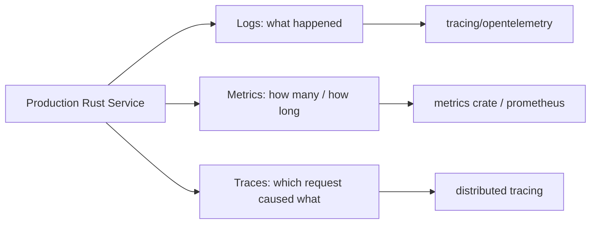

# Tracing, Logging, and Observability

> [!summary] Goal
> Instrument Rust applications for production observability: structured logging with `tracing`, spans for distributed context, metrics collection, OpenTelemetry integration, and making failures diagnosable without reproducing them.

## Table of Contents

1. [Why Observability Matters](#why-observability-matters)
2. [The tracing Crate](#the-tracing-crate)
3. [Spans, Events, and Fields](#spans-events-and-fields)
4. [Subscribers and Exporters](#subscribers-and-exporters)
5. [Logging Compatibility](#logging-compatibility)
6. [Metrics Collection](#metrics-collection)
7. [OpenTelemetry Integration](#opentelemetry-integration)
8. [Pitfalls](#pitfalls)

---

## Why Observability Matters

Rust's error handling (Result/Option) forces you to handle errors explicitly — but "handled" doesn't mean "diagnosable." Without tracing, you can't answer:

- Which request caused this error?
- How long does each step take?
- Is the system CPU-bound, IO-bound, or sync-bound?
- Where are requests being dropped?



---

## The `tracing` Crate

> [!info] tracing
> The `tracing` crate (by Elijah Laprise, Tokio team) is the standard Rust observability framework. It provides **spans** (scoped, structured context) and **events** (point-in-time log messages) with structured fields. Unlike traditional logging (just strings), tracing lets tools query by field values, duration, and span hierarchy.

```toml
# Cargo.toml
[dependencies]
tracing = "0.1"
tracing-subscriber = "0.3"    # For stdout, JSON, fmt
tracing-appender = "0.2"      # For non-blocking file output
tracing-opentelemetry = "0.27" # OpenTelemetry exporter
opentelemetry = { version = "0.24", features = ["trace"] }
```

### Getting started

```rust
use tracing::{info, warn, error, debug, span, Level};
use tracing_subscriber::FmtSubscriber;

// Install a subscriber (once per process):
fn main() {
    let subscriber = FmtSubscriber::builder()
        .with_max_level(Level::INFO)  // Only INFO and above
        .with_target(true)            // Show module path
        .with_thread_ids(true)        // Show thread IDs
        .finish();
    tracing::subscriber::set_global_default(subscriber)
        .expect("setting default subscriber failed");

    // Now use tracing macros:
    info!("Application started");
}
```

---

## Spans, Events, and Fields

### Events (point-in-time log messages)

```rust
// Events are like log statements — they happen at a point in time.

// Simple event (like a log message):
info!("Data loaded successfully");

// With structured fields:
info!(
    user_id = user.id,
    order_count = orders.len(),
    total = total_price,
    "Processed user orders"
);

// Fields are key-value pairs that can be queried by log analyzers.
// They're not string-formatting — they're structured data.

// Error with structured context:
warn!(
    error = %err,
    endpoint = %request.uri(),
    status = 503,
    "Upstream service unavailable"
);
```

### Spans (scoped context)

```rust
// Spans represent a PERIOD of time with context.
// Everything logged inside a span inherits its fields.

use tracing::span;

fn handle_request(request: Request) -> Response {
    // Enter a span that covers the full request
    let span = span!(
        Level::INFO,
        "handle_request",
        request_id = %request.id(),
        user_id = %request.user_id(),
    );
    let _guard = span.enter();  // Span is active for this scope

    info!("Processing request");  // This inherits request_id and user_id

    let inner = span!(
        Level::DEBUG,
        "query_database",
        query_id = %query.id(),
    );
    let _guard2 = inner.enter();
    debug!("Query executed");  // Inherits handle_request AND query_database

    // When _guard2 drops, query_database span ends
    // When _guard drops, handle_request span ends

    Response::ok()
}
```

### Span attributes

```rust
use tracing::info_span;

// Creating spans without entering:
let span = info_span!("parent", user_id = user.id);

// Using span in async code (must be entered per-task):
async fn process_async(span: tracing::Span) {
    // async { }.instrument(span) is preferred for async
    async move {
        info!("Inside span");
    }.instrument(span).await
}

// Recording after creation:
span.record("result", &"success");

// Getting the current span:
let current = tracing::Span::current();
```

### `#[instrument]` attribute macro

```rust
// #[instrument] automatically creates a span for the function
// with all parameters as fields.

use tracing::instrument;

#[instrument(level = "info", skip(password))]
fn login(username: &str, password: &str) -> Result<User, Error> {
    // A span "login" is created with field username=...
    // password is SKIPPED (never logged)
    info!("Attempting login");
    // ...
}

#[instrument(ret, err)]  // Records return value and error
fn fetch_data(url: &str) -> Result<Data, Error> {
    // Span includes ret=? and err=? automatically
    do_work(url)
}

#[instrument(fields(request_id = %uuid::Uuid::new_v4()))]
fn handler() {
    // Fields block lets you add computed fields
    // that aren't function parameters
}
```

---

## Subscribers and Exporters

### FmtSubscriber (human-readable output)

```rust
use tracing_subscriber::fmt;

// Default formatting (stderr):
let sub = fmt::Subscriber::builder()
    .with_target(true)
    .with_line_number(true)
    .with_file(true)
    .with_thread_ids(true)
    .with_max_level(Level::TRACE)
    .finish();

// JSON output (for production log aggregation):
let sub = fmt::Subscriber::builder()
    .json()
    .with_current_span(true)
    .with_span_list(true)
    .with_thread_ids(true)
    .with_file(false)
    .finish();

// JSON output example:
// {"timestamp":"...","level":"INFO","fields":{"message":"started","listener":"0.0.0.0:8080"},"target":"my_app","span":{"name":"server","http.method":"GET"}}
```

### Filtering (env-filter)

```rust
use tracing_subscriber::{filter, prelude::*};

// Environment-based filtering (like RUST_LOG):
// RUST_LOG=my_app=info,my_app::db=debug,other_crate=warn

let filter = filter::EnvFilter::try_from_default_env()
    .unwrap_or_else(|_| filter::EnvFilter::new("info"));

let subscriber = fmt::Subscriber::builder()
    .with_env_filter(filter)
    .finish();

// Per-module filtering:
// RUST_LOG=info,warp=warn,my_crate::detail=debug
```

### Non-blocking file output

```rust
use tracing_appender::rolling;

// Rolling file appender (daily, hourly, minutely)
let file_appender = rolling::daily("/var/log/myapp", "server.log");
let (non_blocking, _guard) = tracing_appender::non_blocking(file_appender);

let subscriber = fmt::Subscriber::builder()
    .with_writer(non_blocking)
    .json()
    .finish();

// The _guard MUST be held for the lifetime of the program
// (flushes buffered events on drop).
```

---

## Logging Compatibility

> [!info] log crate compatibility
> The `tracing` crate provides a bridge to the older `log` crate ecosystem. Many libraries use `log` directly. To see their output through tracing subscribers, enable the `log` feature.

```toml
# Cargo.toml
[dependencies]
tracing = "0.1"
tracing-subscriber = { version = "0.3", features = ["env-filter", "json", "fmt"] }
log = "0.4"  # Libraries may depend on log directly
```

```rust
// Enable log → tracing bridge:
tracing_subscriber::fmt()
    .with_env_filter(tracing_subscriber::EnvFilter::from_default_env())
    .init();

// Now ALL log crate output goes through tracing.
// Libraries using log::info!() appear in your subscriber.

// In library code (if you want to support both log and tracing):
// Use tracing for new projects, log for maximum compatibility.
// The tracing-log crate handles the bridge.
```

---

## Metrics Collection

> [!info] metrics crate
> The `metrics` crate provides counters, gauges, histograms, and meters for quantitative observability. Use it alongside `tracing` (tracing for individual events, metrics for aggregated counts).

```toml
[dependencies]
metrics = "0.24"
metrics-exporter-prometheus = "0.16"  # Prometheus format
```

```rust
use metrics::{counter, gauge, histogram, increment_counter};

fn handle_request() {
    // Increment a counter
    increment_counter!("http_requests_total", "method" => "GET", "path" => "/api");

    // Time an operation
    let start = std::time::Instant::now();
    process();
    let elapsed = start.elapsed();
    histogram!("request_duration_seconds", elapsed.as_secs_f64());

    // Track a gauge (current value, not cumulative)
    gauge!("active_connections", current_connections as f64);
}

// Export to Prometheus:
use metrics_exporter_prometheus::PrometheusBuilder;

fn setup_metrics() {
    let builder = PrometheusBuilder::new();
    builder
        .with_http_listener(([0, 0, 0, 0], 9000))
        .install()
        .expect("failed to install metrics exporter");
    // Now scrape http://localhost:9000/metrics for Prometheus
}
```

### Key metric types

```rust
// Counter: cumulative count (only increases, never decreases)
counter!("tasks_processed", "worker" => "data-import");

// Gauge: point-in-time value (goes up and down)
gauge!("buffer_size", current_size as f64);

// Histogram: distribution of values (latency, size)
histogram!("response_time", duration.as_secs_f64());

// Labeling metrics:
counter!("errors", "error_type" => "timeout", "service" => "payments");
// Use labels to break down metrics by dimension.
// Avoid high-cardinality labels (like user_id, request_id).
```

---

## OpenTelemetry Integration

> [!info] OpenTelemetry
> OpenTelemetry is the industry standard for distributed tracing. With `tracing-opentelemetry`, you can export spans to Jaeger, Zipkin, Grafana Tempo, or any OTLP-compatible backend.

```rust
use opentelemetry::global;
use opentelemetry_otlp::WithExportConfig;
use tracing_subscriber::prelude::*;

fn setup_opentelemetry() {
    // Create OTLP exporter
    let tracer = opentelemetry_otlp::new_pipeline()
        .tracing()
        .with_exporter(
            opentelemetry_otlp::new_exporter()
                .tonic()
                .with_endpoint("http://localhost:4317"),
        )
        .install_batch(opentelemetry::runtime::Tokio)
        .expect("failed to install OTLP tracer");

    // Create tracing layer
    let telemetry = tracing_opentelemetry::layer()
        .with_tracer(tracer);

    // Combine with fmt subscriber
    let subscriber = tracing_subscriber::registry()
        .with(telemetry)
        .with(tracing_subscriber::fmt::layer().json())
        .with(tracing_subscriber::EnvFilter::from_default_env());

    tracing::subscriber::set_global_default(subscriber)
        .expect("failed to set subscriber");
}
```

### Distributed trace propagation

```rust
// In an HTTP server (Axum example):
use opentelemetry::propagation::TextMapPropagator;
use opentelemetry::sdk::propagation::TraceContextPropagator;

async fn handler(req: axum::extract::Request) -> impl axum::response::IntoResponse {
    // Extract trace context from incoming headers
    let propagator = TraceContextPropagator::new();
    let parent_cx = propagator.extract(&req.headers());

    // Create a span that's part of the distributed trace
    let span = tracing::info_span!("handler", http.method = %req.method(), http.target = %req.uri());
    let _guard = span.enter();

    // ... process request ...

    // The span is exported to the tracing backend
    // and linked to the parent span from the caller.
}
```

---

## Pitfalls

### No subscriber installed

If you use `info!()` / `debug!()` without installing a subscriber, events are SILENTLY DROPPED. This is by design (zero overhead when not tracing), but confusing on first use. Always call `set_global_default` or use `tracing_subscriber::fmt::init()`.

### High-cardinality metric labels

Labels with high cardinality (user IDs, request IDs, email addresses) create an unbounded number of metric time series. This can overwhelm Prometheus or your metrics exporter. Use labels for dimensions with < 1000 distinct values.

### Spans held across `.await` points incorrectly

In async code, a span guard (`_guard`) must NOT cross `.await` points if the span is tied to a specific task. Use `instrument()` for async functions instead:

```rust
// ❌ Wrong: guard held across await
async fn bad() {
    let span = info_span!("work");
    let _g = span.enter();
    do_work().await;  // Span may be on wrong task after poll!
}

// ✅ Correct: use instrument
#[instrument]
async fn correct() {
    do_work().await;
}

// Or:
async {
    do_work().await;
}.instrument(info_span!("work")).await
```

### Forgetting `_guard` is dropped immediately

```rust
// ❌ Wrong: guard is dropped at end of statement!
let _ = info_span!("my_span").entered();  // _ is temporary, span ends immediately

// ✅ Correct: bind to a named variable
let span = info_span!("my_span").entered();
// span is dropped at end of scope
```

---

## Cross-Links

- [[Rust/02_Core/04_Async_Await_Tokio_Basics]] for async tracing with instrument
- [[Rust/04_Playbooks/04_Production_Readiness_Checklist]] for production observability checklist
- [[SystemDesign/02_Core/05_Observability_Logs_Metrics_Traces]] for system design observability concepts
