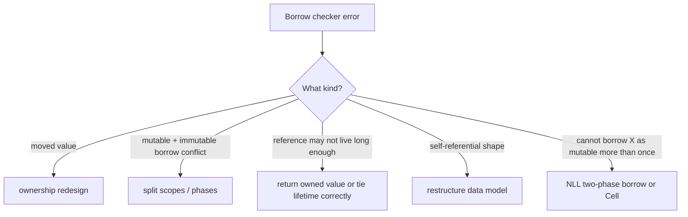

# Debug Borrow Checker Errors

> [!summary] Goal
> Translate borrow-checker diagnostics into concrete design fixes instead of cargo-cult cloning or random lifetime annotations.

## Triage Flow



## Common Error Patterns and Fixes

### "use of moved value"

```rust
// ❌ Problem: value moved into closure
let data = vec![1, 2, 3];
thread::spawn(|| {
    println!("{data:?}");  // data moved here
});
println!("{data:?}");  // ERROR: data was moved

// ✅ Fix: clone or restructure
let data = vec![1, 2, 3];
let cloned = data.clone();
thread::spawn(move || {
    println!("{cloned:?}");
});
println!("{data:?}");  // OK: data wasn't moved

// ✅ Fix: move and restructure
let data = vec![1, 2, 3];
let len = data.len();   // Extract what you need before move
thread::spawn(move || {
    println!("{data:?}, len={len}");
});
```

### "cannot borrow X as mutable because it is also borrowed as immutable"

```rust
// ❌ Problem: mutable borrow conflicts with shared borrow
let mut v = vec![1, 2, 3];
let first = &v[0];     // shared borrow of v
v.push(4);             // ERROR: mutable borrow while shared exists
println!("{first}");   // shared borrow still used here

// ✅ Fix 1: reorder — end shared borrow before mutation
let first = &v[0];
println!("{first}");   // shared borrow ends here
v.push(4);             // OK: no active shared borrows

// ✅ Fix 2: clone the value
let first = v[0];      // copy, not borrow
v.push(4);             // OK: v is not borrowed
println!("{first}");

// ✅ Fix 3: use indices instead of references
let len = v.len();
v.push(4);
println!("{}, {:?}", v[len - 1], &v[..len]);  // Access via index after push
```

### "reference may not live long enough"

```rust
// ❌ Problem: returning reference to local
fn get_ref() -> &str {
    let s = String::from("hello");
    &s  // ERROR: s dropped at end of function
}

// ✅ Fix: return owned value
fn get_owned() -> String {
    String::from("hello")
}

// ❌ Problem: struct reference doesn't match lifetime
struct NameRef<'a> {
    name: &'a str,
}

fn create_name() -> NameRef<'static> {
    let s = String::from("hello");
    NameRef { name: &s }  // ERROR: &s doesn't live long enough
}

// ✅ Fix: pass lifetime into the struct
fn create_name<'a>(s: &'a str) -> NameRef<'a> {
    NameRef { name: s }
}
```

### "cannot borrow X as mutable more than once at a time"

```rust
// ❌ Problem: overlapping mutable borrows
let mut v = vec![1, 2, 3];
let a = &mut v[0];
let b = &mut v[1];  // ERROR: can't borrow v as mutable twice
println!("{a} {b}");

// ✅ Fix: split borrows (Rust doesn't track disjoint fields automatically
// in all cases, but it does for struct fields)
let v = &mut vec![1, 2, 3];
let (a, b) = v.split_at_mut(1);  // split_at_mut uses unsafe internally
println!("{:?} {:?}", a, b);

// ✅ Fix: use indices
let mut v = vec![1, 2, 3];
let a = &mut v[0];
*a = 10;
let b = &mut v[1];  // OK: previous borrow is no longer used
*b = 20;
```

### NLL (Non-Lexical Lifetimes) helps with these

```rust
// NLL allows patterns that didn't work in Rust 2015:
let mut v = vec![1, 2, 3];

let first = &v[0];       // shared borrow
println!("{first}");      // LAST USE — borrow ends here
v.push(4);               // ✅ OK in Rust 2018+ (NLL)

// Before NLL (Rust 2015), the shared borrow lasted until end of scope,
// so v.push(4) would fail even after the println.
```

### Async borrow checker patterns

```rust
use tokio::sync::Mutex;

// ❌ Problem: holding MutexGuard across .await
async fn bad() {
    let data = String::from("hello");
    let mutex = Mutex::new(data);
    let guard = mutex.lock().await;
    do_something(&guard).await;  // ERROR: guard held across await
    drop(guard);                 // (depending on how Mutex is used)
}

// ✅ Fix: scope the guard to not span .await
async fn good() {
    let mutex = Mutex::new(String::from("hello"));
    {
        let guard = mutex.lock().await;
        process(&guard);       // sync work only
    }                          // guard dropped here
    do_something().await;      // OK: no lock held
}
```

---

## Practical Method

1. Read the full error, not just the first line.
2. Identify the owner, borrower, and conflicting use.
3. Ask whether the API should borrow or own.
4. Minimize the code to a tiny reproduction if needed.

---

## Cross-Links

- [[Rust/01_Foundations/01_Ownership_and_Borrowing]] for ownership basics
- [[Rust/03_Advanced/01_Lifetimes_In_Depth_and_Borrow_Checker_Mental_Model]] for NLL, variance, lifetime theory
