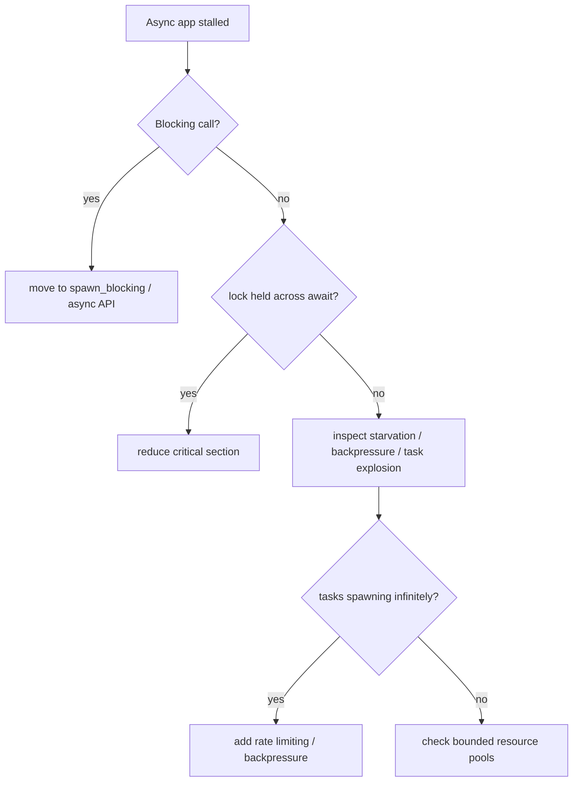

# Debug Async Deadlocks and Blocking

> [!summary] Goal
> Diagnose stalled async Rust caused by blocking calls, lock misuse, starvation, or holding resources across `.await` points.

## Quick Triage



## Common Async Deadlock Patterns

### 1. Blocking on the runtime thread

```rust
// ❌ BAD: blocking I/O on an async runtime thread
async fn handle_request() {
    let result = std::thread::sleep(Duration::from_secs(10));
    // This blocks the ENTIRE worker thread — no other tasks can run on it!
}

// ✅ GOOD: use spawn_blocking for CPU/blocking work
async fn handle_request() {
    let result = tokio::task::spawn_blocking(|| {
        std::thread::sleep(Duration::from_secs(10));
    }).await.unwrap();
}
```

### 2. Mutex held across `.await`

```rust
// ❌ BAD: holding a std::sync::MutexGuard across await
use std::sync::Mutex;

async fn bad() {
    let data = Mutex::new(vec![1, 2, 3]);
    let guard = data.lock().unwrap();
    do_something().await;  // ⚠️ Guard is held! If any task tries to lock, it deadlocks
    drop(guard);
}

// ✅ GOOD: scope the guard or use tokio::sync::Mutex
use tokio::sync::Mutex as TokioMutex;

async fn good() {
    let data = TokioMutex::new(vec![1, 2, 3]);
    {
        let mut guard = data.lock().await;
        guard.push(4);   // Quick critical section
    }                    // guard dropped before .await
    do_something().await;
}
```

### 3. `select!` with unbounded channels

```rust
// ❌ BAD: select! with an unbounded sender can cause starvation
use tokio::sync::mpsc;

async fn bad_select(mut rx: mpsc::Receiver<String>) {
    loop {
        tokio::select! {
            msg = rx.recv() => {
                process(msg.unwrap());
            }
            // No other branches — if rx never closes, this loops forever
            // consuming no CPU but also never doing anything else
        }
    }
}

// ✅ GOOD: add a timeout or other branches
use tokio::time::{timeout, Duration};

async fn good_select(mut rx: mpsc::Receiver<String>) {
    loop {
        tokio::select! {
            msg = rx.recv() => {
                if let Some(m) = msg {
                    process(m);
                } else {
                    break;  // Channel closed
                }
            }
            _ = tokio::time::sleep(Duration::from_secs(60)) => {
                health_check().await;  // Periodic maintenance
            }
        }
    }
}
```

### 4. Bounded channel full — producer backpressure stalls consumer

```rust
// If a bounded channel (mpsc::channel(100)) fills up,
// the producer blocks in .send().await.
// If the consumer ALSO needs to send to the producer → deadlock.

// Fix: use unbounded channels when you can't guarantee ordering,
// or use separate channels for request/response.
```

## Tokio Console

```bash
# Tokio Console is a diagnostics tool for Tokio applications.
# It shows: tasks, resource usage, blocking operations, and task state.

# 1. Add to Cargo.toml:
# tokio = { version = "1", features = ["full"] }
# console-subscriber = "0.4"

# 2. In main():
// console-subscriber::init();

# 3. Run:
# CARGO_MANIFEST_DIR=$(pwd) tokio-console http://127.0.0.1:6669

# What to look for:
# - Tasks in "blocked" state → blocking on runtime?
# - Tasks with very long "scheduled" time → starvation?
# - Tasks with "poll_time" very high → slow future?
```

## Async Backtraces

```rust
// Tokio can dump async task backtraces on timeout or request:

use tokio::time::{timeout, Duration};

async fn monitored_work() {
    // If this takes too long, the timeout fires.
    // Enable RUSTFLAGS="--cfg tokio_unstable" to get task dumps.
    do_work().await;
}

// With proper instrumentation:
#[tracing::instrument]
async fn monitored() {
    // tracing spans show up as structured events in the log
    // Combined with tokio-console, you can correlate task state
    // with specific request spans.
    step1().await;
    step2().await;
}
```

---

## Prevention

- Use `spawn_blocking` for CPU-heavy or blocking I/O work
- Never hold `std::sync::Mutex` (or any blocking lock) across `.await`
- Use Tokio Console for real-time task state visibility
- Add timeouts to all external calls
- Prefer unbounded channels or explicitly handle backpressure

---

## Cross-Links

- [[Rust/02_Core/04_Async_Await_Tokio_Basics]] for async fundamentals
- [[Rust/03_Advanced/17_Tracing_Logging_and_Observability]] for instrumenting async code
