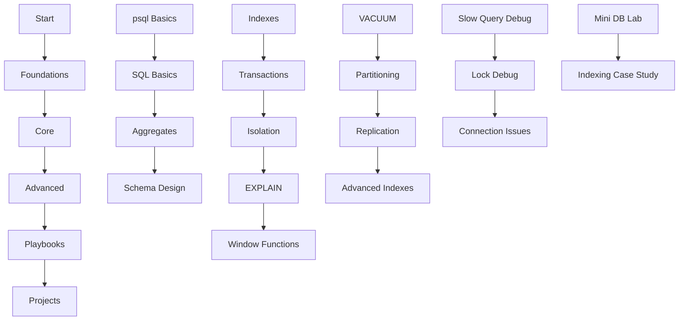

# SQL (PostgreSQL-Centered)

> [!summary] Scope
> SQL fundamentals with PostgreSQL specifics: `psql` CLI, schema design, indexes/B-Tree, transactions/MVCC/locking, isolation levels, query planning with EXPLAIN ANALYZE, window functions, advanced DML (UPSERT/MERGE/RETURNING/COPY), vacuum/autovacuum/bloat management, partitioning, replication, advanced indexes (GIN/GiST/BRIN), PL/pgSQL functions/procedures/triggers, database security (roles, RLS, SSL), schema migrations, debugging slow queries, lock debugging, connection pooling, and hands-on projects.

## Foundations (4 files - ~4,900 lines)

### 01. [[SQL/01_Foundations/01_psql_Basics_and_Workflow]]
- **psql** command-line tool basics
- Connecting to databases, authentication
- Basic commands: `\l`, `\c`, `\d`, `\dt`, `\di`
- Script execution, output formatting
- Meta-commands for development workflow
- **Why**: Essential for database administration and development
- **Lines**: 1,011

### 02. [[SQL/01_Foundations/02_SQL_Basics_Select_Where_Join]]
- SELECT syntax, column aliases, DISTINCT
- WHERE clauses with operators (=, <>, LIKE, IN, BETWEEN)
- JOIN types: INNER, LEFT, RIGHT, FULL, CROSS, SELF, LATERAL
- Multiple table joins, self-joins
- Subqueries (correlated and uncorrelated)
- CTEs (Common Table Expressions) with WITH
- **Why**: Core querying skills for data retrieval
- **Lines**: 1,360

### 03. [[SQL/01_Foundations/03_Group_By_Having_and_Aggregates]]
- GROUP BY clause and aggregation functions
- HAVING for filtering grouped results
- COUNT, SUM, AVG, MIN, MAX, STDDEV
- GROUPING SETS, CUBE, ROLLUP
- Window functions basics (ROW_NUMBER, RANK)
- Aggregate filtering patterns
- **Why**: Essential for analytical queries and reporting
- **Lines**: 1,300

### 04. [[SQL/01_Foundations/04_Schema_Design_Basics]]
- Tables, columns, data types (text, numeric, date/time)
- Primary keys, foreign keys, constraints
- Normalization (1NF, 2NF, 3NF) vs denormalization
- Indexes basics, when to index
- Views, materialized views
- Sequences, UUIDs, serial types
- **Why**: Foundation for database structure and performance
- **Lines**: 1,423

## Core (6 files - ~6,600 lines)

### 01. [[SQL/02_Core/01_Indexes_Basics_and_BTree]]
- B-Tree index structure and mechanics
- Index creation: CREATE INDEX, composite indexes
- Index usage in query planning (EXPLAIN)
- Index maintenance, bloat, reindexing
- Partial indexes, unique indexes
- Index selectivity and cardinality
- **Why**: Critical for query performance optimization
- **Lines**: 1,031

### 02. [[SQL/02_Core/02_Transactions_and_Locking]]
- ACID properties (Atomicity, Consistency, Isolation, Durability)
- Transaction commands: BEGIN, COMMIT, ROLLBACK, SAVEPOINT
- MVCC (Multi-Version Concurrency Control) internals
- Lock types: table locks, row locks, advisory locks
- Lock conflicts and deadlock prevention
- Transaction isolation levels
- **Why**: Ensures data integrity in concurrent environments
- **Lines**: 1,150

### 03. [[SQL/02_Core/03_Isolation_Levels_and_Anomalies]]
- Read phenomena: dirty reads, non-repeatable reads, phantom reads
- Isolation levels: READ UNCOMMITTED, READ COMMITTED, REPEATABLE READ, SERIALIZABLE
- PostgreSQL default (READ COMMITTED) behavior
- Serializable snapshot isolation (SSI)
- Anomalies and their prevention
- SET TRANSACTION ISOLATION LEVEL syntax
- **Why**: Understanding concurrency control and consistency
- **Lines**: 1,200

### 04. [[SQL/02_Core/04_Explain_Analyze_and_Query_Plans]]
- EXPLAIN output interpretation
- Query planning phases: parser, optimizer, executor
- Cost estimation, row count estimates
- Index scans, sequential scans, bitmap scans
- Join strategies: nested loop, hash join, merge join
- ANALYZE for statistics updates
- **Why**: Essential for performance debugging and optimization
- **Lines**: 1,300

### 05. [[SQL/02_Core/05_Window_Functions]]
- OVER clause syntax and partitioning
- Ranking functions: ROW_NUMBER, RANK, DENSE_RANK
- Aggregate window functions: SUM, AVG over windows
- Frame clauses: ROWS vs RANGE, unbounded/preceding/following
- Running totals, moving averages
- Window function performance considerations
- **Why**: Advanced analytical queries and reporting
- **Lines**: 1,119

### 06. [[SQL/02_Core/06_Advanced_DML_Upsert_Merge_Returning]]
- UPSERT with `INSERT ... ON CONFLICT`
- `MERGE` for conditional insert/update/delete
- `RETURNING` clause for result feedback
- `COPY` for high-speed bulk operations
- Batch INSERT and bulk DELETE strategies
- **Why**: Production DML patterns beyond basic INSERT/UPDATE/DELETE
- **Lines**: 200

## Advanced (7 files - ~4,500 lines)

### 01. [[SQL/03_Advanced/01_VACUUM_Autovacuum_and_Bloat]]
- MVCC and dead tuple creation
- VACUUM process: reclaiming space, updating visibility maps
- Autovacuum daemon configuration and monitoring
- Table bloat detection and measurement
- VACUUM vs VACUUM FULL vs CLUSTER
- Maintenance scheduling and performance impact
- **Why**: Prevents performance degradation from table bloat
- **Lines**: 856

### 02. [[SQL/03_Advanced/02_Partitioning]]
- Table partitioning strategies: range, list, hash
- Partition key selection and constraints
- Query optimization with partitioned tables
- Partition maintenance: attach/detach, splitting
- Indexing partitioned tables
- Partition pruning in EXPLAIN plans
- **Why**: Handles large tables efficiently
- **Lines**: 742

### 03. [[SQL/03_Advanced/03_Replication_and_Backups]]
- Streaming replication setup and configuration
- Logical replication for selective copying
- Backup strategies: pg_dump, pg_basebackup, continuous archiving
- Point-in-time recovery (PITR)
- Replication slots and monitoring
- Failover and high availability
- **Why**: Data safety, disaster recovery, read scaling
- **Lines**: 891

### 04. [[SQL/03_Advanced/04_Advanced_Index_Types_GIN_GiST_BRIN]]
- GIN indexes for arrays, full-text, JSON
- GiST indexes for geometric, text search
- BRIN indexes for large ordered tables
- Index creation and maintenance
- When to use each index type
- Performance characteristics and trade-offs
- **Why**: Specialized indexes for specific data types and queries
- **Lines**: 711

### 05. [[SQL/03_Advanced/05_PL_pgSQL_Functions_and_Procedures]]
- CREATE FUNCTION vs CREATE PROCEDURE
- PL/pgSQL syntax: variables, types, control structures
- Exceptions, error handling, RAISE
- Cursors for row-by-row processing
- Triggers: BEFORE, AFTER, INSTEAD OF
- DO blocks for ad-hoc procedural logic
- **Why**: Server-side logic for complex operations and automation
- **Lines**: 350

### 06. [[SQL/03_Advanced/06_Database_Security]]
- Roles and users, privilege hierarchy
- GRANT/REVOKE, default privileges
- Row-Level Security (RLS) policies
- Authentication methods (pg_hba.conf, scram-sha-256, cert)
- SSL/TLS connection security
- Encryption at rest, audit logging
- **Why**: Production database security is non-negotiable
- **Lines**: 300

### 07. [[SQL/03_Advanced/07_Schema_Migrations_and_Database_Design_Deep]]
- Flyway and Liquibase migration tools
- Zero-downtime migration strategies
- BCNF, 4NF normalization
- Star schema and dimensional modeling
- Denormalization tradeoffs
- **Why**: Managing schema changes safely and designing for analytics
- **Lines**: 250

## Playbooks (3 files - ~2,800 lines)

### 01. [[SQL/04_Playbooks/01_Debug_Slow_Query_Workflow]]
- Identifying slow queries with pg_stat_statements
- EXPLAIN ANALYZE deep dive and interpretation
- Index optimization strategies
- Query rewriting techniques
- Configuration tuning (work_mem, shared_buffers)
- Connection pooling with PgBouncer
- **Why**: Systematic approach to performance troubleshooting
- **Lines**: 987

### 02. [[SQL/04_Playbooks/02_Debug_Locks_and_Deadlocks]]
- Lock monitoring with pg_locks and pg_stat_activity
- Deadlock detection and prevention
- Lock timeout configuration
- Application-level lock management
- Advisory locks for application coordination
- Lock debugging in production
- **Why**: Resolves blocking and deadlock issues
- **Lines**: 923

### 03. [[SQL/04_Playbooks/03_Incident_Playbook_Connection_Exhaustion]]
- Connection pool monitoring and sizing
- max_connections configuration
- Connection leak detection
- Prepared statements and their impact
- Application connection management
- Emergency connection limiting
- **Why**: Handles connection pool exhaustion incidents
- **Lines**: 890

## Projects (2 files - ~1,700 lines)

### 01. [[SQL/05_Projects/01_Build_a_Mini_DB_Lab_With_psql]]
- Complete database setup with schema
- Sample data insertion and queries
- Index creation and performance testing
- Transaction examples with isolation levels
- Backup and restore procedures
- **Why**: Hands-on PostgreSQL experience
- **Lines**: 876

### 02. [[SQL/05_Projects/02_Indexing_Case_Study_Read_Heavy_Table]]
- Large table creation with realistic data
- Index strategy development and testing
- Query performance before/after indexing
- Index maintenance procedures
- Monitoring and alerting setup
- **Why**: Practical indexing for production scenarios
- **Lines**: 824

## Learning Path

## Key Concepts Map

- **Query Performance**: EXPLAIN ANALYZE → Indexes → Statistics → Configuration
- **Concurrency**: MVCC → Isolation Levels → Locking → Deadlocks
- **Maintenance**: VACUUM → Autovacuum → Bloat → Monitoring
- **Scalability**: Partitioning → Replication → Connection Pooling → Indexing
- **Reliability**: Transactions → Backups → Monitoring → Incident Response

## PostgreSQL-Specific Features

- Advanced data types: arrays, JSONB, geometric types, ranges
- Full-text search with tsvector/tsquery
- Extensions: PostGIS, pg_stat_statements, pg_buffercache
- Advanced SQL: window functions, CTEs, LATERAL joins
- Performance: parallel queries, JIT compilation, partitioning

## Common PostgreSQL vs Other RDBMS

| Feature | PostgreSQL | MySQL | SQL Server |
|---------|------------|-------|------------|
| MVCC | Yes | Yes (InnoDB) | Yes |
| Default Isolation | Read Committed | Repeatable Read | Read Committed |
| Window Functions | Full support | Limited | Full support |
| JSON Support | Excellent | Good | Good |
| Extensions | Rich ecosystem | Limited | Limited |
| Partitioning | Declarative | Manual | Declarative |

## Cross-Links

- **Spring + JPA**: [[SpringBoot/00_MOC/00_SpringBoot_MOC]]
- **System Design Trade-offs**: [[SystemDesign/00_MOC/00_SystemDesign_MOC]]
- **JavaScript/Node.js**: [[JavaScript/00_MOC/00_JavaScript_MOC]]
- **Docker**: [[CICD/02_Docker/00_Docker_MOC]]
- **Kubernetes**: [[CICD/03_Kubernetes/00_Kubernetes_MOC]]

## Resources

- **Official Documentation**: https://www.postgresql.org/docs/
- **Performance Tuning**: https://www.postgresql.org/docs/current/performance-tips.html
- **Monitoring**: https://www.postgresql.org/docs/current/monitoring.html
- **Books**: "PostgreSQL: Up and Running" by Regina O. Obe and Leo S. Hsu
- **Tools**: pgAdmin, DBeaver, pg_stat_statements extension

---

**Total Files**: 18  
**Total Lines**: ~18,400  
**Status**: Phase 1 Complete (50%), Phase 2 In Progress  
**Last Updated**: 2026-04-26