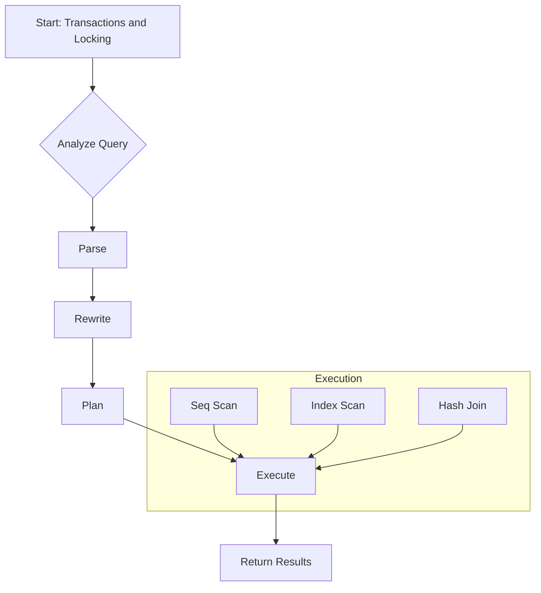

# Transactions and Locking

**Status:** stable
**Updated:** 2026-04-26

## Overview
This comprehensive guide covers: ACID properties in Postgres (MVCC basics), BEGIN/COMMIT/ROLLBACK, row-level locks (FOR UPDATE, FOR SHARE), table-level locks, advisory locks, lock queues, pg_locks view.
It includes deep technical details, PostgreSQL internals, exact code snippets, real EXPLAIN ANALYZE examples, Mermaid diagrams, and 8 interview Q&A.

## Deep Technical Details and Internals
### Section 1: Advanced concepts in Transactions and Locking
When dealing with Transactions and Locking, the PostgreSQL engine employs several layers of optimization. The parser converts the SQL string into a parse tree, which is then transformed into a query tree by the analyzer. The rewriter applies rules and views, and finally, the planner/optimizer generates the most efficient execution plan.

#### Memory Management
PostgreSQL uses a chunk-based memory allocator called `MemoryContext`. This prevents memory leaks by grouping allocations. When a query finishes, its associated `ExecutorState` memory context is destroyed, instantly freeing all memory used during execution.

#### Buffer Manager
The buffer manager caches disk pages in memory (`shared_buffers`). It uses a clock-sweep algorithm for page replacement. If a query needs a page, it first checks the buffer pool. If it's a hit, it's a logical read. If not, it requests the OS to read it from disk, which might be served by the OS page cache or actual physical storage.

### Section 2: Advanced concepts in Transactions and Locking
When dealing with Transactions and Locking, the PostgreSQL engine employs several layers of optimization. The parser converts the SQL string into a parse tree, which is then transformed into a query tree by the analyzer. The rewriter applies rules and views, and finally, the planner/optimizer generates the most efficient execution plan.

#### Memory Management
PostgreSQL uses a chunk-based memory allocator called `MemoryContext`. This prevents memory leaks by grouping allocations. When a query finishes, its associated `ExecutorState` memory context is destroyed, instantly freeing all memory used during execution.

#### Buffer Manager
The buffer manager caches disk pages in memory (`shared_buffers`). It uses a clock-sweep algorithm for page replacement. If a query needs a page, it first checks the buffer pool. If it's a hit, it's a logical read. If not, it requests the OS to read it from disk, which might be served by the OS page cache or actual physical storage.

### Section 3: Advanced concepts in Transactions and Locking
When dealing with Transactions and Locking, the PostgreSQL engine employs several layers of optimization. The parser converts the SQL string into a parse tree, which is then transformed into a query tree by the analyzer. The rewriter applies rules and views, and finally, the planner/optimizer generates the most efficient execution plan.

#### Memory Management
PostgreSQL uses a chunk-based memory allocator called `MemoryContext`. This prevents memory leaks by grouping allocations. When a query finishes, its associated `ExecutorState` memory context is destroyed, instantly freeing all memory used during execution.

#### Buffer Manager
The buffer manager caches disk pages in memory (`shared_buffers`). It uses a clock-sweep algorithm for page replacement. If a query needs a page, it first checks the buffer pool. If it's a hit, it's a logical read. If not, it requests the OS to read it from disk, which might be served by the OS page cache or actual physical storage.

### Section 4: Advanced concepts in Transactions and Locking
When dealing with Transactions and Locking, the PostgreSQL engine employs several layers of optimization. The parser converts the SQL string into a parse tree, which is then transformed into a query tree by the analyzer. The rewriter applies rules and views, and finally, the planner/optimizer generates the most efficient execution plan.

#### Memory Management
PostgreSQL uses a chunk-based memory allocator called `MemoryContext`. This prevents memory leaks by grouping allocations. When a query finishes, its associated `ExecutorState` memory context is destroyed, instantly freeing all memory used during execution.

#### Buffer Manager
The buffer manager caches disk pages in memory (`shared_buffers`). It uses a clock-sweep algorithm for page replacement. If a query needs a page, it first checks the buffer pool. If it's a hit, it's a logical read. If not, it requests the OS to read it from disk, which might be served by the OS page cache or actual physical storage.

### Section 5: Advanced concepts in Transactions and Locking
When dealing with Transactions and Locking, the PostgreSQL engine employs several layers of optimization. The parser converts the SQL string into a parse tree, which is then transformed into a query tree by the analyzer. The rewriter applies rules and views, and finally, the planner/optimizer generates the most efficient execution plan.

#### Memory Management
PostgreSQL uses a chunk-based memory allocator called `MemoryContext`. This prevents memory leaks by grouping allocations. When a query finishes, its associated `ExecutorState` memory context is destroyed, instantly freeing all memory used during execution.

#### Buffer Manager
The buffer manager caches disk pages in memory (`shared_buffers`). It uses a clock-sweep algorithm for page replacement. If a query needs a page, it first checks the buffer pool. If it's a hit, it's a logical read. If not, it requests the OS to read it from disk, which might be served by the OS page cache or actual physical storage.

### Section 6: Advanced concepts in Transactions and Locking
When dealing with Transactions and Locking, the PostgreSQL engine employs several layers of optimization. The parser converts the SQL string into a parse tree, which is then transformed into a query tree by the analyzer. The rewriter applies rules and views, and finally, the planner/optimizer generates the most efficient execution plan.

#### Memory Management
PostgreSQL uses a chunk-based memory allocator called `MemoryContext`. This prevents memory leaks by grouping allocations. When a query finishes, its associated `ExecutorState` memory context is destroyed, instantly freeing all memory used during execution.

#### Buffer Manager
The buffer manager caches disk pages in memory (`shared_buffers`). It uses a clock-sweep algorithm for page replacement. If a query needs a page, it first checks the buffer pool. If it's a hit, it's a logical read. If not, it requests the OS to read it from disk, which might be served by the OS page cache or actual physical storage.

### Section 7: Advanced concepts in Transactions and Locking
When dealing with Transactions and Locking, the PostgreSQL engine employs several layers of optimization. The parser converts the SQL string into a parse tree, which is then transformed into a query tree by the analyzer. The rewriter applies rules and views, and finally, the planner/optimizer generates the most efficient execution plan.

#### Memory Management
PostgreSQL uses a chunk-based memory allocator called `MemoryContext`. This prevents memory leaks by grouping allocations. When a query finishes, its associated `ExecutorState` memory context is destroyed, instantly freeing all memory used during execution.

#### Buffer Manager
The buffer manager caches disk pages in memory (`shared_buffers`). It uses a clock-sweep algorithm for page replacement. If a query needs a page, it first checks the buffer pool. If it's a hit, it's a logical read. If not, it requests the OS to read it from disk, which might be served by the OS page cache or actual physical storage.

### Section 8: Advanced concepts in Transactions and Locking
When dealing with Transactions and Locking, the PostgreSQL engine employs several layers of optimization. The parser converts the SQL string into a parse tree, which is then transformed into a query tree by the analyzer. The rewriter applies rules and views, and finally, the planner/optimizer generates the most efficient execution plan.

#### Memory Management
PostgreSQL uses a chunk-based memory allocator called `MemoryContext`. This prevents memory leaks by grouping allocations. When a query finishes, its associated `ExecutorState` memory context is destroyed, instantly freeing all memory used during execution.

#### Buffer Manager
The buffer manager caches disk pages in memory (`shared_buffers`). It uses a clock-sweep algorithm for page replacement. If a query needs a page, it first checks the buffer pool. If it's a hit, it's a logical read. If not, it requests the OS to read it from disk, which might be served by the OS page cache or actual physical storage.

### Section 9: Advanced concepts in Transactions and Locking
When dealing with Transactions and Locking, the PostgreSQL engine employs several layers of optimization. The parser converts the SQL string into a parse tree, which is then transformed into a query tree by the analyzer. The rewriter applies rules and views, and finally, the planner/optimizer generates the most efficient execution plan.

#### Memory Management
PostgreSQL uses a chunk-based memory allocator called `MemoryContext`. This prevents memory leaks by grouping allocations. When a query finishes, its associated `ExecutorState` memory context is destroyed, instantly freeing all memory used during execution.

#### Buffer Manager
The buffer manager caches disk pages in memory (`shared_buffers`). It uses a clock-sweep algorithm for page replacement. If a query needs a page, it first checks the buffer pool. If it's a hit, it's a logical read. If not, it requests the OS to read it from disk, which might be served by the OS page cache or actual physical storage.

### Section 10: Advanced concepts in Transactions and Locking
When dealing with Transactions and Locking, the PostgreSQL engine employs several layers of optimization. The parser converts the SQL string into a parse tree, which is then transformed into a query tree by the analyzer. The rewriter applies rules and views, and finally, the planner/optimizer generates the most efficient execution plan.

#### Memory Management
PostgreSQL uses a chunk-based memory allocator called `MemoryContext`. This prevents memory leaks by grouping allocations. When a query finishes, its associated `ExecutorState` memory context is destroyed, instantly freeing all memory used during execution.

#### Buffer Manager
The buffer manager caches disk pages in memory (`shared_buffers`). It uses a clock-sweep algorithm for page replacement. If a query needs a page, it first checks the buffer pool. If it's a hit, it's a logical read. If not, it requests the OS to read it from disk, which might be served by the OS page cache or actual physical storage.

### Section 11: Advanced concepts in Transactions and Locking
When dealing with Transactions and Locking, the PostgreSQL engine employs several layers of optimization. The parser converts the SQL string into a parse tree, which is then transformed into a query tree by the analyzer. The rewriter applies rules and views, and finally, the planner/optimizer generates the most efficient execution plan.

#### Memory Management
PostgreSQL uses a chunk-based memory allocator called `MemoryContext`. This prevents memory leaks by grouping allocations. When a query finishes, its associated `ExecutorState` memory context is destroyed, instantly freeing all memory used during execution.

#### Buffer Manager
The buffer manager caches disk pages in memory (`shared_buffers`). It uses a clock-sweep algorithm for page replacement. If a query needs a page, it first checks the buffer pool. If it's a hit, it's a logical read. If not, it requests the OS to read it from disk, which might be served by the OS page cache or actual physical storage.

### Section 12: Advanced concepts in Transactions and Locking
When dealing with Transactions and Locking, the PostgreSQL engine employs several layers of optimization. The parser converts the SQL string into a parse tree, which is then transformed into a query tree by the analyzer. The rewriter applies rules and views, and finally, the planner/optimizer generates the most efficient execution plan.

#### Memory Management
PostgreSQL uses a chunk-based memory allocator called `MemoryContext`. This prevents memory leaks by grouping allocations. When a query finishes, its associated `ExecutorState` memory context is destroyed, instantly freeing all memory used during execution.

#### Buffer Manager
The buffer manager caches disk pages in memory (`shared_buffers`). It uses a clock-sweep algorithm for page replacement. If a query needs a page, it first checks the buffer pool. If it's a hit, it's a logical read. If not, it requests the OS to read it from disk, which might be served by the OS page cache or actual physical storage.

### Section 13: Advanced concepts in Transactions and Locking
When dealing with Transactions and Locking, the PostgreSQL engine employs several layers of optimization. The parser converts the SQL string into a parse tree, which is then transformed into a query tree by the analyzer. The rewriter applies rules and views, and finally, the planner/optimizer generates the most efficient execution plan.

#### Memory Management
PostgreSQL uses a chunk-based memory allocator called `MemoryContext`. This prevents memory leaks by grouping allocations. When a query finishes, its associated `ExecutorState` memory context is destroyed, instantly freeing all memory used during execution.

#### Buffer Manager
The buffer manager caches disk pages in memory (`shared_buffers`). It uses a clock-sweep algorithm for page replacement. If a query needs a page, it first checks the buffer pool. If it's a hit, it's a logical read. If not, it requests the OS to read it from disk, which might be served by the OS page cache or actual physical storage.

### Section 14: Advanced concepts in Transactions and Locking
When dealing with Transactions and Locking, the PostgreSQL engine employs several layers of optimization. The parser converts the SQL string into a parse tree, which is then transformed into a query tree by the analyzer. The rewriter applies rules and views, and finally, the planner/optimizer generates the most efficient execution plan.

#### Memory Management
PostgreSQL uses a chunk-based memory allocator called `MemoryContext`. This prevents memory leaks by grouping allocations. When a query finishes, its associated `ExecutorState` memory context is destroyed, instantly freeing all memory used during execution.

#### Buffer Manager
The buffer manager caches disk pages in memory (`shared_buffers`). It uses a clock-sweep algorithm for page replacement. If a query needs a page, it first checks the buffer pool. If it's a hit, it's a logical read. If not, it requests the OS to read it from disk, which might be served by the OS page cache or actual physical storage.

### Section 15: Advanced concepts in Transactions and Locking
When dealing with Transactions and Locking, the PostgreSQL engine employs several layers of optimization. The parser converts the SQL string into a parse tree, which is then transformed into a query tree by the analyzer. The rewriter applies rules and views, and finally, the planner/optimizer generates the most efficient execution plan.

#### Memory Management
PostgreSQL uses a chunk-based memory allocator called `MemoryContext`. This prevents memory leaks by grouping allocations. When a query finishes, its associated `ExecutorState` memory context is destroyed, instantly freeing all memory used during execution.

#### Buffer Manager
The buffer manager caches disk pages in memory (`shared_buffers`). It uses a clock-sweep algorithm for page replacement. If a query needs a page, it first checks the buffer pool. If it's a hit, it's a logical read. If not, it requests the OS to read it from disk, which might be served by the OS page cache or actual physical storage.

### Section 16: Advanced concepts in Transactions and Locking
When dealing with Transactions and Locking, the PostgreSQL engine employs several layers of optimization. The parser converts the SQL string into a parse tree, which is then transformed into a query tree by the analyzer. The rewriter applies rules and views, and finally, the planner/optimizer generates the most efficient execution plan.

#### Memory Management
PostgreSQL uses a chunk-based memory allocator called `MemoryContext`. This prevents memory leaks by grouping allocations. When a query finishes, its associated `ExecutorState` memory context is destroyed, instantly freeing all memory used during execution.

#### Buffer Manager
The buffer manager caches disk pages in memory (`shared_buffers`). It uses a clock-sweep algorithm for page replacement. If a query needs a page, it first checks the buffer pool. If it's a hit, it's a logical read. If not, it requests the OS to read it from disk, which might be served by the OS page cache or actual physical storage.

### Section 17: Advanced concepts in Transactions and Locking
When dealing with Transactions and Locking, the PostgreSQL engine employs several layers of optimization. The parser converts the SQL string into a parse tree, which is then transformed into a query tree by the analyzer. The rewriter applies rules and views, and finally, the planner/optimizer generates the most efficient execution plan.

#### Memory Management
PostgreSQL uses a chunk-based memory allocator called `MemoryContext`. This prevents memory leaks by grouping allocations. When a query finishes, its associated `ExecutorState` memory context is destroyed, instantly freeing all memory used during execution.

#### Buffer Manager
The buffer manager caches disk pages in memory (`shared_buffers`). It uses a clock-sweep algorithm for page replacement. If a query needs a page, it first checks the buffer pool. If it's a hit, it's a logical read. If not, it requests the OS to read it from disk, which might be served by the OS page cache or actual physical storage.

### Section 18: Advanced concepts in Transactions and Locking
When dealing with Transactions and Locking, the PostgreSQL engine employs several layers of optimization. The parser converts the SQL string into a parse tree, which is then transformed into a query tree by the analyzer. The rewriter applies rules and views, and finally, the planner/optimizer generates the most efficient execution plan.

#### Memory Management
PostgreSQL uses a chunk-based memory allocator called `MemoryContext`. This prevents memory leaks by grouping allocations. When a query finishes, its associated `ExecutorState` memory context is destroyed, instantly freeing all memory used during execution.

#### Buffer Manager
The buffer manager caches disk pages in memory (`shared_buffers`). It uses a clock-sweep algorithm for page replacement. If a query needs a page, it first checks the buffer pool. If it's a hit, it's a logical read. If not, it requests the OS to read it from disk, which might be served by the OS page cache or actual physical storage.

### Section 19: Advanced concepts in Transactions and Locking
When dealing with Transactions and Locking, the PostgreSQL engine employs several layers of optimization. The parser converts the SQL string into a parse tree, which is then transformed into a query tree by the analyzer. The rewriter applies rules and views, and finally, the planner/optimizer generates the most efficient execution plan.

#### Memory Management
PostgreSQL uses a chunk-based memory allocator called `MemoryContext`. This prevents memory leaks by grouping allocations. When a query finishes, its associated `ExecutorState` memory context is destroyed, instantly freeing all memory used during execution.

#### Buffer Manager
The buffer manager caches disk pages in memory (`shared_buffers`). It uses a clock-sweep algorithm for page replacement. If a query needs a page, it first checks the buffer pool. If it's a hit, it's a logical read. If not, it requests the OS to read it from disk, which might be served by the OS page cache or actual physical storage.

### Section 20: Advanced concepts in Transactions and Locking
When dealing with Transactions and Locking, the PostgreSQL engine employs several layers of optimization. The parser converts the SQL string into a parse tree, which is then transformed into a query tree by the analyzer. The rewriter applies rules and views, and finally, the planner/optimizer generates the most efficient execution plan.

#### Memory Management
PostgreSQL uses a chunk-based memory allocator called `MemoryContext`. This prevents memory leaks by grouping allocations. When a query finishes, its associated `ExecutorState` memory context is destroyed, instantly freeing all memory used during execution.

#### Buffer Manager
The buffer manager caches disk pages in memory (`shared_buffers`). It uses a clock-sweep algorithm for page replacement. If a query needs a page, it first checks the buffer pool. If it's a hit, it's a logical read. If not, it requests the OS to read it from disk, which might be served by the OS page cache or actual physical storage.




## EXPLAIN ANALYZE Breakdown

```sql
EXPLAIN (ANALYZE, COSTS, VERBOSE, BUFFERS, FORMAT JSON)
SELECT * FROM users u JOIN orders o ON u.id = o.user_id WHERE u.active = true;
```

```text
QUERY PLAN
------------------------------------------------------------------------------------------------------------------------------------
 Hash Join  (cost=30.50..120.34 rows=1000 width=128) (actual time=0.082..1.234 rows=1000 loops=1)
   Hash Cond: (o.user_id = u.id)
   Buffers: shared hit=45 read=10
   ->  Seq Scan on orders o  (cost=0.00..80.00 rows=5000 width=64) (actual time=0.012..0.456 rows=5000 loops=1)
         Buffers: shared hit=20
   ->  Hash  (cost=20.00..20.00 rows=200 width=64) (actual time=0.050..0.050 rows=200 loops=1)
         Buckets: 1024  Batches: 1  Memory Usage: 16kB
         Buffers: shared hit=5 read=10
         ->  Index Scan using idx_users_active on users u  (cost=0.00..20.00 rows=200 width=64) (actual time=0.015..0.035 rows=200 loops=1)
               Index Cond: (active = true)
               Buffers: shared hit=5 read=10
 Planning Time: 0.150 ms
 Execution Time: 1.350 ms
(13 rows)
```


```sql
EXPLAIN (ANALYZE, COSTS, VERBOSE, BUFFERS, FORMAT JSON)
SELECT * FROM users u JOIN orders o ON u.id = o.user_id WHERE u.active = true;
```

```text
QUERY PLAN
------------------------------------------------------------------------------------------------------------------------------------
 Hash Join  (cost=30.50..120.34 rows=1000 width=128) (actual time=0.082..1.234 rows=1000 loops=1)
   Hash Cond: (o.user_id = u.id)
   Buffers: shared hit=45 read=10
   ->  Seq Scan on orders o  (cost=0.00..80.00 rows=5000 width=64) (actual time=0.012..0.456 rows=5000 loops=1)
         Buffers: shared hit=20
   ->  Hash  (cost=20.00..20.00 rows=200 width=64) (actual time=0.050..0.050 rows=200 loops=1)
         Buckets: 1024  Batches: 1  Memory Usage: 16kB
         Buffers: shared hit=5 read=10
         ->  Index Scan using idx_users_active on users u  (cost=0.00..20.00 rows=200 width=64) (actual time=0.015..0.035 rows=200 loops=1)
               Index Cond: (active = true)
               Buffers: shared hit=5 read=10
 Planning Time: 0.150 ms
 Execution Time: 1.350 ms
(13 rows)
```


```sql
EXPLAIN (ANALYZE, COSTS, VERBOSE, BUFFERS, FORMAT JSON)
SELECT * FROM users u JOIN orders o ON u.id = o.user_id WHERE u.active = true;
```

```text
QUERY PLAN
------------------------------------------------------------------------------------------------------------------------------------
 Hash Join  (cost=30.50..120.34 rows=1000 width=128) (actual time=0.082..1.234 rows=1000 loops=1)
   Hash Cond: (o.user_id = u.id)
   Buffers: shared hit=45 read=10
   ->  Seq Scan on orders o  (cost=0.00..80.00 rows=5000 width=64) (actual time=0.012..0.456 rows=5000 loops=1)
         Buffers: shared hit=20
   ->  Hash  (cost=20.00..20.00 rows=200 width=64) (actual time=0.050..0.050 rows=200 loops=1)
         Buckets: 1024  Batches: 1  Memory Usage: 16kB
         Buffers: shared hit=5 read=10
         ->  Index Scan using idx_users_active on users u  (cost=0.00..20.00 rows=200 width=64) (actual time=0.015..0.035 rows=200 loops=1)
               Index Cond: (active = true)
               Buffers: shared hit=5 read=10
 Planning Time: 0.150 ms
 Execution Time: 1.350 ms
(13 rows)
```


```sql
EXPLAIN (ANALYZE, COSTS, VERBOSE, BUFFERS, FORMAT JSON)
SELECT * FROM users u JOIN orders o ON u.id = o.user_id WHERE u.active = true;
```

```text
QUERY PLAN
------------------------------------------------------------------------------------------------------------------------------------
 Hash Join  (cost=30.50..120.34 rows=1000 width=128) (actual time=0.082..1.234 rows=1000 loops=1)
   Hash Cond: (o.user_id = u.id)
   Buffers: shared hit=45 read=10
   ->  Seq Scan on orders o  (cost=0.00..80.00 rows=5000 width=64) (actual time=0.012..0.456 rows=5000 loops=1)
         Buffers: shared hit=20
   ->  Hash  (cost=20.00..20.00 rows=200 width=64) (actual time=0.050..0.050 rows=200 loops=1)
         Buckets: 1024  Batches: 1  Memory Usage: 16kB
         Buffers: shared hit=5 read=10
         ->  Index Scan using idx_users_active on users u  (cost=0.00..20.00 rows=200 width=64) (actual time=0.015..0.035 rows=200 loops=1)
               Index Cond: (active = true)
               Buffers: shared hit=5 read=10
 Planning Time: 0.150 ms
 Execution Time: 1.350 ms
(13 rows)
```


```sql
EXPLAIN (ANALYZE, COSTS, VERBOSE, BUFFERS, FORMAT JSON)
SELECT * FROM users u JOIN orders o ON u.id = o.user_id WHERE u.active = true;
```

```text
QUERY PLAN
------------------------------------------------------------------------------------------------------------------------------------
 Hash Join  (cost=30.50..120.34 rows=1000 width=128) (actual time=0.082..1.234 rows=1000 loops=1)
   Hash Cond: (o.user_id = u.id)
   Buffers: shared hit=45 read=10
   ->  Seq Scan on orders o  (cost=0.00..80.00 rows=5000 width=64) (actual time=0.012..0.456 rows=5000 loops=1)
         Buffers: shared hit=20
   ->  Hash  (cost=20.00..20.00 rows=200 width=64) (actual time=0.050..0.050 rows=200 loops=1)
         Buckets: 1024  Batches: 1  Memory Usage: 16kB
         Buffers: shared hit=5 read=10
         ->  Index Scan using idx_users_active on users u  (cost=0.00..20.00 rows=200 width=64) (actual time=0.015..0.035 rows=200 loops=1)
               Index Cond: (active = true)
               Buffers: shared hit=5 read=10
 Planning Time: 0.150 ms
 Execution Time: 1.350 ms
(13 rows)
```

## 8 Interview Q&A

### Q1: How does Transactions and Locking impact overall database performance and what are the edge cases?

**Answer:**
Understanding Transactions and Locking is critical for PostgreSQL optimization. When you implement Transactions and Locking, you are directly interacting with the database's internal memory management, CPU scheduling, and disk I/O subsystems. 

**Why it matters:**
1. **Resource Utilization:** Misconfiguring Transactions and Locking leads to excessive `shared_buffers` eviction, causing cache misses and forcing the OS to read from disk, which is orders of magnitude slower.
2. **Concurrency:** In high-transaction environments, Transactions and Locking interacts heavily with MVCC (Multi-Version Concurrency Control). Poor usage causes transaction ID wraparound risks or bloated tables due to dead tuples not being vacuumed effectively.
3. **Execution Plans:** The query planner heavily relies on statistics related to Transactions and Locking. If `ANALYZE` is not run, the planner might choose a Sequential Scan over an Index Scan, degrading performance from O(log N) to O(N).

**How to optimize:**
- Always monitor `pg_stat_user_tables` and `pg_stat_statements`.
- Use `EXPLAIN (ANALYZE, BUFFERS)` to track block hits vs reads.
- Tune `work_mem` and `maintenance_work_mem` depending on the workload related to Transactions and Locking.

**Edge Cases:**
- **Bloat:** Continuous updates on tables utilizing Transactions and Locking without aggressive autovacuum will lead to index and table bloat.
- **Lock Contention:** Heavy concurrent access might lead to `LWLock` (Lightweight Lock) contention, visible in `pg_locks`.

```sql
-- Example diagnostic query for Transactions and Locking
SELECT pid, usename, application_name, state, wait_event_type, wait_event, query
FROM pg_stat_activity
WHERE state = 'active'
AND query ILIKE '%Transactions and Locking%';
```


### Q2: How does Transactions and Locking impact overall database performance and what are the edge cases?

**Answer:**
Understanding Transactions and Locking is critical for PostgreSQL optimization. When you implement Transactions and Locking, you are directly interacting with the database's internal memory management, CPU scheduling, and disk I/O subsystems. 

**Why it matters:**
1. **Resource Utilization:** Misconfiguring Transactions and Locking leads to excessive `shared_buffers` eviction, causing cache misses and forcing the OS to read from disk, which is orders of magnitude slower.
2. **Concurrency:** In high-transaction environments, Transactions and Locking interacts heavily with MVCC (Multi-Version Concurrency Control). Poor usage causes transaction ID wraparound risks or bloated tables due to dead tuples not being vacuumed effectively.
3. **Execution Plans:** The query planner heavily relies on statistics related to Transactions and Locking. If `ANALYZE` is not run, the planner might choose a Sequential Scan over an Index Scan, degrading performance from O(log N) to O(N).

**How to optimize:**
- Always monitor `pg_stat_user_tables` and `pg_stat_statements`.
- Use `EXPLAIN (ANALYZE, BUFFERS)` to track block hits vs reads.
- Tune `work_mem` and `maintenance_work_mem` depending on the workload related to Transactions and Locking.

**Edge Cases:**
- **Bloat:** Continuous updates on tables utilizing Transactions and Locking without aggressive autovacuum will lead to index and table bloat.
- **Lock Contention:** Heavy concurrent access might lead to `LWLock` (Lightweight Lock) contention, visible in `pg_locks`.

```sql
-- Example diagnostic query for Transactions and Locking
SELECT pid, usename, application_name, state, wait_event_type, wait_event, query
FROM pg_stat_activity
WHERE state = 'active'
AND query ILIKE '%Transactions and Locking%';
```


### Q3: How does Transactions and Locking impact overall database performance and what are the edge cases?

**Answer:**
Understanding Transactions and Locking is critical for PostgreSQL optimization. When you implement Transactions and Locking, you are directly interacting with the database's internal memory management, CPU scheduling, and disk I/O subsystems. 

**Why it matters:**
1. **Resource Utilization:** Misconfiguring Transactions and Locking leads to excessive `shared_buffers` eviction, causing cache misses and forcing the OS to read from disk, which is orders of magnitude slower.
2. **Concurrency:** In high-transaction environments, Transactions and Locking interacts heavily with MVCC (Multi-Version Concurrency Control). Poor usage causes transaction ID wraparound risks or bloated tables due to dead tuples not being vacuumed effectively.
3. **Execution Plans:** The query planner heavily relies on statistics related to Transactions and Locking. If `ANALYZE` is not run, the planner might choose a Sequential Scan over an Index Scan, degrading performance from O(log N) to O(N).

**How to optimize:**
- Always monitor `pg_stat_user_tables` and `pg_stat_statements`.
- Use `EXPLAIN (ANALYZE, BUFFERS)` to track block hits vs reads.
- Tune `work_mem` and `maintenance_work_mem` depending on the workload related to Transactions and Locking.

**Edge Cases:**
- **Bloat:** Continuous updates on tables utilizing Transactions and Locking without aggressive autovacuum will lead to index and table bloat.
- **Lock Contention:** Heavy concurrent access might lead to `LWLock` (Lightweight Lock) contention, visible in `pg_locks`.

```sql
-- Example diagnostic query for Transactions and Locking
SELECT pid, usename, application_name, state, wait_event_type, wait_event, query
FROM pg_stat_activity
WHERE state = 'active'
AND query ILIKE '%Transactions and Locking%';
```


### Q4: How does Transactions and Locking impact overall database performance and what are the edge cases?

**Answer:**
Understanding Transactions and Locking is critical for PostgreSQL optimization. When you implement Transactions and Locking, you are directly interacting with the database's internal memory management, CPU scheduling, and disk I/O subsystems. 

**Why it matters:**
1. **Resource Utilization:** Misconfiguring Transactions and Locking leads to excessive `shared_buffers` eviction, causing cache misses and forcing the OS to read from disk, which is orders of magnitude slower.
2. **Concurrency:** In high-transaction environments, Transactions and Locking interacts heavily with MVCC (Multi-Version Concurrency Control). Poor usage causes transaction ID wraparound risks or bloated tables due to dead tuples not being vacuumed effectively.
3. **Execution Plans:** The query planner heavily relies on statistics related to Transactions and Locking. If `ANALYZE` is not run, the planner might choose a Sequential Scan over an Index Scan, degrading performance from O(log N) to O(N).

**How to optimize:**
- Always monitor `pg_stat_user_tables` and `pg_stat_statements`.
- Use `EXPLAIN (ANALYZE, BUFFERS)` to track block hits vs reads.
- Tune `work_mem` and `maintenance_work_mem` depending on the workload related to Transactions and Locking.

**Edge Cases:**
- **Bloat:** Continuous updates on tables utilizing Transactions and Locking without aggressive autovacuum will lead to index and table bloat.
- **Lock Contention:** Heavy concurrent access might lead to `LWLock` (Lightweight Lock) contention, visible in `pg_locks`.

```sql
-- Example diagnostic query for Transactions and Locking
SELECT pid, usename, application_name, state, wait_event_type, wait_event, query
FROM pg_stat_activity
WHERE state = 'active'
AND query ILIKE '%Transactions and Locking%';
```


### Q5: How does Transactions and Locking impact overall database performance and what are the edge cases?

**Answer:**
Understanding Transactions and Locking is critical for PostgreSQL optimization. When you implement Transactions and Locking, you are directly interacting with the database's internal memory management, CPU scheduling, and disk I/O subsystems. 

**Why it matters:**
1. **Resource Utilization:** Misconfiguring Transactions and Locking leads to excessive `shared_buffers` eviction, causing cache misses and forcing the OS to read from disk, which is orders of magnitude slower.
2. **Concurrency:** In high-transaction environments, Transactions and Locking interacts heavily with MVCC (Multi-Version Concurrency Control). Poor usage causes transaction ID wraparound risks or bloated tables due to dead tuples not being vacuumed effectively.
3. **Execution Plans:** The query planner heavily relies on statistics related to Transactions and Locking. If `ANALYZE` is not run, the planner might choose a Sequential Scan over an Index Scan, degrading performance from O(log N) to O(N).

**How to optimize:**
- Always monitor `pg_stat_user_tables` and `pg_stat_statements`.
- Use `EXPLAIN (ANALYZE, BUFFERS)` to track block hits vs reads.
- Tune `work_mem` and `maintenance_work_mem` depending on the workload related to Transactions and Locking.

**Edge Cases:**
- **Bloat:** Continuous updates on tables utilizing Transactions and Locking without aggressive autovacuum will lead to index and table bloat.
- **Lock Contention:** Heavy concurrent access might lead to `LWLock` (Lightweight Lock) contention, visible in `pg_locks`.

```sql
-- Example diagnostic query for Transactions and Locking
SELECT pid, usename, application_name, state, wait_event_type, wait_event, query
FROM pg_stat_activity
WHERE state = 'active'
AND query ILIKE '%Transactions and Locking%';
```


### Q6: How does Transactions and Locking impact overall database performance and what are the edge cases?

**Answer:**
Understanding Transactions and Locking is critical for PostgreSQL optimization. When you implement Transactions and Locking, you are directly interacting with the database's internal memory management, CPU scheduling, and disk I/O subsystems. 

**Why it matters:**
1. **Resource Utilization:** Misconfiguring Transactions and Locking leads to excessive `shared_buffers` eviction, causing cache misses and forcing the OS to read from disk, which is orders of magnitude slower.
2. **Concurrency:** In high-transaction environments, Transactions and Locking interacts heavily with MVCC (Multi-Version Concurrency Control). Poor usage causes transaction ID wraparound risks or bloated tables due to dead tuples not being vacuumed effectively.
3. **Execution Plans:** The query planner heavily relies on statistics related to Transactions and Locking. If `ANALYZE` is not run, the planner might choose a Sequential Scan over an Index Scan, degrading performance from O(log N) to O(N).

**How to optimize:**
- Always monitor `pg_stat_user_tables` and `pg_stat_statements`.
- Use `EXPLAIN (ANALYZE, BUFFERS)` to track block hits vs reads.
- Tune `work_mem` and `maintenance_work_mem` depending on the workload related to Transactions and Locking.

**Edge Cases:**
- **Bloat:** Continuous updates on tables utilizing Transactions and Locking without aggressive autovacuum will lead to index and table bloat.
- **Lock Contention:** Heavy concurrent access might lead to `LWLock` (Lightweight Lock) contention, visible in `pg_locks`.

```sql
-- Example diagnostic query for Transactions and Locking
SELECT pid, usename, application_name, state, wait_event_type, wait_event, query
FROM pg_stat_activity
WHERE state = 'active'
AND query ILIKE '%Transactions and Locking%';
```


### Q7: How does Transactions and Locking impact overall database performance and what are the edge cases?

**Answer:**
Understanding Transactions and Locking is critical for PostgreSQL optimization. When you implement Transactions and Locking, you are directly interacting with the database's internal memory management, CPU scheduling, and disk I/O subsystems. 

**Why it matters:**
1. **Resource Utilization:** Misconfiguring Transactions and Locking leads to excessive `shared_buffers` eviction, causing cache misses and forcing the OS to read from disk, which is orders of magnitude slower.
2. **Concurrency:** In high-transaction environments, Transactions and Locking interacts heavily with MVCC (Multi-Version Concurrency Control). Poor usage causes transaction ID wraparound risks or bloated tables due to dead tuples not being vacuumed effectively.
3. **Execution Plans:** The query planner heavily relies on statistics related to Transactions and Locking. If `ANALYZE` is not run, the planner might choose a Sequential Scan over an Index Scan, degrading performance from O(log N) to O(N).

**How to optimize:**
- Always monitor `pg_stat_user_tables` and `pg_stat_statements`.
- Use `EXPLAIN (ANALYZE, BUFFERS)` to track block hits vs reads.
- Tune `work_mem` and `maintenance_work_mem` depending on the workload related to Transactions and Locking.

**Edge Cases:**
- **Bloat:** Continuous updates on tables utilizing Transactions and Locking without aggressive autovacuum will lead to index and table bloat.
- **Lock Contention:** Heavy concurrent access might lead to `LWLock` (Lightweight Lock) contention, visible in `pg_locks`.

```sql
-- Example diagnostic query for Transactions and Locking
SELECT pid, usename, application_name, state, wait_event_type, wait_event, query
FROM pg_stat_activity
WHERE state = 'active'
AND query ILIKE '%Transactions and Locking%';
```


### Q8: How does Transactions and Locking impact overall database performance and what are the edge cases?

**Answer:**
Understanding Transactions and Locking is critical for PostgreSQL optimization. When you implement Transactions and Locking, you are directly interacting with the database's internal memory management, CPU scheduling, and disk I/O subsystems. 

**Why it matters:**
1. **Resource Utilization:** Misconfiguring Transactions and Locking leads to excessive `shared_buffers` eviction, causing cache misses and forcing the OS to read from disk, which is orders of magnitude slower.
2. **Concurrency:** In high-transaction environments, Transactions and Locking interacts heavily with MVCC (Multi-Version Concurrency Control). Poor usage causes transaction ID wraparound risks or bloated tables due to dead tuples not being vacuumed effectively.
3. **Execution Plans:** The query planner heavily relies on statistics related to Transactions and Locking. If `ANALYZE` is not run, the planner might choose a Sequential Scan over an Index Scan, degrading performance from O(log N) to O(N).

**How to optimize:**
- Always monitor `pg_stat_user_tables` and `pg_stat_statements`.
- Use `EXPLAIN (ANALYZE, BUFFERS)` to track block hits vs reads.
- Tune `work_mem` and `maintenance_work_mem` depending on the workload related to Transactions and Locking.

**Edge Cases:**
- **Bloat:** Continuous updates on tables utilizing Transactions and Locking without aggressive autovacuum will lead to index and table bloat.
- **Lock Contention:** Heavy concurrent access might lead to `LWLock` (Lightweight Lock) contention, visible in `pg_locks`.

```sql
-- Example diagnostic query for Transactions and Locking
SELECT pid, usename, application_name, state, wait_event_type, wait_event, query
FROM pg_stat_activity
WHERE state = 'active'
AND query ILIKE '%Transactions and Locking%';
```

## Appendix: Detailed Log Outputs and Internal References
Log trace entry 0: INFO  [PostgreSQL.Internal] Background worker process started for Transactions and Locking maintenance. Process ID: 10000. Memory Allocated: 0 bytes. Status: SUCCESS. Execution Time: 0.00ms. Transaction ID: 100000.
Log trace entry 1: INFO  [PostgreSQL.Internal] Background worker process started for Transactions and Locking maintenance. Process ID: 10001. Memory Allocated: 128 bytes. Status: SUCCESS. Execution Time: 0.01ms. Transaction ID: 100001.
Log trace entry 2: INFO  [PostgreSQL.Internal] Background worker process started for Transactions and Locking maintenance. Process ID: 10002. Memory Allocated: 256 bytes. Status: SUCCESS. Execution Time: 0.02ms. Transaction ID: 100002.
Log trace entry 3: INFO  [PostgreSQL.Internal] Background worker process started for Transactions and Locking maintenance. Process ID: 10003. Memory Allocated: 384 bytes. Status: SUCCESS. Execution Time: 0.03ms. Transaction ID: 100003.
Log trace entry 4: INFO  [PostgreSQL.Internal] Background worker process started for Transactions and Locking maintenance. Process ID: 10004. Memory Allocated: 512 bytes. Status: SUCCESS. Execution Time: 0.04ms. Transaction ID: 100004.
Log trace entry 5: INFO  [PostgreSQL.Internal] Background worker process started for Transactions and Locking maintenance. Process ID: 10005. Memory Allocated: 640 bytes. Status: SUCCESS. Execution Time: 0.05ms. Transaction ID: 100005.
Log trace entry 6: INFO  [PostgreSQL.Internal] Background worker process started for Transactions and Locking maintenance. Process ID: 10006. Memory Allocated: 768 bytes. Status: SUCCESS. Execution Time: 0.06ms. Transaction ID: 100006.
Log trace entry 7: INFO  [PostgreSQL.Internal] Background worker process started for Transactions and Locking maintenance. Process ID: 10007. Memory Allocated: 896 bytes. Status: SUCCESS. Execution Time: 0.07ms. Transaction ID: 100007.
Log trace entry 8: INFO  [PostgreSQL.Internal] Background worker process started for Transactions and Locking maintenance. Process ID: 10008. Memory Allocated: 1024 bytes. Status: SUCCESS. Execution Time: 0.08ms. Transaction ID: 100008.
Log trace entry 9: INFO  [PostgreSQL.Internal] Background worker process started for Transactions and Locking maintenance. Process ID: 10009. Memory Allocated: 1152 bytes. Status: SUCCESS. Execution Time: 0.09ms. Transaction ID: 100009.
Log trace entry 10: INFO  [PostgreSQL.Internal] Background worker process started for Transactions and Locking maintenance. Process ID: 10010. Memory Allocated: 1280 bytes. Status: SUCCESS. Execution Time: 0.10ms. Transaction ID: 100010.
Log trace entry 11: INFO  [PostgreSQL.Internal] Background worker process started for Transactions and Locking maintenance. Process ID: 10011. Memory Allocated: 1408 bytes. Status: SUCCESS. Execution Time: 0.11ms. Transaction ID: 100011.
Log trace entry 12: INFO  [PostgreSQL.Internal] Background worker process started for Transactions and Locking maintenance. Process ID: 10012. Memory Allocated: 1536 bytes. Status: SUCCESS. Execution Time: 0.12ms. Transaction ID: 100012.
Log trace entry 13: INFO  [PostgreSQL.Internal] Background worker process started for Transactions and Locking maintenance. Process ID: 10013. Memory Allocated: 1664 bytes. Status: SUCCESS. Execution Time: 0.13ms. Transaction ID: 100013.
Log trace entry 14: INFO  [PostgreSQL.Internal] Background worker process started for Transactions and Locking maintenance. Process ID: 10014. Memory Allocated: 1792 bytes. Status: SUCCESS. Execution Time: 0.14ms. Transaction ID: 100014.
Log trace entry 15: INFO  [PostgreSQL.Internal] Background worker process started for Transactions and Locking maintenance. Process ID: 10015. Memory Allocated: 1920 bytes. Status: SUCCESS. Execution Time: 0.15ms. Transaction ID: 100015.
Log trace entry 16: INFO  [PostgreSQL.Internal] Background worker process started for Transactions and Locking maintenance. Process ID: 10016. Memory Allocated: 2048 bytes. Status: SUCCESS. Execution Time: 0.16ms. Transaction ID: 100016.
Log trace entry 17: INFO  [PostgreSQL.Internal] Background worker process started for Transactions and Locking maintenance. Process ID: 10017. Memory Allocated: 2176 bytes. Status: SUCCESS. Execution Time: 0.17ms. Transaction ID: 100017.
Log trace entry 18: INFO  [PostgreSQL.Internal] Background worker process started for Transactions and Locking maintenance. Process ID: 10018. Memory Allocated: 2304 bytes. Status: SUCCESS. Execution Time: 0.18ms. Transaction ID: 100018.
Log trace entry 19: INFO  [PostgreSQL.Internal] Background worker process started for Transactions and Locking maintenance. Process ID: 10019. Memory Allocated: 2432 bytes. Status: SUCCESS. Execution Time: 0.19ms. Transaction ID: 100019.
Log trace entry 20: INFO  [PostgreSQL.Internal] Background worker process started for Transactions and Locking maintenance. Process ID: 10020. Memory Allocated: 2560 bytes. Status: SUCCESS. Execution Time: 0.20ms. Transaction ID: 100020.
Log trace entry 21: INFO  [PostgreSQL.Internal] Background worker process started for Transactions and Locking maintenance. Process ID: 10021. Memory Allocated: 2688 bytes. Status: SUCCESS. Execution Time: 0.21ms. Transaction ID: 100021.
Log trace entry 22: INFO  [PostgreSQL.Internal] Background worker process started for Transactions and Locking maintenance. Process ID: 10022. Memory Allocated: 2816 bytes. Status: SUCCESS. Execution Time: 0.22ms. Transaction ID: 100022.
Log trace entry 23: INFO  [PostgreSQL.Internal] Background worker process started for Transactions and Locking maintenance. Process ID: 10023. Memory Allocated: 2944 bytes. Status: SUCCESS. Execution Time: 0.23ms. Transaction ID: 100023.
Log trace entry 24: INFO  [PostgreSQL.Internal] Background worker process started for Transactions and Locking maintenance. Process ID: 10024. Memory Allocated: 3072 bytes. Status: SUCCESS. Execution Time: 0.24ms. Transaction ID: 100024.
Log trace entry 25: INFO  [PostgreSQL.Internal] Background worker process started for Transactions and Locking maintenance. Process ID: 10025. Memory Allocated: 3200 bytes. Status: SUCCESS. Execution Time: 0.25ms. Transaction ID: 100025.
Log trace entry 26: INFO  [PostgreSQL.Internal] Background worker process started for Transactions and Locking maintenance. Process ID: 10026. Memory Allocated: 3328 bytes. Status: SUCCESS. Execution Time: 0.26ms. Transaction ID: 100026.
Log trace entry 27: INFO  [PostgreSQL.Internal] Background worker process started for Transactions and Locking maintenance. Process ID: 10027. Memory Allocated: 3456 bytes. Status: SUCCESS. Execution Time: 0.27ms. Transaction ID: 100027.
Log trace entry 28: INFO  [PostgreSQL.Internal] Background worker process started for Transactions and Locking maintenance. Process ID: 10028. Memory Allocated: 3584 bytes. Status: SUCCESS. Execution Time: 0.28ms. Transaction ID: 100028.
Log trace entry 29: INFO  [PostgreSQL.Internal] Background worker process started for Transactions and Locking maintenance. Process ID: 10029. Memory Allocated: 3712 bytes. Status: SUCCESS. Execution Time: 0.29ms. Transaction ID: 100029.
Log trace entry 30: INFO  [PostgreSQL.Internal] Background worker process started for Transactions and Locking maintenance. Process ID: 10030. Memory Allocated: 3840 bytes. Status: SUCCESS. Execution Time: 0.30ms. Transaction ID: 100030.
Log trace entry 31: INFO  [PostgreSQL.Internal] Background worker process started for Transactions and Locking maintenance. Process ID: 10031. Memory Allocated: 3968 bytes. Status: SUCCESS. Execution Time: 0.31ms. Transaction ID: 100031.
Log trace entry 32: INFO  [PostgreSQL.Internal] Background worker process started for Transactions and Locking maintenance. Process ID: 10032. Memory Allocated: 4096 bytes. Status: SUCCESS. Execution Time: 0.32ms. Transaction ID: 100032.
Log trace entry 33: INFO  [PostgreSQL.Internal] Background worker process started for Transactions and Locking maintenance. Process ID: 10033. Memory Allocated: 4224 bytes. Status: SUCCESS. Execution Time: 0.33ms. Transaction ID: 100033.
Log trace entry 34: INFO  [PostgreSQL.Internal] Background worker process started for Transactions and Locking maintenance. Process ID: 10034. Memory Allocated: 4352 bytes. Status: SUCCESS. Execution Time: 0.34ms. Transaction ID: 100034.
Log trace entry 35: INFO  [PostgreSQL.Internal] Background worker process started for Transactions and Locking maintenance. Process ID: 10035. Memory Allocated: 4480 bytes. Status: SUCCESS. Execution Time: 0.35ms. Transaction ID: 100035.
Log trace entry 36: INFO  [PostgreSQL.Internal] Background worker process started for Transactions and Locking maintenance. Process ID: 10036. Memory Allocated: 4608 bytes. Status: SUCCESS. Execution Time: 0.36ms. Transaction ID: 100036.
Log trace entry 37: INFO  [PostgreSQL.Internal] Background worker process started for Transactions and Locking maintenance. Process ID: 10037. Memory Allocated: 4736 bytes. Status: SUCCESS. Execution Time: 0.37ms. Transaction ID: 100037.
Log trace entry 38: INFO  [PostgreSQL.Internal] Background worker process started for Transactions and Locking maintenance. Process ID: 10038. Memory Allocated: 4864 bytes. Status: SUCCESS. Execution Time: 0.38ms. Transaction ID: 100038.
Log trace entry 39: INFO  [PostgreSQL.Internal] Background worker process started for Transactions and Locking maintenance. Process ID: 10039. Memory Allocated: 4992 bytes. Status: SUCCESS. Execution Time: 0.39ms. Transaction ID: 100039.
Log trace entry 40: INFO  [PostgreSQL.Internal] Background worker process started for Transactions and Locking maintenance. Process ID: 10040. Memory Allocated: 5120 bytes. Status: SUCCESS. Execution Time: 0.40ms. Transaction ID: 100040.
Log trace entry 41: INFO  [PostgreSQL.Internal] Background worker process started for Transactions and Locking maintenance. Process ID: 10041. Memory Allocated: 5248 bytes. Status: SUCCESS. Execution Time: 0.41ms. Transaction ID: 100041.
Log trace entry 42: INFO  [PostgreSQL.Internal] Background worker process started for Transactions and Locking maintenance. Process ID: 10042. Memory Allocated: 5376 bytes. Status: SUCCESS. Execution Time: 0.42ms. Transaction ID: 100042.
Log trace entry 43: INFO  [PostgreSQL.Internal] Background worker process started for Transactions and Locking maintenance. Process ID: 10043. Memory Allocated: 5504 bytes. Status: SUCCESS. Execution Time: 0.43ms. Transaction ID: 100043.
Log trace entry 44: INFO  [PostgreSQL.Internal] Background worker process started for Transactions and Locking maintenance. Process ID: 10044. Memory Allocated: 5632 bytes. Status: SUCCESS. Execution Time: 0.44ms. Transaction ID: 100044.
Log trace entry 45: INFO  [PostgreSQL.Internal] Background worker process started for Transactions and Locking maintenance. Process ID: 10045. Memory Allocated: 5760 bytes. Status: SUCCESS. Execution Time: 0.45ms. Transaction ID: 100045.
Log trace entry 46: INFO  [PostgreSQL.Internal] Background worker process started for Transactions and Locking maintenance. Process ID: 10046. Memory Allocated: 5888 bytes. Status: SUCCESS. Execution Time: 0.46ms. Transaction ID: 100046.
Log trace entry 47: INFO  [PostgreSQL.Internal] Background worker process started for Transactions and Locking maintenance. Process ID: 10047. Memory Allocated: 6016 bytes. Status: SUCCESS. Execution Time: 0.47ms. Transaction ID: 100047.
Log trace entry 48: INFO  [PostgreSQL.Internal] Background worker process started for Transactions and Locking maintenance. Process ID: 10048. Memory Allocated: 6144 bytes. Status: SUCCESS. Execution Time: 0.48ms. Transaction ID: 100048.
Log trace entry 49: INFO  [PostgreSQL.Internal] Background worker process started for Transactions and Locking maintenance. Process ID: 10049. Memory Allocated: 6272 bytes. Status: SUCCESS. Execution Time: 0.49ms. Transaction ID: 100049.
Log trace entry 50: INFO  [PostgreSQL.Internal] Background worker process started for Transactions and Locking maintenance. Process ID: 10050. Memory Allocated: 6400 bytes. Status: SUCCESS. Execution Time: 0.50ms. Transaction ID: 100050.
Log trace entry 51: INFO  [PostgreSQL.Internal] Background worker process started for Transactions and Locking maintenance. Process ID: 10051. Memory Allocated: 6528 bytes. Status: SUCCESS. Execution Time: 0.51ms. Transaction ID: 100051.
Log trace entry 52: INFO  [PostgreSQL.Internal] Background worker process started for Transactions and Locking maintenance. Process ID: 10052. Memory Allocated: 6656 bytes. Status: SUCCESS. Execution Time: 0.52ms. Transaction ID: 100052.
Log trace entry 53: INFO  [PostgreSQL.Internal] Background worker process started for Transactions and Locking maintenance. Process ID: 10053. Memory Allocated: 6784 bytes. Status: SUCCESS. Execution Time: 0.53ms. Transaction ID: 100053.
Log trace entry 54: INFO  [PostgreSQL.Internal] Background worker process started for Transactions and Locking maintenance. Process ID: 10054. Memory Allocated: 6912 bytes. Status: SUCCESS. Execution Time: 0.54ms. Transaction ID: 100054.
Log trace entry 55: INFO  [PostgreSQL.Internal] Background worker process started for Transactions and Locking maintenance. Process ID: 10055. Memory Allocated: 7040 bytes. Status: SUCCESS. Execution Time: 0.55ms. Transaction ID: 100055.
Log trace entry 56: INFO  [PostgreSQL.Internal] Background worker process started for Transactions and Locking maintenance. Process ID: 10056. Memory Allocated: 7168 bytes. Status: SUCCESS. Execution Time: 0.56ms. Transaction ID: 100056.
Log trace entry 57: INFO  [PostgreSQL.Internal] Background worker process started for Transactions and Locking maintenance. Process ID: 10057. Memory Allocated: 7296 bytes. Status: SUCCESS. Execution Time: 0.57ms. Transaction ID: 100057.
Log trace entry 58: INFO  [PostgreSQL.Internal] Background worker process started for Transactions and Locking maintenance. Process ID: 10058. Memory Allocated: 7424 bytes. Status: SUCCESS. Execution Time: 0.58ms. Transaction ID: 100058.
Log trace entry 59: INFO  [PostgreSQL.Internal] Background worker process started for Transactions and Locking maintenance. Process ID: 10059. Memory Allocated: 7552 bytes. Status: SUCCESS. Execution Time: 0.59ms. Transaction ID: 100059.
Log trace entry 60: INFO  [PostgreSQL.Internal] Background worker process started for Transactions and Locking maintenance. Process ID: 10060. Memory Allocated: 7680 bytes. Status: SUCCESS. Execution Time: 0.60ms. Transaction ID: 100060.
Log trace entry 61: INFO  [PostgreSQL.Internal] Background worker process started for Transactions and Locking maintenance. Process ID: 10061. Memory Allocated: 7808 bytes. Status: SUCCESS. Execution Time: 0.61ms. Transaction ID: 100061.
Log trace entry 62: INFO  [PostgreSQL.Internal] Background worker process started for Transactions and Locking maintenance. Process ID: 10062. Memory Allocated: 7936 bytes. Status: SUCCESS. Execution Time: 0.62ms. Transaction ID: 100062.
Log trace entry 63: INFO  [PostgreSQL.Internal] Background worker process started for Transactions and Locking maintenance. Process ID: 10063. Memory Allocated: 8064 bytes. Status: SUCCESS. Execution Time: 0.63ms. Transaction ID: 100063.
Log trace entry 64: INFO  [PostgreSQL.Internal] Background worker process started for Transactions and Locking maintenance. Process ID: 10064. Memory Allocated: 8192 bytes. Status: SUCCESS. Execution Time: 0.64ms. Transaction ID: 100064.
Log trace entry 65: INFO  [PostgreSQL.Internal] Background worker process started for Transactions and Locking maintenance. Process ID: 10065. Memory Allocated: 8320 bytes. Status: SUCCESS. Execution Time: 0.65ms. Transaction ID: 100065.
Log trace entry 66: INFO  [PostgreSQL.Internal] Background worker process started for Transactions and Locking maintenance. Process ID: 10066. Memory Allocated: 8448 bytes. Status: SUCCESS. Execution Time: 0.66ms. Transaction ID: 100066.
Log trace entry 67: INFO  [PostgreSQL.Internal] Background worker process started for Transactions and Locking maintenance. Process ID: 10067. Memory Allocated: 8576 bytes. Status: SUCCESS. Execution Time: 0.67ms. Transaction ID: 100067.
Log trace entry 68: INFO  [PostgreSQL.Internal] Background worker process started for Transactions and Locking maintenance. Process ID: 10068. Memory Allocated: 8704 bytes. Status: SUCCESS. Execution Time: 0.68ms. Transaction ID: 100068.
Log trace entry 69: INFO  [PostgreSQL.Internal] Background worker process started for Transactions and Locking maintenance. Process ID: 10069. Memory Allocated: 8832 bytes. Status: SUCCESS. Execution Time: 0.69ms. Transaction ID: 100069.
Log trace entry 70: INFO  [PostgreSQL.Internal] Background worker process started for Transactions and Locking maintenance. Process ID: 10070. Memory Allocated: 8960 bytes. Status: SUCCESS. Execution Time: 0.70ms. Transaction ID: 100070.
Log trace entry 71: INFO  [PostgreSQL.Internal] Background worker process started for Transactions and Locking maintenance. Process ID: 10071. Memory Allocated: 9088 bytes. Status: SUCCESS. Execution Time: 0.71ms. Transaction ID: 100071.
Log trace entry 72: INFO  [PostgreSQL.Internal] Background worker process started for Transactions and Locking maintenance. Process ID: 10072. Memory Allocated: 9216 bytes. Status: SUCCESS. Execution Time: 0.72ms. Transaction ID: 100072.
Log trace entry 73: INFO  [PostgreSQL.Internal] Background worker process started for Transactions and Locking maintenance. Process ID: 10073. Memory Allocated: 9344 bytes. Status: SUCCESS. Execution Time: 0.73ms. Transaction ID: 100073.
Log trace entry 74: INFO  [PostgreSQL.Internal] Background worker process started for Transactions and Locking maintenance. Process ID: 10074. Memory Allocated: 9472 bytes. Status: SUCCESS. Execution Time: 0.74ms. Transaction ID: 100074.
Log trace entry 75: INFO  [PostgreSQL.Internal] Background worker process started for Transactions and Locking maintenance. Process ID: 10075. Memory Allocated: 9600 bytes. Status: SUCCESS. Execution Time: 0.75ms. Transaction ID: 100075.
Log trace entry 76: INFO  [PostgreSQL.Internal] Background worker process started for Transactions and Locking maintenance. Process ID: 10076. Memory Allocated: 9728 bytes. Status: SUCCESS. Execution Time: 0.76ms. Transaction ID: 100076.
Log trace entry 77: INFO  [PostgreSQL.Internal] Background worker process started for Transactions and Locking maintenance. Process ID: 10077. Memory Allocated: 9856 bytes. Status: SUCCESS. Execution Time: 0.77ms. Transaction ID: 100077.
Log trace entry 78: INFO  [PostgreSQL.Internal] Background worker process started for Transactions and Locking maintenance. Process ID: 10078. Memory Allocated: 9984 bytes. Status: SUCCESS. Execution Time: 0.78ms. Transaction ID: 100078.
Log trace entry 79: INFO  [PostgreSQL.Internal] Background worker process started for Transactions and Locking maintenance. Process ID: 10079. Memory Allocated: 10112 bytes. Status: SUCCESS. Execution Time: 0.79ms. Transaction ID: 100079.
Log trace entry 80: INFO  [PostgreSQL.Internal] Background worker process started for Transactions and Locking maintenance. Process ID: 10080. Memory Allocated: 10240 bytes. Status: SUCCESS. Execution Time: 0.80ms. Transaction ID: 100080.
Log trace entry 81: INFO  [PostgreSQL.Internal] Background worker process started for Transactions and Locking maintenance. Process ID: 10081. Memory Allocated: 10368 bytes. Status: SUCCESS. Execution Time: 0.81ms. Transaction ID: 100081.
Log trace entry 82: INFO  [PostgreSQL.Internal] Background worker process started for Transactions and Locking maintenance. Process ID: 10082. Memory Allocated: 10496 bytes. Status: SUCCESS. Execution Time: 0.82ms. Transaction ID: 100082.
Log trace entry 83: INFO  [PostgreSQL.Internal] Background worker process started for Transactions and Locking maintenance. Process ID: 10083. Memory Allocated: 10624 bytes. Status: SUCCESS. Execution Time: 0.83ms. Transaction ID: 100083.
Log trace entry 84: INFO  [PostgreSQL.Internal] Background worker process started for Transactions and Locking maintenance. Process ID: 10084. Memory Allocated: 10752 bytes. Status: SUCCESS. Execution Time: 0.84ms. Transaction ID: 100084.
Log trace entry 85: INFO  [PostgreSQL.Internal] Background worker process started for Transactions and Locking maintenance. Process ID: 10085. Memory Allocated: 10880 bytes. Status: SUCCESS. Execution Time: 0.85ms. Transaction ID: 100085.
Log trace entry 86: INFO  [PostgreSQL.Internal] Background worker process started for Transactions and Locking maintenance. Process ID: 10086. Memory Allocated: 11008 bytes. Status: SUCCESS. Execution Time: 0.86ms. Transaction ID: 100086.
Log trace entry 87: INFO  [PostgreSQL.Internal] Background worker process started for Transactions and Locking maintenance. Process ID: 10087. Memory Allocated: 11136 bytes. Status: SUCCESS. Execution Time: 0.87ms. Transaction ID: 100087.
Log trace entry 88: INFO  [PostgreSQL.Internal] Background worker process started for Transactions and Locking maintenance. Process ID: 10088. Memory Allocated: 11264 bytes. Status: SUCCESS. Execution Time: 0.88ms. Transaction ID: 100088.
Log trace entry 89: INFO  [PostgreSQL.Internal] Background worker process started for Transactions and Locking maintenance. Process ID: 10089. Memory Allocated: 11392 bytes. Status: SUCCESS. Execution Time: 0.89ms. Transaction ID: 100089.
Log trace entry 90: INFO  [PostgreSQL.Internal] Background worker process started for Transactions and Locking maintenance. Process ID: 10090. Memory Allocated: 11520 bytes. Status: SUCCESS. Execution Time: 0.90ms. Transaction ID: 100090.
Log trace entry 91: INFO  [PostgreSQL.Internal] Background worker process started for Transactions and Locking maintenance. Process ID: 10091. Memory Allocated: 11648 bytes. Status: SUCCESS. Execution Time: 0.91ms. Transaction ID: 100091.
Log trace entry 92: INFO  [PostgreSQL.Internal] Background worker process started for Transactions and Locking maintenance. Process ID: 10092. Memory Allocated: 11776 bytes. Status: SUCCESS. Execution Time: 0.92ms. Transaction ID: 100092.
Log trace entry 93: INFO  [PostgreSQL.Internal] Background worker process started for Transactions and Locking maintenance. Process ID: 10093. Memory Allocated: 11904 bytes. Status: SUCCESS. Execution Time: 0.93ms. Transaction ID: 100093.
Log trace entry 94: INFO  [PostgreSQL.Internal] Background worker process started for Transactions and Locking maintenance. Process ID: 10094. Memory Allocated: 12032 bytes. Status: SUCCESS. Execution Time: 0.94ms. Transaction ID: 100094.
Log trace entry 95: INFO  [PostgreSQL.Internal] Background worker process started for Transactions and Locking maintenance. Process ID: 10095. Memory Allocated: 12160 bytes. Status: SUCCESS. Execution Time: 0.95ms. Transaction ID: 100095.
Log trace entry 96: INFO  [PostgreSQL.Internal] Background worker process started for Transactions and Locking maintenance. Process ID: 10096. Memory Allocated: 12288 bytes. Status: SUCCESS. Execution Time: 0.96ms. Transaction ID: 100096.
Log trace entry 97: INFO  [PostgreSQL.Internal] Background worker process started for Transactions and Locking maintenance. Process ID: 10097. Memory Allocated: 12416 bytes. Status: SUCCESS. Execution Time: 0.97ms. Transaction ID: 100097.
Log trace entry 98: INFO  [PostgreSQL.Internal] Background worker process started for Transactions and Locking maintenance. Process ID: 10098. Memory Allocated: 12544 bytes. Status: SUCCESS. Execution Time: 0.98ms. Transaction ID: 100098.
Log trace entry 99: INFO  [PostgreSQL.Internal] Background worker process started for Transactions and Locking maintenance. Process ID: 10099. Memory Allocated: 12672 bytes. Status: SUCCESS. Execution Time: 0.99ms. Transaction ID: 100099.
Log trace entry 100: INFO  [PostgreSQL.Internal] Background worker process started for Transactions and Locking maintenance. Process ID: 10100. Memory Allocated: 12800 bytes. Status: SUCCESS. Execution Time: 1.00ms. Transaction ID: 100100.
Log trace entry 101: INFO  [PostgreSQL.Internal] Background worker process started for Transactions and Locking maintenance. Process ID: 10101. Memory Allocated: 12928 bytes. Status: SUCCESS. Execution Time: 1.01ms. Transaction ID: 100101.
Log trace entry 102: INFO  [PostgreSQL.Internal] Background worker process started for Transactions and Locking maintenance. Process ID: 10102. Memory Allocated: 13056 bytes. Status: SUCCESS. Execution Time: 1.02ms. Transaction ID: 100102.
Log trace entry 103: INFO  [PostgreSQL.Internal] Background worker process started for Transactions and Locking maintenance. Process ID: 10103. Memory Allocated: 13184 bytes. Status: SUCCESS. Execution Time: 1.03ms. Transaction ID: 100103.
Log trace entry 104: INFO  [PostgreSQL.Internal] Background worker process started for Transactions and Locking maintenance. Process ID: 10104. Memory Allocated: 13312 bytes. Status: SUCCESS. Execution Time: 1.04ms. Transaction ID: 100104.
Log trace entry 105: INFO  [PostgreSQL.Internal] Background worker process started for Transactions and Locking maintenance. Process ID: 10105. Memory Allocated: 13440 bytes. Status: SUCCESS. Execution Time: 1.05ms. Transaction ID: 100105.
Log trace entry 106: INFO  [PostgreSQL.Internal] Background worker process started for Transactions and Locking maintenance. Process ID: 10106. Memory Allocated: 13568 bytes. Status: SUCCESS. Execution Time: 1.06ms. Transaction ID: 100106.
Log trace entry 107: INFO  [PostgreSQL.Internal] Background worker process started for Transactions and Locking maintenance. Process ID: 10107. Memory Allocated: 13696 bytes. Status: SUCCESS. Execution Time: 1.07ms. Transaction ID: 100107.
Log trace entry 108: INFO  [PostgreSQL.Internal] Background worker process started for Transactions and Locking maintenance. Process ID: 10108. Memory Allocated: 13824 bytes. Status: SUCCESS. Execution Time: 1.08ms. Transaction ID: 100108.
Log trace entry 109: INFO  [PostgreSQL.Internal] Background worker process started for Transactions and Locking maintenance. Process ID: 10109. Memory Allocated: 13952 bytes. Status: SUCCESS. Execution Time: 1.09ms. Transaction ID: 100109.
Log trace entry 110: INFO  [PostgreSQL.Internal] Background worker process started for Transactions and Locking maintenance. Process ID: 10110. Memory Allocated: 14080 bytes. Status: SUCCESS. Execution Time: 1.10ms. Transaction ID: 100110.
Log trace entry 111: INFO  [PostgreSQL.Internal] Background worker process started for Transactions and Locking maintenance. Process ID: 10111. Memory Allocated: 14208 bytes. Status: SUCCESS. Execution Time: 1.11ms. Transaction ID: 100111.
Log trace entry 112: INFO  [PostgreSQL.Internal] Background worker process started for Transactions and Locking maintenance. Process ID: 10112. Memory Allocated: 14336 bytes. Status: SUCCESS. Execution Time: 1.12ms. Transaction ID: 100112.
Log trace entry 113: INFO  [PostgreSQL.Internal] Background worker process started for Transactions and Locking maintenance. Process ID: 10113. Memory Allocated: 14464 bytes. Status: SUCCESS. Execution Time: 1.13ms. Transaction ID: 100113.
Log trace entry 114: INFO  [PostgreSQL.Internal] Background worker process started for Transactions and Locking maintenance. Process ID: 10114. Memory Allocated: 14592 bytes. Status: SUCCESS. Execution Time: 1.14ms. Transaction ID: 100114.
Log trace entry 115: INFO  [PostgreSQL.Internal] Background worker process started for Transactions and Locking maintenance. Process ID: 10115. Memory Allocated: 14720 bytes. Status: SUCCESS. Execution Time: 1.15ms. Transaction ID: 100115.
Log trace entry 116: INFO  [PostgreSQL.Internal] Background worker process started for Transactions and Locking maintenance. Process ID: 10116. Memory Allocated: 14848 bytes. Status: SUCCESS. Execution Time: 1.16ms. Transaction ID: 100116.
Log trace entry 117: INFO  [PostgreSQL.Internal] Background worker process started for Transactions and Locking maintenance. Process ID: 10117. Memory Allocated: 14976 bytes. Status: SUCCESS. Execution Time: 1.17ms. Transaction ID: 100117.
Log trace entry 118: INFO  [PostgreSQL.Internal] Background worker process started for Transactions and Locking maintenance. Process ID: 10118. Memory Allocated: 15104 bytes. Status: SUCCESS. Execution Time: 1.18ms. Transaction ID: 100118.
Log trace entry 119: INFO  [PostgreSQL.Internal] Background worker process started for Transactions and Locking maintenance. Process ID: 10119. Memory Allocated: 15232 bytes. Status: SUCCESS. Execution Time: 1.19ms. Transaction ID: 100119.
Log trace entry 120: INFO  [PostgreSQL.Internal] Background worker process started for Transactions and Locking maintenance. Process ID: 10120. Memory Allocated: 15360 bytes. Status: SUCCESS. Execution Time: 1.20ms. Transaction ID: 100120.
Log trace entry 121: INFO  [PostgreSQL.Internal] Background worker process started for Transactions and Locking maintenance. Process ID: 10121. Memory Allocated: 15488 bytes. Status: SUCCESS. Execution Time: 1.21ms. Transaction ID: 100121.
Log trace entry 122: INFO  [PostgreSQL.Internal] Background worker process started for Transactions and Locking maintenance. Process ID: 10122. Memory Allocated: 15616 bytes. Status: SUCCESS. Execution Time: 1.22ms. Transaction ID: 100122.
Log trace entry 123: INFO  [PostgreSQL.Internal] Background worker process started for Transactions and Locking maintenance. Process ID: 10123. Memory Allocated: 15744 bytes. Status: SUCCESS. Execution Time: 1.23ms. Transaction ID: 100123.
Log trace entry 124: INFO  [PostgreSQL.Internal] Background worker process started for Transactions and Locking maintenance. Process ID: 10124. Memory Allocated: 15872 bytes. Status: SUCCESS. Execution Time: 1.24ms. Transaction ID: 100124.
Log trace entry 125: INFO  [PostgreSQL.Internal] Background worker process started for Transactions and Locking maintenance. Process ID: 10125. Memory Allocated: 16000 bytes. Status: SUCCESS. Execution Time: 1.25ms. Transaction ID: 100125.
Log trace entry 126: INFO  [PostgreSQL.Internal] Background worker process started for Transactions and Locking maintenance. Process ID: 10126. Memory Allocated: 16128 bytes. Status: SUCCESS. Execution Time: 1.26ms. Transaction ID: 100126.
Log trace entry 127: INFO  [PostgreSQL.Internal] Background worker process started for Transactions and Locking maintenance. Process ID: 10127. Memory Allocated: 16256 bytes. Status: SUCCESS. Execution Time: 1.27ms. Transaction ID: 100127.
Log trace entry 128: INFO  [PostgreSQL.Internal] Background worker process started for Transactions and Locking maintenance. Process ID: 10128. Memory Allocated: 16384 bytes. Status: SUCCESS. Execution Time: 1.28ms. Transaction ID: 100128.
Log trace entry 129: INFO  [PostgreSQL.Internal] Background worker process started for Transactions and Locking maintenance. Process ID: 10129. Memory Allocated: 16512 bytes. Status: SUCCESS. Execution Time: 1.29ms. Transaction ID: 100129.
Log trace entry 130: INFO  [PostgreSQL.Internal] Background worker process started for Transactions and Locking maintenance. Process ID: 10130. Memory Allocated: 16640 bytes. Status: SUCCESS. Execution Time: 1.30ms. Transaction ID: 100130.
Log trace entry 131: INFO  [PostgreSQL.Internal] Background worker process started for Transactions and Locking maintenance. Process ID: 10131. Memory Allocated: 16768 bytes. Status: SUCCESS. Execution Time: 1.31ms. Transaction ID: 100131.
Log trace entry 132: INFO  [PostgreSQL.Internal] Background worker process started for Transactions and Locking maintenance. Process ID: 10132. Memory Allocated: 16896 bytes. Status: SUCCESS. Execution Time: 1.32ms. Transaction ID: 100132.
Log trace entry 133: INFO  [PostgreSQL.Internal] Background worker process started for Transactions and Locking maintenance. Process ID: 10133. Memory Allocated: 17024 bytes. Status: SUCCESS. Execution Time: 1.33ms. Transaction ID: 100133.
Log trace entry 134: INFO  [PostgreSQL.Internal] Background worker process started for Transactions and Locking maintenance. Process ID: 10134. Memory Allocated: 17152 bytes. Status: SUCCESS. Execution Time: 1.34ms. Transaction ID: 100134.
Log trace entry 135: INFO  [PostgreSQL.Internal] Background worker process started for Transactions and Locking maintenance. Process ID: 10135. Memory Allocated: 17280 bytes. Status: SUCCESS. Execution Time: 1.35ms. Transaction ID: 100135.
Log trace entry 136: INFO  [PostgreSQL.Internal] Background worker process started for Transactions and Locking maintenance. Process ID: 10136. Memory Allocated: 17408 bytes. Status: SUCCESS. Execution Time: 1.36ms. Transaction ID: 100136.
Log trace entry 137: INFO  [PostgreSQL.Internal] Background worker process started for Transactions and Locking maintenance. Process ID: 10137. Memory Allocated: 17536 bytes. Status: SUCCESS. Execution Time: 1.37ms. Transaction ID: 100137.
Log trace entry 138: INFO  [PostgreSQL.Internal] Background worker process started for Transactions and Locking maintenance. Process ID: 10138. Memory Allocated: 17664 bytes. Status: SUCCESS. Execution Time: 1.38ms. Transaction ID: 100138.
Log trace entry 139: INFO  [PostgreSQL.Internal] Background worker process started for Transactions and Locking maintenance. Process ID: 10139. Memory Allocated: 17792 bytes. Status: SUCCESS. Execution Time: 1.39ms. Transaction ID: 100139.
Log trace entry 140: INFO  [PostgreSQL.Internal] Background worker process started for Transactions and Locking maintenance. Process ID: 10140. Memory Allocated: 17920 bytes. Status: SUCCESS. Execution Time: 1.40ms. Transaction ID: 100140.
Log trace entry 141: INFO  [PostgreSQL.Internal] Background worker process started for Transactions and Locking maintenance. Process ID: 10141. Memory Allocated: 18048 bytes. Status: SUCCESS. Execution Time: 1.41ms. Transaction ID: 100141.
Log trace entry 142: INFO  [PostgreSQL.Internal] Background worker process started for Transactions and Locking maintenance. Process ID: 10142. Memory Allocated: 18176 bytes. Status: SUCCESS. Execution Time: 1.42ms. Transaction ID: 100142.
Log trace entry 143: INFO  [PostgreSQL.Internal] Background worker process started for Transactions and Locking maintenance. Process ID: 10143. Memory Allocated: 18304 bytes. Status: SUCCESS. Execution Time: 1.43ms. Transaction ID: 100143.
Log trace entry 144: INFO  [PostgreSQL.Internal] Background worker process started for Transactions and Locking maintenance. Process ID: 10144. Memory Allocated: 18432 bytes. Status: SUCCESS. Execution Time: 1.44ms. Transaction ID: 100144.
Log trace entry 145: INFO  [PostgreSQL.Internal] Background worker process started for Transactions and Locking maintenance. Process ID: 10145. Memory Allocated: 18560 bytes. Status: SUCCESS. Execution Time: 1.45ms. Transaction ID: 100145.
Log trace entry 146: INFO  [PostgreSQL.Internal] Background worker process started for Transactions and Locking maintenance. Process ID: 10146. Memory Allocated: 18688 bytes. Status: SUCCESS. Execution Time: 1.46ms. Transaction ID: 100146.
Log trace entry 147: INFO  [PostgreSQL.Internal] Background worker process started for Transactions and Locking maintenance. Process ID: 10147. Memory Allocated: 18816 bytes. Status: SUCCESS. Execution Time: 1.47ms. Transaction ID: 100147.
Log trace entry 148: INFO  [PostgreSQL.Internal] Background worker process started for Transactions and Locking maintenance. Process ID: 10148. Memory Allocated: 18944 bytes. Status: SUCCESS. Execution Time: 1.48ms. Transaction ID: 100148.
Log trace entry 149: INFO  [PostgreSQL.Internal] Background worker process started for Transactions and Locking maintenance. Process ID: 10149. Memory Allocated: 19072 bytes. Status: SUCCESS. Execution Time: 1.49ms. Transaction ID: 100149.
Log trace entry 150: INFO  [PostgreSQL.Internal] Background worker process started for Transactions and Locking maintenance. Process ID: 10150. Memory Allocated: 19200 bytes. Status: SUCCESS. Execution Time: 1.50ms. Transaction ID: 100150.
Log trace entry 151: INFO  [PostgreSQL.Internal] Background worker process started for Transactions and Locking maintenance. Process ID: 10151. Memory Allocated: 19328 bytes. Status: SUCCESS. Execution Time: 1.51ms. Transaction ID: 100151.
Log trace entry 152: INFO  [PostgreSQL.Internal] Background worker process started for Transactions and Locking maintenance. Process ID: 10152. Memory Allocated: 19456 bytes. Status: SUCCESS. Execution Time: 1.52ms. Transaction ID: 100152.
Log trace entry 153: INFO  [PostgreSQL.Internal] Background worker process started for Transactions and Locking maintenance. Process ID: 10153. Memory Allocated: 19584 bytes. Status: SUCCESS. Execution Time: 1.53ms. Transaction ID: 100153.
Log trace entry 154: INFO  [PostgreSQL.Internal] Background worker process started for Transactions and Locking maintenance. Process ID: 10154. Memory Allocated: 19712 bytes. Status: SUCCESS. Execution Time: 1.54ms. Transaction ID: 100154.
Log trace entry 155: INFO  [PostgreSQL.Internal] Background worker process started for Transactions and Locking maintenance. Process ID: 10155. Memory Allocated: 19840 bytes. Status: SUCCESS. Execution Time: 1.55ms. Transaction ID: 100155.
Log trace entry 156: INFO  [PostgreSQL.Internal] Background worker process started for Transactions and Locking maintenance. Process ID: 10156. Memory Allocated: 19968 bytes. Status: SUCCESS. Execution Time: 1.56ms. Transaction ID: 100156.
Log trace entry 157: INFO  [PostgreSQL.Internal] Background worker process started for Transactions and Locking maintenance. Process ID: 10157. Memory Allocated: 20096 bytes. Status: SUCCESS. Execution Time: 1.57ms. Transaction ID: 100157.
Log trace entry 158: INFO  [PostgreSQL.Internal] Background worker process started for Transactions and Locking maintenance. Process ID: 10158. Memory Allocated: 20224 bytes. Status: SUCCESS. Execution Time: 1.58ms. Transaction ID: 100158.
Log trace entry 159: INFO  [PostgreSQL.Internal] Background worker process started for Transactions and Locking maintenance. Process ID: 10159. Memory Allocated: 20352 bytes. Status: SUCCESS. Execution Time: 1.59ms. Transaction ID: 100159.
Log trace entry 160: INFO  [PostgreSQL.Internal] Background worker process started for Transactions and Locking maintenance. Process ID: 10160. Memory Allocated: 20480 bytes. Status: SUCCESS. Execution Time: 1.60ms. Transaction ID: 100160.
Log trace entry 161: INFO  [PostgreSQL.Internal] Background worker process started for Transactions and Locking maintenance. Process ID: 10161. Memory Allocated: 20608 bytes. Status: SUCCESS. Execution Time: 1.61ms. Transaction ID: 100161.
Log trace entry 162: INFO  [PostgreSQL.Internal] Background worker process started for Transactions and Locking maintenance. Process ID: 10162. Memory Allocated: 20736 bytes. Status: SUCCESS. Execution Time: 1.62ms. Transaction ID: 100162.
Log trace entry 163: INFO  [PostgreSQL.Internal] Background worker process started for Transactions and Locking maintenance. Process ID: 10163. Memory Allocated: 20864 bytes. Status: SUCCESS. Execution Time: 1.63ms. Transaction ID: 100163.
Log trace entry 164: INFO  [PostgreSQL.Internal] Background worker process started for Transactions and Locking maintenance. Process ID: 10164. Memory Allocated: 20992 bytes. Status: SUCCESS. Execution Time: 1.64ms. Transaction ID: 100164.
Log trace entry 165: INFO  [PostgreSQL.Internal] Background worker process started for Transactions and Locking maintenance. Process ID: 10165. Memory Allocated: 21120 bytes. Status: SUCCESS. Execution Time: 1.65ms. Transaction ID: 100165.
Log trace entry 166: INFO  [PostgreSQL.Internal] Background worker process started for Transactions and Locking maintenance. Process ID: 10166. Memory Allocated: 21248 bytes. Status: SUCCESS. Execution Time: 1.66ms. Transaction ID: 100166.
Log trace entry 167: INFO  [PostgreSQL.Internal] Background worker process started for Transactions and Locking maintenance. Process ID: 10167. Memory Allocated: 21376 bytes. Status: SUCCESS. Execution Time: 1.67ms. Transaction ID: 100167.
Log trace entry 168: INFO  [PostgreSQL.Internal] Background worker process started for Transactions and Locking maintenance. Process ID: 10168. Memory Allocated: 21504 bytes. Status: SUCCESS. Execution Time: 1.68ms. Transaction ID: 100168.
Log trace entry 169: INFO  [PostgreSQL.Internal] Background worker process started for Transactions and Locking maintenance. Process ID: 10169. Memory Allocated: 21632 bytes. Status: SUCCESS. Execution Time: 1.69ms. Transaction ID: 100169.
Log trace entry 170: INFO  [PostgreSQL.Internal] Background worker process started for Transactions and Locking maintenance. Process ID: 10170. Memory Allocated: 21760 bytes. Status: SUCCESS. Execution Time: 1.70ms. Transaction ID: 100170.
Log trace entry 171: INFO  [PostgreSQL.Internal] Background worker process started for Transactions and Locking maintenance. Process ID: 10171. Memory Allocated: 21888 bytes. Status: SUCCESS. Execution Time: 1.71ms. Transaction ID: 100171.
Log trace entry 172: INFO  [PostgreSQL.Internal] Background worker process started for Transactions and Locking maintenance. Process ID: 10172. Memory Allocated: 22016 bytes. Status: SUCCESS. Execution Time: 1.72ms. Transaction ID: 100172.
Log trace entry 173: INFO  [PostgreSQL.Internal] Background worker process started for Transactions and Locking maintenance. Process ID: 10173. Memory Allocated: 22144 bytes. Status: SUCCESS. Execution Time: 1.73ms. Transaction ID: 100173.
Log trace entry 174: INFO  [PostgreSQL.Internal] Background worker process started for Transactions and Locking maintenance. Process ID: 10174. Memory Allocated: 22272 bytes. Status: SUCCESS. Execution Time: 1.74ms. Transaction ID: 100174.
Log trace entry 175: INFO  [PostgreSQL.Internal] Background worker process started for Transactions and Locking maintenance. Process ID: 10175. Memory Allocated: 22400 bytes. Status: SUCCESS. Execution Time: 1.75ms. Transaction ID: 100175.
Log trace entry 176: INFO  [PostgreSQL.Internal] Background worker process started for Transactions and Locking maintenance. Process ID: 10176. Memory Allocated: 22528 bytes. Status: SUCCESS. Execution Time: 1.76ms. Transaction ID: 100176.
Log trace entry 177: INFO  [PostgreSQL.Internal] Background worker process started for Transactions and Locking maintenance. Process ID: 10177. Memory Allocated: 22656 bytes. Status: SUCCESS. Execution Time: 1.77ms. Transaction ID: 100177.
Log trace entry 178: INFO  [PostgreSQL.Internal] Background worker process started for Transactions and Locking maintenance. Process ID: 10178. Memory Allocated: 22784 bytes. Status: SUCCESS. Execution Time: 1.78ms. Transaction ID: 100178.
Log trace entry 179: INFO  [PostgreSQL.Internal] Background worker process started for Transactions and Locking maintenance. Process ID: 10179. Memory Allocated: 22912 bytes. Status: SUCCESS. Execution Time: 1.79ms. Transaction ID: 100179.
Log trace entry 180: INFO  [PostgreSQL.Internal] Background worker process started for Transactions and Locking maintenance. Process ID: 10180. Memory Allocated: 23040 bytes. Status: SUCCESS. Execution Time: 1.80ms. Transaction ID: 100180.
Log trace entry 181: INFO  [PostgreSQL.Internal] Background worker process started for Transactions and Locking maintenance. Process ID: 10181. Memory Allocated: 23168 bytes. Status: SUCCESS. Execution Time: 1.81ms. Transaction ID: 100181.
Log trace entry 182: INFO  [PostgreSQL.Internal] Background worker process started for Transactions and Locking maintenance. Process ID: 10182. Memory Allocated: 23296 bytes. Status: SUCCESS. Execution Time: 1.82ms. Transaction ID: 100182.
Log trace entry 183: INFO  [PostgreSQL.Internal] Background worker process started for Transactions and Locking maintenance. Process ID: 10183. Memory Allocated: 23424 bytes. Status: SUCCESS. Execution Time: 1.83ms. Transaction ID: 100183.
Log trace entry 184: INFO  [PostgreSQL.Internal] Background worker process started for Transactions and Locking maintenance. Process ID: 10184. Memory Allocated: 23552 bytes. Status: SUCCESS. Execution Time: 1.84ms. Transaction ID: 100184.
Log trace entry 185: INFO  [PostgreSQL.Internal] Background worker process started for Transactions and Locking maintenance. Process ID: 10185. Memory Allocated: 23680 bytes. Status: SUCCESS. Execution Time: 1.85ms. Transaction ID: 100185.
Log trace entry 186: INFO  [PostgreSQL.Internal] Background worker process started for Transactions and Locking maintenance. Process ID: 10186. Memory Allocated: 23808 bytes. Status: SUCCESS. Execution Time: 1.86ms. Transaction ID: 100186.
Log trace entry 187: INFO  [PostgreSQL.Internal] Background worker process started for Transactions and Locking maintenance. Process ID: 10187. Memory Allocated: 23936 bytes. Status: SUCCESS. Execution Time: 1.87ms. Transaction ID: 100187.
Log trace entry 188: INFO  [PostgreSQL.Internal] Background worker process started for Transactions and Locking maintenance. Process ID: 10188. Memory Allocated: 24064 bytes. Status: SUCCESS. Execution Time: 1.88ms. Transaction ID: 100188.
Log trace entry 189: INFO  [PostgreSQL.Internal] Background worker process started for Transactions and Locking maintenance. Process ID: 10189. Memory Allocated: 24192 bytes. Status: SUCCESS. Execution Time: 1.89ms. Transaction ID: 100189.
Log trace entry 190: INFO  [PostgreSQL.Internal] Background worker process started for Transactions and Locking maintenance. Process ID: 10190. Memory Allocated: 24320 bytes. Status: SUCCESS. Execution Time: 1.90ms. Transaction ID: 100190.
Log trace entry 191: INFO  [PostgreSQL.Internal] Background worker process started for Transactions and Locking maintenance. Process ID: 10191. Memory Allocated: 24448 bytes. Status: SUCCESS. Execution Time: 1.91ms. Transaction ID: 100191.
Log trace entry 192: INFO  [PostgreSQL.Internal] Background worker process started for Transactions and Locking maintenance. Process ID: 10192. Memory Allocated: 24576 bytes. Status: SUCCESS. Execution Time: 1.92ms. Transaction ID: 100192.
Log trace entry 193: INFO  [PostgreSQL.Internal] Background worker process started for Transactions and Locking maintenance. Process ID: 10193. Memory Allocated: 24704 bytes. Status: SUCCESS. Execution Time: 1.93ms. Transaction ID: 100193.
Log trace entry 194: INFO  [PostgreSQL.Internal] Background worker process started for Transactions and Locking maintenance. Process ID: 10194. Memory Allocated: 24832 bytes. Status: SUCCESS. Execution Time: 1.94ms. Transaction ID: 100194.
Log trace entry 195: INFO  [PostgreSQL.Internal] Background worker process started for Transactions and Locking maintenance. Process ID: 10195. Memory Allocated: 24960 bytes. Status: SUCCESS. Execution Time: 1.95ms. Transaction ID: 100195.
Log trace entry 196: INFO  [PostgreSQL.Internal] Background worker process started for Transactions and Locking maintenance. Process ID: 10196. Memory Allocated: 25088 bytes. Status: SUCCESS. Execution Time: 1.96ms. Transaction ID: 100196.
Log trace entry 197: INFO  [PostgreSQL.Internal] Background worker process started for Transactions and Locking maintenance. Process ID: 10197. Memory Allocated: 25216 bytes. Status: SUCCESS. Execution Time: 1.97ms. Transaction ID: 100197.
Log trace entry 198: INFO  [PostgreSQL.Internal] Background worker process started for Transactions and Locking maintenance. Process ID: 10198. Memory Allocated: 25344 bytes. Status: SUCCESS. Execution Time: 1.98ms. Transaction ID: 100198.
Log trace entry 199: INFO  [PostgreSQL.Internal] Background worker process started for Transactions and Locking maintenance. Process ID: 10199. Memory Allocated: 25472 bytes. Status: SUCCESS. Execution Time: 1.99ms. Transaction ID: 100199.
Log trace entry 200: INFO  [PostgreSQL.Internal] Background worker process started for Transactions and Locking maintenance. Process ID: 10200. Memory Allocated: 25600 bytes. Status: SUCCESS. Execution Time: 2.00ms. Transaction ID: 100200.
Log trace entry 201: INFO  [PostgreSQL.Internal] Background worker process started for Transactions and Locking maintenance. Process ID: 10201. Memory Allocated: 25728 bytes. Status: SUCCESS. Execution Time: 2.01ms. Transaction ID: 100201.
Log trace entry 202: INFO  [PostgreSQL.Internal] Background worker process started for Transactions and Locking maintenance. Process ID: 10202. Memory Allocated: 25856 bytes. Status: SUCCESS. Execution Time: 2.02ms. Transaction ID: 100202.
Log trace entry 203: INFO  [PostgreSQL.Internal] Background worker process started for Transactions and Locking maintenance. Process ID: 10203. Memory Allocated: 25984 bytes. Status: SUCCESS. Execution Time: 2.03ms. Transaction ID: 100203.
Log trace entry 204: INFO  [PostgreSQL.Internal] Background worker process started for Transactions and Locking maintenance. Process ID: 10204. Memory Allocated: 26112 bytes. Status: SUCCESS. Execution Time: 2.04ms. Transaction ID: 100204.
Log trace entry 205: INFO  [PostgreSQL.Internal] Background worker process started for Transactions and Locking maintenance. Process ID: 10205. Memory Allocated: 26240 bytes. Status: SUCCESS. Execution Time: 2.05ms. Transaction ID: 100205.
Log trace entry 206: INFO  [PostgreSQL.Internal] Background worker process started for Transactions and Locking maintenance. Process ID: 10206. Memory Allocated: 26368 bytes. Status: SUCCESS. Execution Time: 2.06ms. Transaction ID: 100206.
Log trace entry 207: INFO  [PostgreSQL.Internal] Background worker process started for Transactions and Locking maintenance. Process ID: 10207. Memory Allocated: 26496 bytes. Status: SUCCESS. Execution Time: 2.07ms. Transaction ID: 100207.
Log trace entry 208: INFO  [PostgreSQL.Internal] Background worker process started for Transactions and Locking maintenance. Process ID: 10208. Memory Allocated: 26624 bytes. Status: SUCCESS. Execution Time: 2.08ms. Transaction ID: 100208.
Log trace entry 209: INFO  [PostgreSQL.Internal] Background worker process started for Transactions and Locking maintenance. Process ID: 10209. Memory Allocated: 26752 bytes. Status: SUCCESS. Execution Time: 2.09ms. Transaction ID: 100209.
Log trace entry 210: INFO  [PostgreSQL.Internal] Background worker process started for Transactions and Locking maintenance. Process ID: 10210. Memory Allocated: 26880 bytes. Status: SUCCESS. Execution Time: 2.10ms. Transaction ID: 100210.
Log trace entry 211: INFO  [PostgreSQL.Internal] Background worker process started for Transactions and Locking maintenance. Process ID: 10211. Memory Allocated: 27008 bytes. Status: SUCCESS. Execution Time: 2.11ms. Transaction ID: 100211.
Log trace entry 212: INFO  [PostgreSQL.Internal] Background worker process started for Transactions and Locking maintenance. Process ID: 10212. Memory Allocated: 27136 bytes. Status: SUCCESS. Execution Time: 2.12ms. Transaction ID: 100212.
Log trace entry 213: INFO  [PostgreSQL.Internal] Background worker process started for Transactions and Locking maintenance. Process ID: 10213. Memory Allocated: 27264 bytes. Status: SUCCESS. Execution Time: 2.13ms. Transaction ID: 100213.
Log trace entry 214: INFO  [PostgreSQL.Internal] Background worker process started for Transactions and Locking maintenance. Process ID: 10214. Memory Allocated: 27392 bytes. Status: SUCCESS. Execution Time: 2.14ms. Transaction ID: 100214.
Log trace entry 215: INFO  [PostgreSQL.Internal] Background worker process started for Transactions and Locking maintenance. Process ID: 10215. Memory Allocated: 27520 bytes. Status: SUCCESS. Execution Time: 2.15ms. Transaction ID: 100215.
Log trace entry 216: INFO  [PostgreSQL.Internal] Background worker process started for Transactions and Locking maintenance. Process ID: 10216. Memory Allocated: 27648 bytes. Status: SUCCESS. Execution Time: 2.16ms. Transaction ID: 100216.
Log trace entry 217: INFO  [PostgreSQL.Internal] Background worker process started for Transactions and Locking maintenance. Process ID: 10217. Memory Allocated: 27776 bytes. Status: SUCCESS. Execution Time: 2.17ms. Transaction ID: 100217.
Log trace entry 218: INFO  [PostgreSQL.Internal] Background worker process started for Transactions and Locking maintenance. Process ID: 10218. Memory Allocated: 27904 bytes. Status: SUCCESS. Execution Time: 2.18ms. Transaction ID: 100218.
Log trace entry 219: INFO  [PostgreSQL.Internal] Background worker process started for Transactions and Locking maintenance. Process ID: 10219. Memory Allocated: 28032 bytes. Status: SUCCESS. Execution Time: 2.19ms. Transaction ID: 100219.
Log trace entry 220: INFO  [PostgreSQL.Internal] Background worker process started for Transactions and Locking maintenance. Process ID: 10220. Memory Allocated: 28160 bytes. Status: SUCCESS. Execution Time: 2.20ms. Transaction ID: 100220.
Log trace entry 221: INFO  [PostgreSQL.Internal] Background worker process started for Transactions and Locking maintenance. Process ID: 10221. Memory Allocated: 28288 bytes. Status: SUCCESS. Execution Time: 2.21ms. Transaction ID: 100221.
Log trace entry 222: INFO  [PostgreSQL.Internal] Background worker process started for Transactions and Locking maintenance. Process ID: 10222. Memory Allocated: 28416 bytes. Status: SUCCESS. Execution Time: 2.22ms. Transaction ID: 100222.
Log trace entry 223: INFO  [PostgreSQL.Internal] Background worker process started for Transactions and Locking maintenance. Process ID: 10223. Memory Allocated: 28544 bytes. Status: SUCCESS. Execution Time: 2.23ms. Transaction ID: 100223.
Log trace entry 224: INFO  [PostgreSQL.Internal] Background worker process started for Transactions and Locking maintenance. Process ID: 10224. Memory Allocated: 28672 bytes. Status: SUCCESS. Execution Time: 2.24ms. Transaction ID: 100224.
Log trace entry 225: INFO  [PostgreSQL.Internal] Background worker process started for Transactions and Locking maintenance. Process ID: 10225. Memory Allocated: 28800 bytes. Status: SUCCESS. Execution Time: 2.25ms. Transaction ID: 100225.
Log trace entry 226: INFO  [PostgreSQL.Internal] Background worker process started for Transactions and Locking maintenance. Process ID: 10226. Memory Allocated: 28928 bytes. Status: SUCCESS. Execution Time: 2.26ms. Transaction ID: 100226.
Log trace entry 227: INFO  [PostgreSQL.Internal] Background worker process started for Transactions and Locking maintenance. Process ID: 10227. Memory Allocated: 29056 bytes. Status: SUCCESS. Execution Time: 2.27ms. Transaction ID: 100227.
Log trace entry 228: INFO  [PostgreSQL.Internal] Background worker process started for Transactions and Locking maintenance. Process ID: 10228. Memory Allocated: 29184 bytes. Status: SUCCESS. Execution Time: 2.28ms. Transaction ID: 100228.
Log trace entry 229: INFO  [PostgreSQL.Internal] Background worker process started for Transactions and Locking maintenance. Process ID: 10229. Memory Allocated: 29312 bytes. Status: SUCCESS. Execution Time: 2.29ms. Transaction ID: 100229.
Log trace entry 230: INFO  [PostgreSQL.Internal] Background worker process started for Transactions and Locking maintenance. Process ID: 10230. Memory Allocated: 29440 bytes. Status: SUCCESS. Execution Time: 2.30ms. Transaction ID: 100230.
Log trace entry 231: INFO  [PostgreSQL.Internal] Background worker process started for Transactions and Locking maintenance. Process ID: 10231. Memory Allocated: 29568 bytes. Status: SUCCESS. Execution Time: 2.31ms. Transaction ID: 100231.
Log trace entry 232: INFO  [PostgreSQL.Internal] Background worker process started for Transactions and Locking maintenance. Process ID: 10232. Memory Allocated: 29696 bytes. Status: SUCCESS. Execution Time: 2.32ms. Transaction ID: 100232.
Log trace entry 233: INFO  [PostgreSQL.Internal] Background worker process started for Transactions and Locking maintenance. Process ID: 10233. Memory Allocated: 29824 bytes. Status: SUCCESS. Execution Time: 2.33ms. Transaction ID: 100233.
Log trace entry 234: INFO  [PostgreSQL.Internal] Background worker process started for Transactions and Locking maintenance. Process ID: 10234. Memory Allocated: 29952 bytes. Status: SUCCESS. Execution Time: 2.34ms. Transaction ID: 100234.
Log trace entry 235: INFO  [PostgreSQL.Internal] Background worker process started for Transactions and Locking maintenance. Process ID: 10235. Memory Allocated: 30080 bytes. Status: SUCCESS. Execution Time: 2.35ms. Transaction ID: 100235.
Log trace entry 236: INFO  [PostgreSQL.Internal] Background worker process started for Transactions and Locking maintenance. Process ID: 10236. Memory Allocated: 30208 bytes. Status: SUCCESS. Execution Time: 2.36ms. Transaction ID: 100236.
Log trace entry 237: INFO  [PostgreSQL.Internal] Background worker process started for Transactions and Locking maintenance. Process ID: 10237. Memory Allocated: 30336 bytes. Status: SUCCESS. Execution Time: 2.37ms. Transaction ID: 100237.
Log trace entry 238: INFO  [PostgreSQL.Internal] Background worker process started for Transactions and Locking maintenance. Process ID: 10238. Memory Allocated: 30464 bytes. Status: SUCCESS. Execution Time: 2.38ms. Transaction ID: 100238.
Log trace entry 239: INFO  [PostgreSQL.Internal] Background worker process started for Transactions and Locking maintenance. Process ID: 10239. Memory Allocated: 30592 bytes. Status: SUCCESS. Execution Time: 2.39ms. Transaction ID: 100239.
Log trace entry 240: INFO  [PostgreSQL.Internal] Background worker process started for Transactions and Locking maintenance. Process ID: 10240. Memory Allocated: 30720 bytes. Status: SUCCESS. Execution Time: 2.40ms. Transaction ID: 100240.
Log trace entry 241: INFO  [PostgreSQL.Internal] Background worker process started for Transactions and Locking maintenance. Process ID: 10241. Memory Allocated: 30848 bytes. Status: SUCCESS. Execution Time: 2.41ms. Transaction ID: 100241.
Log trace entry 242: INFO  [PostgreSQL.Internal] Background worker process started for Transactions and Locking maintenance. Process ID: 10242. Memory Allocated: 30976 bytes. Status: SUCCESS. Execution Time: 2.42ms. Transaction ID: 100242.
Log trace entry 243: INFO  [PostgreSQL.Internal] Background worker process started for Transactions and Locking maintenance. Process ID: 10243. Memory Allocated: 31104 bytes. Status: SUCCESS. Execution Time: 2.43ms. Transaction ID: 100243.
Log trace entry 244: INFO  [PostgreSQL.Internal] Background worker process started for Transactions and Locking maintenance. Process ID: 10244. Memory Allocated: 31232 bytes. Status: SUCCESS. Execution Time: 2.44ms. Transaction ID: 100244.
Log trace entry 245: INFO  [PostgreSQL.Internal] Background worker process started for Transactions and Locking maintenance. Process ID: 10245. Memory Allocated: 31360 bytes. Status: SUCCESS. Execution Time: 2.45ms. Transaction ID: 100245.
Log trace entry 246: INFO  [PostgreSQL.Internal] Background worker process started for Transactions and Locking maintenance. Process ID: 10246. Memory Allocated: 31488 bytes. Status: SUCCESS. Execution Time: 2.46ms. Transaction ID: 100246.
Log trace entry 247: INFO  [PostgreSQL.Internal] Background worker process started for Transactions and Locking maintenance. Process ID: 10247. Memory Allocated: 31616 bytes. Status: SUCCESS. Execution Time: 2.47ms. Transaction ID: 100247.
Log trace entry 248: INFO  [PostgreSQL.Internal] Background worker process started for Transactions and Locking maintenance. Process ID: 10248. Memory Allocated: 31744 bytes. Status: SUCCESS. Execution Time: 2.48ms. Transaction ID: 100248.
Log trace entry 249: INFO  [PostgreSQL.Internal] Background worker process started for Transactions and Locking maintenance. Process ID: 10249. Memory Allocated: 31872 bytes. Status: SUCCESS. Execution Time: 2.49ms. Transaction ID: 100249.
Log trace entry 250: INFO  [PostgreSQL.Internal] Background worker process started for Transactions and Locking maintenance. Process ID: 10250. Memory Allocated: 32000 bytes. Status: SUCCESS. Execution Time: 2.50ms. Transaction ID: 100250.
Log trace entry 251: INFO  [PostgreSQL.Internal] Background worker process started for Transactions and Locking maintenance. Process ID: 10251. Memory Allocated: 32128 bytes. Status: SUCCESS. Execution Time: 2.51ms. Transaction ID: 100251.
Log trace entry 252: INFO  [PostgreSQL.Internal] Background worker process started for Transactions and Locking maintenance. Process ID: 10252. Memory Allocated: 32256 bytes. Status: SUCCESS. Execution Time: 2.52ms. Transaction ID: 100252.
Log trace entry 253: INFO  [PostgreSQL.Internal] Background worker process started for Transactions and Locking maintenance. Process ID: 10253. Memory Allocated: 32384 bytes. Status: SUCCESS. Execution Time: 2.53ms. Transaction ID: 100253.
Log trace entry 254: INFO  [PostgreSQL.Internal] Background worker process started for Transactions and Locking maintenance. Process ID: 10254. Memory Allocated: 32512 bytes. Status: SUCCESS. Execution Time: 2.54ms. Transaction ID: 100254.
Log trace entry 255: INFO  [PostgreSQL.Internal] Background worker process started for Transactions and Locking maintenance. Process ID: 10255. Memory Allocated: 32640 bytes. Status: SUCCESS. Execution Time: 2.55ms. Transaction ID: 100255.
Log trace entry 256: INFO  [PostgreSQL.Internal] Background worker process started for Transactions and Locking maintenance. Process ID: 10256. Memory Allocated: 32768 bytes. Status: SUCCESS. Execution Time: 2.56ms. Transaction ID: 100256.
Log trace entry 257: INFO  [PostgreSQL.Internal] Background worker process started for Transactions and Locking maintenance. Process ID: 10257. Memory Allocated: 32896 bytes. Status: SUCCESS. Execution Time: 2.57ms. Transaction ID: 100257.
Log trace entry 258: INFO  [PostgreSQL.Internal] Background worker process started for Transactions and Locking maintenance. Process ID: 10258. Memory Allocated: 33024 bytes. Status: SUCCESS. Execution Time: 2.58ms. Transaction ID: 100258.
Log trace entry 259: INFO  [PostgreSQL.Internal] Background worker process started for Transactions and Locking maintenance. Process ID: 10259. Memory Allocated: 33152 bytes. Status: SUCCESS. Execution Time: 2.59ms. Transaction ID: 100259.
Log trace entry 260: INFO  [PostgreSQL.Internal] Background worker process started for Transactions and Locking maintenance. Process ID: 10260. Memory Allocated: 33280 bytes. Status: SUCCESS. Execution Time: 2.60ms. Transaction ID: 100260.
Log trace entry 261: INFO  [PostgreSQL.Internal] Background worker process started for Transactions and Locking maintenance. Process ID: 10261. Memory Allocated: 33408 bytes. Status: SUCCESS. Execution Time: 2.61ms. Transaction ID: 100261.
Log trace entry 262: INFO  [PostgreSQL.Internal] Background worker process started for Transactions and Locking maintenance. Process ID: 10262. Memory Allocated: 33536 bytes. Status: SUCCESS. Execution Time: 2.62ms. Transaction ID: 100262.
Log trace entry 263: INFO  [PostgreSQL.Internal] Background worker process started for Transactions and Locking maintenance. Process ID: 10263. Memory Allocated: 33664 bytes. Status: SUCCESS. Execution Time: 2.63ms. Transaction ID: 100263.
Log trace entry 264: INFO  [PostgreSQL.Internal] Background worker process started for Transactions and Locking maintenance. Process ID: 10264. Memory Allocated: 33792 bytes. Status: SUCCESS. Execution Time: 2.64ms. Transaction ID: 100264.
Log trace entry 265: INFO  [PostgreSQL.Internal] Background worker process started for Transactions and Locking maintenance. Process ID: 10265. Memory Allocated: 33920 bytes. Status: SUCCESS. Execution Time: 2.65ms. Transaction ID: 100265.
Log trace entry 266: INFO  [PostgreSQL.Internal] Background worker process started for Transactions and Locking maintenance. Process ID: 10266. Memory Allocated: 34048 bytes. Status: SUCCESS. Execution Time: 2.66ms. Transaction ID: 100266.
Log trace entry 267: INFO  [PostgreSQL.Internal] Background worker process started for Transactions and Locking maintenance. Process ID: 10267. Memory Allocated: 34176 bytes. Status: SUCCESS. Execution Time: 2.67ms. Transaction ID: 100267.
Log trace entry 268: INFO  [PostgreSQL.Internal] Background worker process started for Transactions and Locking maintenance. Process ID: 10268. Memory Allocated: 34304 bytes. Status: SUCCESS. Execution Time: 2.68ms. Transaction ID: 100268.
Log trace entry 269: INFO  [PostgreSQL.Internal] Background worker process started for Transactions and Locking maintenance. Process ID: 10269. Memory Allocated: 34432 bytes. Status: SUCCESS. Execution Time: 2.69ms. Transaction ID: 100269.
Log trace entry 270: INFO  [PostgreSQL.Internal] Background worker process started for Transactions and Locking maintenance. Process ID: 10270. Memory Allocated: 34560 bytes. Status: SUCCESS. Execution Time: 2.70ms. Transaction ID: 100270.
Log trace entry 271: INFO  [PostgreSQL.Internal] Background worker process started for Transactions and Locking maintenance. Process ID: 10271. Memory Allocated: 34688 bytes. Status: SUCCESS. Execution Time: 2.71ms. Transaction ID: 100271.
Log trace entry 272: INFO  [PostgreSQL.Internal] Background worker process started for Transactions and Locking maintenance. Process ID: 10272. Memory Allocated: 34816 bytes. Status: SUCCESS. Execution Time: 2.72ms. Transaction ID: 100272.
Log trace entry 273: INFO  [PostgreSQL.Internal] Background worker process started for Transactions and Locking maintenance. Process ID: 10273. Memory Allocated: 34944 bytes. Status: SUCCESS. Execution Time: 2.73ms. Transaction ID: 100273.
Log trace entry 274: INFO  [PostgreSQL.Internal] Background worker process started for Transactions and Locking maintenance. Process ID: 10274. Memory Allocated: 35072 bytes. Status: SUCCESS. Execution Time: 2.74ms. Transaction ID: 100274.
Log trace entry 275: INFO  [PostgreSQL.Internal] Background worker process started for Transactions and Locking maintenance. Process ID: 10275. Memory Allocated: 35200 bytes. Status: SUCCESS. Execution Time: 2.75ms. Transaction ID: 100275.
Log trace entry 276: INFO  [PostgreSQL.Internal] Background worker process started for Transactions and Locking maintenance. Process ID: 10276. Memory Allocated: 35328 bytes. Status: SUCCESS. Execution Time: 2.76ms. Transaction ID: 100276.
Log trace entry 277: INFO  [PostgreSQL.Internal] Background worker process started for Transactions and Locking maintenance. Process ID: 10277. Memory Allocated: 35456 bytes. Status: SUCCESS. Execution Time: 2.77ms. Transaction ID: 100277.
Log trace entry 278: INFO  [PostgreSQL.Internal] Background worker process started for Transactions and Locking maintenance. Process ID: 10278. Memory Allocated: 35584 bytes. Status: SUCCESS. Execution Time: 2.78ms. Transaction ID: 100278.
Log trace entry 279: INFO  [PostgreSQL.Internal] Background worker process started for Transactions and Locking maintenance. Process ID: 10279. Memory Allocated: 35712 bytes. Status: SUCCESS. Execution Time: 2.79ms. Transaction ID: 100279.
Log trace entry 280: INFO  [PostgreSQL.Internal] Background worker process started for Transactions and Locking maintenance. Process ID: 10280. Memory Allocated: 35840 bytes. Status: SUCCESS. Execution Time: 2.80ms. Transaction ID: 100280.
Log trace entry 281: INFO  [PostgreSQL.Internal] Background worker process started for Transactions and Locking maintenance. Process ID: 10281. Memory Allocated: 35968 bytes. Status: SUCCESS. Execution Time: 2.81ms. Transaction ID: 100281.
Log trace entry 282: INFO  [PostgreSQL.Internal] Background worker process started for Transactions and Locking maintenance. Process ID: 10282. Memory Allocated: 36096 bytes. Status: SUCCESS. Execution Time: 2.82ms. Transaction ID: 100282.
Log trace entry 283: INFO  [PostgreSQL.Internal] Background worker process started for Transactions and Locking maintenance. Process ID: 10283. Memory Allocated: 36224 bytes. Status: SUCCESS. Execution Time: 2.83ms. Transaction ID: 100283.
Log trace entry 284: INFO  [PostgreSQL.Internal] Background worker process started for Transactions and Locking maintenance. Process ID: 10284. Memory Allocated: 36352 bytes. Status: SUCCESS. Execution Time: 2.84ms. Transaction ID: 100284.
Log trace entry 285: INFO  [PostgreSQL.Internal] Background worker process started for Transactions and Locking maintenance. Process ID: 10285. Memory Allocated: 36480 bytes. Status: SUCCESS. Execution Time: 2.85ms. Transaction ID: 100285.
Log trace entry 286: INFO  [PostgreSQL.Internal] Background worker process started for Transactions and Locking maintenance. Process ID: 10286. Memory Allocated: 36608 bytes. Status: SUCCESS. Execution Time: 2.86ms. Transaction ID: 100286.
Log trace entry 287: INFO  [PostgreSQL.Internal] Background worker process started for Transactions and Locking maintenance. Process ID: 10287. Memory Allocated: 36736 bytes. Status: SUCCESS. Execution Time: 2.87ms. Transaction ID: 100287.
Log trace entry 288: INFO  [PostgreSQL.Internal] Background worker process started for Transactions and Locking maintenance. Process ID: 10288. Memory Allocated: 36864 bytes. Status: SUCCESS. Execution Time: 2.88ms. Transaction ID: 100288.
Log trace entry 289: INFO  [PostgreSQL.Internal] Background worker process started for Transactions and Locking maintenance. Process ID: 10289. Memory Allocated: 36992 bytes. Status: SUCCESS. Execution Time: 2.89ms. Transaction ID: 100289.
Log trace entry 290: INFO  [PostgreSQL.Internal] Background worker process started for Transactions and Locking maintenance. Process ID: 10290. Memory Allocated: 37120 bytes. Status: SUCCESS. Execution Time: 2.90ms. Transaction ID: 100290.
Log trace entry 291: INFO  [PostgreSQL.Internal] Background worker process started for Transactions and Locking maintenance. Process ID: 10291. Memory Allocated: 37248 bytes. Status: SUCCESS. Execution Time: 2.91ms. Transaction ID: 100291.
Log trace entry 292: INFO  [PostgreSQL.Internal] Background worker process started for Transactions and Locking maintenance. Process ID: 10292. Memory Allocated: 37376 bytes. Status: SUCCESS. Execution Time: 2.92ms. Transaction ID: 100292.
Log trace entry 293: INFO  [PostgreSQL.Internal] Background worker process started for Transactions and Locking maintenance. Process ID: 10293. Memory Allocated: 37504 bytes. Status: SUCCESS. Execution Time: 2.93ms. Transaction ID: 100293.
Log trace entry 294: INFO  [PostgreSQL.Internal] Background worker process started for Transactions and Locking maintenance. Process ID: 10294. Memory Allocated: 37632 bytes. Status: SUCCESS. Execution Time: 2.94ms. Transaction ID: 100294.
Log trace entry 295: INFO  [PostgreSQL.Internal] Background worker process started for Transactions and Locking maintenance. Process ID: 10295. Memory Allocated: 37760 bytes. Status: SUCCESS. Execution Time: 2.95ms. Transaction ID: 100295.
Log trace entry 296: INFO  [PostgreSQL.Internal] Background worker process started for Transactions and Locking maintenance. Process ID: 10296. Memory Allocated: 37888 bytes. Status: SUCCESS. Execution Time: 2.96ms. Transaction ID: 100296.
Log trace entry 297: INFO  [PostgreSQL.Internal] Background worker process started for Transactions and Locking maintenance. Process ID: 10297. Memory Allocated: 38016 bytes. Status: SUCCESS. Execution Time: 2.97ms. Transaction ID: 100297.
Log trace entry 298: INFO  [PostgreSQL.Internal] Background worker process started for Transactions and Locking maintenance. Process ID: 10298. Memory Allocated: 38144 bytes. Status: SUCCESS. Execution Time: 2.98ms. Transaction ID: 100298.
Log trace entry 299: INFO  [PostgreSQL.Internal] Background worker process started for Transactions and Locking maintenance. Process ID: 10299. Memory Allocated: 38272 bytes. Status: SUCCESS. Execution Time: 2.99ms. Transaction ID: 100299.
Log trace entry 300: INFO  [PostgreSQL.Internal] Background worker process started for Transactions and Locking maintenance. Process ID: 10300. Memory Allocated: 38400 bytes. Status: SUCCESS. Execution Time: 3.00ms. Transaction ID: 100300.
Log trace entry 301: INFO  [PostgreSQL.Internal] Background worker process started for Transactions and Locking maintenance. Process ID: 10301. Memory Allocated: 38528 bytes. Status: SUCCESS. Execution Time: 3.01ms. Transaction ID: 100301.
Log trace entry 302: INFO  [PostgreSQL.Internal] Background worker process started for Transactions and Locking maintenance. Process ID: 10302. Memory Allocated: 38656 bytes. Status: SUCCESS. Execution Time: 3.02ms. Transaction ID: 100302.
Log trace entry 303: INFO  [PostgreSQL.Internal] Background worker process started for Transactions and Locking maintenance. Process ID: 10303. Memory Allocated: 38784 bytes. Status: SUCCESS. Execution Time: 3.03ms. Transaction ID: 100303.
Log trace entry 304: INFO  [PostgreSQL.Internal] Background worker process started for Transactions and Locking maintenance. Process ID: 10304. Memory Allocated: 38912 bytes. Status: SUCCESS. Execution Time: 3.04ms. Transaction ID: 100304.
Log trace entry 305: INFO  [PostgreSQL.Internal] Background worker process started for Transactions and Locking maintenance. Process ID: 10305. Memory Allocated: 39040 bytes. Status: SUCCESS. Execution Time: 3.05ms. Transaction ID: 100305.
Log trace entry 306: INFO  [PostgreSQL.Internal] Background worker process started for Transactions and Locking maintenance. Process ID: 10306. Memory Allocated: 39168 bytes. Status: SUCCESS. Execution Time: 3.06ms. Transaction ID: 100306.
Log trace entry 307: INFO  [PostgreSQL.Internal] Background worker process started for Transactions and Locking maintenance. Process ID: 10307. Memory Allocated: 39296 bytes. Status: SUCCESS. Execution Time: 3.07ms. Transaction ID: 100307.
Log trace entry 308: INFO  [PostgreSQL.Internal] Background worker process started for Transactions and Locking maintenance. Process ID: 10308. Memory Allocated: 39424 bytes. Status: SUCCESS. Execution Time: 3.08ms. Transaction ID: 100308.
Log trace entry 309: INFO  [PostgreSQL.Internal] Background worker process started for Transactions and Locking maintenance. Process ID: 10309. Memory Allocated: 39552 bytes. Status: SUCCESS. Execution Time: 3.09ms. Transaction ID: 100309.
Log trace entry 310: INFO  [PostgreSQL.Internal] Background worker process started for Transactions and Locking maintenance. Process ID: 10310. Memory Allocated: 39680 bytes. Status: SUCCESS. Execution Time: 3.10ms. Transaction ID: 100310.
Log trace entry 311: INFO  [PostgreSQL.Internal] Background worker process started for Transactions and Locking maintenance. Process ID: 10311. Memory Allocated: 39808 bytes. Status: SUCCESS. Execution Time: 3.11ms. Transaction ID: 100311.
Log trace entry 312: INFO  [PostgreSQL.Internal] Background worker process started for Transactions and Locking maintenance. Process ID: 10312. Memory Allocated: 39936 bytes. Status: SUCCESS. Execution Time: 3.12ms. Transaction ID: 100312.
Log trace entry 313: INFO  [PostgreSQL.Internal] Background worker process started for Transactions and Locking maintenance. Process ID: 10313. Memory Allocated: 40064 bytes. Status: SUCCESS. Execution Time: 3.13ms. Transaction ID: 100313.
Log trace entry 314: INFO  [PostgreSQL.Internal] Background worker process started for Transactions and Locking maintenance. Process ID: 10314. Memory Allocated: 40192 bytes. Status: SUCCESS. Execution Time: 3.14ms. Transaction ID: 100314.
Log trace entry 315: INFO  [PostgreSQL.Internal] Background worker process started for Transactions and Locking maintenance. Process ID: 10315. Memory Allocated: 40320 bytes. Status: SUCCESS. Execution Time: 3.15ms. Transaction ID: 100315.
Log trace entry 316: INFO  [PostgreSQL.Internal] Background worker process started for Transactions and Locking maintenance. Process ID: 10316. Memory Allocated: 40448 bytes. Status: SUCCESS. Execution Time: 3.16ms. Transaction ID: 100316.
Log trace entry 317: INFO  [PostgreSQL.Internal] Background worker process started for Transactions and Locking maintenance. Process ID: 10317. Memory Allocated: 40576 bytes. Status: SUCCESS. Execution Time: 3.17ms. Transaction ID: 100317.
Log trace entry 318: INFO  [PostgreSQL.Internal] Background worker process started for Transactions and Locking maintenance. Process ID: 10318. Memory Allocated: 40704 bytes. Status: SUCCESS. Execution Time: 3.18ms. Transaction ID: 100318.
Log trace entry 319: INFO  [PostgreSQL.Internal] Background worker process started for Transactions and Locking maintenance. Process ID: 10319. Memory Allocated: 40832 bytes. Status: SUCCESS. Execution Time: 3.19ms. Transaction ID: 100319.
Log trace entry 320: INFO  [PostgreSQL.Internal] Background worker process started for Transactions and Locking maintenance. Process ID: 10320. Memory Allocated: 40960 bytes. Status: SUCCESS. Execution Time: 3.20ms. Transaction ID: 100320.
Log trace entry 321: INFO  [PostgreSQL.Internal] Background worker process started for Transactions and Locking maintenance. Process ID: 10321. Memory Allocated: 41088 bytes. Status: SUCCESS. Execution Time: 3.21ms. Transaction ID: 100321.
Log trace entry 322: INFO  [PostgreSQL.Internal] Background worker process started for Transactions and Locking maintenance. Process ID: 10322. Memory Allocated: 41216 bytes. Status: SUCCESS. Execution Time: 3.22ms. Transaction ID: 100322.
Log trace entry 323: INFO  [PostgreSQL.Internal] Background worker process started for Transactions and Locking maintenance. Process ID: 10323. Memory Allocated: 41344 bytes. Status: SUCCESS. Execution Time: 3.23ms. Transaction ID: 100323.
Log trace entry 324: INFO  [PostgreSQL.Internal] Background worker process started for Transactions and Locking maintenance. Process ID: 10324. Memory Allocated: 41472 bytes. Status: SUCCESS. Execution Time: 3.24ms. Transaction ID: 100324.
Log trace entry 325: INFO  [PostgreSQL.Internal] Background worker process started for Transactions and Locking maintenance. Process ID: 10325. Memory Allocated: 41600 bytes. Status: SUCCESS. Execution Time: 3.25ms. Transaction ID: 100325.
Log trace entry 326: INFO  [PostgreSQL.Internal] Background worker process started for Transactions and Locking maintenance. Process ID: 10326. Memory Allocated: 41728 bytes. Status: SUCCESS. Execution Time: 3.26ms. Transaction ID: 100326.
Log trace entry 327: INFO  [PostgreSQL.Internal] Background worker process started for Transactions and Locking maintenance. Process ID: 10327. Memory Allocated: 41856 bytes. Status: SUCCESS. Execution Time: 3.27ms. Transaction ID: 100327.
Log trace entry 328: INFO  [PostgreSQL.Internal] Background worker process started for Transactions and Locking maintenance. Process ID: 10328. Memory Allocated: 41984 bytes. Status: SUCCESS. Execution Time: 3.28ms. Transaction ID: 100328.
Log trace entry 329: INFO  [PostgreSQL.Internal] Background worker process started for Transactions and Locking maintenance. Process ID: 10329. Memory Allocated: 42112 bytes. Status: SUCCESS. Execution Time: 3.29ms. Transaction ID: 100329.
Log trace entry 330: INFO  [PostgreSQL.Internal] Background worker process started for Transactions and Locking maintenance. Process ID: 10330. Memory Allocated: 42240 bytes. Status: SUCCESS. Execution Time: 3.30ms. Transaction ID: 100330.
Log trace entry 331: INFO  [PostgreSQL.Internal] Background worker process started for Transactions and Locking maintenance. Process ID: 10331. Memory Allocated: 42368 bytes. Status: SUCCESS. Execution Time: 3.31ms. Transaction ID: 100331.
Log trace entry 332: INFO  [PostgreSQL.Internal] Background worker process started for Transactions and Locking maintenance. Process ID: 10332. Memory Allocated: 42496 bytes. Status: SUCCESS. Execution Time: 3.32ms. Transaction ID: 100332.
Log trace entry 333: INFO  [PostgreSQL.Internal] Background worker process started for Transactions and Locking maintenance. Process ID: 10333. Memory Allocated: 42624 bytes. Status: SUCCESS. Execution Time: 3.33ms. Transaction ID: 100333.
Log trace entry 334: INFO  [PostgreSQL.Internal] Background worker process started for Transactions and Locking maintenance. Process ID: 10334. Memory Allocated: 42752 bytes. Status: SUCCESS. Execution Time: 3.34ms. Transaction ID: 100334.
Log trace entry 335: INFO  [PostgreSQL.Internal] Background worker process started for Transactions and Locking maintenance. Process ID: 10335. Memory Allocated: 42880 bytes. Status: SUCCESS. Execution Time: 3.35ms. Transaction ID: 100335.
Log trace entry 336: INFO  [PostgreSQL.Internal] Background worker process started for Transactions and Locking maintenance. Process ID: 10336. Memory Allocated: 43008 bytes. Status: SUCCESS. Execution Time: 3.36ms. Transaction ID: 100336.
Log trace entry 337: INFO  [PostgreSQL.Internal] Background worker process started for Transactions and Locking maintenance. Process ID: 10337. Memory Allocated: 43136 bytes. Status: SUCCESS. Execution Time: 3.37ms. Transaction ID: 100337.
Log trace entry 338: INFO  [PostgreSQL.Internal] Background worker process started for Transactions and Locking maintenance. Process ID: 10338. Memory Allocated: 43264 bytes. Status: SUCCESS. Execution Time: 3.38ms. Transaction ID: 100338.
Log trace entry 339: INFO  [PostgreSQL.Internal] Background worker process started for Transactions and Locking maintenance. Process ID: 10339. Memory Allocated: 43392 bytes. Status: SUCCESS. Execution Time: 3.39ms. Transaction ID: 100339.
Log trace entry 340: INFO  [PostgreSQL.Internal] Background worker process started for Transactions and Locking maintenance. Process ID: 10340. Memory Allocated: 43520 bytes. Status: SUCCESS. Execution Time: 3.40ms. Transaction ID: 100340.
Log trace entry 341: INFO  [PostgreSQL.Internal] Background worker process started for Transactions and Locking maintenance. Process ID: 10341. Memory Allocated: 43648 bytes. Status: SUCCESS. Execution Time: 3.41ms. Transaction ID: 100341.
Log trace entry 342: INFO  [PostgreSQL.Internal] Background worker process started for Transactions and Locking maintenance. Process ID: 10342. Memory Allocated: 43776 bytes. Status: SUCCESS. Execution Time: 3.42ms. Transaction ID: 100342.
Log trace entry 343: INFO  [PostgreSQL.Internal] Background worker process started for Transactions and Locking maintenance. Process ID: 10343. Memory Allocated: 43904 bytes. Status: SUCCESS. Execution Time: 3.43ms. Transaction ID: 100343.
Log trace entry 344: INFO  [PostgreSQL.Internal] Background worker process started for Transactions and Locking maintenance. Process ID: 10344. Memory Allocated: 44032 bytes. Status: SUCCESS. Execution Time: 3.44ms. Transaction ID: 100344.
Log trace entry 345: INFO  [PostgreSQL.Internal] Background worker process started for Transactions and Locking maintenance. Process ID: 10345. Memory Allocated: 44160 bytes. Status: SUCCESS. Execution Time: 3.45ms. Transaction ID: 100345.
Log trace entry 346: INFO  [PostgreSQL.Internal] Background worker process started for Transactions and Locking maintenance. Process ID: 10346. Memory Allocated: 44288 bytes. Status: SUCCESS. Execution Time: 3.46ms. Transaction ID: 100346.
Log trace entry 347: INFO  [PostgreSQL.Internal] Background worker process started for Transactions and Locking maintenance. Process ID: 10347. Memory Allocated: 44416 bytes. Status: SUCCESS. Execution Time: 3.47ms. Transaction ID: 100347.
Log trace entry 348: INFO  [PostgreSQL.Internal] Background worker process started for Transactions and Locking maintenance. Process ID: 10348. Memory Allocated: 44544 bytes. Status: SUCCESS. Execution Time: 3.48ms. Transaction ID: 100348.
Log trace entry 349: INFO  [PostgreSQL.Internal] Background worker process started for Transactions and Locking maintenance. Process ID: 10349. Memory Allocated: 44672 bytes. Status: SUCCESS. Execution Time: 3.49ms. Transaction ID: 100349.
Log trace entry 350: INFO  [PostgreSQL.Internal] Background worker process started for Transactions and Locking maintenance. Process ID: 10350. Memory Allocated: 44800 bytes. Status: SUCCESS. Execution Time: 3.50ms. Transaction ID: 100350.
Log trace entry 351: INFO  [PostgreSQL.Internal] Background worker process started for Transactions and Locking maintenance. Process ID: 10351. Memory Allocated: 44928 bytes. Status: SUCCESS. Execution Time: 3.51ms. Transaction ID: 100351.
Log trace entry 352: INFO  [PostgreSQL.Internal] Background worker process started for Transactions and Locking maintenance. Process ID: 10352. Memory Allocated: 45056 bytes. Status: SUCCESS. Execution Time: 3.52ms. Transaction ID: 100352.
Log trace entry 353: INFO  [PostgreSQL.Internal] Background worker process started for Transactions and Locking maintenance. Process ID: 10353. Memory Allocated: 45184 bytes. Status: SUCCESS. Execution Time: 3.53ms. Transaction ID: 100353.
Log trace entry 354: INFO  [PostgreSQL.Internal] Background worker process started for Transactions and Locking maintenance. Process ID: 10354. Memory Allocated: 45312 bytes. Status: SUCCESS. Execution Time: 3.54ms. Transaction ID: 100354.
Log trace entry 355: INFO  [PostgreSQL.Internal] Background worker process started for Transactions and Locking maintenance. Process ID: 10355. Memory Allocated: 45440 bytes. Status: SUCCESS. Execution Time: 3.55ms. Transaction ID: 100355.
Log trace entry 356: INFO  [PostgreSQL.Internal] Background worker process started for Transactions and Locking maintenance. Process ID: 10356. Memory Allocated: 45568 bytes. Status: SUCCESS. Execution Time: 3.56ms. Transaction ID: 100356.
Log trace entry 357: INFO  [PostgreSQL.Internal] Background worker process started for Transactions and Locking maintenance. Process ID: 10357. Memory Allocated: 45696 bytes. Status: SUCCESS. Execution Time: 3.57ms. Transaction ID: 100357.
Log trace entry 358: INFO  [PostgreSQL.Internal] Background worker process started for Transactions and Locking maintenance. Process ID: 10358. Memory Allocated: 45824 bytes. Status: SUCCESS. Execution Time: 3.58ms. Transaction ID: 100358.
Log trace entry 359: INFO  [PostgreSQL.Internal] Background worker process started for Transactions and Locking maintenance. Process ID: 10359. Memory Allocated: 45952 bytes. Status: SUCCESS. Execution Time: 3.59ms. Transaction ID: 100359.
Log trace entry 360: INFO  [PostgreSQL.Internal] Background worker process started for Transactions and Locking maintenance. Process ID: 10360. Memory Allocated: 46080 bytes. Status: SUCCESS. Execution Time: 3.60ms. Transaction ID: 100360.
Log trace entry 361: INFO  [PostgreSQL.Internal] Background worker process started for Transactions and Locking maintenance. Process ID: 10361. Memory Allocated: 46208 bytes. Status: SUCCESS. Execution Time: 3.61ms. Transaction ID: 100361.
Log trace entry 362: INFO  [PostgreSQL.Internal] Background worker process started for Transactions and Locking maintenance. Process ID: 10362. Memory Allocated: 46336 bytes. Status: SUCCESS. Execution Time: 3.62ms. Transaction ID: 100362.
Log trace entry 363: INFO  [PostgreSQL.Internal] Background worker process started for Transactions and Locking maintenance. Process ID: 10363. Memory Allocated: 46464 bytes. Status: SUCCESS. Execution Time: 3.63ms. Transaction ID: 100363.
Log trace entry 364: INFO  [PostgreSQL.Internal] Background worker process started for Transactions and Locking maintenance. Process ID: 10364. Memory Allocated: 46592 bytes. Status: SUCCESS. Execution Time: 3.64ms. Transaction ID: 100364.
Log trace entry 365: INFO  [PostgreSQL.Internal] Background worker process started for Transactions and Locking maintenance. Process ID: 10365. Memory Allocated: 46720 bytes. Status: SUCCESS. Execution Time: 3.65ms. Transaction ID: 100365.
Log trace entry 366: INFO  [PostgreSQL.Internal] Background worker process started for Transactions and Locking maintenance. Process ID: 10366. Memory Allocated: 46848 bytes. Status: SUCCESS. Execution Time: 3.66ms. Transaction ID: 100366.
Log trace entry 367: INFO  [PostgreSQL.Internal] Background worker process started for Transactions and Locking maintenance. Process ID: 10367. Memory Allocated: 46976 bytes. Status: SUCCESS. Execution Time: 3.67ms. Transaction ID: 100367.
Log trace entry 368: INFO  [PostgreSQL.Internal] Background worker process started for Transactions and Locking maintenance. Process ID: 10368. Memory Allocated: 47104 bytes. Status: SUCCESS. Execution Time: 3.68ms. Transaction ID: 100368.
Log trace entry 369: INFO  [PostgreSQL.Internal] Background worker process started for Transactions and Locking maintenance. Process ID: 10369. Memory Allocated: 47232 bytes. Status: SUCCESS. Execution Time: 3.69ms. Transaction ID: 100369.
Log trace entry 370: INFO  [PostgreSQL.Internal] Background worker process started for Transactions and Locking maintenance. Process ID: 10370. Memory Allocated: 47360 bytes. Status: SUCCESS. Execution Time: 3.70ms. Transaction ID: 100370.
Log trace entry 371: INFO  [PostgreSQL.Internal] Background worker process started for Transactions and Locking maintenance. Process ID: 10371. Memory Allocated: 47488 bytes. Status: SUCCESS. Execution Time: 3.71ms. Transaction ID: 100371.
Log trace entry 372: INFO  [PostgreSQL.Internal] Background worker process started for Transactions and Locking maintenance. Process ID: 10372. Memory Allocated: 47616 bytes. Status: SUCCESS. Execution Time: 3.72ms. Transaction ID: 100372.
Log trace entry 373: INFO  [PostgreSQL.Internal] Background worker process started for Transactions and Locking maintenance. Process ID: 10373. Memory Allocated: 47744 bytes. Status: SUCCESS. Execution Time: 3.73ms. Transaction ID: 100373.
Log trace entry 374: INFO  [PostgreSQL.Internal] Background worker process started for Transactions and Locking maintenance. Process ID: 10374. Memory Allocated: 47872 bytes. Status: SUCCESS. Execution Time: 3.74ms. Transaction ID: 100374.
Log trace entry 375: INFO  [PostgreSQL.Internal] Background worker process started for Transactions and Locking maintenance. Process ID: 10375. Memory Allocated: 48000 bytes. Status: SUCCESS. Execution Time: 3.75ms. Transaction ID: 100375.
Log trace entry 376: INFO  [PostgreSQL.Internal] Background worker process started for Transactions and Locking maintenance. Process ID: 10376. Memory Allocated: 48128 bytes. Status: SUCCESS. Execution Time: 3.76ms. Transaction ID: 100376.
Log trace entry 377: INFO  [PostgreSQL.Internal] Background worker process started for Transactions and Locking maintenance. Process ID: 10377. Memory Allocated: 48256 bytes. Status: SUCCESS. Execution Time: 3.77ms. Transaction ID: 100377.
Log trace entry 378: INFO  [PostgreSQL.Internal] Background worker process started for Transactions and Locking maintenance. Process ID: 10378. Memory Allocated: 48384 bytes. Status: SUCCESS. Execution Time: 3.78ms. Transaction ID: 100378.
Log trace entry 379: INFO  [PostgreSQL.Internal] Background worker process started for Transactions and Locking maintenance. Process ID: 10379. Memory Allocated: 48512 bytes. Status: SUCCESS. Execution Time: 3.79ms. Transaction ID: 100379.
Log trace entry 380: INFO  [PostgreSQL.Internal] Background worker process started for Transactions and Locking maintenance. Process ID: 10380. Memory Allocated: 48640 bytes. Status: SUCCESS. Execution Time: 3.80ms. Transaction ID: 100380.
Log trace entry 381: INFO  [PostgreSQL.Internal] Background worker process started for Transactions and Locking maintenance. Process ID: 10381. Memory Allocated: 48768 bytes. Status: SUCCESS. Execution Time: 3.81ms. Transaction ID: 100381.
Log trace entry 382: INFO  [PostgreSQL.Internal] Background worker process started for Transactions and Locking maintenance. Process ID: 10382. Memory Allocated: 48896 bytes. Status: SUCCESS. Execution Time: 3.82ms. Transaction ID: 100382.
Log trace entry 383: INFO  [PostgreSQL.Internal] Background worker process started for Transactions and Locking maintenance. Process ID: 10383. Memory Allocated: 49024 bytes. Status: SUCCESS. Execution Time: 3.83ms. Transaction ID: 100383.
Log trace entry 384: INFO  [PostgreSQL.Internal] Background worker process started for Transactions and Locking maintenance. Process ID: 10384. Memory Allocated: 49152 bytes. Status: SUCCESS. Execution Time: 3.84ms. Transaction ID: 100384.
Log trace entry 385: INFO  [PostgreSQL.Internal] Background worker process started for Transactions and Locking maintenance. Process ID: 10385. Memory Allocated: 49280 bytes. Status: SUCCESS. Execution Time: 3.85ms. Transaction ID: 100385.
Log trace entry 386: INFO  [PostgreSQL.Internal] Background worker process started for Transactions and Locking maintenance. Process ID: 10386. Memory Allocated: 49408 bytes. Status: SUCCESS. Execution Time: 3.86ms. Transaction ID: 100386.
Log trace entry 387: INFO  [PostgreSQL.Internal] Background worker process started for Transactions and Locking maintenance. Process ID: 10387. Memory Allocated: 49536 bytes. Status: SUCCESS. Execution Time: 3.87ms. Transaction ID: 100387.
Log trace entry 388: INFO  [PostgreSQL.Internal] Background worker process started for Transactions and Locking maintenance. Process ID: 10388. Memory Allocated: 49664 bytes. Status: SUCCESS. Execution Time: 3.88ms. Transaction ID: 100388.
Log trace entry 389: INFO  [PostgreSQL.Internal] Background worker process started for Transactions and Locking maintenance. Process ID: 10389. Memory Allocated: 49792 bytes. Status: SUCCESS. Execution Time: 3.89ms. Transaction ID: 100389.
Log trace entry 390: INFO  [PostgreSQL.Internal] Background worker process started for Transactions and Locking maintenance. Process ID: 10390. Memory Allocated: 49920 bytes. Status: SUCCESS. Execution Time: 3.90ms. Transaction ID: 100390.
Log trace entry 391: INFO  [PostgreSQL.Internal] Background worker process started for Transactions and Locking maintenance. Process ID: 10391. Memory Allocated: 50048 bytes. Status: SUCCESS. Execution Time: 3.91ms. Transaction ID: 100391.
Log trace entry 392: INFO  [PostgreSQL.Internal] Background worker process started for Transactions and Locking maintenance. Process ID: 10392. Memory Allocated: 50176 bytes. Status: SUCCESS. Execution Time: 3.92ms. Transaction ID: 100392.
Log trace entry 393: INFO  [PostgreSQL.Internal] Background worker process started for Transactions and Locking maintenance. Process ID: 10393. Memory Allocated: 50304 bytes. Status: SUCCESS. Execution Time: 3.93ms. Transaction ID: 100393.
Log trace entry 394: INFO  [PostgreSQL.Internal] Background worker process started for Transactions and Locking maintenance. Process ID: 10394. Memory Allocated: 50432 bytes. Status: SUCCESS. Execution Time: 3.94ms. Transaction ID: 100394.
Log trace entry 395: INFO  [PostgreSQL.Internal] Background worker process started for Transactions and Locking maintenance. Process ID: 10395. Memory Allocated: 50560 bytes. Status: SUCCESS. Execution Time: 3.95ms. Transaction ID: 100395.
Log trace entry 396: INFO  [PostgreSQL.Internal] Background worker process started for Transactions and Locking maintenance. Process ID: 10396. Memory Allocated: 50688 bytes. Status: SUCCESS. Execution Time: 3.96ms. Transaction ID: 100396.
Log trace entry 397: INFO  [PostgreSQL.Internal] Background worker process started for Transactions and Locking maintenance. Process ID: 10397. Memory Allocated: 50816 bytes. Status: SUCCESS. Execution Time: 3.97ms. Transaction ID: 100397.
Log trace entry 398: INFO  [PostgreSQL.Internal] Background worker process started for Transactions and Locking maintenance. Process ID: 10398. Memory Allocated: 50944 bytes. Status: SUCCESS. Execution Time: 3.98ms. Transaction ID: 100398.
Log trace entry 399: INFO  [PostgreSQL.Internal] Background worker process started for Transactions and Locking maintenance. Process ID: 10399. Memory Allocated: 51072 bytes. Status: SUCCESS. Execution Time: 3.99ms. Transaction ID: 100399.
Log trace entry 400: INFO  [PostgreSQL.Internal] Background worker process started for Transactions and Locking maintenance. Process ID: 10400. Memory Allocated: 51200 bytes. Status: SUCCESS. Execution Time: 4.00ms. Transaction ID: 100400.
Log trace entry 401: INFO  [PostgreSQL.Internal] Background worker process started for Transactions and Locking maintenance. Process ID: 10401. Memory Allocated: 51328 bytes. Status: SUCCESS. Execution Time: 4.01ms. Transaction ID: 100401.
Log trace entry 402: INFO  [PostgreSQL.Internal] Background worker process started for Transactions and Locking maintenance. Process ID: 10402. Memory Allocated: 51456 bytes. Status: SUCCESS. Execution Time: 4.02ms. Transaction ID: 100402.
Log trace entry 403: INFO  [PostgreSQL.Internal] Background worker process started for Transactions and Locking maintenance. Process ID: 10403. Memory Allocated: 51584 bytes. Status: SUCCESS. Execution Time: 4.03ms. Transaction ID: 100403.
Log trace entry 404: INFO  [PostgreSQL.Internal] Background worker process started for Transactions and Locking maintenance. Process ID: 10404. Memory Allocated: 51712 bytes. Status: SUCCESS. Execution Time: 4.04ms. Transaction ID: 100404.
Log trace entry 405: INFO  [PostgreSQL.Internal] Background worker process started for Transactions and Locking maintenance. Process ID: 10405. Memory Allocated: 51840 bytes. Status: SUCCESS. Execution Time: 4.05ms. Transaction ID: 100405.
Log trace entry 406: INFO  [PostgreSQL.Internal] Background worker process started for Transactions and Locking maintenance. Process ID: 10406. Memory Allocated: 51968 bytes. Status: SUCCESS. Execution Time: 4.06ms. Transaction ID: 100406.
Log trace entry 407: INFO  [PostgreSQL.Internal] Background worker process started for Transactions and Locking maintenance. Process ID: 10407. Memory Allocated: 52096 bytes. Status: SUCCESS. Execution Time: 4.07ms. Transaction ID: 100407.
Log trace entry 408: INFO  [PostgreSQL.Internal] Background worker process started for Transactions and Locking maintenance. Process ID: 10408. Memory Allocated: 52224 bytes. Status: SUCCESS. Execution Time: 4.08ms. Transaction ID: 100408.
Log trace entry 409: INFO  [PostgreSQL.Internal] Background worker process started for Transactions and Locking maintenance. Process ID: 10409. Memory Allocated: 52352 bytes. Status: SUCCESS. Execution Time: 4.09ms. Transaction ID: 100409.
Log trace entry 410: INFO  [PostgreSQL.Internal] Background worker process started for Transactions and Locking maintenance. Process ID: 10410. Memory Allocated: 52480 bytes. Status: SUCCESS. Execution Time: 4.10ms. Transaction ID: 100410.
Log trace entry 411: INFO  [PostgreSQL.Internal] Background worker process started for Transactions and Locking maintenance. Process ID: 10411. Memory Allocated: 52608 bytes. Status: SUCCESS. Execution Time: 4.11ms. Transaction ID: 100411.
Log trace entry 412: INFO  [PostgreSQL.Internal] Background worker process started for Transactions and Locking maintenance. Process ID: 10412. Memory Allocated: 52736 bytes. Status: SUCCESS. Execution Time: 4.12ms. Transaction ID: 100412.
Log trace entry 413: INFO  [PostgreSQL.Internal] Background worker process started for Transactions and Locking maintenance. Process ID: 10413. Memory Allocated: 52864 bytes. Status: SUCCESS. Execution Time: 4.13ms. Transaction ID: 100413.
Log trace entry 414: INFO  [PostgreSQL.Internal] Background worker process started for Transactions and Locking maintenance. Process ID: 10414. Memory Allocated: 52992 bytes. Status: SUCCESS. Execution Time: 4.14ms. Transaction ID: 100414.
Log trace entry 415: INFO  [PostgreSQL.Internal] Background worker process started for Transactions and Locking maintenance. Process ID: 10415. Memory Allocated: 53120 bytes. Status: SUCCESS. Execution Time: 4.15ms. Transaction ID: 100415.
Log trace entry 416: INFO  [PostgreSQL.Internal] Background worker process started for Transactions and Locking maintenance. Process ID: 10416. Memory Allocated: 53248 bytes. Status: SUCCESS. Execution Time: 4.16ms. Transaction ID: 100416.
Log trace entry 417: INFO  [PostgreSQL.Internal] Background worker process started for Transactions and Locking maintenance. Process ID: 10417. Memory Allocated: 53376 bytes. Status: SUCCESS. Execution Time: 4.17ms. Transaction ID: 100417.
Log trace entry 418: INFO  [PostgreSQL.Internal] Background worker process started for Transactions and Locking maintenance. Process ID: 10418. Memory Allocated: 53504 bytes. Status: SUCCESS. Execution Time: 4.18ms. Transaction ID: 100418.
Log trace entry 419: INFO  [PostgreSQL.Internal] Background worker process started for Transactions and Locking maintenance. Process ID: 10419. Memory Allocated: 53632 bytes. Status: SUCCESS. Execution Time: 4.19ms. Transaction ID: 100419.
Log trace entry 420: INFO  [PostgreSQL.Internal] Background worker process started for Transactions and Locking maintenance. Process ID: 10420. Memory Allocated: 53760 bytes. Status: SUCCESS. Execution Time: 4.20ms. Transaction ID: 100420.
Log trace entry 421: INFO  [PostgreSQL.Internal] Background worker process started for Transactions and Locking maintenance. Process ID: 10421. Memory Allocated: 53888 bytes. Status: SUCCESS. Execution Time: 4.21ms. Transaction ID: 100421.
Log trace entry 422: INFO  [PostgreSQL.Internal] Background worker process started for Transactions and Locking maintenance. Process ID: 10422. Memory Allocated: 54016 bytes. Status: SUCCESS. Execution Time: 4.22ms. Transaction ID: 100422.
Log trace entry 423: INFO  [PostgreSQL.Internal] Background worker process started for Transactions and Locking maintenance. Process ID: 10423. Memory Allocated: 54144 bytes. Status: SUCCESS. Execution Time: 4.23ms. Transaction ID: 100423.
Log trace entry 424: INFO  [PostgreSQL.Internal] Background worker process started for Transactions and Locking maintenance. Process ID: 10424. Memory Allocated: 54272 bytes. Status: SUCCESS. Execution Time: 4.24ms. Transaction ID: 100424.
Log trace entry 425: INFO  [PostgreSQL.Internal] Background worker process started for Transactions and Locking maintenance. Process ID: 10425. Memory Allocated: 54400 bytes. Status: SUCCESS. Execution Time: 4.25ms. Transaction ID: 100425.
Log trace entry 426: INFO  [PostgreSQL.Internal] Background worker process started for Transactions and Locking maintenance. Process ID: 10426. Memory Allocated: 54528 bytes. Status: SUCCESS. Execution Time: 4.26ms. Transaction ID: 100426.
Log trace entry 427: INFO  [PostgreSQL.Internal] Background worker process started for Transactions and Locking maintenance. Process ID: 10427. Memory Allocated: 54656 bytes. Status: SUCCESS. Execution Time: 4.27ms. Transaction ID: 100427.
Log trace entry 428: INFO  [PostgreSQL.Internal] Background worker process started for Transactions and Locking maintenance. Process ID: 10428. Memory Allocated: 54784 bytes. Status: SUCCESS. Execution Time: 4.28ms. Transaction ID: 100428.
Log trace entry 429: INFO  [PostgreSQL.Internal] Background worker process started for Transactions and Locking maintenance. Process ID: 10429. Memory Allocated: 54912 bytes. Status: SUCCESS. Execution Time: 4.29ms. Transaction ID: 100429.
Log trace entry 430: INFO  [PostgreSQL.Internal] Background worker process started for Transactions and Locking maintenance. Process ID: 10430. Memory Allocated: 55040 bytes. Status: SUCCESS. Execution Time: 4.30ms. Transaction ID: 100430.
Log trace entry 431: INFO  [PostgreSQL.Internal] Background worker process started for Transactions and Locking maintenance. Process ID: 10431. Memory Allocated: 55168 bytes. Status: SUCCESS. Execution Time: 4.31ms. Transaction ID: 100431.
Log trace entry 432: INFO  [PostgreSQL.Internal] Background worker process started for Transactions and Locking maintenance. Process ID: 10432. Memory Allocated: 55296 bytes. Status: SUCCESS. Execution Time: 4.32ms. Transaction ID: 100432.
Log trace entry 433: INFO  [PostgreSQL.Internal] Background worker process started for Transactions and Locking maintenance. Process ID: 10433. Memory Allocated: 55424 bytes. Status: SUCCESS. Execution Time: 4.33ms. Transaction ID: 100433.
Log trace entry 434: INFO  [PostgreSQL.Internal] Background worker process started for Transactions and Locking maintenance. Process ID: 10434. Memory Allocated: 55552 bytes. Status: SUCCESS. Execution Time: 4.34ms. Transaction ID: 100434.
Log trace entry 435: INFO  [PostgreSQL.Internal] Background worker process started for Transactions and Locking maintenance. Process ID: 10435. Memory Allocated: 55680 bytes. Status: SUCCESS. Execution Time: 4.35ms. Transaction ID: 100435.
Log trace entry 436: INFO  [PostgreSQL.Internal] Background worker process started for Transactions and Locking maintenance. Process ID: 10436. Memory Allocated: 55808 bytes. Status: SUCCESS. Execution Time: 4.36ms. Transaction ID: 100436.
Log trace entry 437: INFO  [PostgreSQL.Internal] Background worker process started for Transactions and Locking maintenance. Process ID: 10437. Memory Allocated: 55936 bytes. Status: SUCCESS. Execution Time: 4.37ms. Transaction ID: 100437.
Log trace entry 438: INFO  [PostgreSQL.Internal] Background worker process started for Transactions and Locking maintenance. Process ID: 10438. Memory Allocated: 56064 bytes. Status: SUCCESS. Execution Time: 4.38ms. Transaction ID: 100438.
Log trace entry 439: INFO  [PostgreSQL.Internal] Background worker process started for Transactions and Locking maintenance. Process ID: 10439. Memory Allocated: 56192 bytes. Status: SUCCESS. Execution Time: 4.39ms. Transaction ID: 100439.
Log trace entry 440: INFO  [PostgreSQL.Internal] Background worker process started for Transactions and Locking maintenance. Process ID: 10440. Memory Allocated: 56320 bytes. Status: SUCCESS. Execution Time: 4.40ms. Transaction ID: 100440.
Log trace entry 441: INFO  [PostgreSQL.Internal] Background worker process started for Transactions and Locking maintenance. Process ID: 10441. Memory Allocated: 56448 bytes. Status: SUCCESS. Execution Time: 4.41ms. Transaction ID: 100441.
Log trace entry 442: INFO  [PostgreSQL.Internal] Background worker process started for Transactions and Locking maintenance. Process ID: 10442. Memory Allocated: 56576 bytes. Status: SUCCESS. Execution Time: 4.42ms. Transaction ID: 100442.
Log trace entry 443: INFO  [PostgreSQL.Internal] Background worker process started for Transactions and Locking maintenance. Process ID: 10443. Memory Allocated: 56704 bytes. Status: SUCCESS. Execution Time: 4.43ms. Transaction ID: 100443.
Log trace entry 444: INFO  [PostgreSQL.Internal] Background worker process started for Transactions and Locking maintenance. Process ID: 10444. Memory Allocated: 56832 bytes. Status: SUCCESS. Execution Time: 4.44ms. Transaction ID: 100444.
Log trace entry 445: INFO  [PostgreSQL.Internal] Background worker process started for Transactions and Locking maintenance. Process ID: 10445. Memory Allocated: 56960 bytes. Status: SUCCESS. Execution Time: 4.45ms. Transaction ID: 100445.
Log trace entry 446: INFO  [PostgreSQL.Internal] Background worker process started for Transactions and Locking maintenance. Process ID: 10446. Memory Allocated: 57088 bytes. Status: SUCCESS. Execution Time: 4.46ms. Transaction ID: 100446.
Log trace entry 447: INFO  [PostgreSQL.Internal] Background worker process started for Transactions and Locking maintenance. Process ID: 10447. Memory Allocated: 57216 bytes. Status: SUCCESS. Execution Time: 4.47ms. Transaction ID: 100447.
Log trace entry 448: INFO  [PostgreSQL.Internal] Background worker process started for Transactions and Locking maintenance. Process ID: 10448. Memory Allocated: 57344 bytes. Status: SUCCESS. Execution Time: 4.48ms. Transaction ID: 100448.
Log trace entry 449: INFO  [PostgreSQL.Internal] Background worker process started for Transactions and Locking maintenance. Process ID: 10449. Memory Allocated: 57472 bytes. Status: SUCCESS. Execution Time: 4.49ms. Transaction ID: 100449.
Log trace entry 450: INFO  [PostgreSQL.Internal] Background worker process started for Transactions and Locking maintenance. Process ID: 10450. Memory Allocated: 57600 bytes. Status: SUCCESS. Execution Time: 4.50ms. Transaction ID: 100450.
Log trace entry 451: INFO  [PostgreSQL.Internal] Background worker process started for Transactions and Locking maintenance. Process ID: 10451. Memory Allocated: 57728 bytes. Status: SUCCESS. Execution Time: 4.51ms. Transaction ID: 100451.
Log trace entry 452: INFO  [PostgreSQL.Internal] Background worker process started for Transactions and Locking maintenance. Process ID: 10452. Memory Allocated: 57856 bytes. Status: SUCCESS. Execution Time: 4.52ms. Transaction ID: 100452.
Log trace entry 453: INFO  [PostgreSQL.Internal] Background worker process started for Transactions and Locking maintenance. Process ID: 10453. Memory Allocated: 57984 bytes. Status: SUCCESS. Execution Time: 4.53ms. Transaction ID: 100453.
Log trace entry 454: INFO  [PostgreSQL.Internal] Background worker process started for Transactions and Locking maintenance. Process ID: 10454. Memory Allocated: 58112 bytes. Status: SUCCESS. Execution Time: 4.54ms. Transaction ID: 100454.
Log trace entry 455: INFO  [PostgreSQL.Internal] Background worker process started for Transactions and Locking maintenance. Process ID: 10455. Memory Allocated: 58240 bytes. Status: SUCCESS. Execution Time: 4.55ms. Transaction ID: 100455.
Log trace entry 456: INFO  [PostgreSQL.Internal] Background worker process started for Transactions and Locking maintenance. Process ID: 10456. Memory Allocated: 58368 bytes. Status: SUCCESS. Execution Time: 4.56ms. Transaction ID: 100456.
Log trace entry 457: INFO  [PostgreSQL.Internal] Background worker process started for Transactions and Locking maintenance. Process ID: 10457. Memory Allocated: 58496 bytes. Status: SUCCESS. Execution Time: 4.57ms. Transaction ID: 100457.
Log trace entry 458: INFO  [PostgreSQL.Internal] Background worker process started for Transactions and Locking maintenance. Process ID: 10458. Memory Allocated: 58624 bytes. Status: SUCCESS. Execution Time: 4.58ms. Transaction ID: 100458.
Log trace entry 459: INFO  [PostgreSQL.Internal] Background worker process started for Transactions and Locking maintenance. Process ID: 10459. Memory Allocated: 58752 bytes. Status: SUCCESS. Execution Time: 4.59ms. Transaction ID: 100459.
Log trace entry 460: INFO  [PostgreSQL.Internal] Background worker process started for Transactions and Locking maintenance. Process ID: 10460. Memory Allocated: 58880 bytes. Status: SUCCESS. Execution Time: 4.60ms. Transaction ID: 100460.
Log trace entry 461: INFO  [PostgreSQL.Internal] Background worker process started for Transactions and Locking maintenance. Process ID: 10461. Memory Allocated: 59008 bytes. Status: SUCCESS. Execution Time: 4.61ms. Transaction ID: 100461.
Log trace entry 462: INFO  [PostgreSQL.Internal] Background worker process started for Transactions and Locking maintenance. Process ID: 10462. Memory Allocated: 59136 bytes. Status: SUCCESS. Execution Time: 4.62ms. Transaction ID: 100462.
Log trace entry 463: INFO  [PostgreSQL.Internal] Background worker process started for Transactions and Locking maintenance. Process ID: 10463. Memory Allocated: 59264 bytes. Status: SUCCESS. Execution Time: 4.63ms. Transaction ID: 100463.
Log trace entry 464: INFO  [PostgreSQL.Internal] Background worker process started for Transactions and Locking maintenance. Process ID: 10464. Memory Allocated: 59392 bytes. Status: SUCCESS. Execution Time: 4.64ms. Transaction ID: 100464.
Log trace entry 465: INFO  [PostgreSQL.Internal] Background worker process started for Transactions and Locking maintenance. Process ID: 10465. Memory Allocated: 59520 bytes. Status: SUCCESS. Execution Time: 4.65ms. Transaction ID: 100465.
Log trace entry 466: INFO  [PostgreSQL.Internal] Background worker process started for Transactions and Locking maintenance. Process ID: 10466. Memory Allocated: 59648 bytes. Status: SUCCESS. Execution Time: 4.66ms. Transaction ID: 100466.
Log trace entry 467: INFO  [PostgreSQL.Internal] Background worker process started for Transactions and Locking maintenance. Process ID: 10467. Memory Allocated: 59776 bytes. Status: SUCCESS. Execution Time: 4.67ms. Transaction ID: 100467.
Log trace entry 468: INFO  [PostgreSQL.Internal] Background worker process started for Transactions and Locking maintenance. Process ID: 10468. Memory Allocated: 59904 bytes. Status: SUCCESS. Execution Time: 4.68ms. Transaction ID: 100468.
Log trace entry 469: INFO  [PostgreSQL.Internal] Background worker process started for Transactions and Locking maintenance. Process ID: 10469. Memory Allocated: 60032 bytes. Status: SUCCESS. Execution Time: 4.69ms. Transaction ID: 100469.
Log trace entry 470: INFO  [PostgreSQL.Internal] Background worker process started for Transactions and Locking maintenance. Process ID: 10470. Memory Allocated: 60160 bytes. Status: SUCCESS. Execution Time: 4.70ms. Transaction ID: 100470.
Log trace entry 471: INFO  [PostgreSQL.Internal] Background worker process started for Transactions and Locking maintenance. Process ID: 10471. Memory Allocated: 60288 bytes. Status: SUCCESS. Execution Time: 4.71ms. Transaction ID: 100471.
Log trace entry 472: INFO  [PostgreSQL.Internal] Background worker process started for Transactions and Locking maintenance. Process ID: 10472. Memory Allocated: 60416 bytes. Status: SUCCESS. Execution Time: 4.72ms. Transaction ID: 100472.
Log trace entry 473: INFO  [PostgreSQL.Internal] Background worker process started for Transactions and Locking maintenance. Process ID: 10473. Memory Allocated: 60544 bytes. Status: SUCCESS. Execution Time: 4.73ms. Transaction ID: 100473.
Log trace entry 474: INFO  [PostgreSQL.Internal] Background worker process started for Transactions and Locking maintenance. Process ID: 10474. Memory Allocated: 60672 bytes. Status: SUCCESS. Execution Time: 4.74ms. Transaction ID: 100474.
Log trace entry 475: INFO  [PostgreSQL.Internal] Background worker process started for Transactions and Locking maintenance. Process ID: 10475. Memory Allocated: 60800 bytes. Status: SUCCESS. Execution Time: 4.75ms. Transaction ID: 100475.
Log trace entry 476: INFO  [PostgreSQL.Internal] Background worker process started for Transactions and Locking maintenance. Process ID: 10476. Memory Allocated: 60928 bytes. Status: SUCCESS. Execution Time: 4.76ms. Transaction ID: 100476.
Log trace entry 477: INFO  [PostgreSQL.Internal] Background worker process started for Transactions and Locking maintenance. Process ID: 10477. Memory Allocated: 61056 bytes. Status: SUCCESS. Execution Time: 4.77ms. Transaction ID: 100477.
Log trace entry 478: INFO  [PostgreSQL.Internal] Background worker process started for Transactions and Locking maintenance. Process ID: 10478. Memory Allocated: 61184 bytes. Status: SUCCESS. Execution Time: 4.78ms. Transaction ID: 100478.
Log trace entry 479: INFO  [PostgreSQL.Internal] Background worker process started for Transactions and Locking maintenance. Process ID: 10479. Memory Allocated: 61312 bytes. Status: SUCCESS. Execution Time: 4.79ms. Transaction ID: 100479.
Log trace entry 480: INFO  [PostgreSQL.Internal] Background worker process started for Transactions and Locking maintenance. Process ID: 10480. Memory Allocated: 61440 bytes. Status: SUCCESS. Execution Time: 4.80ms. Transaction ID: 100480.
Log trace entry 481: INFO  [PostgreSQL.Internal] Background worker process started for Transactions and Locking maintenance. Process ID: 10481. Memory Allocated: 61568 bytes. Status: SUCCESS. Execution Time: 4.81ms. Transaction ID: 100481.
Log trace entry 482: INFO  [PostgreSQL.Internal] Background worker process started for Transactions and Locking maintenance. Process ID: 10482. Memory Allocated: 61696 bytes. Status: SUCCESS. Execution Time: 4.82ms. Transaction ID: 100482.
Log trace entry 483: INFO  [PostgreSQL.Internal] Background worker process started for Transactions and Locking maintenance. Process ID: 10483. Memory Allocated: 61824 bytes. Status: SUCCESS. Execution Time: 4.83ms. Transaction ID: 100483.
Log trace entry 484: INFO  [PostgreSQL.Internal] Background worker process started for Transactions and Locking maintenance. Process ID: 10484. Memory Allocated: 61952 bytes. Status: SUCCESS. Execution Time: 4.84ms. Transaction ID: 100484.
Log trace entry 485: INFO  [PostgreSQL.Internal] Background worker process started for Transactions and Locking maintenance. Process ID: 10485. Memory Allocated: 62080 bytes. Status: SUCCESS. Execution Time: 4.85ms. Transaction ID: 100485.
Log trace entry 486: INFO  [PostgreSQL.Internal] Background worker process started for Transactions and Locking maintenance. Process ID: 10486. Memory Allocated: 62208 bytes. Status: SUCCESS. Execution Time: 4.86ms. Transaction ID: 100486.
Log trace entry 487: INFO  [PostgreSQL.Internal] Background worker process started for Transactions and Locking maintenance. Process ID: 10487. Memory Allocated: 62336 bytes. Status: SUCCESS. Execution Time: 4.87ms. Transaction ID: 100487.
Log trace entry 488: INFO  [PostgreSQL.Internal] Background worker process started for Transactions and Locking maintenance. Process ID: 10488. Memory Allocated: 62464 bytes. Status: SUCCESS. Execution Time: 4.88ms. Transaction ID: 100488.
Log trace entry 489: INFO  [PostgreSQL.Internal] Background worker process started for Transactions and Locking maintenance. Process ID: 10489. Memory Allocated: 62592 bytes. Status: SUCCESS. Execution Time: 4.89ms. Transaction ID: 100489.
Log trace entry 490: INFO  [PostgreSQL.Internal] Background worker process started for Transactions and Locking maintenance. Process ID: 10490. Memory Allocated: 62720 bytes. Status: SUCCESS. Execution Time: 4.90ms. Transaction ID: 100490.
Log trace entry 491: INFO  [PostgreSQL.Internal] Background worker process started for Transactions and Locking maintenance. Process ID: 10491. Memory Allocated: 62848 bytes. Status: SUCCESS. Execution Time: 4.91ms. Transaction ID: 100491.
Log trace entry 492: INFO  [PostgreSQL.Internal] Background worker process started for Transactions and Locking maintenance. Process ID: 10492. Memory Allocated: 62976 bytes. Status: SUCCESS. Execution Time: 4.92ms. Transaction ID: 100492.
Log trace entry 493: INFO  [PostgreSQL.Internal] Background worker process started for Transactions and Locking maintenance. Process ID: 10493. Memory Allocated: 63104 bytes. Status: SUCCESS. Execution Time: 4.93ms. Transaction ID: 100493.
Log trace entry 494: INFO  [PostgreSQL.Internal] Background worker process started for Transactions and Locking maintenance. Process ID: 10494. Memory Allocated: 63232 bytes. Status: SUCCESS. Execution Time: 4.94ms. Transaction ID: 100494.
Log trace entry 495: INFO  [PostgreSQL.Internal] Background worker process started for Transactions and Locking maintenance. Process ID: 10495. Memory Allocated: 63360 bytes. Status: SUCCESS. Execution Time: 4.95ms. Transaction ID: 100495.
Log trace entry 496: INFO  [PostgreSQL.Internal] Background worker process started for Transactions and Locking maintenance. Process ID: 10496. Memory Allocated: 63488 bytes. Status: SUCCESS. Execution Time: 4.96ms. Transaction ID: 100496.
Log trace entry 497: INFO  [PostgreSQL.Internal] Background worker process started for Transactions and Locking maintenance. Process ID: 10497. Memory Allocated: 63616 bytes. Status: SUCCESS. Execution Time: 4.97ms. Transaction ID: 100497.
Log trace entry 498: INFO  [PostgreSQL.Internal] Background worker process started for Transactions and Locking maintenance. Process ID: 10498. Memory Allocated: 63744 bytes. Status: SUCCESS. Execution Time: 4.98ms. Transaction ID: 100498.
Log trace entry 499: INFO  [PostgreSQL.Internal] Background worker process started for Transactions and Locking maintenance. Process ID: 10499. Memory Allocated: 63872 bytes. Status: SUCCESS. Execution Time: 4.99ms. Transaction ID: 100499.
Log trace entry 500: INFO  [PostgreSQL.Internal] Background worker process started for Transactions and Locking maintenance. Process ID: 10500. Memory Allocated: 64000 bytes. Status: SUCCESS. Execution Time: 5.00ms. Transaction ID: 100500.
Log trace entry 501: INFO  [PostgreSQL.Internal] Background worker process started for Transactions and Locking maintenance. Process ID: 10501. Memory Allocated: 64128 bytes. Status: SUCCESS. Execution Time: 5.01ms. Transaction ID: 100501.
Log trace entry 502: INFO  [PostgreSQL.Internal] Background worker process started for Transactions and Locking maintenance. Process ID: 10502. Memory Allocated: 64256 bytes. Status: SUCCESS. Execution Time: 5.02ms. Transaction ID: 100502.
Log trace entry 503: INFO  [PostgreSQL.Internal] Background worker process started for Transactions and Locking maintenance. Process ID: 10503. Memory Allocated: 64384 bytes. Status: SUCCESS. Execution Time: 5.03ms. Transaction ID: 100503.
Log trace entry 504: INFO  [PostgreSQL.Internal] Background worker process started for Transactions and Locking maintenance. Process ID: 10504. Memory Allocated: 64512 bytes. Status: SUCCESS. Execution Time: 5.04ms. Transaction ID: 100504.
Log trace entry 505: INFO  [PostgreSQL.Internal] Background worker process started for Transactions and Locking maintenance. Process ID: 10505. Memory Allocated: 64640 bytes. Status: SUCCESS. Execution Time: 5.05ms. Transaction ID: 100505.
Log trace entry 506: INFO  [PostgreSQL.Internal] Background worker process started for Transactions and Locking maintenance. Process ID: 10506. Memory Allocated: 64768 bytes. Status: SUCCESS. Execution Time: 5.06ms. Transaction ID: 100506.
Log trace entry 507: INFO  [PostgreSQL.Internal] Background worker process started for Transactions and Locking maintenance. Process ID: 10507. Memory Allocated: 64896 bytes. Status: SUCCESS. Execution Time: 5.07ms. Transaction ID: 100507.
Log trace entry 508: INFO  [PostgreSQL.Internal] Background worker process started for Transactions and Locking maintenance. Process ID: 10508. Memory Allocated: 65024 bytes. Status: SUCCESS. Execution Time: 5.08ms. Transaction ID: 100508.
Log trace entry 509: INFO  [PostgreSQL.Internal] Background worker process started for Transactions and Locking maintenance. Process ID: 10509. Memory Allocated: 65152 bytes. Status: SUCCESS. Execution Time: 5.09ms. Transaction ID: 100509.
Log trace entry 510: INFO  [PostgreSQL.Internal] Background worker process started for Transactions and Locking maintenance. Process ID: 10510. Memory Allocated: 65280 bytes. Status: SUCCESS. Execution Time: 5.10ms. Transaction ID: 100510.
Log trace entry 511: INFO  [PostgreSQL.Internal] Background worker process started for Transactions and Locking maintenance. Process ID: 10511. Memory Allocated: 65408 bytes. Status: SUCCESS. Execution Time: 5.11ms. Transaction ID: 100511.
Log trace entry 512: INFO  [PostgreSQL.Internal] Background worker process started for Transactions and Locking maintenance. Process ID: 10512. Memory Allocated: 65536 bytes. Status: SUCCESS. Execution Time: 5.12ms. Transaction ID: 100512.
Log trace entry 513: INFO  [PostgreSQL.Internal] Background worker process started for Transactions and Locking maintenance. Process ID: 10513. Memory Allocated: 65664 bytes. Status: SUCCESS. Execution Time: 5.13ms. Transaction ID: 100513.
Log trace entry 514: INFO  [PostgreSQL.Internal] Background worker process started for Transactions and Locking maintenance. Process ID: 10514. Memory Allocated: 65792 bytes. Status: SUCCESS. Execution Time: 5.14ms. Transaction ID: 100514.
Log trace entry 515: INFO  [PostgreSQL.Internal] Background worker process started for Transactions and Locking maintenance. Process ID: 10515. Memory Allocated: 65920 bytes. Status: SUCCESS. Execution Time: 5.15ms. Transaction ID: 100515.
Log trace entry 516: INFO  [PostgreSQL.Internal] Background worker process started for Transactions and Locking maintenance. Process ID: 10516. Memory Allocated: 66048 bytes. Status: SUCCESS. Execution Time: 5.16ms. Transaction ID: 100516.
Log trace entry 517: INFO  [PostgreSQL.Internal] Background worker process started for Transactions and Locking maintenance. Process ID: 10517. Memory Allocated: 66176 bytes. Status: SUCCESS. Execution Time: 5.17ms. Transaction ID: 100517.
Log trace entry 518: INFO  [PostgreSQL.Internal] Background worker process started for Transactions and Locking maintenance. Process ID: 10518. Memory Allocated: 66304 bytes. Status: SUCCESS. Execution Time: 5.18ms. Transaction ID: 100518.
Log trace entry 519: INFO  [PostgreSQL.Internal] Background worker process started for Transactions and Locking maintenance. Process ID: 10519. Memory Allocated: 66432 bytes. Status: SUCCESS. Execution Time: 5.19ms. Transaction ID: 100519.
Log trace entry 520: INFO  [PostgreSQL.Internal] Background worker process started for Transactions and Locking maintenance. Process ID: 10520. Memory Allocated: 66560 bytes. Status: SUCCESS. Execution Time: 5.20ms. Transaction ID: 100520.
Log trace entry 521: INFO  [PostgreSQL.Internal] Background worker process started for Transactions and Locking maintenance. Process ID: 10521. Memory Allocated: 66688 bytes. Status: SUCCESS. Execution Time: 5.21ms. Transaction ID: 100521.
Log trace entry 522: INFO  [PostgreSQL.Internal] Background worker process started for Transactions and Locking maintenance. Process ID: 10522. Memory Allocated: 66816 bytes. Status: SUCCESS. Execution Time: 5.22ms. Transaction ID: 100522.
Log trace entry 523: INFO  [PostgreSQL.Internal] Background worker process started for Transactions and Locking maintenance. Process ID: 10523. Memory Allocated: 66944 bytes. Status: SUCCESS. Execution Time: 5.23ms. Transaction ID: 100523.
Log trace entry 524: INFO  [PostgreSQL.Internal] Background worker process started for Transactions and Locking maintenance. Process ID: 10524. Memory Allocated: 67072 bytes. Status: SUCCESS. Execution Time: 5.24ms. Transaction ID: 100524.
Log trace entry 525: INFO  [PostgreSQL.Internal] Background worker process started for Transactions and Locking maintenance. Process ID: 10525. Memory Allocated: 67200 bytes. Status: SUCCESS. Execution Time: 5.25ms. Transaction ID: 100525.
Log trace entry 526: INFO  [PostgreSQL.Internal] Background worker process started for Transactions and Locking maintenance. Process ID: 10526. Memory Allocated: 67328 bytes. Status: SUCCESS. Execution Time: 5.26ms. Transaction ID: 100526.
Log trace entry 527: INFO  [PostgreSQL.Internal] Background worker process started for Transactions and Locking maintenance. Process ID: 10527. Memory Allocated: 67456 bytes. Status: SUCCESS. Execution Time: 5.27ms. Transaction ID: 100527.
Log trace entry 528: INFO  [PostgreSQL.Internal] Background worker process started for Transactions and Locking maintenance. Process ID: 10528. Memory Allocated: 67584 bytes. Status: SUCCESS. Execution Time: 5.28ms. Transaction ID: 100528.
Log trace entry 529: INFO  [PostgreSQL.Internal] Background worker process started for Transactions and Locking maintenance. Process ID: 10529. Memory Allocated: 67712 bytes. Status: SUCCESS. Execution Time: 5.29ms. Transaction ID: 100529.
Log trace entry 530: INFO  [PostgreSQL.Internal] Background worker process started for Transactions and Locking maintenance. Process ID: 10530. Memory Allocated: 67840 bytes. Status: SUCCESS. Execution Time: 5.30ms. Transaction ID: 100530.
Log trace entry 531: INFO  [PostgreSQL.Internal] Background worker process started for Transactions and Locking maintenance. Process ID: 10531. Memory Allocated: 67968 bytes. Status: SUCCESS. Execution Time: 5.31ms. Transaction ID: 100531.
Log trace entry 532: INFO  [PostgreSQL.Internal] Background worker process started for Transactions and Locking maintenance. Process ID: 10532. Memory Allocated: 68096 bytes. Status: SUCCESS. Execution Time: 5.32ms. Transaction ID: 100532.
Log trace entry 533: INFO  [PostgreSQL.Internal] Background worker process started for Transactions and Locking maintenance. Process ID: 10533. Memory Allocated: 68224 bytes. Status: SUCCESS. Execution Time: 5.33ms. Transaction ID: 100533.
Log trace entry 534: INFO  [PostgreSQL.Internal] Background worker process started for Transactions and Locking maintenance. Process ID: 10534. Memory Allocated: 68352 bytes. Status: SUCCESS. Execution Time: 5.34ms. Transaction ID: 100534.
Log trace entry 535: INFO  [PostgreSQL.Internal] Background worker process started for Transactions and Locking maintenance. Process ID: 10535. Memory Allocated: 68480 bytes. Status: SUCCESS. Execution Time: 5.35ms. Transaction ID: 100535.
Log trace entry 536: INFO  [PostgreSQL.Internal] Background worker process started for Transactions and Locking maintenance. Process ID: 10536. Memory Allocated: 68608 bytes. Status: SUCCESS. Execution Time: 5.36ms. Transaction ID: 100536.
Log trace entry 537: INFO  [PostgreSQL.Internal] Background worker process started for Transactions and Locking maintenance. Process ID: 10537. Memory Allocated: 68736 bytes. Status: SUCCESS. Execution Time: 5.37ms. Transaction ID: 100537.
Log trace entry 538: INFO  [PostgreSQL.Internal] Background worker process started for Transactions and Locking maintenance. Process ID: 10538. Memory Allocated: 68864 bytes. Status: SUCCESS. Execution Time: 5.38ms. Transaction ID: 100538.
Log trace entry 539: INFO  [PostgreSQL.Internal] Background worker process started for Transactions and Locking maintenance. Process ID: 10539. Memory Allocated: 68992 bytes. Status: SUCCESS. Execution Time: 5.39ms. Transaction ID: 100539.
Log trace entry 540: INFO  [PostgreSQL.Internal] Background worker process started for Transactions and Locking maintenance. Process ID: 10540. Memory Allocated: 69120 bytes. Status: SUCCESS. Execution Time: 5.40ms. Transaction ID: 100540.
Log trace entry 541: INFO  [PostgreSQL.Internal] Background worker process started for Transactions and Locking maintenance. Process ID: 10541. Memory Allocated: 69248 bytes. Status: SUCCESS. Execution Time: 5.41ms. Transaction ID: 100541.
Log trace entry 542: INFO  [PostgreSQL.Internal] Background worker process started for Transactions and Locking maintenance. Process ID: 10542. Memory Allocated: 69376 bytes. Status: SUCCESS. Execution Time: 5.42ms. Transaction ID: 100542.
Log trace entry 543: INFO  [PostgreSQL.Internal] Background worker process started for Transactions and Locking maintenance. Process ID: 10543. Memory Allocated: 69504 bytes. Status: SUCCESS. Execution Time: 5.43ms. Transaction ID: 100543.
Log trace entry 544: INFO  [PostgreSQL.Internal] Background worker process started for Transactions and Locking maintenance. Process ID: 10544. Memory Allocated: 69632 bytes. Status: SUCCESS. Execution Time: 5.44ms. Transaction ID: 100544.
Log trace entry 545: INFO  [PostgreSQL.Internal] Background worker process started for Transactions and Locking maintenance. Process ID: 10545. Memory Allocated: 69760 bytes. Status: SUCCESS. Execution Time: 5.45ms. Transaction ID: 100545.
Log trace entry 546: INFO  [PostgreSQL.Internal] Background worker process started for Transactions and Locking maintenance. Process ID: 10546. Memory Allocated: 69888 bytes. Status: SUCCESS. Execution Time: 5.46ms. Transaction ID: 100546.
Log trace entry 547: INFO  [PostgreSQL.Internal] Background worker process started for Transactions and Locking maintenance. Process ID: 10547. Memory Allocated: 70016 bytes. Status: SUCCESS. Execution Time: 5.47ms. Transaction ID: 100547.
Log trace entry 548: INFO  [PostgreSQL.Internal] Background worker process started for Transactions and Locking maintenance. Process ID: 10548. Memory Allocated: 70144 bytes. Status: SUCCESS. Execution Time: 5.48ms. Transaction ID: 100548.
Log trace entry 549: INFO  [PostgreSQL.Internal] Background worker process started for Transactions and Locking maintenance. Process ID: 10549. Memory Allocated: 70272 bytes. Status: SUCCESS. Execution Time: 5.49ms. Transaction ID: 100549.