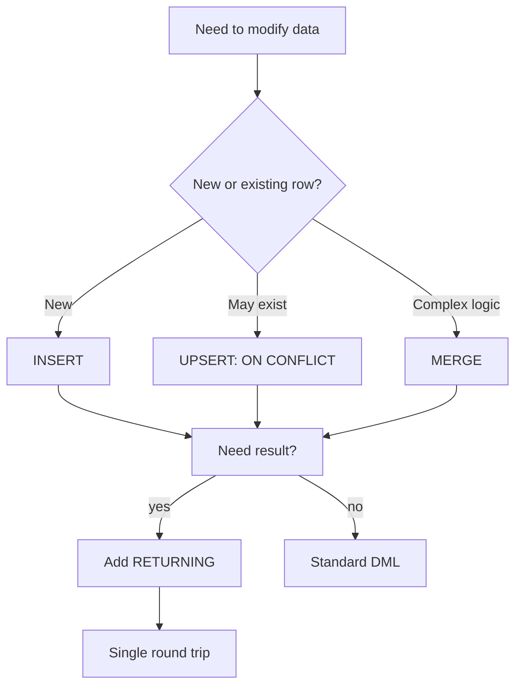

# Advanced DML: UPSERT, MERGE, RETURNING, and COPY

> [!summary] Goal
> Use PostgreSQL's advanced DML features: upsert with `ON CONFLICT`, conditional merge with `MERGE`, result feedback with `RETURNING`, and high-speed bulk loading with `COPY`.

## Table of Contents

1. [Why Advanced DML Matters](#why-advanced-dml-matters)
2. [UPSERT with `ON CONFLICT`](#upsert-with-on-conflict)
3. [`MERGE` (Conditional Insert/Update/Delete)](#merge)
4. [`RETURNING` Clause](#returning-clause)
5. [`COPY` for Bulk Operations](#copy-for-bulk-operations)
6. [Bulk `INSERT` and `DELETE` Strategies](#bulk-insert-and-delete-strategies)
7. [Pitfalls](#pitfalls)

---

## Why Advanced DML Matters

Basic `INSERT`, `UPDATE`, and `DELETE` handle simple cases. Real applications need:
- Insert-or-update logic without race conditions
- Conditional merge of source data into target tables
- Retrieving results from mutations without a separate query
- Loading millions of rows efficiently



---

## UPSERT with `ON CONFLICT`

`INSERT ... ON CONFLICT` atomically inserts or updates — no separate `SELECT` + `INSERT`/`UPDATE` needed, and no race condition.

### Basic upsert

```sql
INSERT INTO users (email, name, last_login)
VALUES ('alice@example.com', 'Alice', now())
ON CONFLICT (email) DO UPDATE
SET name = EXCLUDED.name,
    last_login = EXCLUDED.last_login;
```

**What this does:** If no user with `email = 'alice@example.com'` exists, insert. If one exists, update `name` and `last_login`.

> [!tip] Definition
> **`EXCLUDED`**: a pseudo-table representing the values that were proposed for insertion. `EXCLUDED.email`, `EXCLUDED.name`, etc. refer to the values you tried to insert.

### ON CONFLICT DO NOTHING

```sql
INSERT INTO event_log (event_id, occurred_at)
VALUES ('abc-123', now())
ON CONFLICT (event_id) DO NOTHING;
-- If event_id already exists, skip silently
```

### Conflict on constraint name

```sql
INSERT INTO inventory (sku, quantity)
VALUES ('ABC-001', 100)
ON CONFLICT ON CONSTRAINT inventory_sku_key
DO UPDATE SET quantity = inventory.quantity + EXCLUDED.quantity;
```

### Multiple conflict targets

```sql
CREATE TABLE ratings (
    user_id INTEGER,
    product_id INTEGER,
    rating INTEGER,
    PRIMARY KEY (user_id, product_id)
);

INSERT INTO ratings (user_id, product_id, rating)
VALUES (1, 42, 5)
ON CONFLICT (user_id, product_id)
DO UPDATE SET rating = EXCLUDED.rating;
```

### When to use UPSERT

| Use case | Why UPSERT |
|----------|------------|
| Session tracking | Insert or update last_active timestamp |
| Inventory counts | Increment quantity on existing SKU |
| Deduplicated event log | Insert if new, skip if duplicate key |
| Upsert from staging table | Merge raw data into clean table atomically |

---

## `MERGE` (Conditional Insert/Update/Delete)

`MERGE` (PostgreSQL 15+) performs conditional INSERT, UPDATE, or DELETE based on whether a row exists in the source.

### Basic MERGE

```sql
MERGE INTO products p
USING staging_products s ON p.sku = s.sku
WHEN MATCHED THEN
    UPDATE SET
        name = s.name,
        price = s.price,
        updated_at = now()
WHEN NOT MATCHED THEN
    INSERT (sku, name, price)
    VALUES (s.sku, s.name, s.price);
```

### MERGE with DELETE condition

```sql
MERGE INTO inventory i
USING daily_sales s ON i.product_id = s.product_id
WHEN MATCHED AND s.sold > i.quantity THEN
    DELETE
WHEN MATCHED THEN
    UPDATE SET quantity = i.quantity - s.sold
WHEN NOT MATCHED THEN
    INSERT (product_id, quantity)
    VALUES (s.product_id, 0 - s.sold);
```

### MERGE vs UPSERT

| Aspect | `UPSERT` (ON CONFLICT) | `MERGE` |
|--------|----------------------|---------|
| Complexity | Single table, single conflict target | Complex conditional logic |
| DELETE branch | Not supported | Supported |
| WHEN conditions | No | Yes (`WHEN MATCHED AND ...`) |
| Performance | Slightly faster | Slightly slower (more planning) |
| PostgreSQL version | 9.5+ | 15+ |

---

## `RETURNING` Clause

`RETURNING` returns values from the affected rows after `INSERT`, `UPDATE`, `DELETE`, or `MERGE` — no separate `SELECT` needed.

### RETURNING after INSERT

```sql
INSERT INTO users (email, name)
VALUES ('bob@example.com', 'Bob')
RETURNING id, created_at;
-- Returns: id | 42, created_at | 2026-05-03...
```

### RETURNING after UPDATE

```sql
UPDATE orders
SET status = 'shipped', shipped_at = now()
WHERE id = 1001
RETURNING id, status, shipped_at;
```

### RETURNING after DELETE

```sql
DELETE FROM sessions
WHERE expires_at < now()
RETURNING user_id, session_token;
```

### RETURNING with INTO (PL/pgSQL)

```sql
DO $$
DECLARE
    new_id INTEGER;
BEGIN
    INSERT INTO products (name, price)
    VALUES ('Widget', 9.99)
    RETURNING id INTO new_id;

    INSERT INTO audit_log (entity_id, action)
    VALUES (new_id, 'product_created');
END $$;
```

### DELETE with JOIN-like logic using USING

```sql
DELETE FROM orders o
USING customers c
WHERE o.customer_id = c.id
  AND c.status = 'inactive'
RETURNING o.id, c.name AS customer_name;
```

---

## `COPY` for Bulk Operations

`COPY` is the fastest way to get data in or out of PostgreSQL. It operates at the storage level, bypassing much of the SQL engine overhead.

### Export to file

```sql
COPY users TO '/tmp/users_export.csv' WITH CSV HEADER;

-- With custom delimiter
COPY users TO '/tmp/users_export.txt' WITH DELIMITER '|';

-- Export query results
COPY (SELECT id, email, created_at FROM users WHERE active = true)
TO '/tmp/active_users.csv' WITH CSV HEADER;
```

### Import from file

```sql
COPY users (email, name, active)
FROM '/tmp/new_users.csv' WITH CSV HEADER;
```

### Import from STDIN (via psql)

```bash
psql -c "\COPY users FROM 'users.csv' WITH CSV HEADER"
# \COPY is the psql meta-command — runs as client-side COPY to server
```

### Error handling with LOG ERRORS

```sql
COPY users FROM '/tmp/users.csv'
WITH CSV HEADER
LOG ERRORS
ERR SAVE TABLE public.copy_errors;
-- Invalid rows go to copy_errors instead of failing the whole batch
```

### Performance comparison

| Method | Rows/sec (estimate) | Best for |
|--------|--------------------|----------|
| Single `INSERT` | ~1,000 | Small inserts, real-time |
| Batch INSERT (1000 per stmt) | ~10,000 | Moderate bulk |
| `COPY` | ~100,000+ | Bulk load, migration, ETL |
| `pg_bulkload` | ~1,000,000+ | Very large initial loads |

---

## Bulk `INSERT` and `DELETE` Strategies

### Batch INSERT with multiple value rows

```sql
INSERT INTO logs (severity, message, created_at)
VALUES
    ('INFO', 'startup', now()),
    ('WARN', 'disk 80% full', now()),
    ('ERROR', 'connection failed', now());
-- Up to thousands of rows in a single statement
```

### Large DELETE with batching

Deleting millions of rows in one transaction causes bloat and long lock duration:

```sql
DO $$
DECLARE
    deleted INTEGER;
BEGIN
    LOOP
        DELETE FROM audit_log
        WHERE created_at < now() - INTERVAL '1 year'
        LIMIT 10000;
        GET DIAGNOSTICS deleted = ROW_COUNT;
        EXIT WHEN deleted = 0;
        COMMIT;  -- release locks, advance VACUUM
    END LOOP;
END $$;
```

### Bulk UPDATE with RETURNING

```sql
WITH updated AS (
    UPDATE sessions
    SET status = 'expired'
    WHERE expires_at < now()
    AND status = 'active'
    RETURNING id, user_id
)
SELECT count(*) FROM updated;
```

---

## Pitfalls

### Race condition with SELECT-then-INSERT

```sql
-- BAD: race condition
IF NOT EXISTS (SELECT 1 FROM users WHERE email = 'a@b.com') THEN
    INSERT INTO users (email) VALUES ('a@b.com');
END IF;
-- Two concurrent sessions can both pass the check and attempt to insert
```

**Fix**: Use `ON CONFLICT DO NOTHING` or `ON CONFLICT DO UPDATE`.

### Forgetting EXCLUDED

```sql
-- BAD: references the table's current value, not the proposed insert
INSERT INTO counters (id, count)
VALUES (1, 10)
ON CONFLICT (id) DO UPDATE
SET count = count + 1;  -- this adds 1 to current count, ignores proposed 10

-- GOOD: uses EXCLUDED for the proposed value, or mixes
ON CONFLICT (id) DO UPDATE
SET count = counters.count + EXCLUDED.count;
```

### COPY and constraints

`COPY` does not fire row triggers (`BEFORE INSERT` row triggers fire, but statement-level triggers may behave differently). All constraints (NOT NULL, CHECK, FK) still apply.

### COPY with large files and transaction wraparound

`COPY` in a single transaction holds locks and accumulates dead tuples. For very large loads, use `COPY` in batches with intermediate `COMMIT`.

### MERGE without boolean condition confusion

```sql
-- Correct: WHEN MATCHED AND condition
WHEN MATCHED AND s.quantity = 0 THEN DELETE

-- WRONG: mixing syntax
WHEN MATCHED THEN
    DELETE WHERE s.quantity = 0  -- no WHERE clause here
```

---

> [!question]- Interview Questions
>
> **Q: What is the difference between `INSERT ... ON CONFLICT` and `MERGE`?**
> A: `ON CONFLICT` handles insert-or-update against a single conflict target (unique constraint). `MERGE` (PG 15+) supports multiple conditional branches including DELETE, with arbitrary `WHEN MATCHED AND` conditions.
>
> **Q: What does `RETURNING` do and why would you use it?**
> A: `RETURNING` returns values from affected rows after INSERT, UPDATE, DELETE, or MERGE. It eliminates the need for a separate SELECT to retrieve auto-generated IDs, timestamps, or computed values.
>
> **Q: What is the difference between `COPY` and regular `INSERT`?**
> A: `COPY` is a bulk operation that streams data between the server and a file at the storage level, bypassing much of the SQL engine overhead. It is typically 10-100x faster than individual INSERT statements.
>
> **Q: What does the `EXCLUDED` keyword mean in an UPSERT?**
> A: `EXCLUDED` is a pseudo-table that holds the values that were proposed for insertion. In the `DO UPDATE` clause, `EXCLUDED.column` refers to the value that would have been inserted, while `table.column` refers to the existing value.

---

## Cross-Links

- [[SQL/01_Foundations/02_SQL_Basics_Select_Where_Join]] for basic SELECT and JOIN operations
- [[SQL/01_Foundations/04_Schema_Design_Basics]] for table definitions and constraints that conflict targets reference
- [[SQL/03_Advanced/01_VACUUM_Autovacuum_and_Bloat]] for VACUUM after large bulk operations
- [[SQL/05_Projects/01_Build_a_Mini_DB_Lab_With_psql]] for hands-on exercise with COPY

---

## References

- [PostgreSQL INSERT ... ON CONFLICT](https://www.postgresql.org/docs/current/sql-insert.html)
- [PostgreSQL MERGE](https://www.postgresql.org/docs/current/sql-merge.html)
- [PostgreSQL COPY](https://www.postgresql.org/docs/current/sql-copy.html)
- [PostgreSQL RETURNING](https://www.postgresql.org/docs/current/dml-returning.html)
