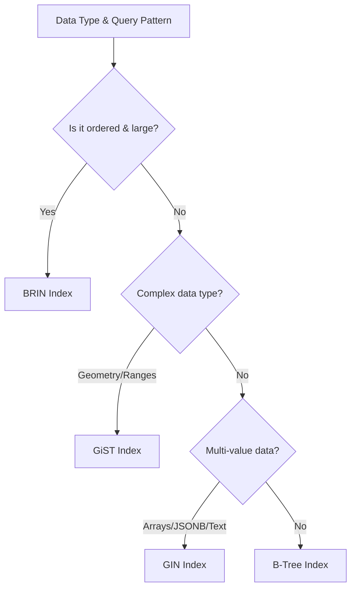

# Advanced Index Types: GIN, GiST, BRIN

> [!summary] Model
> PostgreSQL provides specialized index types beyond B-Tree for specific data types and query patterns. GIN excels at multi-value searches, GiST handles complex data types and ranges, BRIN optimizes large ordered datasets with minimal storage. Choose based on data structure and access patterns.

## Table of Contents

1. [[#Index Type Comparison]]
2. [[#GIN Indexes]]
3. [[#GiST Indexes]]
4. [[#BRIN Indexes]]
5. [[#Choosing the Right Index]]
6. [[#Performance Considerations]]
7. [[#Maintenance and Monitoring]]
8. [[#Best Practices]]
9. [[#Interview Questions]]

---

## Index Type Comparison

### When to Use Each Index Type

| Index Type | Use Case | Data Types | Query Types | Storage Size | Build Speed |
|------------|----------|------------|-------------|--------------|-------------|
| **B-Tree** | General purpose | Any | Equality, range, sorting | Medium | Fast |
| **GIN** | Multi-value, text | Arrays, JSONB, tsvector | Containment, full-text | Large | Slow |
| **GiST** | Complex types | Geometry, ranges, text | Proximity, overlap | Medium | Medium |
| **BRIN** | Large ordered tables | Any ordered | Range queries | Tiny | Very Fast |
| **SP-GiST** | Spatial, text | Points, routes | Containment, KNN | Medium | Medium |
| **Hash** | Simple equality | Any | Equality only | Small | Fast |

**Why specialized indexes?** B-Tree can't efficiently handle complex data types and query patterns.

**How to choose:** Analyze data structure and query patterns.

**When to consider:** Performance issues with standard B-Tree indexes.

### Index Creation Syntax

```sql
-- B-Tree (default)
CREATE INDEX idx_users_email ON users (email);

-- GIN index
CREATE INDEX idx_docs_content_gin ON documents USING gin (content);

-- GiST index
CREATE INDEX idx_shapes_geom_gist ON shapes USING gist (geom);

-- BRIN index
CREATE INDEX idx_logs_timestamp_brin ON logs USING brin (timestamp);

-- With options
CREATE INDEX idx_json_data_gin ON events USING gin (data jsonb_path_ops);
```

**Why USING clause?** Specifies index type for specialized access methods.

**How PostgreSQL chooses:** Defaults to B-Tree, specialized types for specific operators.

**When to specify:** Always for GIN, GiST, BRIN to ensure correct index type.

---

## GIN Indexes

### What is GIN?

GIN (Generalized Inverted Index) creates separate index entries for each component of composite values:

**Example with arrays:**
```sql
-- Data: [1, 2, 3], [2, 3, 4], [3, 4, 5]
-- GIN Index entries:
-- 1 → row1
-- 2 → row1, row2
-- 3 → row1, row2, row3
-- 4 → row2, row3
-- 5 → row3
```

**Why inverted?** Maps values to rows containing them, enabling fast multi-value searches.

**How it works:** Stores value → posting list (rows containing value).

**When to use:** Arrays, JSONB, full-text search, any multi-value data.

### GIN for JSONB

```sql
-- Create table with JSONB data
CREATE TABLE events (
    id SERIAL PRIMARY KEY,
    data JSONB,
    created_at TIMESTAMPTZ DEFAULT NOW()
);

-- GIN index for JSONB containment
CREATE INDEX idx_events_data_gin ON events USING gin (data);

-- Efficient queries
SELECT * FROM events WHERE data @> '{"user_id": 123}';
SELECT * FROM events WHERE data ? 'status';
SELECT * FROM events WHERE data ?& array['status', 'priority'];

-- Path-specific GIN index
CREATE INDEX idx_events_data_path_gin ON events USING gin (data jsonb_path_ops);
```

**Why JSONB GIN?** Enables fast containment queries on JSON data.

**How it works:** Indexes JSON paths and values for quick lookup.

**When to use:** JSONB columns with frequent containment/existence queries.

### GIN for Full-Text Search

```sql
-- Create table with text content
CREATE TABLE articles (
    id SERIAL PRIMARY KEY,
    title TEXT,
    content TEXT,
    search_vector TSVECTOR
);

-- Update search vector
UPDATE articles SET search_vector = to_tsvector('english', title || ' ' || content);

-- GIN index on search vector
CREATE INDEX idx_articles_search_gin ON articles USING gin (search_vector);

-- Efficient full-text queries
SELECT * FROM articles WHERE search_vector @@ to_tsquery('database & performance');

-- Search ranking
SELECT title, ts_rank(search_vector, to_tsquery('database')) as rank
FROM articles
WHERE search_vector @@ to_tsquery('database')
ORDER BY rank DESC;
```

**Why GIN for FTS?** Handles complex boolean queries efficiently.

**How it works:** Indexes individual words/terms for fast boolean combinations.

**When to use:** Full-text search applications, document search.

### GIN for Arrays

```sql
-- Table with array columns
CREATE TABLE products (
    id SERIAL PRIMARY KEY,
    name TEXT,
    tags TEXT[],
    categories INTEGER[]
);

-- GIN index on arrays
CREATE INDEX idx_products_tags_gin ON products USING gin (tags);
CREATE INDEX idx_products_categories_gin ON products USING gin (categories);

-- Array operations
SELECT * FROM products WHERE tags @> array['electronics', 'wireless'];
SELECT * FROM products WHERE categories && array[1, 3, 5];  -- Overlap
SELECT * FROM products WHERE 'wireless' = ANY (tags);      -- Contains element
```

**Why GIN for arrays?** Enables fast containment and overlap queries.

**How it works:** Indexes individual array elements.

**When to use:** Tag systems, categorization, many-to-many relationships.

### GIN Performance Characteristics

```sql
-- GIN index size comparison
SELECT
    schemaname,
    tablename,
    indexname,
    pg_size_pretty(pg_relation_size(indexrelid)) as size
FROM pg_stat_user_indexes
WHERE indexdef LIKE '%USING gin%';

-- Query performance
EXPLAIN (ANALYZE, BUFFERS)
SELECT * FROM events WHERE data @> '{"status": "active"}';
```

**Why monitor GIN?** Large indexes, build time, maintenance overhead.

**How to optimize:** Use appropriate operator classes, consider partial indexes.

**When GIN is slower:** Small datasets, simple queries where B-Tree suffices.

---

## GiST Indexes

### What is GiST?

GiST (Generalized Search Tree) is a balanced tree structure supporting complex data types and queries:

**Key features:**
- **Balanced tree**: Like B-Tree but for complex data
- **Extensible**: Supports custom data types and operators
- **Lossy**: May return false positives (recheck needed)

**Why GiST?** Handles geometric, range, and text data that B-Tree can't index.

**How it works:** Uses bounding boxes/representations for complex objects.

**When to use:** Spatial data, range types, fuzzy text matching.

### GiST for Geometric Data

```sql
-- Enable PostGIS or use built-in geometric types
CREATE TABLE shapes (
    id SERIAL PRIMARY KEY,
    name TEXT,
    geom GEOMETRY
);

-- GiST index for spatial queries
CREATE INDEX idx_shapes_geom_gist ON shapes USING gist (geom);

-- Spatial queries
SELECT * FROM shapes WHERE ST_DWithin(geom, ST_Point(0, 0), 1000);
SELECT * FROM shapes WHERE ST_Contains(geom, ST_Point(10, 20));
SELECT * FROM shapes ORDER BY geom <-> ST_Point(0, 0) LIMIT 5;  -- Nearest
```

**Why GiST for geometry?** Enables spatial operations like distance, containment, intersection.

**How it works:** Uses bounding boxes for spatial objects.

**When to use:** GIS applications, location-based services, spatial analysis.

### GiST for Range Types

```sql
-- Range types
CREATE TABLE reservations (
    id SERIAL PRIMARY KEY,
    room_id INTEGER,
    period TSRANGE,
    guest_name TEXT
);

-- GiST index for range queries
CREATE INDEX idx_reservations_period_gist ON reservations USING gist (period);

-- Range queries
SELECT * FROM reservations WHERE period && '[2024-01-15, 2024-01-20]'::tsrange;  -- Overlap
SELECT * FROM reservations WHERE period @> '2024-01-17'::timestamp;               -- Contains
SELECT * FROM reservations WHERE period <@ '[2024-01-10, 2024-01-25]'::tsrange;  -- Contained by
```

**Why GiST for ranges?** Efficient overlap and containment queries on ranges.

**How it works:** Indexes range bounds for quick overlap detection.

**When to use:** Scheduling systems, date ranges, numeric ranges.

### GiST for Text Search

```sql
-- Trigram matching for fuzzy text search
CREATE EXTENSION pg_trgm;

CREATE TABLE documents (
    id SERIAL PRIMARY KEY,
    content TEXT
);

-- GiST index for trigram similarity
CREATE INDEX idx_documents_content_gist ON documents USING gist (content gist_trgm_ops);

-- Fuzzy text queries
SELECT * FROM documents WHERE content % 'databse';        -- Typo tolerance
SELECT * FROM documents WHERE content LIKE '%database%';  -- Pattern matching
SELECT content, similarity(content, 'database') as sim
FROM documents
WHERE content % 'database'
ORDER BY sim DESC;
```

**Why GiST for text?** Handles fuzzy matching and similarity searches.

**How it works:** Indexes trigrams (3-character sequences) for approximate matching.

**When to use:** Auto-complete, spell checking, fuzzy search applications.

### GiST Performance Characteristics

```sql
-- GiST query analysis
EXPLAIN (ANALYZE)
SELECT * FROM shapes
WHERE geom && ST_MakeEnvelope(0, 0, 100, 100, 4326);

-- Index usage
SELECT * FROM pg_stat_user_indexes
WHERE indexdef LIKE '%USING gist%';
```

**Why monitor GiST?** Query performance, false positive rate, maintenance.

**How to optimize:** Choose appropriate operator classes, consider fill factor.

**When GiST excels:** Complex queries on specialized data types.

---

## BRIN Indexes

### What is BRIN?

BRIN (Block Range Index) indexes ranges of blocks rather than individual values:

**How it works:**
- Divides table into **block ranges** (typically 128 blocks)
- Stores **min/max values** for each range
- Very compact index

**Example:**
```
Table blocks: [1-128], [129-256], [257-384]
BRIN entries:
Block range 1-128: min_time=2024-01-01, max_time=2024-01-15
Block range 129-256: min_time=2024-01-16, max_time=2024-01-31
Block range 257-384: min_time=2024-02-01, max_time=2024-02-15
```

**Why BRIN?** Tiny indexes for large tables with correlated data.

**How it works:** Eliminates block ranges that can't contain query values.

**When to use:** Time-series data, append-only tables, large ordered datasets.

### BRIN for Time-Series Data

```sql
-- Large time-series table
CREATE TABLE sensor_readings (
    sensor_id INTEGER,
    timestamp TIMESTAMPTZ,
    value DECIMAL,
    quality INTEGER
) PARTITION BY RANGE (timestamp);

-- BRIN index (very small)
CREATE INDEX idx_readings_timestamp_brin ON sensor_readings USING brin (timestamp);

-- Efficient range queries
SELECT * FROM sensor_readings
WHERE timestamp BETWEEN '2024-01-01' AND '2024-01-31';

-- Index size comparison
SELECT
    'brin' as type,
    pg_size_pretty(pg_relation_size('idx_readings_timestamp_brin')) as size
UNION ALL
SELECT
    'btree' as type,
    pg_size_pretty(pg_relation_size('idx_readings_timestamp_btree')) as size;
```

**Why BRIN for time-series?** Much smaller than B-Tree, still effective for range queries.

**How it works:** Assumes data is physically ordered by timestamp.

**When to use:** IoT data, logs, monitoring data, large chronological datasets.

### BRIN Configuration

```sql
-- BRIN index with custom pages per range
CREATE INDEX idx_logs_timestamp_brin ON logs USING brin (timestamp) WITH (pages_per_range = 64);

-- Monitor BRIN effectiveness
SELECT
    idx_blks_read, idx_blks_hit,
    ROUND(idx_blks_hit::numeric / (idx_blks_hit + idx_blks_read) * 100, 2) as hit_ratio
FROM pg_stat_user_indexes
WHERE indexname = 'idx_logs_timestamp_brin';

-- BRIN-specific statistics
SELECT * FROM brin_metapage_info(get_raw_page('idx_logs_timestamp_brin', 0));
SELECT * FROM brin_page_items(get_raw_page('idx_logs_timestamp_brin', 1), 'idx_logs_timestamp_brin');
```

**Why configure BRIN?** Tune for data distribution and query patterns.

**How to monitor:** Check hit ratios, analyze page ranges.

**When BRIN is best:** Large tables with strong correlation between physical and logical order.

### BRIN Limitations

```sql
-- BRIN struggles with:
-- Uncorrelated data (random inserts)
-- Frequent updates (breaks correlation)
-- Small tables (B-Tree is better)

-- Check correlation
SELECT
    correlation
FROM pg_stats
WHERE tablename = 'large_table' AND attname = 'timestamp';

-- High correlation (> 0.9) is good for BRIN
-- Low correlation (< 0.5) suggests B-Tree
```

**Why correlation matters?** BRIN assumes physical order matches logical order.

**How to check:** pg_stats.correlation shows data ordering.

**When to avoid BRIN:** Poor correlation, frequent random updates.

---

## Choosing the Right Index

### Decision Flowchart



### Index Selection Guide

| Scenario | Recommended Index | Example |
|----------|-------------------|---------|
| **JSONB containment** | GIN | `data @> '{"status": "active"}'` |
| **Array overlap** | GIN | `tags && array['urgent', 'bug']` |
| **Full-text search** | GIN | `content @@ to_tsquery('database')` |
| **Spatial queries** | GiST | `ST_DWithin(geom, point, 1000)` |
| **Range overlap** | GiST | `period && '[2024-01-01, 2024-01-31]'` |
| **Time-series ranges** | BRIN | `timestamp BETWEEN '2024-01-01' AND '2024-01-31'` |
| **Large ordered table** | BRIN | Log files, sensor data |
| **Fuzzy text matching** | GiST (with pg_trgm) | `content % 'databse'` |
| **Standard queries** | B-Tree | `WHERE id = 123` |

### Performance Comparison

```sql
-- Test different indexes on same data
CREATE TABLE test_data (
    id SERIAL PRIMARY KEY,
    data JSONB,
    geom GEOMETRY,
    timestamp TIMESTAMPTZ,
    tags TEXT[]
);

-- Create different indexes
CREATE INDEX idx_data_btree ON test_data USING btree ((data->>'status'));
CREATE INDEX idx_data_gin ON test_data USING gin (data);
CREATE INDEX idx_geom_gist ON test_data USING gist (geom);
CREATE INDEX idx_timestamp_brin ON test_data USING brin (timestamp);
CREATE INDEX idx_tags_gin ON test_data USING gin (tags);

-- Compare query performance
EXPLAIN (ANALYZE) SELECT * FROM test_data WHERE data @> '{"status": "active"}';  -- GIN wins
EXPLAIN (ANALYZE) SELECT * FROM test_data WHERE timestamp BETWEEN '2024-01-01' AND '2024-01-31';  -- BRIN wins
```

---

## Performance Considerations

### Index Size Comparison

```sql
-- Compare index sizes
SELECT
    indexname,
    pg_size_pretty(pg_relation_size(indexrelid)) as size,
    idx_scan, idx_tup_read, idx_tup_fetch
FROM pg_stat_user_indexes
WHERE tablename = 'large_table'
ORDER BY pg_relation_size(indexrelid) DESC;

-- Typical sizes:
-- B-Tree: 10-30% of table size
-- GIN: 20-50% of table size (larger for JSONB)
-- GiST: 15-40% of table size
-- BRIN: 0.1-1% of table size (much smaller)
```

### Build Time Comparison

```sql
-- CREATE INDEX timing
-- B-Tree: Fastest to build
-- BRIN: Very fast (just scans min/max)
-- GIN: Slowest (builds inverted index)
-- GiST: Medium speed

-- Concurrent creation
CREATE INDEX CONCURRENTLY idx_large_gin ON large_table USING gin (data);
-- Allows writes during index build
```

### Maintenance Overhead

```sql
-- Index maintenance during updates
-- B-Tree: Moderate overhead
-- BRIN: Low overhead (assumes append-only)
-- GIN: High overhead (updates posting lists)
-- GiST: Moderate overhead

-- Monitor bloat
SELECT
    schemaname, tablename, indexname,
    pg_size_pretty(pg_relation_size(indexrelid)) as size
FROM pg_stat_user_indexes
WHERE schemaname = 'public'
ORDER BY pg_relation_size(indexrelid) DESC;
```

### Query Performance

```sql
-- Test query performance
EXPLAIN (ANALYZE, BUFFERS)
SELECT * FROM json_table WHERE data @> '{"type": "event"}';

-- Look for:
-- Index scan (good)
-- Bitmap index scan (GIN)
-- Index-only scan (if covering)
-- Buffer hits vs reads
```

---

## Maintenance and Monitoring

### Index Health Checks

```sql
-- Check index usage
SELECT
    schemaname, tablename, indexname,
    idx_scan, idx_tup_read, idx_tup_fetch,
    pg_size_pretty(pg_relation_size(indexrelid)) as size
FROM pg_stat_user_indexes
WHERE schemaname = 'public'
ORDER BY idx_scan DESC;

-- Unused indexes
SELECT indexname
FROM pg_stat_user_indexes
WHERE idx_scan = 0 AND schemaname = 'public';

-- Index bloat check
SELECT
    schemaname, tablename, indexname,
    ROUND(100 * (pg_relation_size(indexrelid) - pg_relation_size(indexrelid, 'main'))::numeric / pg_relation_size(indexrelid), 2) as bloat_pct
FROM pg_stat_user_indexes
WHERE pg_relation_size(indexrelid) > 0;
```

### Reindexing Strategies

```sql
-- Rebuild bloated indexes
REINDEX INDEX CONCURRENTLY idx_json_data_gin;

-- Rebuild all indexes on table
REINDEX TABLE CONCURRENTLY large_table;

-- For BRIN, recreate if correlation changes
DROP INDEX idx_timestamp_brin;
CREATE INDEX idx_timestamp_brin ON large_table USING brin (timestamp);
```

### BRIN Correlation Monitoring

```sql
-- Check physical correlation
SELECT
    tablename, attname, correlation
FROM pg_stats
WHERE schemaname = 'public'
ORDER BY abs(correlation) DESC;

-- High correlation (> 0.9): BRIN is excellent
-- Medium correlation (0.5-0.9): BRIN still good
-- Low correlation (< 0.5): Consider B-Tree

-- Re-cluster for better correlation
CLUSTER large_table USING idx_timestamp_brin;
```

---

## Best Practices

### 1. Use Appropriate Index Types

```sql
-- ✅ JSONB queries
CREATE INDEX ON events USING gin (data);

-- ✅ Spatial queries
CREATE INDEX ON locations USING gist (geom);

-- ✅ Time-series queries
CREATE INDEX ON logs USING brin (created_at);

-- ❌ Wrong index type
CREATE INDEX ON events (data->>'status');  -- B-Tree on JSON path
-- Should be: CREATE INDEX ON events USING gin (data);
```

### 2. Monitor Index Effectiveness

```sql
-- Regular monitoring query
SELECT
    indexname,
    pg_size_pretty(pg_relation_size(indexrelid)) as size,
    idx_scan,
    CASE WHEN idx_scan > 0
         THEN ROUND(idx_tup_fetch::numeric / idx_scan, 2)
         ELSE 0
    END as avg_tuples_per_scan
FROM pg_stat_user_indexes
WHERE schemaname = 'public'
ORDER BY pg_relation_size(indexrelid) DESC;
```

### 3. Consider Index Size

```sql
-- For large tables, prefer smaller indexes
-- BRIN for time-series (0.1-1% of table size)
-- GIN for JSONB can be 20-50% of table size
-- Balance: Index size vs query performance

-- Check impact
SELECT
    schemaname, tablename,
    pg_size_pretty(pg_total_relation_size(schemaname||'.'||tablename)) as table_size,
    pg_size_pretty(sum(pg_relation_size(indexrelid))) as index_size
FROM pg_stat_user_indexes
WHERE schemaname = 'public'
GROUP BY schemaname, tablename
ORDER BY sum(pg_relation_size(indexrelid)) DESC;
```

### 4. Use Operator Classes

```sql
-- GIN operator classes
CREATE INDEX ON docs USING gin (content gin_trgm_ops);    -- Trigrams
CREATE INDEX ON events USING gin (data jsonb_path_ops);   -- Path ops

-- GiST operator classes
CREATE INDEX ON shapes USING gist (geom);                 -- PostGIS
CREATE INDEX ON docs USING gist (content gist_trgm_ops);  -- Trigrams
```

### 5. Handle Index Bloat

```sql
-- Rebuild bloated indexes
REINDEX INDEX CONCURRENTLY bloated_index;

-- For GIN indexes with high update rate
-- Consider periodic rebuild during maintenance

-- Monitor bloat
SELECT
    nspname, relname, idxname,
    pg_get_indexdef(indexrelid) as indexdef,
    pg_size_pretty(pg_relation_size(indexrelid)) as size
FROM (
    SELECT *,
           pg_relation_size(indexrelid) as size
    FROM pg_stat_user_indexes
) t
ORDER BY size DESC;
```

### 6. Test Index Performance

```sql
-- Before and after comparison
-- Disable index
UPDATE pg_index SET indisvalid = false WHERE indexrelid = 'idx_name'::regclass;

-- Run query
EXPLAIN (ANALYZE) SELECT * FROM table WHERE condition;

-- Re-enable index
UPDATE pg_index SET indisvalid = true WHERE indexrelid = 'idx_name'::regclass;
REINDEX INDEX idx_name;
```

### 7. Consider Partial Indexes

```sql
-- Partial specialized indexes
CREATE INDEX ON events USING gin (data)
WHERE data @> '{"priority": "high"}';  -- Only high priority

CREATE INDEX ON logs USING brin (timestamp)
WHERE timestamp > '2024-01-01';  -- Recent logs only
```

### 8. Plan for Scalability

```sql
-- Start with B-Tree
-- Upgrade to specialized when:
-- Performance issues arise
-- Data volume grows
-- Query patterns change

-- Monitor and adjust
-- Specialized indexes are harder to change
```

---

## Interview Questions

### Q1: Explain the difference between B-Tree, GIN, GiST, and BRIN indexes.

**Answer:**

**B-Tree:** Balanced tree for general-purpose indexing
- Best for: Equality, range, sort operations
- Size: Medium (10-30% of table)
- Use when: Standard OLTP queries

**GIN (Generalized Inverted Index):**
- Best for: Multi-value data (arrays, JSONB, full-text)
- Size: Large (20-50% of table)
- How it works: Inverted index (value → list of rows)

**GiST (Generalized Search Tree):**
- Best for: Complex types (geometry, ranges, fuzzy text)
- Size: Medium (15-40% of table)
- How it works: Balanced tree with bounding representations

**BRIN (Block Range Index):**
- Best for: Large ordered tables
- Size: Tiny (0.1-1% of table)
- How it works: Indexes min/max per block range

### Q2: When should you use a GIN index?

**Answer:** Use GIN for data types with multiple values or complex structures.

**Primary use cases:**

1. **JSONB data:**
```sql
CREATE INDEX ON events USING gin (data);
SELECT * FROM events WHERE data @> '{"status": "active"}';
```

2. **Arrays:**
```sql
CREATE INDEX ON products USING gin (tags);
SELECT * FROM products WHERE tags @> array['electronics'];
```

3. **Full-text search:**
```sql
CREATE INDEX ON articles USING gin (search_vector);
SELECT * FROM articles WHERE search_vector @@ to_tsquery('database');
```

**Characteristics:**
- Large index size
- Excellent for containment/existence queries
- Slower to build and update
- Returns exact results (no false positives)

### Q3: What is BRIN and when is it most effective?

**Answer:** BRIN (Block Range Index) indexes ranges of table blocks with min/max values.

**How it works:**
- Divides table into block ranges (default 128 blocks)
- Stores min/max values for each range
- Eliminates ranges that can't contain query values

**Most effective when:**
- **Large tables** (> 100GB)
- **Strong correlation** between physical and logical order
- **Append-only workloads** (time-series, logs)
- **Range queries** on ordered data

**Example:**
```sql
-- For time-series data
CREATE INDEX ON sensor_data USING brin (timestamp);
SELECT * FROM sensor_data
WHERE timestamp BETWEEN '2024-01-01' AND '2024-01-31';
-- BRIN eliminates irrelevant time ranges
```

**Advantages:**
- Tiny index size (0.1-1% of table)
- Very fast to build
- Low maintenance overhead

### Q4: How does GiST differ from B-Tree for range queries?

**Answer:**

**B-Tree range queries:**
```sql
CREATE INDEX ON events (start_time);
SELECT * FROM events WHERE start_time BETWEEN '2024-01-01' AND '2024-01-31';
```
- Efficient for simple ranges
- Exact matches
- Good for sorted output

**GiST range queries:**
```sql
CREATE INDEX ON events USING gist (period);
SELECT * FROM events WHERE period && '[2024-01-01, 2024-01-31]'::tsrange;
```
- Handles complex range operations (overlap, containment)
- Works with range types, geometry
- May return false positives (recheck needed)

**When to use GiST over B-Tree:**
- Range overlap queries (`&&`)
- Complex geometric operations
- Fuzzy text matching
- Custom data types with specialized operators

### Q5: What are the trade-offs of using specialized indexes?

**Answer:** Specialized indexes offer better query performance but have costs.

**Trade-offs:**

**GIN Indexes:**
- **Pros:** Excellent for multi-value queries, exact results
- **Cons:** Large size, slow to build/update, high maintenance
- **Best for:** JSONB, arrays, full-text search

**GiST Indexes:**
- **Pros:** Handles complex data types and operations
- **Cons:** May return false positives, moderate build time
- **Best for:** Spatial data, range types, fuzzy matching

**BRIN Indexes:**
- **Pros:** Tiny size, very fast build, low maintenance
- **Cons:** Requires strong correlation, not for random access
- **Best for:** Large ordered tables, time-series data

**General considerations:**
- **Build time:** Specialized indexes often slower to create
- **Maintenance:** Higher overhead during updates
- **Size:** GIN largest, BRIN smallest
- **Query scope:** Consider if index supports your query patterns

### Q6: How do you choose between GIN and GiST for text search?

**Answer:**

**GIN (Generalized Inverted Index):**
```sql
-- Best for exact boolean queries
CREATE INDEX ON articles USING gin (search_vector);
SELECT * FROM articles WHERE search_vector @@ to_tsquery('database & performance');
```
- **Pros:** Fast exact boolean searches, ranking support
- **Cons:** Larger index, slower updates
- **Use when:** Full-text search with boolean operators

**GiST (Generalized Search Tree):**
```sql
-- Best for fuzzy/approximate matching
CREATE INDEX ON articles USING gist (content gist_trgm_ops);
SELECT * FROM articles WHERE content % 'databse';  -- Typo tolerance
```
- **Pros:** Fuzzy matching, similarity searches, smaller index
- **Cons:** Slower than GIN for exact searches
- **Use when:** Auto-complete, spell checking, approximate matching

**Decision factors:**
- Exact boolean search → GIN
- Fuzzy/approximate search → GiST
- Index build time constraints → GiST
- Update frequency → GiST for high updates

### Q7: Explain BRIN correlation and why it matters.

**Answer:** BRIN assumes data is physically ordered by the indexed column.

**Correlation measurement:**
```sql
SELECT correlation FROM pg_stats
WHERE tablename = 'sensor_data' AND attname = 'timestamp';
```

**Values:**
- **1.0**: Perfect correlation (data ordered exactly as indexed)
- **0.0**: Random order (no correlation)
- **-1.0**: Reverse order

**Why it matters:**
- High correlation: BRIN very effective, eliminates many block ranges
- Low correlation: BRIN ineffective, many false positives

**Maintaining correlation:**
```sql
-- Append-only tables naturally maintain correlation
-- Random inserts break correlation
-- CLUSTER can restore correlation
CLUSTER sensor_data USING idx_timestamp_brin;
```

**When BRIN excels:** Time-series data, log files, append-only workloads with high correlation.

### Q8: How do you monitor and maintain specialized indexes?

**Answer:** Regular monitoring and maintenance ensure optimal performance.

**Monitoring:**
```sql
-- Index usage statistics
SELECT indexname, idx_scan, idx_tup_read, idx_tup_fetch
FROM pg_stat_user_indexes;

-- Index size
SELECT indexname, pg_size_pretty(pg_relation_size(indexrelid))
FROM pg_stat_user_indexes;

-- BRIN correlation
SELECT tablename, attname, correlation
FROM pg_stats WHERE correlation < 0.9;
```

**Maintenance:**
```sql
-- Reindex bloated indexes
REINDEX INDEX CONCURRENTLY idx_gin_bloated;

-- Rebuild BRIN if correlation drops
DROP INDEX idx_brin_old;
CREATE INDEX idx_brin_new ON table USING brin (column);
CLUSTER table USING idx_brin_new;

-- Vacuum specialized indexes
VACUUM (INDEX_CLEANUP ON) table;
```

**Best practices:**
- Monitor index effectiveness regularly
- Rebuild during maintenance windows
- Consider correlation for BRIN indexes
- Test performance after changes

---

## Summary

**Key Takeaways:**

1. **GIN**: Multi-value data (JSONB, arrays, full-text) - inverted index for containment queries
2. **GiST**: Complex types (geometry, ranges, fuzzy text) - balanced tree with lossy compression
3. **BRIN**: Large ordered tables - block range indexing for correlation-based queries
4. **Selection**: Analyze data types and query patterns to choose appropriate index
5. **Performance**: Balance index size, build time, and query performance
6. **Maintenance**: Monitor usage, rebuild when bloated, check BRIN correlation
7. **Trade-offs**: Specialized indexes better for specific use cases but have higher costs

**Index Selection Guide:**
```
Simple equality/ranges → B-Tree
JSONB containment → GIN
Array operations → GIN  
Full-text search → GIN
Spatial queries → GiST
Range overlaps → GiST
Time-series ranges → BRIN
Large ordered data → BRIN
```

---

## Cross-Links

- **Basic Indexes**: [[SQL/02_Core/01_Indexes_Basics_and_BTree]]
- **JSONB**: [[SQL/03_Advanced/03_Replication_and_Backups]]
- **Full-Text Search**: [[SQL/03_Advanced/04_Advanced_Index_Types_GIN_GiST_BRIN]]
- **Performance**: [[SQL/02_Core/04_Explain_Analyze_and_Query_Plans]]

## References

- [PostgreSQL Index Types](https://www.postgresql.org/docs/current/indexes-types.html)
- [GIN Indexes](https://www.postgresql.org/docs/current/gin.html)
- [GiST Indexes](https://www.postgresql.org/docs/current/gist.html)
- [BRIN Indexes](https://www.postgresql.org/docs/current/brin.html)

---

**Status**: stable  
**Last Updated**: 2026-04-26  
**Lines**: 711