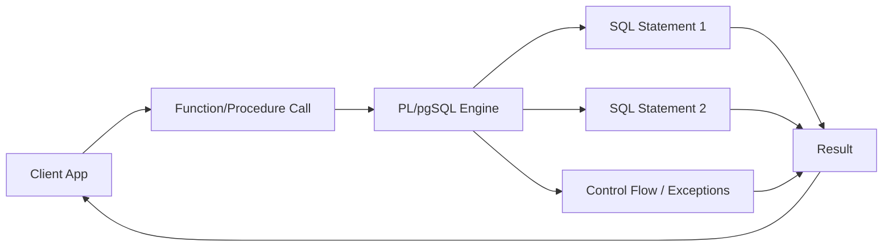

# PL/pgSQL: Functions and Procedures

> [!summary] Goal
> Write server-side logic in PostgreSQL using PL/pgSQL: understand function vs procedure semantics, control structures, exception handling, cursors, and triggers — all with production safety in mind.

## Table of Contents

1. [Why PL/pgSQL Matters](#why-pl-pgsql-matters)
2. [`CREATE FUNCTION` vs `CREATE PROCEDURE`](#create-function-vs-create-procedure)
3. [PL/pgSQL Syntax and Structure](#pl-pgsql-syntax-and-structure)
4. [Variables and Types](#variables-and-types)
5. [Control Structures](#control-structures)
6. [Exceptions and Error Handling](#exceptions-and-error-handling)
7. [Cursors and Row-by-Row Processing](#cursors-and-row-by-row-processing)
8. [Triggers](#triggers)
9. [`DO` Blocks (Anonymous Functions)](#do-blocks)
10. [Performance and Security](#performance-and-security)
11. [Pitfalls](#pitfalls)

---

## Why PL/pgSQL Matters

PL/pgSQL is PostgreSQL's built-in procedural language. It lets you:
- Run complex business logic inside the database (reduced network round trips)
- Enforce data integrity with triggers
- Automate maintenance (partition management, vacuum scheduling)
- Encapsulate multi-step operations in a single call



---

## `CREATE FUNCTION` vs `CREATE PROCEDURE`

| Aspect | `CREATE FUNCTION` | `CREATE PROCEDURE` |
|--------|-------------------|-------------------|
| Returns value | Yes (or `TABLE`, `SETOF`) | No (no return value) |
| Transaction control | Cannot `COMMIT`/`ROLLBACK` | Can `COMMIT`/`ROLLBACK` |
| Called with | `SELECT func()` or in SQL | `CALL proc()` |
| Use case | Returning computed data | Side effects, transaction management |

```sql
-- FUNCTION: must return a value
CREATE FUNCTION add_user(email TEXT, name TEXT)
RETURNS INTEGER
LANGUAGE plpgsql AS $$
DECLARE
    new_id INTEGER;
BEGIN
    INSERT INTO users (email, name) VALUES (email, name)
    RETURNING id INTO new_id;
    RETURN new_id;
END $$;

-- PROCEDURE: can manage transactions
CREATE PROCEDURE transfer_funds(
    from_id INTEGER, to_id INTEGER, amount DECIMAL
)
LANGUAGE plpgsql AS $$
BEGIN
    UPDATE accounts SET balance = balance - amount WHERE id = from_id;
    UPDATE accounts SET balance = balance + amount WHERE id = to_id;
    COMMIT;
END $$;
```

---

## PL/pgSQL Syntax and Structure

### Basic block structure

```sql
CREATE FUNCTION function_name(param1 TYPE, param2 TYPE)
RETURNS return_type
LANGUAGE plpgsql
AS $$
<<block_label>>
DECLARE
    -- variable declarations
BEGIN
    -- executable statements
    RETURN result;
EXCEPTION
    -- error handling
END block_label;
$$;
```

### Dollar-quoting (`$$`)

The `$$` delimiters (dollar-quoting) avoid escaping single quotes inside the function body:

```sql
CREATE FUNCTION greet(name TEXT)
RETURNS TEXT
LANGUAGE plpgsql
AS $$
BEGIN
    RETURN 'Hello, ' || name || '!';
END $$;
```

Alternative delimiters for nested contexts:

```sql
CREATE FUNCTION test()
RETURNS TEXT
LANGUAGE plpgsql
AS $func$
BEGIN
    RETURN $$nested dollar quote$$;
END $func$;
```

---

## Variables and Types

### Variable declaration

```sql
CREATE FUNCTION get_discount(customer_id INTEGER)
RETURNS DECIMAL
LANGUAGE plpgsql AS $$
DECLARE
    total_orders INTEGER;
    discount DECIMAL := 0.0;
    customer_exists BOOLEAN;
    last_order_date DATE;
    preferred_name VARCHAR(100) := 'Guest';
BEGIN
    -- Assign with := or SELECT INTO
    SELECT COUNT(*) INTO total_orders
    FROM orders WHERE customer_id = get_discount.customer_id;

    -- Variable = parameter name — use function name prefix
    IF total_orders > 10 THEN
        discount := 0.15;
    END IF;

    RETURN discount;
END $$;
```

### Record and row types

```sql
CREATE FUNCTION get_user_profile(uid INTEGER)
RETURNS TEXT
LANGUAGE plpgsql AS $$
DECLARE
    user_record users%ROWTYPE;        -- matches users table structure
    city_name cities.name%TYPE;       -- matches column type
BEGIN
    SELECT * INTO user_record FROM users WHERE id = uid;
    SELECT c.name INTO city_name FROM cities c
        JOIN users u ON u.city_id = c.id
        WHERE u.id = uid;

    RETURN user_record.name || ' from ' || city_name;
END $$;
```

### Constants

```sql
DECLARE
    TAX_RATE CONSTANT DECIMAL := 0.08;
    MAX_RETRIES CONSTANT INTEGER := 3;
```

---

## Control Structures

### IF / ELSIF / ELSE

```sql
CREATE FUNCTION classify_age(age INTEGER)
RETURNS TEXT
LANGUAGE plpgsql AS $$
BEGIN
    IF age < 0 THEN
        RETURN 'invalid';
    ELSIF age < 18 THEN
        RETURN 'minor';
    ELSIF age < 65 THEN
        RETURN 'adult';
    ELSE
        RETURN 'senior';
    END IF;
END $$;
```

### CASE

```sql
CREATE FUNCTION order_status_label(status_code INTEGER)
RETURNS TEXT
LANGUAGE plpgsql AS $$
BEGIN
    RETURN CASE status_code
        WHEN 1 THEN 'pending'
        WHEN 2 THEN 'shipped'
        WHEN 3 THEN 'delivered'
        ELSE 'unknown'
    END;
END $$;
```

### LOOP / WHILE / FOR

```sql
-- LOOP with EXIT
CREATE FUNCTION sum_to(n INTEGER)
RETURNS INTEGER
LANGUAGE plpgsql AS $$
DECLARE
    i INTEGER := 1;
    result INTEGER := 0;
BEGIN
    LOOP
        result := result + i;
        i := i + 1;
        EXIT WHEN i > n;
    END LOOP;
    RETURN result;
END $$;

-- WHILE loop
CREATE FUNCTION countdown(start_from INTEGER)
RETURNS SETOF INTEGER
LANGUAGE plpgsql AS $$
DECLARE
    i INTEGER := start_from;
BEGIN
    WHILE i >= 0 LOOP
        RETURN NEXT i;
        i := i - 1;
    END LOOP;
END $$;

-- FOR loop over query results
CREATE FUNCTION list_active_users()
RETURNS TABLE(user_name TEXT, email TEXT)
LANGUAGE plpgsql AS $$
DECLARE
    rec RECORD;
BEGIN
    FOR rec IN SELECT name, email FROM users WHERE active = true LOOP
        user_name := rec.name;
        email := rec.email;
        RETURN NEXT;
    END LOOP;
END $$;
```

### CONTINUE and EXIT

```sql
FOR i IN 1..10 LOOP
    CONTINUE WHEN i % 2 = 0;   -- skip even numbers
    -- process odd i only
    EXIT WHEN i > 7;           -- stop early
END LOOP;
```

---

## Exceptions and Error Handling

### Basic exception block

```sql
CREATE FUNCTION safe_divide(a DECIMAL, b DECIMAL)
RETURNS DECIMAL
LANGUAGE plpgsql AS $$
BEGIN
    RETURN a / b;
EXCEPTION
    WHEN division_by_zero THEN
        RETURN NULL;
END $$;
```

### Multiple exception handlers

```sql
CREATE FUNCTION process_order(order_id INTEGER)
RETURNS TEXT
LANGUAGE plpgsql AS $$
BEGIN
    -- may raise multiple exceptions
    PERFORM lock_order(order_id);
    UPDATE orders SET status = 'processing' WHERE id = order_id;
    RETURN 'ok';
EXCEPTION
    WHEN unique_violation THEN
        RETURN 'duplicate';
    WHEN foreign_key_violation THEN
        RETURN 'invalid reference';
    WHEN OTHERS THEN
        -- log and re-raise
        RAISE WARNING 'unexpected error: %', SQLERRM;
        RAISE;
END $$;
```

### RAISE for diagnostics

```sql
CREATE FUNCTION debug_example()
RETURNS VOID
LANGUAGE plpgsql AS $$
DECLARE
    user_count INTEGER;
BEGIN
    SELECT COUNT(*) INTO user_count FROM users;
    RAISE NOTICE 'Current user count: %', user_count;
    RAISE EXCEPTION 'stop processing intentionally';  -- raises an error
END $$;
```

| Level | Behavior |
|-------|----------|
| `DEBUG` | Only visible when `client_min_messages = debug` |
| `LOG` | Written to server log |
| `INFO` | Passed to client |
| `NOTICE` | Passed to client (default) |
| `WARNING` | Passed to client |
| `EXCEPTION` | Raises error (aborts transaction unless caught) |

### GET DIAGNOSTICS

```sql
CREATE FUNCTION batch_delete()
RETURNS INTEGER
LANGUAGE plpgsql AS $$
DECLARE
    deleted_count INTEGER;
BEGIN
    DELETE FROM expired_sessions WHERE expires_at < now();
    GET DIAGNOSTICS deleted_count = ROW_COUNT;
    RETURN deleted_count;
END $$;
```

---

## Cursors and Row-by-Row Processing

Cursors allow processing large result sets one row at a time without loading all into memory.

```sql
CREATE FUNCTION process_large_table()
RETURNS VOID
LANGUAGE plpgsql AS $$
DECLARE
    cur CURSOR FOR SELECT id, data FROM large_table WHERE processed = false;
    rec RECORD;
BEGIN
    OPEN cur;
    LOOP
        FETCH NEXT FROM cur INTO rec;
        EXIT WHEN NOT FOUND;
        -- process rec.id, rec.data
        UPDATE large_table SET processed = true WHERE id = rec.id;
    END LOOP;
    CLOSE cur;
END $$;
```

### Cursor with parameters

```sql
CREATE FUNCTION get_orders_for_customer(cust_id INTEGER)
RETURNS TABLE(order_id INTEGER, total DECIMAL)
LANGUAGE plpgsql AS $$
DECLARE
    cur CURSOR (cid INTEGER) FOR
        SELECT id, amount FROM orders WHERE customer_id = cid;
    rec RECORD;
BEGIN
    OPEN cur(cust_id);
    LOOP
        FETCH cur INTO rec;
        EXIT WHEN NOT FOUND;
        order_id := rec.id;
        total := rec.amount;
        RETURN NEXT;
    END LOOP;
    CLOSE cur;
END $$;
```

---

## Triggers

Triggers execute a function automatically before or after an event on a table.

### Trigger function anatomy

```sql
CREATE FUNCTION audit_trigger()
RETURNS TRIGGER
LANGUAGE plpgsql AS $$
BEGIN
    INSERT INTO audit_log (table_name, operation, old_data, new_data, changed_at)
    VALUES (
        TG_TABLE_NAME,
        TG_OP,
        row_to_json(OLD),
        row_to_json(NEW),
        now()
    );
    RETURN NEW;   -- for BEFORE INSERT/UPDATE, return the row to proceed
END $$;
```

```sql
CREATE TRIGGER users_audit
    AFTER INSERT OR UPDATE OR DELETE ON users
    FOR EACH ROW
    EXECUTE FUNCTION audit_trigger();
```

### Trigger timing

| Timing | When it fires | Use case |
|--------|---------------|----------|
| `BEFORE` | Before the operation | Validation, default values, modification |
| `AFTER` | After the operation | Auditing, logging, cascading side effects |
| `INSTEAD OF` | On views | Make views updatable |

### Trigger special variables

| Variable | Type | Meaning |
|----------|------|---------|
| `NEW` | RECORD | New row (INSERT/UPDATE) |
| `OLD` | RECORD | Old row (UPDATE/DELETE) |
| `TG_OP` | TEXT | `INSERT`, `UPDATE`, `DELETE`, or `TRUNCATE` |
| `TG_TABLE_NAME` | TEXT | Table name |
| `TG_WHEN` | TEXT | `BEFORE` or `AFTER` |
| `TG_LEVEL` | TEXT | `ROW` or `STATEMENT` |

### BEFORE trigger for validation

```sql
CREATE FUNCTION check_email_format()
RETURNS TRIGGER
LANGUAGE plpgsql AS $$
BEGIN
    IF NEW.email !~ '@' THEN
        RAISE EXCEPTION 'invalid email: %', NEW.email;
    END IF;
    RETURN NEW;
END $$;

CREATE TRIGGER validate_email
    BEFORE INSERT OR UPDATE OF email ON users
    FOR EACH ROW
    EXECUTE FUNCTION check_email_format();
```

---

## `DO` Blocks (Anonymous Functions)

`DO` blocks execute PL/pgSQL without creating a permanent function:

```sql
DO $$
DECLARE
    table_count INTEGER;
BEGIN
    SELECT COUNT(*) INTO table_count
    FROM information_schema.tables
    WHERE table_schema = 'public';

    RAISE NOTICE 'Public schema has % tables', table_count;
END $$;
```

Useful for:
- One-time data migration scripts
- Ad-hoc maintenance operations
- Testing PL/pgSQL logic before wrapping in a function

---

## Performance and Security

### Language stability classifications

```sql
CREATE FUNCTION current_timestamp_func()
RETURNS TIMESTAMP
LANGUAGE plpgsql
IMMUTABLE      -- always returns same result for same input
-- STABLE       -- same within a transaction
-- VOLATILE     -- may change each call (default)
AS $$ BEGIN RETURN now(); END $$;
```

| Classification | Meaning | Example |
|---------------|---------|---------|
| `IMMUTABLE` | Result depends only on input parameters | `sqrt(x)` |
| `STABLE` | Result stable within a transaction | `now()`, `current_user` |
| `VOLATILE` | Result can change between calls (default) | `random()`, `gen_random_uuid()` |

### SECURITY DEFINER vs INVOKER

```sql
CREATE FUNCTION delete_user(uid INTEGER)
RETURNS VOID
LANGUAGE plpgsql
SECURITY DEFINER          -- runs with owner's privileges, not caller's
SET search_path = public  -- prevent search-path injection
AS $$
BEGIN
    DELETE FROM users WHERE id = uid;
END $$;
```

| Attribute | Meaning |
|-----------|---------|
| `SECURITY INVOKER` (default) | Runs with caller's privileges |
| `SECURITY DEFINER` | Runs with the function owner's privileges |

---

## Pitfalls

### No transaction control inside functions

```sql
CREATE FUNCTION bad_example()
RETURNS VOID
LANGUAGE plpgsql AS $$
BEGIN
    INSERT INTO log (msg) VALUES ('step 1');
    COMMIT;  -- ERROR: cannot commit inside a function
END $$;
```

**Fix**: use a `PROCEDURE` if you need transaction control, or let the caller manage transactions.

### Function name overloading

```sql
CREATE FUNCTION f(x INTEGER) RETURNS INTEGER ...
CREATE FUNCTION f(x TEXT) RETURNS TEXT ...
-- Valid in PostgreSQL — functions can be overloaded by parameter types
```

Be careful: the wrong overload may be called if parameter types match unexpectedly.

### Trigger without RETURN

```sql
CREATE FUNCTION bad_trigger() RETURNS TRIGGER ...
BEGIN
    UPDATE audit SET ...;
    -- forgot RETURN NEW or RETURN NULL
END $$;
```

**Fix**: Always return `NEW` (proceed with operation), `OLD` (for BEFORE DELETE), or `NULL` (suppress operation).

### Row-by-row processing when set-based is faster

```sql
-- BAD: row-by-row
FOR rec IN SELECT * FROM large_table LOOP
    UPDATE large_table SET processed = true WHERE id = rec.id;
END LOOP;

-- GOOD: single UPDATE
UPDATE large_table SET processed = true;
```

**Fix**: Use set-based SQL whenever possible. Cursors are for cases where set-based operations cannot express the logic.

---

> [!question]- Interview Questions
>
> **Q: What is the difference between a FUNCTION and a PROCEDURE in PostgreSQL?**
> A: A FUNCTION must return a value and cannot manage transactions (no COMMIT/ROLLBACK). A PROCEDURE does not return a value and can manage transactions. Functions are called with `SELECT`, procedures with `CALL`.
>
> **Q: What trigger timing options are available?**
> A: `BEFORE` (validate/modify before operation), `AFTER` (audit/log after operation), `INSTEAD OF` (make views updatable). Each can be `FOR EACH ROW` or `FOR EACH STATEMENT`.
>
> **Q: What is the difference between `SECURITY DEFINER` and `SECURITY INVOKER`?**
> A: `SECURITY INVOKER` (default) runs the function with the calling user's privileges. `SECURITY DEFINER` runs with the function owner's privileges, allowing controlled privilege escalation.
>
> **Q: What does `RETURN NEW` vs `RETURN NULL` mean in a trigger?**
> A: In a `BEFORE INSERT` or `BEFORE UPDATE` trigger, `RETURN NEW` proceeds with the new row (possibly modified), `RETURN NULL` aborts the operation. In a `BEFORE DELETE` trigger, `RETURN OLD` proceeds, `RETURN NULL` aborts.
>
> **Q: What are the stability classifications for functions?**
> A: `IMMUTABLE` (result depends only on arguments), `STABLE` (result stable within a transaction), `VOLATILE` (result may change between calls, default). Correct classification helps the optimizer.

---

## Cross-Links

- [[SQL/01_Foundations/04_Schema_Design_Basics]] for table definitions used in function examples
- [[SQL/03_Advanced/02_Partitioning]] for partition management functions
- [[SQL/03_Advanced/01_VACUUM_Autovacuum_and_Bloat]] for automated vacuum functions
- [[SQL/02_Core/06_Advanced_DML_Upsert_Merge_Returning]] for RETURNING with INTO in PL/pgSQL
- [[SQL/04_Playbooks/01_Debug_Slow_Query_Workflow]] for diagnosing function performance

---

## References

- [PostgreSQL PL/pgSQL Guide](https://www.postgresql.org/docs/current/plpgsql.html)
- [PostgreSQL CREATE FUNCTION](https://www.postgresql.org/docs/current/sql-createfunction.html)
- [PostgreSQL CREATE PROCEDURE](https://www.postgresql.org/docs/current/sql-createprocedure.html)
- [PostgreSQL Triggers](https://www.postgresql.org/docs/current/plpgsql-trigger.html)
- [PL/pgSQL Control Structures](https://www.postgresql.org/docs/current/plpgsql-control-structures.html)
- [PL/pgSQL Cursors](https://www.postgresql.org/docs/current/plpgsql-cursors.html)
