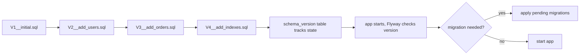
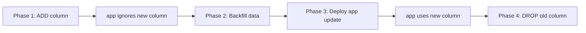
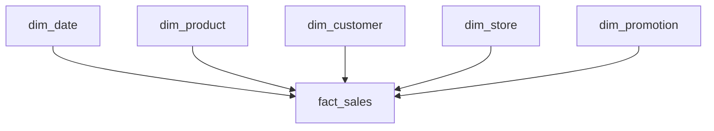

# Schema Migrations and Database Design (Deep)

> [!summary] Goal
> Manage schema changes safely across environments with migrations, and design schemas beyond 3NF: BCNF, denormalization, star schemas, and dimensional modeling.

## Table of Contents

1. [Why Schema Migrations Matter](#why-schema-migrations-matter)
2. [Migration Tools: Flyway and Liquibase](#migration-tools-flyway-and-liquibase)
3. [Migration Strategies](#migration-strategies)
4. [Normalization Beyond 3NF](#normalization-beyond-3nf)
5. [Denormalization and Star Schema](#denormalization-and-star-schema)
6. [Pitfalls](#pitfalls)

---

## Why Schema Migrations Matter

Schema migrations are version-controlled changes to your database schema. Without them:
- Team members have inconsistent database states
- Deployments require manual SQL execution
- Rollbacks are unreliable
- Schema drift goes undetected



---

## Migration Tools: Flyway and Liquibase

### Flyway (Java / CLI)

```bash
# Install
brew install flyway

# Configure
flyway -url=jdbc:postgresql://localhost:5432/mydb \
       -user=app_user \
       -password=secret \
       migrate
```

Migration files follow a naming convention:

```
sql/migrations/
├── V1__create_users.sql
├── V2__add_email_unique.sql
├── V3__create_orders.sql
└── V4__add_order_index.sql
```

```sql
-- V1__create_users.sql
CREATE TABLE users (
    id SERIAL PRIMARY KEY,
    email TEXT NOT NULL UNIQUE,
    name TEXT NOT NULL,
    created_at TIMESTAMPTZ DEFAULT now()
);
```

```sql
-- V2__add_email_unique.sql
ALTER TABLE users ADD CONSTRAINT users_email_unique UNIQUE (email);
```

### Liquibase (XML / YAML / JSON / SQL)

```xml
<!-- db/changelog/db.changelog-master.xml -->
<databaseChangeLog>
    <changeSet id="1" author="alice">
        <createTable tableName="users">
            <column name="id" type="SERIAL">
                <constraints primaryKey="true"/>
            </column>
            <column name="email" type="TEXT">
                <constraints nullable="false" unique="true"/>
            </column>
        </createTable>
    </changeSet>
</databaseChangeLog>
```

### Version tracking

Both tools use a table (usually `flyway_schema_history` or `DATABASECHANGELOG`) that records which migrations have been applied, their checksums, and when they ran.

```sql
SELECT version, description, installed_on, success
FROM flyway_schema_history
ORDER BY installed_rank;
```

---

## Migration Strategies

### Expanding (additive) migrations

Add new tables, columns, or indexes without touching existing structures:

```sql
-- Safe: new column with default
ALTER TABLE users ADD COLUMN phone TEXT;
-- Safe: new index
CREATE INDEX idx_users_email ON users (email);
-- Safe: new table
CREATE TABLE audit_log (...);
```

### Contracting (destructive) migrations

Removing columns or tables. Requires care:

```sql
-- Step 1: Remove foreign key references
-- Step 2: Remove application reads/writes to column
-- Step 3: Deploy migration to drop column
ALTER TABLE users DROP COLUMN legacy_field;
```

### Zero-downtime migrations pattern

```sql
-- Phase 1: Add new column (safe, existing code ignores it)
ALTER TABLE orders ADD COLUMN status_v2 TEXT;

-- Phase 2: Backfill data
UPDATE orders SET status_v2 = status WHERE status_v2 IS NULL;

-- Phase 3: Deploy app update to read/write status_v2 instead of status
-- Phase 4: Drop old column
ALTER TABLE orders DROP COLUMN status;
```



### Rollback considerations

```sql
-- Write reversible migrations
-- V2__add_phone.sql
ALTER TABLE users ADD COLUMN phone TEXT;

-- V2__add_phone.sql rollback:
-- ALTER TABLE users DROP COLUMN phone;
```

---

## Normalization Beyond 3NF

### BCNF (Boyce-Codd Normal Form)

A table is in BCNF if for every non-trivial functional dependency `X → Y`, `X` is a superkey.

```sql
-- Violates BCNF: {student, subject} → professor, but professor → subject
CREATE TABLE enrollment (
    student_id INTEGER,
    subject TEXT,
    professor TEXT,
    PRIMARY KEY (student_id, subject)
);
-- If each professor teaches only one subject, professor → subject
-- but professor is not a superkey → BCNF violation

-- Fix: decompose
CREATE TABLE professor_subject (
    professor TEXT PRIMARY KEY,
    subject TEXT NOT NULL
);
CREATE TABLE enrollment (
    student_id INTEGER,
    professor TEXT,
    FOREIGN KEY (professor) REFERENCES professor_subject(professor)
);
```

### 4NF (Fourth Normal Form)

A table is in 4NF if it is in BCNF and has no multi-valued dependencies.

```sql
-- Violates 4NF: {product} →→ {color} and {product} →→ {size}
-- (colors and sizes are independent)
CREATE TABLE product_variants (
    product_id INTEGER,
    color TEXT,
    size TEXT
);
-- If product 1 comes in red/blue and S/M/L, this stores 6 rows

-- Fix: decompose into separate independent tables
CREATE TABLE product_colors (product_id INTEGER, color TEXT);
CREATE TABLE product_sizes (product_id INTEGER, size TEXT);
```

### When to normalize beyond 3NF

| Normal form | When to apply |
|-------------|---------------|
| 3NF | Always — eliminates transitive dependencies |
| BCNF | When overlapping composite keys exist |
| 4NF | When independent multi-valued attributes exist |
| 5NF | Rare — when join dependencies are complex |

---

## Denormalization and Star Schema

### Star schema (dimensional modeling)

Used in data warehousing: a central **fact table** surrounded by **dimension tables**.



```sql
CREATE TABLE dim_product (
    product_id INTEGER PRIMARY KEY,
    sku TEXT,
    name TEXT,
    category TEXT,
    brand TEXT
);

CREATE TABLE dim_customer (
    customer_id INTEGER PRIMARY KEY,
    name TEXT,
    segment TEXT,   -- e.g., 'retail', 'wholesale'
    region TEXT
);

CREATE TABLE fact_sales (
    sale_id BIGINT PRIMARY KEY,
    product_id INTEGER REFERENCES dim_product(product_id),
    customer_id INTEGER REFERENCES dim_customer(customer_id),
    sale_date DATE,
    quantity INTEGER,
    unit_price DECIMAL(10,2),
    total_amount DECIMAL(10,2)
);
```

### Star vs Snowflake

| Aspect | Star schema | Snowflake schema |
|--------|-------------|-----------------|
| Dimension tables | Denormalized (e.g., category in product dim) | Normalized (category → separate table) |
| Query performance | Faster (fewer joins) | Slower (more joins) |
| Storage | More (data duplicated) | Less (data normalized) |
| ETL complexity | Simpler | More complex |
| Use case | Analytics, reporting, BI | Data warehouses where storage is critical |

### When to denormalize

```sql
-- Denormalized: faster reads, slower writes, more storage
CREATE TABLE orders_denormalized (
    order_id INTEGER PRIMARY KEY,
    customer_name TEXT,        -- denormalized from customers
    customer_email TEXT,       -- denormalized from customers
    product_name TEXT,         -- denormalized from products
    quantity INTEGER,
    total DECIMAL(10,2)
);

-- Normalized: slower reads (need joins), faster writes, less storage
-- Separate orders, customers, products, order_items tables
```

---

## Pitfalls

### Irreversible migrations

```sql
-- Once deployed, this DROP cannot be undone without a restore
ALTER TABLE users DROP COLUMN important_data;
```

**Fix**: Always write reversible migrations. If the tool doesn't support auto-generated rollbacks, write manual ones.

### Long-running migrations in production

```sql
-- ALTER TABLE ADD COLUMN with DEFAULT on a large table locks the table
ALTER TABLE orders ADD COLUMN status TEXT DEFAULT 'pending';
```

**Fix**: Use `CHECK (status IS NOT NULL)` instead of `NOT NULL` + `DEFAULT`, or add the column without DEFAULT, backfill in batches, then add NOT NULL.

### Over-normalization

Going beyond 3NF unnecessarily adds query complexity without meaningful benefit. Most production OLTP databases are fine at 3NF.

### Skipping migration checksums

```sql
-- If you modify an already-applied migration, Flyway detects checksum mismatch
-- and refuses to run. Never edit applied migrations — create a new one.
```

**Fix**: Always create a new migration file; never retroactively edit applied ones.

---

> [!question]- Interview Questions
>
> **Q: What is BCNF and how is it different from 3NF?**
> A: A table is in BCNF if every determinant is a candidate key. BCNF is stricter than 3NF — it handles the case where overlapping composite keys create functional dependencies that 3NF allows but BCNF rejects.
>
> **Q: What is the difference between star schema and snowflake schema?**
> A: Star schema has denormalized dimension tables (faster queries, more storage). Snowflake normalizes dimensions into sub-dimensions (slower queries, less storage, more complex ETL).
>
> **Q: What is the zero-downtime migration pattern?**
> A: Add new structures in phase 1 (app ignores them), backfill data in phase 2, deploy app update in phase 3, drop old structures in phase 4. Each phase is independently deployable.
>
> **Q: What tools are commonly used for schema migrations?**
> A: Flyway (SQL-first, Java/CLI) and Liquibase (XML/YAML/JSON, Java). Both track applied migrations in a version table.

---

## Cross-Links

- [[SQL/01_Foundations/04_Schema_Design_Basics]] for 1NF/2NF/3NF and basic DDL
- [[SQL/02_Core/06_Advanced_DML_Upsert_Merge_Returning]] for backfill strategies with COPY
- [[SQL/05_Projects/01_Build_a_Mini_DB_Lab_With_psql]] for hands-on schema design
- [[SQL/04_Playbooks/01_Debug_Slow_Query_Workflow]] for diagnosing migration performance impact

---

## References

- [Flyway Documentation](https://documentation.red-gate.com/flyway/)
- [Liquibase Documentation](https://docs.liquibase.com/)
- [PostgreSQL DDL](https://www.postgresql.org/docs/current/ddl.html)
- [Star Schema (Wikipedia)](https://en.wikipedia.org/wiki/Star_schema)
- [BCNF (Wikipedia)](https://en.wikipedia.org/wiki/Boyce%E2%80%93Codd_normal_form)
