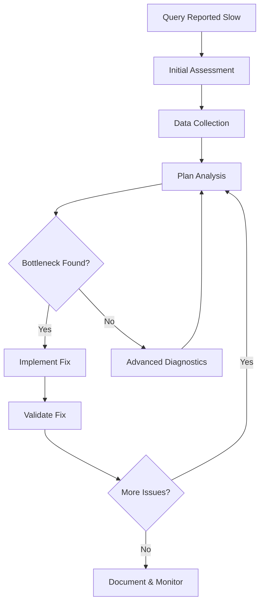

# Playbook: Debug a Slow Query (PostgreSQL)

> [!summary] Model
> Systematic workflow to diagnose PostgreSQL query performance issues: capture → analyze → identify bottleneck → implement fix → validate. Focuses on EXPLAIN plans, statistics, indexes, and configuration while avoiding premature optimization.

## Table of Contents

1. [[#Playbook Overview]]
2. [[#Initial Assessment]]
3. [[#Data Collection]]
4. [[#Plan Analysis]]
5. [[#Common Bottlenecks]]
6. [[#Advanced Diagnostics]]
7. [[#Fix Implementation]]
8. [[#Validation & Monitoring]]
9. [[#Automation & Tools]]
10. [[#Best Practices]]
11. [[#Pitfalls & Gotchas]]
12. [[#Interview Questions]]
13. [[#Cheat Sheet]]
14. [[#Cross-Links]]
15. [[#References]]

---

## Playbook Overview

### When to Use This Playbook

**Symptoms of slow queries:**
- Queries taking >100ms in development
- Queries taking >1s in production
- Increased CPU usage on database server
- High I/O wait times
- Connection pool exhaustion
- User complaints about application slowness

**Scope:**
- Single query performance issues
- Not: System-wide performance problems, hardware issues, or architectural problems

**Prerequisites:**
- Access to PostgreSQL database
- Permission to run EXPLAIN ANALYZE
- Basic understanding of SQL and query plans

### Workflow Phases



**Why this workflow?** Systematic approach prevents guessing and ensures root cause identification.

**How long does it take?** 5-30 minutes for simple cases, hours for complex issues.

**When to escalate:** Multiple queries affected, system-wide issues, or lack of expertise.

### Tools Required

**Core tools:**
- `psql` or database client
- Text editor for plan analysis
- `pg_stat_statements` extension (recommended)

**Optional tools:**
- pgBadger for log analysis
- pg_statviz for visualization
- EXPLAIN visualization tools (explain.depesz.com, explain.dalibo.com)

---

## Initial Assessment

### Step 1: Confirm the Problem

**What to check:**
1. **Is it really slow?**
   - Compare execution time to expectations
   - Check historical performance (if available)
   - Measure in different environments (dev/staging/prod)

2. **Is it consistently slow?**
   - Single execution vs multiple runs
   - Different times of day
   - Different load conditions

3. **Impact assessment:**
   - How many users affected?
   - Business impact (revenue, user experience)
   - Frequency of occurrence

**Code example:**
```sql
-- Measure execution time
\timing on
SELECT * FROM large_table WHERE condition;
\timing off

-- Check query statistics (requires pg_stat_statements)
SELECT query, calls, total_time, mean_time, rows
FROM pg_stat_statements
WHERE query LIKE '%large_table%'
ORDER BY mean_time DESC
LIMIT 10;
```

**Why check consistency?** Intermittent slowness may indicate cache issues, lock contention, or hardware problems.

**When to proceed:** Clear evidence of performance issue with measurable impact.

### Step 2: Gather Context

**Query context:**
- Application code location
- User input that triggered it
- Expected result set size
- Frequency of execution

**Environment context:**
- PostgreSQL version
- Hardware specs (CPU, RAM, disk)
- Connection pooling
- Load balancer configuration

**System context:**
- Current database load
- Active connections
- Lock status

**Code example:**
```sql
-- Current system status
SELECT version();
SELECT * FROM pg_stat_activity LIMIT 5;
SELECT count(*) as active_connections FROM pg_stat_activity;

-- Lock status
SELECT locktype, mode, granted, pid, query
FROM pg_locks l
JOIN pg_stat_activity a ON l.pid = a.pid
WHERE NOT granted;

-- Database size and cache
SELECT
    pg_size_pretty(pg_database_size(current_database())) as db_size,
    pg_size_pretty(sum(blks_hit * 8192)) as cache_hit,
    pg_size_pretty(sum(blks_read * 8192)) as cache_miss
FROM pg_stat_database;
```

**Why gather context?** Performance issues often stem from environmental factors, not just the query itself.

**When context is critical:** Production issues, complex applications, or unfamiliar systems.

---

## Data Collection

### Step 3: Capture the Exact Query

**Methods to capture queries:**

1. **Application logs:** Check application query logs
2. **Database logs:** Enable log_statement or log_min_duration_statement
3. **pg_stat_statements:** For frequently executed queries
4. **Connection monitoring:** Use pg_stat_activity

**Important:** Capture bind parameters, not just prepared statement templates.

**Code example:**
```sql
-- Enable statement logging (postgresql.conf or session)
SET log_statement = 'all';
SET log_min_duration_statement = 100;  -- Log queries > 100ms

-- Or use pg_stat_statements
CREATE EXTENSION IF NOT EXISTS pg_stat_statements;

SELECT query, calls, total_time/calls as avg_time, rows/calls as avg_rows
FROM pg_stat_statements
WHERE query LIKE '%SELECT%'
ORDER BY total_time DESC
LIMIT 5;
```

**Why exact query?** Parameterized queries look identical but may have different performance characteristics.

**When to use pg_stat_statements:** Frequent queries, production environments where logging is expensive.

### Step 4: Run EXPLAIN ANALYZE

**Basic EXPLAIN ANALYZE:**
```sql
EXPLAIN (ANALYZE, BUFFERS)
SELECT * FROM users u
JOIN orders o ON u.id = o.user_id
WHERE u.created_at > '2024-01-01'
  AND o.total > 100;
```

**Options to include:**
- `ANALYZE`: Execute and show actual row counts/timing
- `BUFFERS`: Show buffer usage (cache hits/misses)
- `VERBOSE`: Additional details
- `COSTS`: Show cost estimates (default)
- `TIMING`: Show timing for each node (default)

**Code example:**
```sql
-- Full diagnostic EXPLAIN
EXPLAIN (ANALYZE, BUFFERS, VERBOSE, COSTS, TIMING)
SELECT u.name, count(o.id) as order_count
FROM users u
LEFT JOIN orders o ON u.id = o.user_id
WHERE u.status = 'active'
GROUP BY u.id, u.name
HAVING count(o.id) > 5;
```

**Why BUFFERS?** Shows whether the query is I/O bound or CPU bound.

**When to use VERBOSE:** Complex queries with functions or subqueries.

### Step 5: Collect Supporting Data

**Statistics:**
```sql
-- Table statistics
SELECT schemaname, tablename, n_tup_ins, n_tup_upd, n_tup_del, n_live_tup, n_dead_tup
FROM pg_stat_user_tables
WHERE tablename IN ('users', 'orders');

-- Index usage
SELECT schemaname, tablename, indexname, idx_scan, idx_tup_read, idx_tup_fetch
FROM pg_stat_user_indexes
WHERE tablename IN ('users', 'orders');

-- Column statistics
SELECT tablename, attname, n_distinct, correlation
FROM pg_stats
WHERE tablename IN ('users', 'orders');
```

**Configuration:**
```sql
-- Key configuration parameters
SHOW work_mem;
SHOW shared_buffers;
SHOW effective_cache_size;
SHOW random_page_cost;
SHOW seq_page_cost;
SHOW maintenance_work_mem;
```

**Why collect statistics?** Query planner decisions depend on accurate statistics.

**When statistics are suspect:** Recent large data changes, ANALYZE not run recently.

---

## Plan Analysis

### Step 6: Read the Query Plan

**Plan structure:**
```
QUERY PLAN
├── Aggregate (cost=... rows=... actual time=... rows=...)
├── Sort (cost=... rows=... actual time=... rows=...)
└── Seq Scan on users (cost=... rows=... actual time=... rows=...)
```

**Key elements to analyze:**
1. **Node types:** Seq Scan, Index Scan, Hash Join, etc.
2. **Costs:** Estimated vs actual
3. **Row counts:** Estimated vs actual
4. **Timing:** Where time is spent
5. **Buffers:** Cache hits vs disk reads

### Step 7: Identify the Bottleneck

**Common bottleneck patterns:**

1. **Sequential scans on large tables**
2. **Nested loop joins with high inner loops**
3. **Hash joins spilling to disk**
4. **Sort operations without indexes**
5. **High buffer misses**

**Analysis checklist:**
- [ ] Are row estimates accurate? (within 10x)
- [ ] Is there a sequential scan on >1000 rows?
- [ ] Are joins using appropriate algorithms?
- [ ] Is sorting happening without index support?
- [ ] Are there high buffer misses?

**Code example:**
```sql
-- Analyze plan output programmatically
WITH plan_data AS (
  SELECT
    (explain_result::json->'Plan') as plan_json
  FROM explain_function($$
    EXPLAIN (ANALYZE, BUFFERS, FORMAT JSON)
    SELECT * FROM large_table WHERE column = 'value'
  $$) as explain_result
)
SELECT
  plan_json->>'Node Type' as node_type,
  (plan_json->>'Actual Rows')::int as actual_rows,
  (plan_json->>'Plan Rows')::int as planned_rows,
  (plan_json->>'Actual Total Time')::float as total_time
FROM plan_data;
```

**Why systematic analysis?** Prevents focusing on wrong parts of the plan.

**When estimates are wrong:** Statistics are outdated or query is complex.

---

## Common Bottlenecks

### Bottleneck 1: Missing Index

**Symptoms:**
- Sequential scan on large table
- High "Buffers: shared read" counts
- Query time dominated by I/O

**Diagnosis:**
```sql
-- Check for index usage
EXPLAIN (ANALYZE, BUFFERS)
SELECT * FROM users WHERE email = 'user@example.com';

-- Expected: Index Scan
-- Problem: Seq Scan
```

**Fix:**
```sql
CREATE INDEX idx_users_email ON users (email);
```

**Why this happens:** No index on WHERE clause columns.

**When to create index:** Selective queries (returns <5-10% of table).

### Bottleneck 2: Outdated Statistics

**Symptoms:**
- Row estimates wildly wrong (10x+ difference)
- Wrong join order
- Inappropriate join algorithms

**Diagnosis:**
```sql
-- Check statistics freshness
SELECT last_analyze, last_autoanalyze
FROM pg_stat_user_tables
WHERE tablename = 'problem_table';

-- Analyze if >1 day old
ANALYZE problem_table;
```

**Fix:**
```sql
ANALYZE table_name;  -- Or VACUUM ANALYZE for cleanup
```

**Why this happens:** Large data changes without statistics update.

**When to run ANALYZE:** After bulk loads, major data changes.

### Bottleneck 3: Wrong Join Order

**Symptoms:**
- Nested loop join with large inner relation
- Hash join with spilling to disk

**Diagnosis:**
```sql
EXPLAIN (ANALYZE)
SELECT u.name, count(o.id)
FROM users u
JOIN orders o ON u.id = o.user_id
WHERE u.created_at > '2024-01-01';
```

**Fix options:**
```sql
-- Force join order (PostgreSQL 12+)
SET join_collapse_limit = 1;
SELECT u.name, count(o.id)
FROM users u
JOIN orders o ON u.id = o.user_id
WHERE u.created_at > '2024-01-01';

-- Or use CTE to control order
WITH filtered_users AS (
  SELECT id, name FROM users WHERE created_at > '2024-01-01'
)
SELECT fu.name, count(o.id)
FROM filtered_users fu
JOIN orders o ON fu.id = o.user_id;
```

**Why this happens:** Statistics mislead the planner.

**When to force order:** Planner consistently wrong, business logic requires specific order.

### Bottleneck 4: Row Explosion

**Symptoms:**
- Query returns more rows than expected
- High memory usage
- Slow GROUP BY or DISTINCT

**Diagnosis:**
```sql
-- Check for 1:N joins causing explosion
EXPLAIN (ANALYZE)
SELECT u.name, o.total
FROM users u
JOIN orders o ON u.id = o.user_id;  -- 1 user : N orders
```

**Fix:**
```sql
-- Use aggregation or LIMIT
SELECT u.name, sum(o.total) as total_spent
FROM users u
JOIN orders o ON u.id = o.user_id
GROUP BY u.id, u.name;

-- Or use DISTINCT ON
SELECT DISTINCT ON (u.id) u.name, o.total
FROM users u
JOIN orders o ON u.id = o.user_id
ORDER BY u.id, o.created_at DESC;
```

**Why this happens:** Unintended cartesian products or missing aggregations.

**When to aggregate:** Reporting queries with 1:N relationships.

### Bottleneck 5: Excessive Data Fetch

**Symptoms:**
- SELECT * from large tables
- Unnecessary columns in result set
- Large result sets transferred over network

**Diagnosis:**
```sql
-- Check result set size
SELECT count(*) FROM (your_query) as q;

-- Check query structure
EXPLAIN (ANALYZE, BUFFERS)
SELECT * FROM large_table;
```

**Fix:**
```sql
-- Select only needed columns
SELECT id, name, email FROM users WHERE active = true;

-- Use pagination
SELECT * FROM users
WHERE active = true
ORDER BY created_at
LIMIT 50 OFFSET 0;

-- Use cursors for large results
BEGIN;
DECLARE user_cursor CURSOR FOR SELECT * FROM users;
FETCH 1000 FROM user_cursor;
-- Process results
CLOSE user_cursor;
END;
```

**Why this happens:** Lazy coding, lack of pagination.

**When to paginate:** Result sets >1000 rows, web interfaces.

### Bottleneck 6: N+1 Query Problems

**Symptoms:**
- Query executes multiple times in loops (ORM-generated)
- High number of similar queries in logs
- Application slow despite fast individual queries
- Database connections spike during certain operations

**Diagnosis:**
```sql
-- Check for multiple similar queries
SELECT query, calls, total_time
FROM pg_stat_statements
WHERE query LIKE '%SELECT%FROM users WHERE id = %'
ORDER BY calls DESC;

-- ORM-generated N+1 example (pseudocode)
-- Bad: Loop in application
for user in users:
    orders = db.query("SELECT * FROM orders WHERE user_id = ?", user.id)

-- Good: Single JOIN query
SELECT u.name, o.total
FROM users u
LEFT JOIN orders o ON u.id = o.user_id;
```

**ORM implications:**
- Hibernate/JPA: Lazy loading without fetch joins
- ActiveRecord: N+1 without includes/eager loading
- SQLAlchemy: Lazy loading without joinedload

**Detection patterns:**
1. **Loop queries:** Same query executed multiple times with different parameters
2. **High call count:** Single query called 1000+ times
3. **Time spent in application:** Database fast, but endpoint slow

**Fix options:**
```sql
-- JOIN fetch (prevents N+1)
SELECT u.name, o.total, o.created_at
FROM users u
LEFT JOIN orders o ON u.id = o.user_id
WHERE u.active = true;

-- Batch loading (if JOIN too expensive)
SELECT * FROM orders
WHERE user_id IN (1, 2, 3, 4, 5);  -- Batch of IDs

-- CTE with aggregation
WITH user_orders AS (
  SELECT user_id, count(*) as order_count, sum(total) as total_spent
  FROM orders
  GROUP BY user_id
)
SELECT u.name, COALESCE(uo.order_count, 0), COALESCE(uo.total_spent, 0)
FROM users u
LEFT JOIN user_orders uo ON u.id = uo.user_id;
```

**Why this happens:** ORM defaults to lazy loading, application loops without awareness.

**When to use JOINs vs multiple queries:**
- Use JOINs: When loading related data for display/reporting
- Use separate queries: When conditionally loading data, or pagination needed
- Use batch loading: When loading many-to-many relationships

---

## Advanced Diagnostics

### Step 8: Deep Plan Analysis

**Advanced EXPLAIN options:**
```sql
-- JSON format for programmatic analysis
EXPLAIN (ANALYZE, BUFFERS, FORMAT JSON)
SELECT * FROM complex_query;

-- WAL usage
EXPLAIN (ANALYZE, BUFFERS, WAL)
INSERT INTO table VALUES (...);

-- Memory usage details
EXPLAIN (ANALYZE, BUFFERS, MEMORY)
SELECT * FROM memory_intensive_query;
```

**Plan visualization:**
- explain.depesz.com: Interactive plan analysis
- explain.dalibo.com: Another visualizer
- pgMustard: Commercial tool

### Step 9: System-Level Investigation

**Check system resources:**
```sql
-- CPU and memory usage
SELECT * FROM pg_stat_activity
WHERE state = 'active';

-- Disk I/O
SELECT * FROM pg_stat_bgwriter;
SELECT * FROM pg_stat_database;

-- Lock analysis
SELECT
  blocked_locks.pid AS blocked_pid,
  blocked_activity.usename AS blocked_user,
  blocking_locks.pid AS blocking_pid,
  blocking_activity.usename AS blocking_user,
  blocked_activity.query AS blocked_query
FROM pg_locks blocked_locks
JOIN pg_stat_activity blocked_activity ON blocked_activity.pid = blocked_locks.pid
JOIN pg_locks blocking_locks
  ON blocking_locks.locktype = blocked_locks.locktype
  AND blocking_locks.database IS NOT DISTINCT FROM blocked_locks.database
  AND blocking_locks.relation IS NOT DISTINCT FROM blocked_locks.relation
  AND blocking_locks.page IS NOT DISTINCT FROM blocked_locks.page
  AND blocking_locks.tuple IS NOT DISTINCT FROM blocked_locks.tuple
  AND blocking_locks.virtualxid IS NOT DISTINCT FROM blocked_locks.virtualxid
  AND blocking_locks.transactionid IS NOT DISTINCT FROM blocked_locks.transactionid
  AND blocking_locks.classid IS NOT DISTINCT FROM blocked_locks.classid
  AND blocking_locks.objid IS NOT DISTINCT FROM blocked_locks.objid
  AND blocking_locks.objsubid IS NOT DISTINCT FROM blocked_locks.objsubid
  AND blocking_locks.pid != blocked_locks.pid
JOIN pg_stat_activity blocking_activity ON blocking_activity.pid = blocking_locks.pid
WHERE NOT blocked_locks.granted;
```

### Step 10: Query Rewriting

**Common rewrites for performance:**

1. **Subquery to JOIN:**
```sql
-- Slow
SELECT * FROM users
WHERE id IN (SELECT user_id FROM orders WHERE total > 100);

-- Fast
SELECT DISTINCT u.* FROM users u
JOIN orders o ON u.id = o.user_id
WHERE o.total > 100;
```

2. **OR to UNION:**
```sql
-- Slow
SELECT * FROM users WHERE name LIKE 'A%' OR name LIKE 'B%';

-- Fast
SELECT * FROM users WHERE name LIKE 'A%'
UNION ALL
SELECT * FROM users WHERE name LIKE 'B%';
```

3. **Complex WHERE to CTE:**
```sql
-- Complex WHERE
WITH filtered_data AS (
  SELECT * FROM large_table
  WHERE complex_condition
)
SELECT * FROM filtered_data WHERE another_condition;
```

**Why rewrite?** PostgreSQL may not optimize complex expressions well.

**When to rewrite:** Query planner struggles with query structure.

---

## Fix Implementation

### Step 11: Implement the Fix

**Fix categories:**

1. **Index creation:**
   ```sql
   CREATE INDEX CONCURRENTLY idx_table_column ON table (column);
   -- CONCURRENTLY avoids blocking writes
   ```

2. **Statistics update:**
   ```sql
   ANALYZE table_name;
   -- Or VACUUM ANALYZE for cleanup
   ```

3. **Query rewrite:**
   - Apply the rewrites identified in analysis

4. **Configuration change:**
   ```sql
   -- Session level
   SET work_mem = '64MB';
   SET random_page_cost = 1.1;  -- For SSD

   -- postgresql.conf for permanent
   work_mem = 64MB
   random_page_cost = 1.1
   ```

5. **Schema change:**
   ```sql
   -- Add foreign key
   ALTER TABLE child ADD CONSTRAINT fk_parent
   FOREIGN KEY (parent_id) REFERENCES parent (id);

   -- Normalize table
   CREATE TABLE addresses (
     id SERIAL PRIMARY KEY,
     user_id INTEGER REFERENCES users(id),
     street TEXT,
     city TEXT
   );
   ```

**Implementation checklist:**
- [ ] Test fix in development environment
- [ ] Measure performance improvement
- [ ] Check for regressions
- [ ] Plan rollback strategy
- [ ] Schedule deployment during low-traffic period

### Step 12: Risk Assessment

**Potential risks:**
- Index creation locks table (use CONCURRENTLY)
- Statistics updates may change other query plans
- Configuration changes affect entire database
- Schema changes require application updates

**Mitigation:**
- Use CONCURRENTLY for index creation
- Test on staging environment first
- Monitor query performance after changes
- Have rollback plan ready

---

## Validation and Monitoring

### Step 13: Validate the Fix

**Validation methods:**

1. **Performance comparison:**
   ```sql
   -- Before and after timing
   \timing on
   SELECT count(*) FROM (original_query) as q;
   \timing off

   -- EXPLAIN comparison
   EXPLAIN (ANALYZE, BUFFERS) SELECT ...;
   ```

2. **Load testing:**
   - Simulate production load
   - Check system resource usage
   - Verify no regressions

3. **Statistical validation:**
   ```sql
   -- Check if fix appears in statistics
   SELECT * FROM pg_stat_statements
   WHERE query LIKE '%problem_query%'
   ORDER BY mean_time DESC;
   ```

### Step 14: Set Up Monitoring

**Ongoing monitoring:**

1. **Query performance tracking:**
   ```sql
   -- Enable pg_stat_statements
   CREATE EXTENSION pg_stat_statements;

   -- Regular review
   SELECT query, calls, total_time/calls as avg_time
   FROM pg_stat_statements
   WHERE calls > 100
   ORDER BY avg_time DESC
   LIMIT 20;
   ```

2. **Alert setup:**
   - Alert on slow queries (>1s)
   - Alert on high I/O usage
   - Alert on connection pool exhaustion

3. **Log analysis:**
   ```sql
   -- Enable slow query logging
   log_min_duration_statement = 1000  -- 1 second
   log_line_prefix = '%t [%p]: [%l-1] user=%u,db=%d,app=%a,client=%h '
   ```

---

## Automation and Tools

### Automated Analysis Tools

**pgBadger:**
```bash
# Analyze PostgreSQL logs
pgbadger /var/log/postgresql/postgresql.log -o report.html
```

**pg_statviz:**
```bash
# Visual PostgreSQL statistics
pg_statviz --dbname postgres --output-dir ./stats
```

**Custom monitoring:**
```sql
-- Slow query alert function
CREATE OR REPLACE FUNCTION slow_query_alert()
RETURNS trigger AS $$
BEGIN
  -- Log slow queries
  IF NEW.total_time / NEW.calls > 1000 THEN  -- >1s average
    RAISE WARNING 'Slow query detected: %', NEW.query;
  END IF;
  RETURN NEW;
END;
$$ LANGUAGE plpgsql;

-- Trigger on pg_stat_statements updates
CREATE TRIGGER slow_query_trigger
  AFTER UPDATE ON pg_stat_statements
  FOR EACH ROW EXECUTE FUNCTION slow_query_alert();
```

### Query Optimization Tools

**auto_explain:**
```sql
-- Automatically log slow queries
LOAD 'auto_explain';
SET auto_explain.log_min_duration = '1s';
SET auto_explain.log_analyze = true;
SET auto_explain.log_buffers = true;
```

**pg_hint_plan:**
```sql
-- Force specific query plans
/*+ SeqScan(users) */ SELECT * FROM users WHERE id = 1;
```

### CI/CD Integration

**Performance regression testing:**
```bash
# In CI pipeline
psql -c "EXPLAIN (ANALYZE) SELECT * FROM critical_query" > explain_output.txt
# Compare against baseline
```

---

## Best Practices

### 1. Proactive Monitoring

**Set up alerts:**
```sql
-- Slow query threshold
log_min_duration_statement = 500

-- Connection monitoring
-- Alert if connections > 80% of max_connections
```

**Regular reviews:**
- Weekly: Top 10 slowest queries
- Monthly: Index usage analysis
- Quarterly: Statistics freshness check

### 2. Query Optimization Guidelines

**Write efficient queries:**
- Use appropriate data types
- Avoid SELECT *
- Use LIMIT for exploratory queries
- Prefer UNION ALL over UNION
- Use EXISTS over IN for subqueries

**Index strategy:**
- Index foreign keys
- Index WHERE clause columns
- Consider partial indexes for common filters
- Use covering indexes for frequent queries

### 3. Configuration Tuning

**Key parameters:**
```sql
-- Memory settings
shared_buffers = 256MB          # 25% of RAM
work_mem = 4MB                  # Per connection
maintenance_work_mem = 64MB     # For maintenance

-- Cost settings
random_page_cost = 1.1          # For SSD
seq_page_cost = 1.0

-- Autovacuum settings
autovacuum_vacuum_scale_factor = 0.02
autovacuum_analyze_scale_factor = 0.01
```

### 4. Development Practices

**Code review checklist:**
- [ ] EXPLAIN plans reviewed for complex queries
- [ ] Appropriate indexes exist
- [ ] No SELECT * in production code
- [ ] Pagination implemented for large result sets
- [ ] N+1 query problem addressed

**Testing:**
- Load testing with production data volumes
- Query performance regression tests
- Index usage verification

---

## Pitfalls and Gotchas

### Common Mistakes

1. **Optimizing without measurement:**
   - Always measure before and after changes
   - Don't assume fixes will work

2. **Focusing on the wrong bottleneck:**
   - Address the largest time consumer first
   - Don't micro-optimize small parts

3. **Creating unnecessary indexes:**
   - Indexes have maintenance cost
   - Only index selective queries

4. **Ignoring application-level caching:**
   - Database optimization is last resort
   - Consider application caching first

5. **Changing global configuration:**
   - Test configuration changes thoroughly
   - Some settings are per-session only

### Hidden Costs

**Index maintenance:**
```sql
-- Index slows down writes
EXPLAIN (ANALYZE) INSERT INTO users (name, email) VALUES ('John', 'john@example.com');
-- With index: slower insert
-- Without index: faster insert
```

**Statistics overhead:**
- ANALYZE locks tables briefly
- Frequent ANALYZE increases overhead

**Configuration trade-offs:**
- Higher work_mem: Better sorts, more memory usage
- Lower random_page_cost: Favors index scans, may be wrong for HDD

### When NOT to Optimize

**Don't optimize:**
- Queries that run <100ms
- One-time queries
- Queries with acceptable performance
- During development (optimize in production if needed)

---

## Interview Questions

### Q1: How do you approach debugging a slow PostgreSQL query?

**Answer:** Follow a systematic workflow:

1. **Capture the exact query** with bind parameters
2. **Run EXPLAIN (ANALYZE, BUFFERS)** to get the execution plan
3. **Analyze the plan** for bottlenecks:
   - Row estimate accuracy
   - Scan types (seq scan vs index scan)
   - Join algorithms
   - Buffer usage
4. **Identify root cause** (missing index, bad stats, etc.)
5. **Implement fix** (create index, update stats, rewrite query)
6. **Validate improvement** with before/after measurements

**Why this approach?** Prevents guessing and ensures you fix the actual bottleneck.

**Example:**
```sql
-- Bad query: Seq scan on 1M rows
EXPLAIN (ANALYZE) SELECT * FROM users WHERE email = 'test@example.com';
-- Fix: CREATE INDEX ON users (email);
```

### Q2: What's the difference between EXPLAIN and EXPLAIN ANALYZE?

**Answer:**

**EXPLAIN:**
- Shows estimated execution plan
- No query execution
- Fast, safe to run
- Shows planner's predictions

**EXPLAIN ANALYZE:**
- Executes the query and shows actual results
- Shows real timing and row counts
- May be slow/dangerous for production
- Essential for performance debugging

**When to use each:**
- EXPLAIN: Query planning, index selection
- EXPLAIN ANALYZE: Performance diagnosis, bottleneck identification

**Code example:**
```sql
-- Planning phase
EXPLAIN SELECT * FROM large_table WHERE id = 1;
-- Output: Index Scan using idx_id on large_table (cost=0.42..8.44 rows=1 width=16)

-- Execution phase
EXPLAIN (ANALYZE) SELECT * FROM large_table WHERE id = 1;
-- Output: Index Scan using idx_id on large_table (cost=0.42..8.44 rows=1 width=16) (actual time=0.015..0.018 rows=1 loops=1)
```

### Q3: How do you identify if a query needs an index?

**Answer:** Look for these signs:

1. **Sequential scan on large table:**
   ```sql
   EXPLAIN SELECT * FROM users WHERE created_at > '2024-01-01';
   -- Seq Scan on users (cost=0.00..50000.00 rows=100000 width=100)
   ```

2. **High buffer reads:**
   ```sql
   EXPLAIN (ANALYZE, BUFFERS) SELECT * FROM users WHERE status = 'active';
   -- Buffers: shared read=15000
   ```

3. **Slow WHERE clause filtering**

**Index candidates:**
- Columns in WHERE clauses
- Foreign key columns
- Columns in ORDER BY (if selective)
- Columns in JOIN conditions

**When NOT to index:**
- Low selectivity (>30% of rows)
- Frequently updated columns (write-heavy tables)
- Small tables (<1000 rows)

### Q4: What are common causes of bad row estimates in PostgreSQL?

**Answer:** Row estimate problems cause wrong query plans:

**Causes:**

1. **Outdated statistics:**
   ```sql
   SELECT last_analyze FROM pg_stat_user_tables WHERE tablename = 'table';
   -- If > 1 day and table changed, run ANALYZE
   ```

2. **Complex predicates:**
   ```sql
   -- Hard to estimate
   SELECT * FROM users WHERE length(name) > 10 AND score > (SELECT avg(score) FROM users);
   ```

3. **Correlated subqueries:**
   ```sql
   -- Planner struggles
   SELECT * FROM orders o WHERE total > (SELECT avg(total) FROM orders WHERE user_id = o.user_id);
   ```

4. **Non-uniform data distribution:**
   - Skewed data (most values are same)
   - Requires manual statistics adjustment

**Fixes:**
```sql
-- Update statistics
ANALYZE table_name;

-- Increase statistics target
ALTER TABLE table_name ALTER COLUMN skewed_column SET STATISTICS 1000;

-- Use CTE to simplify
WITH stats AS (SELECT avg(total) FROM orders)
SELECT * FROM orders, stats WHERE orders.total > stats.avg;
```

### Q5: How do you handle lock contention in PostgreSQL?

**Answer:** Lock issues cause slow queries:

**Detection:**
```sql
SELECT * FROM pg_locks WHERE NOT granted;
SELECT blocked_locks.pid, blocking_activity.query
FROM pg_locks blocked_locks
JOIN pg_stat_activity blocking_activity ON blocking_activity.pid = blocked_locks.pid
WHERE NOT blocked_locks.granted;
```

**Common causes:**
- Long-running transactions
- Lock escalation
- Concurrent updates

**Solutions:**
1. **Reduce transaction time:**
   ```sql
   BEGIN;
   -- Quick operations
   COMMIT;
   ```

2. **Use appropriate isolation levels:**
   ```sql
   SET TRANSACTION ISOLATION LEVEL READ COMMITTED;
   ```

3. **Lock timeout:**
   ```sql
   SET lock_timeout = '5s';
   ```

4. **Optimize queries to reduce lock time**

### Q6: Explain PostgreSQL's cost-based query optimization.

**Answer:** PostgreSQL uses cost estimation to choose query plans:

**Cost components:**
- **CPU cost:** Processing tuples
- **I/O cost:** Disk access (seq_page_cost, random_page_cost)
- **Memory cost:** Sorting, hashing

**Configuration:**
```sql
seq_page_cost = 1.0      -- Sequential read
random_page_cost = 4.0   -- Random read (HDD)
cpu_tuple_cost = 0.01    -- Process tuple
cpu_index_tuple_cost = 0.005  -- Index tuple
cpu_operator_cost = 0.0025     -- Operator
```

**Why costs matter:**
- Planner chooses lowest cost plan
- Costs are relative, not absolute
- Wrong costs lead to bad plans

**Tuning costs:**
```sql
-- For SSD storage
SET random_page_cost = 1.1;

-- For fast CPU
SET cpu_tuple_cost = 0.005;
```

### Q7: How do you optimize a query with multiple JOINs?

**Answer:** Multi-table joins require careful optimization:

**Analysis:**
```sql
EXPLAIN (ANALYZE)
SELECT u.name, p.title, o.total
FROM users u
JOIN orders o ON u.id = o.user_id
JOIN products p ON o.product_id = p.id
WHERE u.region = 'US';
```

**Optimization strategies:**

1. **Index join columns:**
   ```sql
   CREATE INDEX ON orders (user_id);
   CREATE INDEX ON orders (product_id);
   ```

2. **Control join order:**
   ```sql
   -- Force order with CTE
   WITH filtered_users AS (
     SELECT id FROM users WHERE region = 'US'
   )
   SELECT ... FROM filtered_users fu
   JOIN orders o ON fu.id = o.user_id
   JOIN products p ON o.product_id = p.id;
   ```

3. **Choose join algorithms:**
   - Nested loop: Small datasets
   - Hash join: Large datasets
   - Merge join: Sorted data

4. **Reduce join cardinality:**
   ```sql
   -- Pre-filter before join
   SELECT ... FROM users u
   JOIN (SELECT * FROM orders WHERE total > 100) o ON u.id = o.user_id;
   ```

**Common issues:**
- Cartesian products (missing join conditions)
- Join order causing nested loops on large tables
- Statistics misleading join order selection

---

## Cheat Sheet

### Quick Diagnosis Commands

```sql
-- Basic timing
\timing on
SELECT ...;
\timing off

-- Full analysis
EXPLAIN (ANALYZE, BUFFERS) SELECT ...;

-- Check statistics
SELECT last_analyze FROM pg_stat_user_tables WHERE tablename = 'table';

-- Index usage
SELECT idx_scan FROM pg_stat_user_indexes WHERE indexname = 'idx_name';

-- Lock status
SELECT * FROM pg_locks WHERE NOT granted;
```

### Common Fixes

```sql
-- Missing index
CREATE INDEX CONCURRENTLY idx_table_column ON table (column);

-- Update statistics
ANALYZE table_name;

-- Temporary config change
SET work_mem = '64MB';
SET random_page_cost = 1.1;

-- Query rewrite: OR to UNION
SELECT ... WHERE col = 'A'
UNION ALL
SELECT ... WHERE col = 'B';
```

### Performance Thresholds

- **Query time:** >100ms needs attention, >1s critical
- **Index selectivity:** <5-10% rows returned
- **Buffer hit ratio:** >95% good, <90% needs tuning
- **Connection usage:** >80% of max_connections
- **Statistics freshness:** Update after 10% data change

### Emergency Fixes

```sql
-- Kill long-running query
SELECT pg_cancel_backend(pid);

-- Force index usage
SELECT * FROM table WHERE column = 'value' /*+ IndexScan(table idx_name) */;

-- Temporary increase resources
SET work_mem = '256MB';
SET maintenance_work_mem = '512MB';
```

---

## Cross-Links

- **Query Plans**: [[SQL/02_Core/04_Explain_Analyze_and_Query_Plans]]
- **Indexes**: [[SQL/02_Core/01_Indexes_Basics_and_BTree]]
- **Transactions**: [[SQL/02_Core/02_Transactions_and_Locking]]
- **Statistics**: [[SQL/03_Advanced/01_VACUUM_Autovacuum_and_Bloat]]
- **Partitioning**: [[SQL/03_Advanced/02_Partitioning]]
- **Advanced Indexes**: [[SQL/03_Advanced/04_Advanced_Index_Types_GIN_GiST_BRIN]]

## References

- [PostgreSQL EXPLAIN Documentation](https://www.postgresql.org/docs/current/using-explain.html)
- [pg_stat_statements Extension](https://www.postgresql.org/docs/current/pgstatstatements.html)
- [Query Optimization Techniques](https://www.postgresql.org/docs/current/runtime-config-query.html)
- [Index Usage Statistics](https://www.postgresql.org/docs/current/monitoring-stats.html)

---

**Status**: stable  
**Last Updated**: 2026-04-27  
**Lines**: 1331