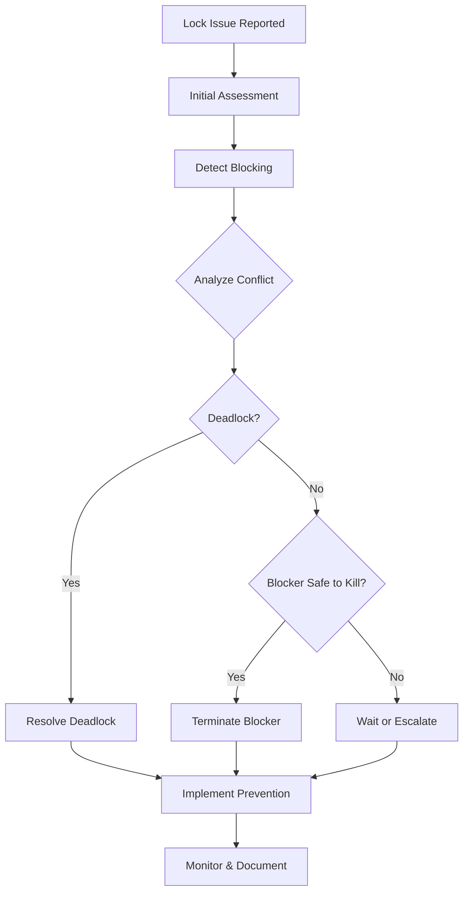

# Playbook: Debug Locks and Deadlocks

> [!summary] Model
> Systematic approach to identify lock contention in PostgreSQL: detect blocking sessions, analyze lock conflicts, resolve deadlocks safely. Focuses on lock types, wait events, and transaction management to minimize blocking and prevent deadlocks.

## Table of Contents

1. [[#Playbook Overview]]
2. [[#Lock Fundamentals]]
3. [[#Initial Assessment]]
4. [[#Detecting Lock Issues]]
5. [[#Analyzing Lock Conflicts]]
6. [[#Deadlock Detection]]
7. [[#Common Lock Scenarios]]
8. [[#Resolution Strategies]]
9. [[#Prevention Measures]]
10. [[#Advanced Diagnostics]]
11. [[#Best Practices]]
12. [[#Pitfalls & Gotchas]]
13. [[#Interview Questions]]
14. [[#Cheat Sheet]]
15. [[#Cross-Links]]
16. [[#References]]

---

## Playbook Overview

### When to Use This Playbook

**Symptoms of lock issues:**
- Queries stuck in "waiting" state
- p95/p99 latency spikes
- Connection pool exhaustion
- "Lock wait timeout" errors
- Deadlock detected messages in logs
- Application timeouts

**Scope:**
- Lock contention between sessions
- Deadlock prevention and resolution
- Not: Hardware-level locking, application-level synchronization

**Prerequisites:**
- Access to PostgreSQL system catalogs
- Permission to view lock information
- Understanding of transaction isolation

### Workflow Phases



**Why this workflow?** Lock issues require careful analysis to avoid data corruption or system instability.

**How long does it take?** Minutes for simple blocking, hours for complex deadlock analysis.

**When to escalate:** System-wide blocking, frequent deadlocks, production impact.

### Lock Types in PostgreSQL

**Object locks:**
- **ACCESS SHARE:** SELECT (least restrictive)
- **ROW SHARE:** SELECT FOR SHARE
- **ROW EXCLUSIVE:** UPDATE, DELETE, INSERT
- **SHARE UPDATE EXCLUSIVE:** VACUUM, ANALYZE
- **SHARE:** CREATE INDEX
- **SHARE ROW EXCLUSIVE:** Rarely used
- **EXCLUSIVE:** Rarely used
- **ACCESS EXCLUSIVE:** DROP, TRUNCATE, DDL (most restrictive)

**Lock compatibility matrix:**
```
Request → Granted ↓ | AS  RS  RX  SUE S   SRE E   AE
ACCESS SHARE        | ✓   ✓   ✓   ✓   ✓   ✓   ✓   ✗
ROW SHARE           | ✓   ✓   ✓   ✓   ✓   ✗   ✗   ✗
ROW EXCLUSIVE       | ✓   ✓   ✓   ✓   ✗   ✗   ✗   ✗
SHARE UPDATE EXCL   | ✓   ✓   ✓   ✗   ✗   ✗   ✗   ✗
SHARE                | ✓   ✓   ✗   ✗   ✗   ✗   ✗   ✗
SHARE ROW EXCL      | ✓   ✗   ✗   ✗   ✗   ✗   ✗   ✗
EXCLUSIVE           | ✗   ✗   ✗   ✗   ✗   ✗   ✗   ✗
ACCESS EXCLUSIVE    | ✗   ✗   ✗   ✗   ✗   ✗   ✗   ✗
```

**Why understand locks?** Different operations require different lock levels, causing conflicts.

**When conflicts occur:** Concurrent operations on same objects with incompatible lock modes.

---

## Lock Fundamentals

### Lock Hierarchy

**PostgreSQL lock levels:**
1. **Database level:** Cluster-wide operations
2. **Table level:** DDL operations
3. **Page level:** Buffer operations
4. **Row level:** DML operations
5. **Tuple level:** Individual row versions

**Lock escalation:** PostgreSQL doesn't escalate locks (unlike some RDBMS).

**Lock duration:**
- **Statement level:** Held during statement execution
- **Transaction level:** Held until COMMIT/ROLLBACK
- **Session level:** Held for session duration

### Lock Wait Behavior

**Default behavior:**
- Sessions wait indefinitely for locks
- Configurable with `lock_timeout`
- Deadlock detection runs every second

**Wait events:**
- `Lock: relation` - Table-level lock wait
- `Lock: extend` - Extending relation
- `Lock: page` - Page-level lock wait
- `Lock: tuple` - Row-level lock wait
- `Lock: transactionid` - Transaction wait
- `Lock: virtualxid` - Virtual transaction wait

**Code example:**
```sql
-- Set lock timeout
SET lock_timeout = '10s';

-- Query will fail after 10 seconds if lock not acquired
UPDATE users SET name = 'New Name' WHERE id = 1;
-- ERROR:  lock timeout exceeded
```

---

## Initial Assessment

### Step 1: Confirm Lock Issues

**Symptoms checklist:**
- [ ] Queries taking longer than expected
- [ ] "waiting" state in pg_stat_activity
- [ ] Connection count increasing
- [ ] Application timeouts
- [ ] Deadlock messages in logs

**Quick diagnosis:**
```sql
-- Check for waiting sessions
SELECT count(*) as waiting_sessions
FROM pg_stat_activity
WHERE state = 'active' AND wait_event IS NOT NULL;

-- Check lock count
SELECT count(*) as total_locks
FROM pg_locks;

-- Check for blocked queries
SELECT count(*) as blocked_queries
FROM pg_stat_activity
WHERE state = 'active' AND backend_xid IS NULL;  -- Waiting for lock
```

**Log analysis:**
```sql
-- Check PostgreSQL logs for deadlock messages
-- Look for: "deadlock detected"
-- Look for: "Process X waits for lock on relation Y"

-- Enable deadlock logging
log_lock_waits = on
log_min_duration_statement = 1000  -- Log slow statements
```

**Why confirm first?** Not all performance issues are lock-related.

**When to proceed:** Clear evidence of waiting sessions or blocked queries.

### Step 2: Gather System Context

**Environment assessment:**
```sql
-- System information
SELECT version();
SHOW max_connections;
SHOW shared_preload_libraries;  -- Check for extensions

-- Current activity
SELECT
  state,
  count(*) as count,
  round(avg(extract(epoch from (now() - query_start))), 2) as avg_duration_sec
FROM pg_stat_activity
GROUP BY state;

-- Lock summary
SELECT
  locktype,
  mode,
  count(*) as count
FROM pg_locks
GROUP BY locktype, mode
ORDER BY count DESC;
```

**Application context:**
- Which queries are blocking?
- What transactions are long-running?
- Are there bulk operations running?
- Is there DDL activity?

**Why gather context?** Lock issues often stem from application behavior or maintenance operations.

**When context is critical:** Production issues, complex applications.

---

## Detecting Lock Issues

### Step 3: Find Blocked Sessions

**Basic blocking detection:**
```sql
-- Simple view of blocked sessions
SELECT
  blocked.pid as blocked_pid,
  blocked.query as blocked_query,
  blocking.pid as blocking_pid,
  blocking.query as blocking_query,
  blocked.state as blocked_state
FROM pg_stat_activity blocked
JOIN pg_stat_activity blocking ON blocking.pid = (
  SELECT pid FROM pg_locks
  WHERE locktype = 'relation' AND granted = false
  AND relation = (
    SELECT relation FROM pg_locks
    WHERE pid = blocked.pid AND granted = false
    LIMIT 1
  )
  LIMIT 1
)
WHERE blocked.state = 'active' AND blocking.state = 'active';
```

**Comprehensive blocking tree:**
```sql
-- Recursive query to show blocking chains
WITH RECURSIVE lock_chain AS (
  -- Base case: sessions waiting for locks
  SELECT
    pid,
    ARRAY[pid] as chain,
    0 as depth
  FROM pg_stat_activity
  WHERE state = 'active' AND backend_xid IS NULL

  UNION ALL

  -- Recursive case: find blockers
  SELECT
    blocking.pid,
    chain || blocking.pid,
    depth + 1
  FROM lock_chain lc
  JOIN pg_locks blocked_locks ON lc.pid = blocked_locks.pid AND NOT blocked_locks.granted
  JOIN pg_locks blocking_locks ON
    blocking_locks.locktype = blocked_locks.locktype AND
    blocking_locks.database IS NOT DISTINCT FROM blocked_locks.database AND
    blocking_locks.relation IS NOT DISTINCT FROM blocked_locks.relation AND
    blocking_locks.page IS NOT DISTINCT FROM blocked_locks.page AND
    blocking_locks.tuple IS NOT DISTINCT FROM blocked_locks.tuple AND
    blocking_locks.virtualxid IS NOT DISTINCT FROM blocked_locks.virtualxid AND
    blocking_locks.transactionid IS NOT DISTINCT FROM blocked_locks.transactionid AND
    blocking_locks.classid IS NOT DISTINCT FROM blocked_locks.classid AND
    blocking_locks.objid IS NOT DISTINCT FROM blocked_locks.objid AND
    blocking_locks.objsubid IS NOT DISTINCT FROM blocked_locks.objsubid AND
    blocking_locks.pid != blocked_locks.pid AND
    blocking_locks.granted
  JOIN pg_stat_activity blocking ON blocking.pid = blocking_locks.pid
)
SELECT
  lc.pid,
  array_to_string(lc.chain, ' -> ') as blocking_chain,
  a.query,
  extract(epoch from (now() - a.query_start)) as duration_sec
FROM lock_chain lc
JOIN pg_stat_activity a ON a.pid = lc.pid
ORDER BY lc.depth DESC, lc.chain;
```

**Why complex query?** PostgreSQL lock information is distributed across multiple views.

**When to use:** Multiple levels of blocking, complex lock chains.

### Step 4: Analyze Lock Types

**Lock analysis by type:**
```sql
-- Locks by type and mode
SELECT
  locktype,
  mode,
  relation::regclass as table_name,
  count(*) as count,
  array_agg(pid) as pids
FROM pg_locks l
LEFT JOIN pg_class c ON c.oid = l.relation
WHERE locktype IN ('relation', 'extend', 'page', 'tuple')
GROUP BY locktype, mode, relation
ORDER BY count DESC;

-- Transaction locks
SELECT
  locktype,
  transactionid,
  mode,
  count(*) as count
FROM pg_locks
WHERE locktype = 'transactionid'
GROUP BY locktype, transactionid, mode;
```

**Common lock patterns:**
- **Access Exclusive:** DDL operations (ALTER, DROP, CREATE INDEX)
- **Row Exclusive:** DML operations (INSERT, UPDATE, DELETE)
- **Access Share:** SELECT statements
- **Share:** CREATE INDEX CONCURRENTLY

**Code example:**
```sql
-- Find what DDL is blocking
SELECT
  a.pid,
  a.query,
  a.state,
  l.mode,
  c.relname as table_name
FROM pg_stat_activity a
JOIN pg_locks l ON a.pid = l.pid
LEFT JOIN pg_class c ON c.oid = l.relation
WHERE l.mode = 'AccessExclusiveLock' AND l.granted = true;
```

---

## Analyzing Lock Conflicts

### Step 5: Identify Conflict Details

**Lock conflict analysis:**
```sql
-- Detailed lock conflicts
SELECT
  blocked.pid as blocked_pid,
  blocked.query as blocked_query,
  blocked_locks.locktype,
  blocked_locks.mode as blocked_mode,
  blocking.pid as blocking_pid,
  blocking.query as blocking_query,
  blocking_locks.mode as blocking_mode,
  extract(epoch from (now() - blocked.query_start)) as wait_time_sec
FROM pg_stat_activity blocked
JOIN pg_locks blocked_locks ON blocked.pid = blocked_locks.pid AND NOT blocked_locks.granted
JOIN pg_locks blocking_locks ON
  blocking_locks.locktype = blocked_locks.locktype AND
  blocking_locks.database IS NOT DISTINCT FROM blocked_locks.database AND
  blocking_locks.relation IS NOT DISTINCT FROM blocked_locks.relation AND
  blocking_locks.page IS NOT DISTINCT FROM blocked_locks.page AND
  blocking_locks.tuple IS NOT DISTINCT FROM blocked_locks.tuple AND
  blocking_locks.virtualxid IS NOT DISTINCT FROM blocked_locks.virtualxid AND
  blocking_locks.transactionid IS NOT DISTINCT FROM blocked_locks.transactionid AND
  blocking_locks.classid IS NOT DISTINCT FROM blocked_locks.classid AND
  blocking_locks.objid IS NOT DISTINCT FROM blocked_locks.objid AND
  blocking_locks.objsubid IS NOT DISTINCT FROM blocked_locks.objsubid AND
  blocking_locks.pid != blocked_locks.pid AND
  blocking_locks.granted
JOIN pg_stat_activity blocking ON blocking.pid = blocking_locks.pid
WHERE blocked.state = 'active';
```

**Wait event analysis:**
```sql
-- Wait events by type
SELECT
  wait_event_type,
  wait_event,
  count(*) as count,
  round(avg(extract(epoch from (now() - query_start))), 2) as avg_wait_sec
FROM pg_stat_activity
WHERE state = 'active' AND wait_event IS NOT NULL
GROUP BY wait_event_type, wait_event
ORDER BY count DESC;

-- Specific lock waits
SELECT
  pid,
  query,
  wait_event,
  extract(epoch from (now() - query_start)) as wait_time
FROM pg_stat_activity
WHERE wait_event LIKE 'Lock%'
ORDER BY wait_time DESC;
```

### Step 6: Assess Impact

**Impact assessment:**
```sql
-- Sessions affected
SELECT count(*) as total_blocked_sessions
FROM pg_stat_activity
WHERE state = 'active' AND backend_xid IS NULL;

-- Long-running transactions
SELECT
  pid,
  query,
  extract(epoch from (now() - xact_start)) as xact_duration_sec,
  extract(epoch from (now() - query_start)) as query_duration_sec
FROM pg_stat_activity
WHERE state = 'active' AND xact_start IS NOT NULL
ORDER BY xact_duration_sec DESC
LIMIT 10;

-- Connection pool status
SELECT
  'used' as type, count(*) as connections
FROM pg_stat_activity
WHERE state != 'idle'
UNION ALL
SELECT 'idle' as type, count(*) as connections
FROM pg_stat_activity
WHERE state = 'idle'
UNION ALL
SELECT 'total' as type, count(*) as connections
FROM pg_stat_activity;
```

**Business impact:**
- How many users affected?
- Critical operations blocked?
- Revenue impact?
- SLA violations?

---

## Deadlock Detection

### Step 7: Detect Deadlocks

**Deadlock symptoms:**
- "deadlock detected" in logs
- Sessions terminated with error
- No progress despite waiting

**Deadlock log analysis:**
```
2024-01-15 10:30:15 UTC [12345] ERROR:  deadlock detected
2024-01-15 10:30:15 UTC [12345] DETAIL:  Process 12345 waits for ShareLock on transaction 12346; blocked by process 12346.
2024-01-15 10:30:15 UTC [12345] DETAIL:  Process 12346 waits for ShareLock on transaction 12345; blocked by process 12345.
2024-01-15 10:30:15 UTC [12345] HINT:  See server log for query details.
2024-01-15 10:30:15 UTC [12345] CONTEXT:  while updating tuple (0,1) in relation "accounts"
2024-01-15 10:30:15 UTC [12345] STATEMENT:  UPDATE accounts SET balance = balance - 100 WHERE id = 1;
```

**Deadlock detection configuration:**
```sql
-- Deadlock timeout (default 1s)
deadlock_timeout = 1000ms

-- Enable deadlock logging
log_lock_waits = on
log_min_messages = warning  -- Deadlocks are warnings
```

### Step 8: Analyze Deadlock Scenarios

**Common deadlock patterns:**

1. **Transaction order deadlock:**
```sql
-- Session 1
BEGIN;
UPDATE accounts SET balance = balance - 100 WHERE id = 1;
UPDATE accounts SET balance = balance + 100 WHERE id = 2;
COMMIT;

-- Session 2 (simultaneous)
BEGIN;
UPDATE accounts SET balance = balance - 100 WHERE id = 2;  -- Blocks on session 1
UPDATE accounts SET balance = balance + 100 WHERE id = 1;  -- Deadlock!
COMMIT;
```

2. **Foreign key deadlock:**
```sql
-- Parent-child relationship deadlock
-- Session 1: UPDATE parent SET ... WHERE id = 1;
-- Session 2: UPDATE child SET ... WHERE parent_id = 1;
-- Session 1: UPDATE child SET ... WHERE parent_id = 1;  -- Blocks
-- Session 2: UPDATE parent SET ... WHERE id = 1;       -- Deadlock
```

3. **Index page deadlock:**
```sql
-- Concurrent inserts causing index page splits
-- Both sessions try to insert into same index page
-- Each waits for the other's lock on different pages
```

**Why deadlocks occur:** Circular wait conditions where each session waits for a resource held by another.

**When deadlocks are likely:** High concurrency, long transactions, inconsistent lock ordering.

---

## Common Lock Scenarios

### Scenario 1: Long-Running Transactions

**Symptoms:**
- Transactions holding locks for extended periods
- Blocking cascades affecting multiple sessions

**Detection:**
```sql
-- Long-running transactions
SELECT
  pid,
  query,
  extract(epoch from (now() - xact_start)) / 60 as xact_minutes,
  extract(epoch from (now() - query_start)) / 60 as query_minutes
FROM pg_stat_activity
WHERE state IN ('active', 'idle in transaction')
  AND xact_start < now() - interval '1 minute'
ORDER BY xact_start;

-- Locks held by long transactions
SELECT
  l.pid,
  a.query,
  l.mode,
  c.relname,
  extract(epoch from (now() - a.xact_start)) as xact_age_sec
FROM pg_locks l
JOIN pg_stat_activity a ON a.pid = l.pid
LEFT JOIN pg_class c ON c.oid = l.relation
WHERE l.granted = true
  AND a.xact_start < now() - interval '30 seconds'
ORDER BY xact_age_sec DESC;
```

**Causes:**
- Large batch operations
- Interactive transactions left open
- Poor transaction design

**Fix:**
```sql
-- Reduce transaction scope
BEGIN;
-- Quick operations
COMMIT;

-- Or rollback idle transactions
SELECT pg_terminate_backend(pid)
FROM pg_stat_activity
WHERE state = 'idle in transaction'
  AND xact_start < now() - interval '1 hour';
```

### Scenario 2: DDL Blocking DML

**Symptoms:**
- CREATE INDEX or ALTER TABLE blocks all access
- Queue of waiting SELECT/UPDATE statements

**Detection:**
```sql
-- DDL operations in progress
SELECT
  pid,
  query,
  state,
  extract(epoch from (now() - query_start)) as duration
FROM pg_stat_activity
WHERE query ~* '^(alter|create|drop)\s+(table|index|view|sequence)'
  AND state = 'active';
```

**Prevention:**
```sql
-- Use CONCURRENTLY for index creation
CREATE INDEX CONCURRENTLY idx_table_column ON table (column);

-- Use ALTER TABLE with minimal locking
ALTER TABLE table ADD COLUMN new_col TEXT;  -- Share lock
-- vs
ALTER TABLE table DROP COLUMN old_col;     -- Access exclusive
```

### Scenario 3: Hot Row Contention

**Symptoms:**
- UPDATE on same row by multiple sessions
- High lock wait times on specific rows

**Detection:**
```sql
-- Row-level lock analysis
SELECT
  l.pid,
  a.query,
  c.relname,
  l.page,
  l.tuple
FROM pg_locks l
JOIN pg_stat_activity a ON a.pid = l.pid
LEFT JOIN pg_class c ON c.oid = l.relation
WHERE l.locktype = 'tuple'
ORDER BY c.relname, l.page, l.tuple;

-- Hot spot analysis
SELECT
  schemaname,
  tablename,
  n_tup_upd,
  n_tup_ins,
  n_tup_del,
  seq_scan,
  idx_scan
FROM pg_stat_user_tables
WHERE n_tup_upd > 1000
ORDER BY n_tup_upd DESC;
```

**Fixes:**
```sql
-- Use application-level queuing
-- Implement optimistic locking
SELECT balance FROM accounts WHERE id = 1;
-- Application logic to handle conflicts

-- Reduce lock hold time
BEGIN;
UPDATE accounts SET balance = balance - 100 WHERE id = 1;
COMMIT;  -- Immediate commit

-- Use SKIP LOCKED
SELECT * FROM jobs
WHERE status = 'pending'
ORDER BY priority DESC
FOR UPDATE SKIP LOCKED
LIMIT 1;
```

### Scenario 4: Lock Escalation Prevention

**PostgreSQL doesn't escalate locks, but similar issues:**

**Page-level lock contention:**
```sql
-- Multiple sessions updating different rows on same page
-- Causes page-level lock waits

-- Detection
SELECT
  l.pid,
  a.query,
  l.locktype,
  l.page
FROM pg_locks l
JOIN pg_stat_activity a ON a.pid = l.pid
WHERE l.locktype = 'page';
```

**Fix:**
- Reorganize data to reduce page contention
- Use table partitioning
- Consider fillfactor adjustments

---

## Resolution Strategies

### Step 9: Safe Termination

**When to terminate:**
- Blocking session is safe to kill
- No critical operations running
- Impact assessment done

**Termination options:**
```sql
-- Soft termination (rollback transaction)
SELECT pg_cancel_backend(pid);

-- Hard termination (kill process)
SELECT pg_terminate_backend(pid);

-- Terminate by application name
SELECT pg_terminate_backend(pid)
FROM pg_stat_activity
WHERE application_name = 'problematic_app';
```

**Termination safety check:**
```sql
-- Check if session has uncommitted changes
SELECT
  pid,
  query,
  state,
  xact_start IS NOT NULL as has_transaction
FROM pg_stat_activity
WHERE pid = 12345;

-- Check for prepared transactions
SELECT * FROM pg_prepared_xacts;
```

**Why soft first?** pg_cancel_backend allows clean rollback, pg_terminate_backend forces process kill.

**When to use hard termination:** Unresponsive sessions, emergency situations.

### Step 10: Lock Timeout Configuration

**Application-level timeouts:**
```sql
-- Set per session
SET lock_timeout = '30s';

-- Set per transaction
BEGIN;
SET LOCAL lock_timeout = '10s';
UPDATE ...;
COMMIT;
```

**Global configuration:**
```sql
-- postgresql.conf
lock_timeout = 30000  -- 30 seconds
```

**NOWAIT and SKIP LOCKED:**
```sql
-- Fail immediately if lock not available
SELECT * FROM table FOR UPDATE NOWAIT;

-- Skip locked rows
SELECT * FROM jobs
WHERE status = 'pending'
FOR UPDATE SKIP LOCKED
LIMIT 10;
```

### Step 11: Transaction Design Improvements

**Reduce lock duration:**
```sql
-- Bad: Hold locks across user input
BEGIN;
SELECT balance FROM accounts WHERE id = 1;
-- User thinks...
UPDATE accounts SET balance = balance - 100 WHERE id = 1;
COMMIT;

-- Good: Quick transactions
BEGIN;
UPDATE accounts SET balance = balance - 100 WHERE id = 1;
COMMIT;
```

**Consistent lock ordering:**
```sql
-- Bad: Inconsistent order causes deadlocks
-- Session 1: UPDATE accounts SET ... WHERE id = 1; UPDATE accounts SET ... WHERE id = 2;
-- Session 2: UPDATE accounts SET ... WHERE id = 2; UPDATE accounts SET ... WHERE id = 1;

-- Good: Always lock in same order
-- Both sessions: UPDATE accounts SET ... WHERE id = 1; UPDATE accounts SET ... WHERE id = 2;
```

**Optimistic locking:**
```sql
-- Check version before update
UPDATE accounts
SET balance = balance - 100, version = version + 1
WHERE id = 1 AND version = 5;

-- Check affected rows
IF pg_affected_rows() = 0 THEN
  -- Handle conflict
END IF;
```

---

## Prevention Measures

### Proactive Monitoring

**Set up alerts:**
```sql
-- Alert on high lock count
SELECT count(*) > 1000 as high_lock_count FROM pg_locks;

-- Alert on long-running transactions
SELECT count(*) > 5 as long_transactions
FROM pg_stat_activity
WHERE state = 'active'
  AND xact_start < now() - interval '5 minutes';

-- Alert on deadlock frequency
-- Monitor PostgreSQL logs for "deadlock detected"
```

**Lock monitoring dashboard:**
```sql
-- Create monitoring view
CREATE VIEW lock_monitor AS
SELECT
  now() as timestamp,
  (SELECT count(*) FROM pg_locks) as total_locks,
  (SELECT count(*) FROM pg_stat_activity WHERE state = 'active' AND wait_event LIKE 'Lock%') as waiting_sessions,
  (SELECT count(*) FROM pg_stat_activity WHERE state IN ('active', 'idle in transaction') AND xact_start < now() - interval '1 minute') as long_transactions
;
```

### Configuration Tuning

**Lock-related settings:**
```sql
-- Deadlock detection frequency
deadlock_timeout = 1000ms  -- Check every second

-- Lock wait timeout
lock_timeout = 30000ms     -- 30 second default

-- Allow lock waits in logs
log_lock_waits = on

-- Log statement duration for lock analysis
log_min_duration_statement = 1000
```

### Application Architecture

**Connection pooling:**
- Use appropriate pool size
- Configure connection timeouts
- Implement retry logic with exponential backoff

**Transaction management:**
- Keep transactions short
- Use appropriate isolation levels
- Implement proper error handling

**Query optimization:**
- Reduce lock hold time through query tuning
- Use appropriate lock modes
- Implement batching for bulk operations

---

## Advanced Diagnostics

### Lock Wait Analysis

**Historical lock analysis:**
```sql
-- Enable lock wait logging
log_lock_waits = on

-- Analyze log files for patterns
-- Look for frequent lock waits on same objects
```

**Lock contention profiling:**
```sql
-- Use pg_stat_statements for lock-related waits
SELECT
  query,
  calls,
  total_time,
  blk_read_time,
  blk_write_time,
  temp_blk_read_time,
  temp_blk_write_time
FROM pg_stat_statements
WHERE blk_read_time > 0 OR blk_write_time > 0
ORDER BY blk_read_time + blk_write_time DESC;
```

### Deadlock Analysis Tools

**pg_locks analysis:**
```sql
-- Deadlock simulation and analysis
-- Create test scenario
BEGIN;
UPDATE table1 SET col = col + 1 WHERE id = 1;

-- In another session
BEGIN;
UPDATE table2 SET col = col + 1 WHERE id = 1;
UPDATE table1 SET col = col + 1 WHERE id = 1;  -- This will deadlock
```

**Lock graph visualization:**
```sql
-- Generate lock graph data
SELECT
  json_build_object(
    'blocked_pid', blocked.pid,
    'blocking_pid', blocking.pid,
    'blocked_query', blocked.query,
    'blocking_query', blocking.query,
    'lock_type', blocked_locks.locktype,
    'lock_mode', blocked_locks.mode
  ) as lock_graph
FROM pg_stat_activity blocked
JOIN pg_locks blocked_locks ON blocked.pid = blocked_locks.pid AND NOT blocked_locks.granted
JOIN pg_locks blocking_locks ON blocking_locks.locktype = blocked_locks.locktype
  AND blocking_locks.granted
  AND blocking_locks.pid != blocked_locks.pid
JOIN pg_stat_activity blocking ON blocking.pid = blocking_locks.pid;
```

### Performance Impact Analysis

**Lock overhead measurement:**
```sql
-- Measure lock acquisition time
\timing on
BEGIN;
SELECT * FROM table FOR SHARE;
COMMIT;
\timing off

-- Compare with no locks
\timing on
SELECT * FROM table;
\timing off
```

---

## Best Practices

### 1. Transaction Discipline

**Keep transactions short:**
```sql
-- Bad: Long transaction
BEGIN;
-- Complex business logic
-- User interaction
COMMIT;

-- Good: Short transactions
-- Prepare data outside transaction
BEGIN;
-- Quick database operations
COMMIT;
```

**Use appropriate isolation:**
```sql
-- Default is READ COMMITTED - usually fine
BEGIN TRANSACTION ISOLATION LEVEL READ COMMITTED;

-- Use SERIALIZABLE only when necessary
BEGIN TRANSACTION ISOLATION LEVEL SERIALIZABLE;
```

### 2. Lock Mode Selection

**Choose least restrictive locks:**
```sql
-- Read-only operations
SELECT * FROM table FOR SHARE;     -- Allows concurrent reads

-- Optimistic updates
SELECT * FROM table WHERE id = 1;
-- Application logic
UPDATE table SET ... WHERE id = 1;

-- Skip locked rows
SELECT * FROM queue
FOR UPDATE SKIP LOCKED
LIMIT 10;
```

### 3. Monitoring and Alerting

**Implement monitoring:**
```sql
-- Daily lock health check
SELECT
  'locks' as metric,
  count(*) as value
FROM pg_locks
UNION ALL
SELECT 'blocked_sessions', count(*)
FROM pg_stat_activity
WHERE state = 'active' AND wait_event LIKE 'Lock%'
UNION ALL
SELECT 'long_transactions', count(*)
FROM pg_stat_activity
WHERE xact_start < now() - interval '5 minutes';
```

**Set up alerts:**
- Lock count > threshold
- Blocked sessions > threshold
- Deadlock frequency > threshold
- Long-running transactions

### 4. Development Practices

**Code review checklist:**
- [ ] Transactions are kept short
- [ ] Lock ordering is consistent
- [ ] Appropriate lock modes used
- [ ] Error handling for lock timeouts
- [ ] Connection pooling configured
- [ ] Deadlock retry logic implemented

### 5. Schema Design

**Minimize lock contention:**
```sql
-- Use surrogate keys to avoid hot spots
CREATE TABLE events (
  id BIGSERIAL PRIMARY KEY,
  -- Avoid sequences that cause contention
);

-- Partition hot tables
CREATE TABLE events PARTITION BY RANGE (created_at) (
  PARTITION events_2024_01 VALUES FROM ('2024-01-01') TO ('2024-02-01'),
  PARTITION events_2024_02 VALUES FROM ('2024-02-01') TO ('2024-03-01')
);
```

### 6. Maintenance Operations

**Schedule DDL carefully:**
```sql
-- Use CONCURRENTLY
CREATE INDEX CONCURRENTLY idx_table_column ON table (column);

-- Schedule during low-traffic periods
-- Use maintenance windows
```

**Vacuum and analyze:**
```sql
-- Regular maintenance reduces lock contention
VACUUM ANALYZE table_name;

-- Autovacuum configuration
autovacuum_vacuum_scale_factor = 0.02
autovacuum_analyze_scale_factor = 0.01
```

---

## Pitfalls and Gotchas

### Common Mistakes

1. **Assuming PostgreSQL escalates locks:**
   - PostgreSQL doesn't escalate row locks to table locks
   - Lock contention stays at row level

2. **Using SERIALIZABLE everywhere:**
   - Causes more lock conflicts
   - Performance overhead
   - Use READ COMMITTED for most cases

3. **Ignoring application-level locking:**
   - Database locks are last resort
   - Consider application design first

4. **Long-running read transactions:**
   - SELECT statements can hold locks
   - Block vacuum and DDL operations

5. **Inconsistent lock ordering:**
   - Causes deadlocks
   - Hard to debug in complex applications

### Hidden Costs

**Lock overhead:**
- Lock acquisition has CPU cost
- Lock management uses memory
- Lock waits cause context switches

**Monitoring impact:**
- pg_locks queries can be expensive
- Frequent monitoring adds load

**Connection pool issues:**
- Blocked connections consume pool slots
- Can cause application-wide slowdowns

### When NOT to Worry About Locks

**Don't over-optimize:**
- Low-concurrency applications
- Read-mostly workloads
- Single-user scenarios
- Development environments

**Acceptable lock waits:**
- Sub-second waits are normal
- Occasional blocking is expected
- Only optimize when it impacts users

---

## Interview Questions

### Q1: How do you detect and resolve lock blocking in PostgreSQL?

**Answer:** Use a systematic approach:

1. **Detect blocking:**
```sql
SELECT blocked.pid, blocking.pid
FROM pg_stat_activity blocked
JOIN pg_locks bl ON blocked.pid = bl.pid AND NOT bl.granted
JOIN pg_locks bll ON bll.pid = bl.pid AND bll.granted
JOIN pg_stat_activity blocking ON blocking.pid = bll.pid;
```

2. **Analyze the conflict:**
   - Check lock types and modes
   - Identify the blocking query
   - Assess impact and safety

3. **Resolve safely:**
   - Try pg_cancel_backend() first (soft)
   - Use pg_terminate_backend() if needed (hard)
   - Implement prevention measures

**Why systematic?** Prevents data corruption or system instability.

**Example scenario:**
- User reports slow queries
- Find 50 sessions waiting
- Root cause: Long-running VACUUM FULL
- Resolution: Cancel vacuum, schedule during maintenance window

### Q2: Explain PostgreSQL lock types and their compatibility.

**Answer:** PostgreSQL has multiple lock types with different compatibility:

**Lock modes (from least to most restrictive):**
- **ACCESS SHARE:** SELECT statements
- **ROW SHARE:** SELECT FOR SHARE
- **ROW EXCLUSIVE:** INSERT, UPDATE, DELETE
- **SHARE UPDATE EXCLUSIVE:** VACUUM, CREATE INDEX CONCURRENTLY
- **SHARE:** CREATE INDEX
- **SHARE ROW EXCLUSIVE:** Rare
- **EXCLUSIVE:** Rare
- **ACCESS EXCLUSIVE:** DROP, TRUNCATE, ALTER TABLE

**Compatibility matrix:**
- ACCESS SHARE compatible with all except ACCESS EXCLUSIVE
- ROW EXCLUSIVE conflicts with SHARE and more restrictive modes
- ACCESS EXCLUSIVE conflicts with everything

**Why this matters:**
- DDL operations take ACCESS EXCLUSIVE (block everything)
- DML operations take ROW EXCLUSIVE (block DDL)
- Multiple SELECTs can run concurrently

**Example:**
```sql
-- This SELECT can run during CREATE INDEX CONCURRENTLY
SELECT * FROM table;

-- But this UPDATE will wait
UPDATE table SET column = value;
```

### Q3: How do you prevent deadlocks in PostgreSQL?

**Answer:** Deadlock prevention strategies:

1. **Consistent lock ordering:**
```sql
-- Always lock resources in same order
-- Bad: Session 1 locks A then B, Session 2 locks B then A
-- Good: Both sessions always lock A then B
UPDATE accounts SET balance = balance - 100 WHERE id = LEAST(id1, id2);
UPDATE accounts SET balance = balance + 100 WHERE id = GREATEST(id1, id2);
```

2. **Short transactions:**
   - Minimize time locks are held
   - Avoid user interaction during transactions

3. **Appropriate lock modes:**
   - Use least restrictive locks needed
   - Consider NOWAIT or SKIP LOCKED

4. **Optimistic locking:**
```sql
UPDATE table SET version = version + 1, data = 'new'
WHERE id = 1 AND version = old_version;
```

5. **Application-level queuing:**
   - Serialize access to hot resources
   - Use application locks instead of database locks

**Why prevention matters:** Deadlocks cause transaction rollbacks and user frustration.

**Detection:** PostgreSQL automatically detects deadlocks and terminates one transaction.

### Q4: What's the difference between pg_cancel_backend and pg_terminate_backend?

**Answer:**

**pg_cancel_backend(pid):**
- Sends SIGINT signal
- Allows clean transaction rollback
- Session can continue after rollback
- Safer option

**pg_terminate_backend(pid):**
- Sends SIGTERM signal
- Immediately kills the backend process
- Session ends completely
- Use when backend is unresponsive

**When to use each:**
- Try pg_cancel_backend first for active queries
- Use pg_terminate_backend for stuck or unresponsive sessions
- Check if session has uncommitted work before terminating

**Example:**
```sql
-- Safe cancellation
SELECT pg_cancel_backend(12345);

-- Check if it worked
SELECT pid, state FROM pg_stat_activity WHERE pid = 12345;

-- Force termination if needed
SELECT pg_terminate_backend(12345);
```

### Q5: How do you handle hot row contention?

**Answer:** Hot row issues occur when multiple sessions update the same row:

**Symptoms:**
- High lock wait times on specific rows
- UPDATE statements queue up

**Solutions:**

1. **Application-level queuing:**
   - Use application locks or queues
   - Process updates serially

2. **Database-level solutions:**
```sql
-- Use SKIP LOCKED for queues
SELECT * FROM jobs
WHERE status = 'pending'
ORDER BY priority DESC
FOR UPDATE SKIP LOCKED
LIMIT 1;
```

3. **Optimistic locking:**
```sql
UPDATE accounts
SET balance = balance - 100, version = version + 1
WHERE id = 1 AND version = current_version;
```

4. **Reduce lock duration:**
   - Keep transactions short
   - Update only when necessary

5. **Schema changes:**
   - Partition hot tables
   - Use surrogate keys to distribute load

**Why it happens:** Business logic concentrating updates on few rows (counters, status fields).

**Prevention:** Design to distribute load across multiple rows.

### Q6: Explain PostgreSQL's deadlock detection mechanism.

**Answer:** PostgreSQL uses a proactive deadlock detection system:

**How it works:**
1. **Waits-for graph:** Maintains graph of which processes wait for which locks
2. **Cycle detection:** Runs deadlock detector every `deadlock_timeout` (default 1s)
3. **Victim selection:** Chooses transaction to terminate based on cost
4. **Cleanup:** Rolls back terminated transaction

**Algorithm:**
- When a process waits > deadlock_timeout, detector runs
- Builds waits-for graph from pg_locks information
- Uses depth-first search to find cycles
- Terminates transaction with lowest "cost" (estimated rollback cost)

**Configuration:**
```sql
deadlock_timeout = 1000ms    -- How often to check
log_lock_waits = on          -- Log lock waits
```

**Why proactive:** Doesn't wait for actual deadlock, prevents infinite waits.

**Limitations:** Can't detect all deadlock types (some require timeout).

### Q7: How do you monitor lock performance in PostgreSQL?

**Answer:** Use multiple monitoring approaches:

**Real-time monitoring:**
```sql
-- Current lock status
SELECT locktype, mode, count(*) FROM pg_locks GROUP BY locktype, mode;

-- Blocked sessions
SELECT pid, query, wait_event FROM pg_stat_activity WHERE wait_event LIKE 'Lock%';
```

**Historical monitoring:**
```sql
-- Enable pg_stat_statements
CREATE EXTENSION pg_stat_statements;

-- Query performance with locks
SELECT query, calls, total_time, blk_read_time, blk_write_time
FROM pg_stat_statements
ORDER BY blk_read_time DESC;
```

**Log analysis:**
```sql
-- Enable lock logging
log_lock_waits = on
log_min_duration_statement = 1000

-- Analyze logs for patterns
-- Look for frequent lock waits
-- Identify deadlock causes
```

**Custom monitoring:**
```sql
-- Create lock dashboard
CREATE VIEW lock_dashboard AS
SELECT
  now() as timestamp,
  (SELECT count(*) FROM pg_locks) as total_locks,
  (SELECT count(*) FROM pg_stat_activity WHERE wait_event LIKE 'Lock%') as waiting,
  (SELECT count(*) FROM pg_stat_activity WHERE xact_start < now() - interval '1 minute') as long_xacts
;
```

**Metrics to track:**
- Lock count trends
- Wait time averages
- Deadlock frequency
- Long transaction count

---

## Cheat Sheet

### Quick Lock Diagnosis

```sql
-- Check for blocking
SELECT count(*) FROM pg_stat_activity WHERE wait_event LIKE 'Lock%';

-- Find blockers
SELECT blocked.pid, blocking.query
FROM pg_stat_activity blocked
JOIN pg_locks bl ON blocked.pid = bl.pid AND NOT bl.granted
JOIN pg_locks bll ON bll.pid != bl.pid AND bll.granted
JOIN pg_stat_activity blocking ON blocking.pid = bll.pid;

-- Lock summary
SELECT locktype, mode, count(*) FROM pg_locks GROUP BY locktype, mode;

-- Terminate safely
SELECT pg_cancel_backend(blocking_pid);
```

### Deadlock Prevention

```sql
-- Consistent ordering
UPDATE table SET ... WHERE id = LEAST(id1, id2);
UPDATE table SET ... WHERE id = GREATEST(id1, id2);

-- Short transactions
BEGIN; UPDATE ...; COMMIT;

-- NOWAIT
SELECT * FROM table FOR UPDATE NOWAIT;

-- SKIP LOCKED
SELECT * FROM queue FOR UPDATE SKIP LOCKED LIMIT 1;
```

### Monitoring Setup

```sql
-- Enable extensions
CREATE EXTENSION pg_stat_statements;

-- Configuration
log_lock_waits = on
deadlock_timeout = 1000
lock_timeout = 30000

-- Alert queries
SELECT CASE WHEN count(*) > 100 THEN 'HIGH LOCKS' END FROM pg_locks;
SELECT CASE WHEN count(*) > 10 THEN 'HIGH BLOCKING' END
FROM pg_stat_activity WHERE wait_event LIKE 'Lock%';
```

### Emergency Fixes

```sql
-- Cancel long-running query
SELECT pg_cancel_backend(pid) FROM pg_stat_activity WHERE pid = 12345;

-- Terminate stuck session
SELECT pg_terminate_backend(pid) FROM pg_stat_activity WHERE pid = 12345;

-- Set timeout for session
SET lock_timeout = '30s';

-- Kill all idle transactions
SELECT pg_terminate_backend(pid)
FROM pg_stat_activity
WHERE state = 'idle in transaction'
  AND xact_start < now() - interval '30 minutes';
```

---

## Cross-Links

- **Transactions**: [[SQL/02_Core/02_Transactions_and_Locking]]
- **Isolation Levels**: [[SQL/02_Core/03_Isolation_Levels_and_Anomalies]]
- **Indexes**: [[SQL/02_Core/01_Indexes_Basics_and_BTree]]
- **Query Plans**: [[SQL/02_Core/04_Explain_Analyze_and_Query_Plans]]
- **Vacuum**: [[SQL/03_Advanced/01_VACUUM_Autovacuum_and_Bloat]]
- **Partitioning**: [[SQL/03_Advanced/02_Partitioning]]

## References

- [PostgreSQL Lock Documentation](https://www.postgresql.org/docs/current/explicit-locking.html)
- [Deadlock Detection](https://www.postgresql.org/docs/current/runtime-config-locks.html)
- [Lock Monitoring](https://www.postgresql.org/docs/current/monitoring-stats.html)
- [pg_locks View](https://www.postgresql.org/docs/current/view-pg-locks.html)

---

**Status**: stable  
**Last Updated**: 2026-04-27  
**Lines**: 892